# Differential Expression between V1 V3 V4 in Year2 Samples
a. [Sample Informations](#sample-information)

b. [Gene Filtering Information](#gene-filtering)

c. [Deseq2 Analysis](#deseq-analysis-results) 
      1. [Filtering Condition](#deseq2-filtering-condition)
      2. [SP vs BI](#sp_vs_bi)
      3. [AT vs SP](#at_vs_sp)
      4. [AT vs BI](#at_vs_bi)

[Session information](#sessionInfo)

### Sample Information
Total Samples:114

---------------------
File|Sample|Gene Count
---|---|---|
Sample_PAG007_V1_E2.txt|Sample_PAG007_V1_E2|60675
Sample_PAG007_V3_E2.txt|Sample_PAG007_V3_E2|60675
Sample_PAG007_V4_E2.txt|Sample_PAG007_V4_E2|60675
Sample_PAG010_V1_E2.txt|Sample_PAG010_V1_E2|60675
Sample_PAG010_V3_E2.txt|Sample_PAG010_V3_E2|60675
Sample_PAG010_V4_E2.txt|Sample_PAG010_V4_E2|60675
Sample_PAG014_V1_E2.txt|Sample_PAG014_V1_E2|60675
Sample_PAG014_V3_E2.txt|Sample_PAG014_V3_E2|60675
Sample_PAG014_V4_E2.txt|Sample_PAG014_V4_E2|60675
Sample_PAG016_V1_E2.txt|Sample_PAG016_V1_E2|60675
Sample_PAG016_V3_E2.txt|Sample_PAG016_V3_E2|60675
Sample_PAG016_V4_E2.txt|Sample_PAG016_V4_E2|60675
Sample_PAG021_V1_E2.txt|Sample_PAG021_V1_E2|60675
Sample_PAG021_V3_E2.txt|Sample_PAG021_V3_E2|60675
Sample_PAG021_V4_E2.txt|Sample_PAG021_V4_E2|60675
Sample_PAG029_V1_E2.txt|Sample_PAG029_V1_E2|60675
Sample_PAG029_V3_E2.txt|Sample_PAG029_V3_E2|60675
Sample_PAG029_V4_E2.txt|Sample_PAG029_V4_E2|60675
Sample_PAG030_V1_E2.txt|Sample_PAG030_V1_E2|60675
Sample_PAG030_V3_E2.txt|Sample_PAG030_V3_E2|60675
Sample_PAG030_V4_E2.txt|Sample_PAG030_V4_E2|60675
Sample_PAG031_V1_E2.txt|Sample_PAG031_V1_E2|60675
Sample_PAG031_V3_E2.txt|Sample_PAG031_V3_E2|60675
Sample_PAG031_V4_E2.txt|Sample_PAG031_V4_E2|60675
Sample_PAG034_V1_E2.txt|Sample_PAG034_V1_E2|60675
Sample_PAG034_V3_E2.txt|Sample_PAG034_V3_E2|60675
Sample_PAG034_V4_E2.txt|Sample_PAG034_V4_E2|60675
Sample_PAG035_V1_E2.txt|Sample_PAG035_V1_E2|60675
Sample_PAG035_V3_E2.txt|Sample_PAG035_V3_E2|60675
Sample_PAG035_V4_E2.txt|Sample_PAG035_V4_E2|60675
Sample_PAG036_V1_E2.txt|Sample_PAG036_V1_E2|60675
Sample_PAG036_V3_E2.txt|Sample_PAG036_V3_E2|60675
Sample_PAG036_V4_E2.txt|Sample_PAG036_V4_E2|60675
Sample_PAG049_V1_E2.txt|Sample_PAG049_V1_E2|60675
Sample_PAG049_V3_E2.txt|Sample_PAG049_V3_E2|60675
Sample_PAG049_V4_E2.txt|Sample_PAG049_V4_E2|60675
Sample_PAG058_V1_E2.txt|Sample_PAG058_V1_E2|60675
Sample_PAG058_V3_E2.txt|Sample_PAG058_V3_E2|60675
Sample_PAG058_V4_E2.txt|Sample_PAG058_V4_E2|60675
Sample_PAG074_V1_E2.txt|Sample_PAG074_V1_E2|60675
Sample_PAG074_V3_E2.txt|Sample_PAG074_V3_E2|60675
Sample_PAG074_V4_E2.txt|Sample_PAG074_V4_E2|60675
Sample_PAG076_V1_E2.txt|Sample_PAG076_V1_E2|60675
Sample_PAG076_V3_E2.txt|Sample_PAG076_V3_E2|60675
Sample_PAG076_V4_E2.txt|Sample_PAG076_V4_E2|60675
Sample_PAG091_V1_E2.txt|Sample_PAG091_V1_E2|60675
Sample_PAG091_V3_E2.txt|Sample_PAG091_V3_E2|60675
Sample_PAG091_V4_E2.txt|Sample_PAG091_V4_E2|60675
Sample_PAG100_V1_E2.txt|Sample_PAG100_V1_E2|60675
Sample_PAG100_V3_E2.txt|Sample_PAG100_V3_E2|60675
Sample_PAG100_V4_E2.txt|Sample_PAG100_V4_E2|60675
Sample_PAG102_V1_E2.txt|Sample_PAG102_V1_E2|60675
Sample_PAG102_V3_E2.txt|Sample_PAG102_V3_E2|60675
Sample_PAG102_V4_E2.txt|Sample_PAG102_V4_E2|60675
Sample_PAG122_V1_E2.txt|Sample_PAG122_V1_E2|60675
Sample_PAG122_V3_E2.txt|Sample_PAG122_V3_E2|60675
Sample_PAG122_V4_E2.txt|Sample_PAG122_V4_E2|60675
Sample_PAG123_V1_E2.txt|Sample_PAG123_V1_E2|60675
Sample_PAG123_V3_E2.txt|Sample_PAG123_V3_E2|60675
Sample_PAG123_V4_E2.txt|Sample_PAG123_V4_E2|60675
Sample_PAG132_V1_E2.txt|Sample_PAG132_V1_E2|60675
Sample_PAG132_V3_E2.txt|Sample_PAG132_V3_E2|60675
Sample_PAG132_V4_E2.txt|Sample_PAG132_V4_E2|60675
Sample_PAG136_V1_E2.txt|Sample_PAG136_V1_E2|60675
Sample_PAG136_V3_E2.txt|Sample_PAG136_V3_E2|60675
Sample_PAG136_V4_E2.txt|Sample_PAG136_V4_E2|60675
Sample_PAG139_V1_E2.txt|Sample_PAG139_V1_E2|60675
Sample_PAG139_V3_E2.txt|Sample_PAG139_V3_E2|60675
Sample_PAG139_V4_E2.txt|Sample_PAG139_V4_E2|60675
Sample_PAG143_V1_E2.txt|Sample_PAG143_V1_E2|60675
Sample_PAG143_V3_E2.txt|Sample_PAG143_V3_E2|60675
Sample_PAG143_V4_E2.txt|Sample_PAG143_V4_E2|60675
Sample_PAG144_V1_E2.txt|Sample_PAG144_V1_E2|60675
Sample_PAG144_V3_E2.txt|Sample_PAG144_V3_E2|60675
Sample_PAG144_V4_E2.txt|Sample_PAG144_V4_E2|60675
Sample_PAG145_V1_E2.txt|Sample_PAG145_V1_E2|60675
Sample_PAG145_V3_E2.txt|Sample_PAG145_V3_E2|60675
Sample_PAG145_V4_E2.txt|Sample_PAG145_V4_E2|60675
Sample_PAG148_V1_E2.txt|Sample_PAG148_V1_E2|60675
Sample_PAG148_V3_E2.txt|Sample_PAG148_V3_E2|60675
Sample_PAG148_V4_E2.txt|Sample_PAG148_V4_E2|60675
Sample_PAG151_V1_E2.txt|Sample_PAG151_V1_E2|60675
Sample_PAG151_V3_E2.txt|Sample_PAG151_V3_E2|60675
Sample_PAG151_V4_E2.txt|Sample_PAG151_V4_E2|60675
Sample_PAG153_V1_E2.txt|Sample_PAG153_V1_E2|60675
Sample_PAG153_V3_E2.txt|Sample_PAG153_V3_E2|60675
Sample_PAG153_V4_E2.txt|Sample_PAG153_V4_E2|60675
Sample_PAG157_V1_E2.txt|Sample_PAG157_V1_E2|60675
Sample_PAG157_V3_E2.txt|Sample_PAG157_V3_E2|60675
Sample_PAG157_V4_E2.txt|Sample_PAG157_V4_E2|60675
Sample_PAG158_V1_E2.txt|Sample_PAG158_V1_E2|60675
Sample_PAG158_V3_E2.txt|Sample_PAG158_V3_E2|60675
Sample_PAG158_V4_E2.txt|Sample_PAG158_V4_E2|60675
Sample_PAG161_V1_E2.txt|Sample_PAG161_V1_E2|60675
Sample_PAG161_V3_E2.txt|Sample_PAG161_V3_E2|60675
Sample_PAG161_V4_E2.txt|Sample_PAG161_V4_E2|60675
Sample_PAG165_V1_E2.txt|Sample_PAG165_V1_E2|60675
Sample_PAG165_V3_E2.txt|Sample_PAG165_V3_E2|60675
Sample_PAG165_V4_E2.txt|Sample_PAG165_V4_E2|60675
Sample_PAG170_V1_E2.txt|Sample_PAG170_V1_E2|60675
Sample_PAG170_V3_E2.txt|Sample_PAG170_V3_E2|60675
Sample_PAG170_V4_E2.txt|Sample_PAG170_V4_E2|60675
Sample_PAG171_V1_E2.txt|Sample_PAG171_V1_E2|60675
Sample_PAG171_V3_E2.txt|Sample_PAG171_V3_E2|60675
Sample_PAG171_V4_E2.txt|Sample_PAG171_V4_E2|60675
Sample_PAG172_V1_E2.txt|Sample_PAG172_V1_E2|60675
Sample_PAG172_V3_E2.txt|Sample_PAG172_V3_E2|60675
Sample_PAG172_V4_E2.txt|Sample_PAG172_V4_E2|60675
Sample_PAG174_V1_E2.txt|Sample_PAG174_V1_E2|60675
Sample_PAG174_V3_E2.txt|Sample_PAG174_V3_E2|60675
Sample_PAG174_V4_E2.txt|Sample_PAG174_V4_E2|60675
Sample_PAG175_V1_E2.txt|Sample_PAG175_V1_E2|60675
Sample_PAG175_V3_E2.txt|Sample_PAG175_V3_E2|60675
Sample_PAG175_V4_E2.txt|Sample_PAG175_V4_E2|60675

### Visit Wise Sample Count ######
Visit|#Samples
---|---|
V1|38
V3|38
V4|38

### Gene Filtering

Minimum_Read(s):5

Total Genes|Filtered Genes in 50% of Samples|Minimum 10 Samples in any visit|Minimum 10 samples in every visit|
---|---|---|---|
60676|11,475|14,017|10,420

*For Analysis*:  We use Genes with minimum 5 read count in minimum of 10 Samples in any one of the visit (14,017).

### Deseq Analysis Results

***Top 30 Genes based on Normalized counts***

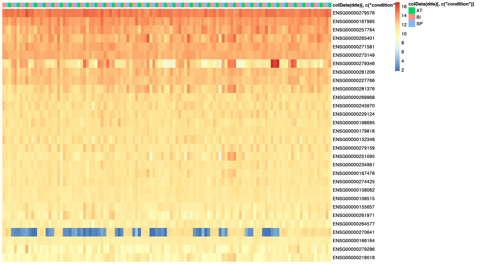

***HeatMap: rLog***
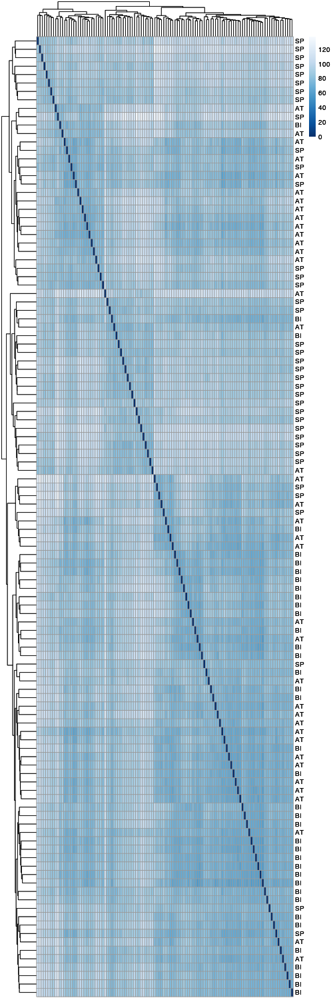

***HeatMap: vsT***
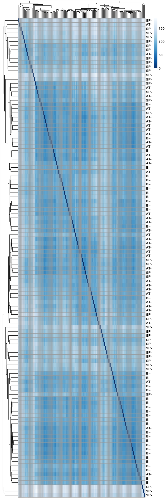

***PCA: condition***
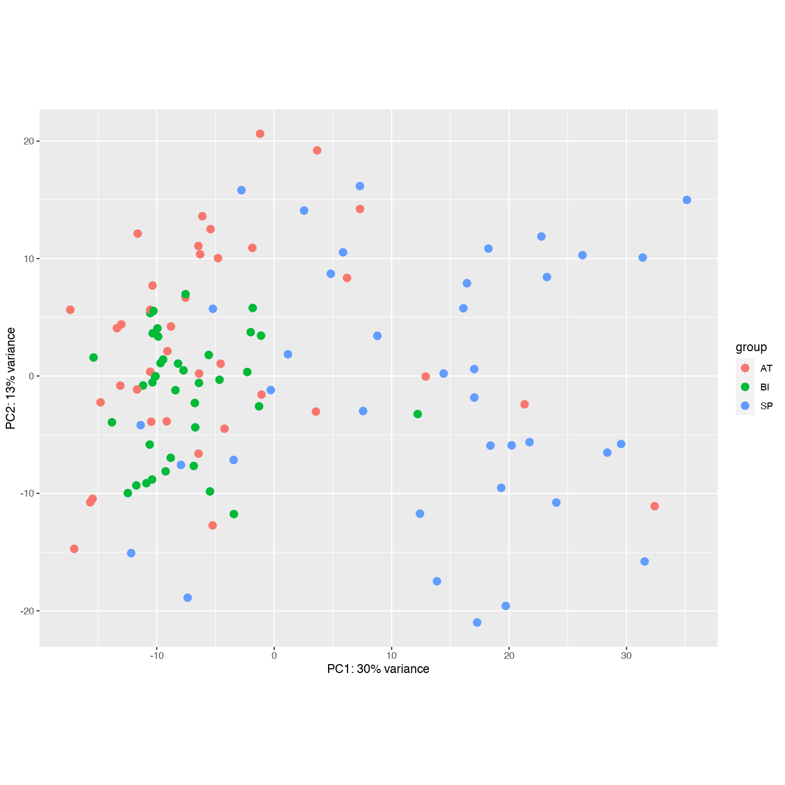

### Deseq2 Filtering Condition

P-VALUE CUTOFF|LFC CUTOFF|
:---:|:---:|
0.05|+/-0.58| 

### SP_vs_BI

***MAPlot: SP_vs_BI***
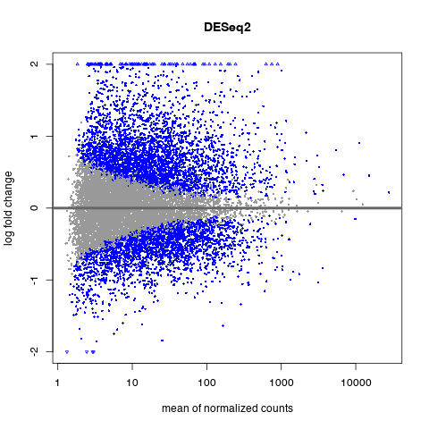

***VolcanoPlot: SP_vs_BI*** 
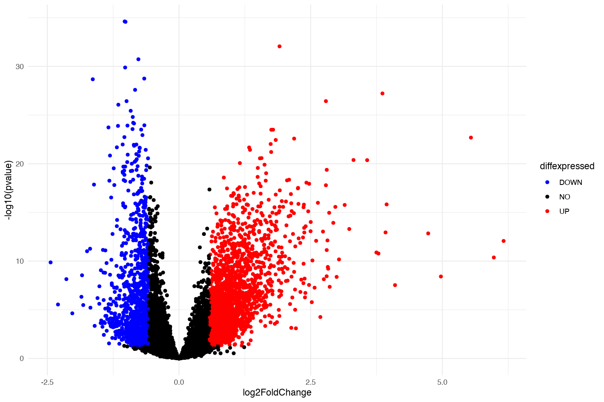    
      
***Top Up and Down Regulated gene SP_vs_BI***
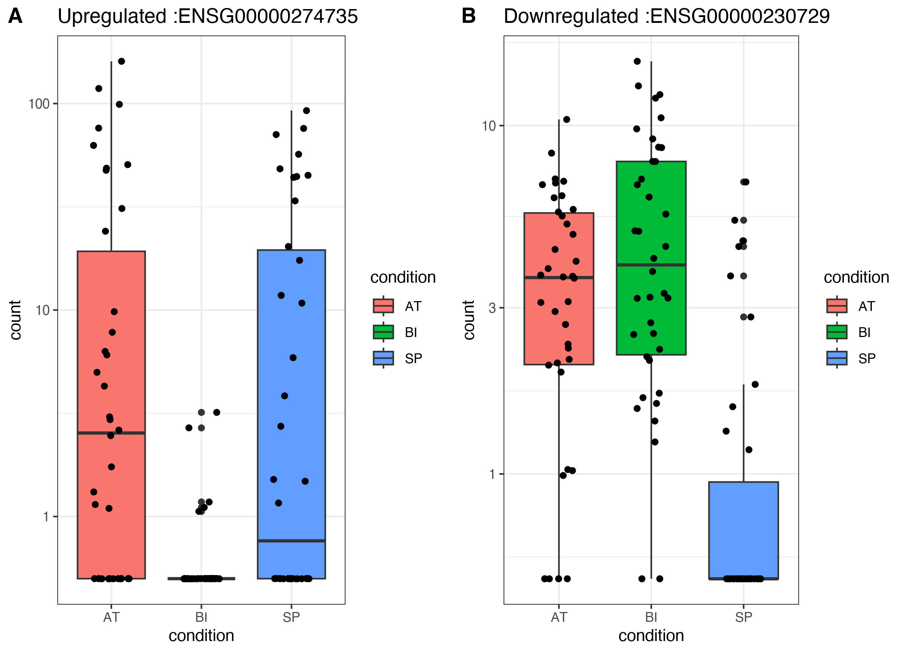

### SP_vs_BI

***MAPlot:***
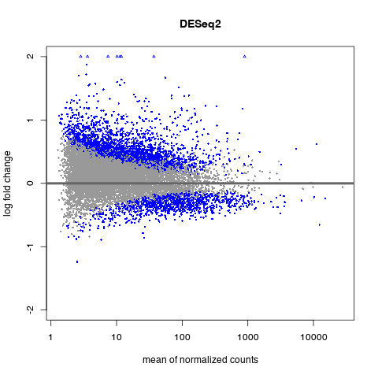

***VolcanoPlot:*** 
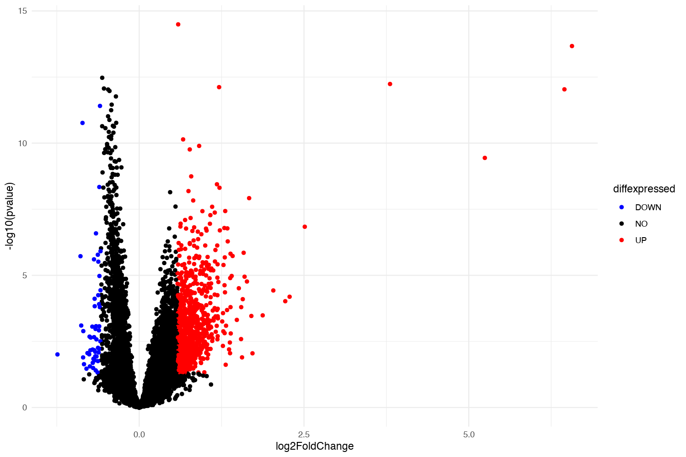    
      
***Top Up and Down Regulated gene***
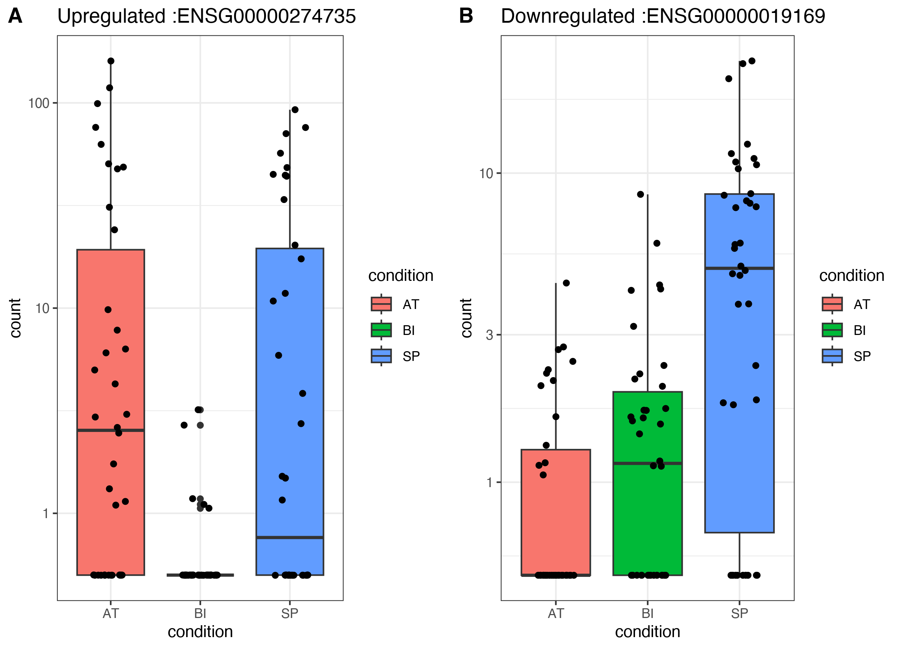

### AT_Vs_SP

***MAPlot:AT_Vs_SP***
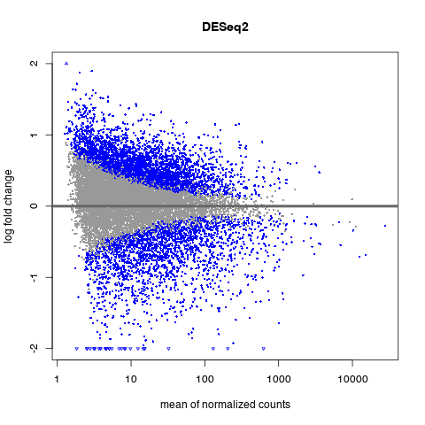

***VolcanoPlot: SP_vs_BI*** 
    
      
***Top Up and Down Regulated gene***
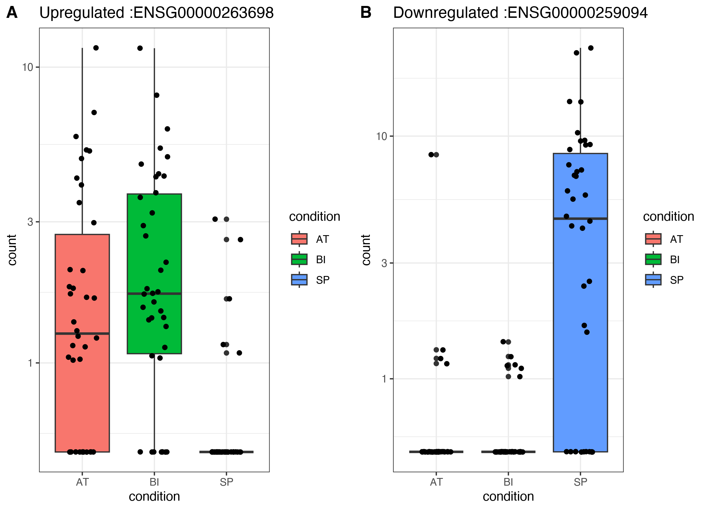

### SessionInfo
