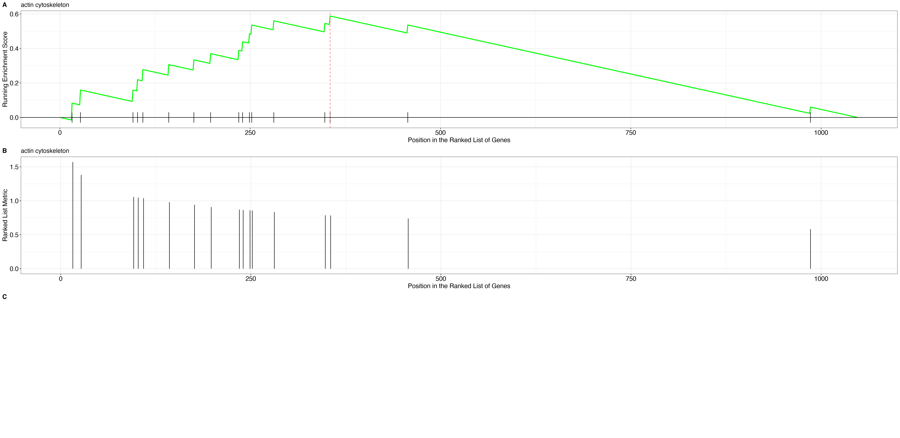

# Differential Expression Analysis

a. [Sample Informations](#sample-informations)

b. [Gene Filtering Information](#gene-filtering)

c. [Deseq2 Analysis](#deseq-analysis-results) 

  1. [SP vs BI](#differential-expression-sp-bi)
  2. [AT vs SP](#differential-expression-at-sp)
  3. [AT vs BI](#differential-expression-at-bi)
### Sample Informations 
Total Samples:114

---------------------
File|Sample|Gene Count
---|---|---|
Sample_PAG007_V1_E2.txt|Sample_PAG007_V1_E2|60675
Sample_PAG007_V3_E2.txt|Sample_PAG007_V3_E2|60675
Sample_PAG007_V4_E2.txt|Sample_PAG007_V4_E2|60675
Sample_PAG010_V1_E2.txt|Sample_PAG010_V1_E2|60675
Sample_PAG010_V3_E2.txt|Sample_PAG010_V3_E2|60675
Sample_PAG010_V4_E2.txt|Sample_PAG010_V4_E2|60675
Sample_PAG014_V1_E2.txt|Sample_PAG014_V1_E2|60675
Sample_PAG014_V3_E2.txt|Sample_PAG014_V3_E2|60675
Sample_PAG014_V4_E2.txt|Sample_PAG014_V4_E2|60675
Sample_PAG016_V1_E2.txt|Sample_PAG016_V1_E2|60675
Sample_PAG016_V3_E2.txt|Sample_PAG016_V3_E2|60675
Sample_PAG016_V4_E2.txt|Sample_PAG016_V4_E2|60675
Sample_PAG021_V1_E2.txt|Sample_PAG021_V1_E2|60675
Sample_PAG021_V3_E2.txt|Sample_PAG021_V3_E2|60675
Sample_PAG021_V4_E2.txt|Sample_PAG021_V4_E2|60675
Sample_PAG029_V1_E2.txt|Sample_PAG029_V1_E2|60675
Sample_PAG029_V3_E2.txt|Sample_PAG029_V3_E2|60675
Sample_PAG029_V4_E2.txt|Sample_PAG029_V4_E2|60675
Sample_PAG030_V1_E2.txt|Sample_PAG030_V1_E2|60675
Sample_PAG030_V3_E2.txt|Sample_PAG030_V3_E2|60675
Sample_PAG030_V4_E2.txt|Sample_PAG030_V4_E2|60675
Sample_PAG031_V1_E2.txt|Sample_PAG031_V1_E2|60675
Sample_PAG031_V3_E2.txt|Sample_PAG031_V3_E2|60675
Sample_PAG031_V4_E2.txt|Sample_PAG031_V4_E2|60675
Sample_PAG034_V1_E2.txt|Sample_PAG034_V1_E2|60675
Sample_PAG034_V3_E2.txt|Sample_PAG034_V3_E2|60675
Sample_PAG034_V4_E2.txt|Sample_PAG034_V4_E2|60675
Sample_PAG035_V1_E2.txt|Sample_PAG035_V1_E2|60675
Sample_PAG035_V3_E2.txt|Sample_PAG035_V3_E2|60675
Sample_PAG035_V4_E2.txt|Sample_PAG035_V4_E2|60675
Sample_PAG036_V1_E2.txt|Sample_PAG036_V1_E2|60675
Sample_PAG036_V3_E2.txt|Sample_PAG036_V3_E2|60675
Sample_PAG036_V4_E2.txt|Sample_PAG036_V4_E2|60675
Sample_PAG049_V1_E2.txt|Sample_PAG049_V1_E2|60675
Sample_PAG049_V3_E2.txt|Sample_PAG049_V3_E2|60675
Sample_PAG049_V4_E2.txt|Sample_PAG049_V4_E2|60675
Sample_PAG058_V1_E2.txt|Sample_PAG058_V1_E2|60675
Sample_PAG058_V3_E2.txt|Sample_PAG058_V3_E2|60675
Sample_PAG058_V4_E2.txt|Sample_PAG058_V4_E2|60675
Sample_PAG074_V1_E2.txt|Sample_PAG074_V1_E2|60675
Sample_PAG074_V3_E2.txt|Sample_PAG074_V3_E2|60675
Sample_PAG074_V4_E2.txt|Sample_PAG074_V4_E2|60675
Sample_PAG076_V1_E2.txt|Sample_PAG076_V1_E2|60675
Sample_PAG076_V3_E2.txt|Sample_PAG076_V3_E2|60675
Sample_PAG076_V4_E2.txt|Sample_PAG076_V4_E2|60675
Sample_PAG091_V1_E2.txt|Sample_PAG091_V1_E2|60675
Sample_PAG091_V3_E2.txt|Sample_PAG091_V3_E2|60675
Sample_PAG091_V4_E2.txt|Sample_PAG091_V4_E2|60675
Sample_PAG100_V1_E2.txt|Sample_PAG100_V1_E2|60675
Sample_PAG100_V3_E2.txt|Sample_PAG100_V3_E2|60675
Sample_PAG100_V4_E2.txt|Sample_PAG100_V4_E2|60675
Sample_PAG102_V1_E2.txt|Sample_PAG102_V1_E2|60675
Sample_PAG102_V3_E2.txt|Sample_PAG102_V3_E2|60675
Sample_PAG102_V4_E2.txt|Sample_PAG102_V4_E2|60675
Sample_PAG122_V1_E2.txt|Sample_PAG122_V1_E2|60675
Sample_PAG122_V3_E2.txt|Sample_PAG122_V3_E2|60675
Sample_PAG122_V4_E2.txt|Sample_PAG122_V4_E2|60675
Sample_PAG123_V1_E2.txt|Sample_PAG123_V1_E2|60675
Sample_PAG123_V3_E2.txt|Sample_PAG123_V3_E2|60675
Sample_PAG123_V4_E2.txt|Sample_PAG123_V4_E2|60675
Sample_PAG132_V1_E2.txt|Sample_PAG132_V1_E2|60675
Sample_PAG132_V3_E2.txt|Sample_PAG132_V3_E2|60675
Sample_PAG132_V4_E2.txt|Sample_PAG132_V4_E2|60675
Sample_PAG136_V1_E2.txt|Sample_PAG136_V1_E2|60675
Sample_PAG136_V3_E2.txt|Sample_PAG136_V3_E2|60675
Sample_PAG136_V4_E2.txt|Sample_PAG136_V4_E2|60675
Sample_PAG139_V1_E2.txt|Sample_PAG139_V1_E2|60675
Sample_PAG139_V3_E2.txt|Sample_PAG139_V3_E2|60675
Sample_PAG139_V4_E2.txt|Sample_PAG139_V4_E2|60675
Sample_PAG143_V1_E2.txt|Sample_PAG143_V1_E2|60675
Sample_PAG143_V3_E2.txt|Sample_PAG143_V3_E2|60675
Sample_PAG143_V4_E2.txt|Sample_PAG143_V4_E2|60675
Sample_PAG144_V1_E2.txt|Sample_PAG144_V1_E2|60675
Sample_PAG144_V3_E2.txt|Sample_PAG144_V3_E2|60675
Sample_PAG144_V4_E2.txt|Sample_PAG144_V4_E2|60675
Sample_PAG145_V1_E2.txt|Sample_PAG145_V1_E2|60675
Sample_PAG145_V3_E2.txt|Sample_PAG145_V3_E2|60675
Sample_PAG145_V4_E2.txt|Sample_PAG145_V4_E2|60675
Sample_PAG148_V1_E2.txt|Sample_PAG148_V1_E2|60675
Sample_PAG148_V3_E2.txt|Sample_PAG148_V3_E2|60675
Sample_PAG148_V4_E2.txt|Sample_PAG148_V4_E2|60675
Sample_PAG151_V1_E2.txt|Sample_PAG151_V1_E2|60675
Sample_PAG151_V3_E2.txt|Sample_PAG151_V3_E2|60675
Sample_PAG151_V4_E2.txt|Sample_PAG151_V4_E2|60675
Sample_PAG153_V1_E2.txt|Sample_PAG153_V1_E2|60675
Sample_PAG153_V3_E2.txt|Sample_PAG153_V3_E2|60675
Sample_PAG153_V4_E2.txt|Sample_PAG153_V4_E2|60675
Sample_PAG157_V1_E2.txt|Sample_PAG157_V1_E2|60675
Sample_PAG157_V3_E2.txt|Sample_PAG157_V3_E2|60675
Sample_PAG157_V4_E2.txt|Sample_PAG157_V4_E2|60675
Sample_PAG158_V1_E2.txt|Sample_PAG158_V1_E2|60675
Sample_PAG158_V3_E2.txt|Sample_PAG158_V3_E2|60675
Sample_PAG158_V4_E2.txt|Sample_PAG158_V4_E2|60675
Sample_PAG161_V1_E2.txt|Sample_PAG161_V1_E2|60675
Sample_PAG161_V3_E2.txt|Sample_PAG161_V3_E2|60675
Sample_PAG161_V4_E2.txt|Sample_PAG161_V4_E2|60675
Sample_PAG165_V1_E2.txt|Sample_PAG165_V1_E2|60675
Sample_PAG165_V3_E2.txt|Sample_PAG165_V3_E2|60675
Sample_PAG165_V4_E2.txt|Sample_PAG165_V4_E2|60675
Sample_PAG170_V1_E2.txt|Sample_PAG170_V1_E2|60675
Sample_PAG170_V3_E2.txt|Sample_PAG170_V3_E2|60675
Sample_PAG170_V4_E2.txt|Sample_PAG170_V4_E2|60675
Sample_PAG171_V1_E2.txt|Sample_PAG171_V1_E2|60675
Sample_PAG171_V3_E2.txt|Sample_PAG171_V3_E2|60675
Sample_PAG171_V4_E2.txt|Sample_PAG171_V4_E2|60675
Sample_PAG172_V1_E2.txt|Sample_PAG172_V1_E2|60675
Sample_PAG172_V3_E2.txt|Sample_PAG172_V3_E2|60675
Sample_PAG172_V4_E2.txt|Sample_PAG172_V4_E2|60675
Sample_PAG174_V1_E2.txt|Sample_PAG174_V1_E2|60675
Sample_PAG174_V3_E2.txt|Sample_PAG174_V3_E2|60675
Sample_PAG174_V4_E2.txt|Sample_PAG174_V4_E2|60675
Sample_PAG175_V1_E2.txt|Sample_PAG175_V1_E2|60675
Sample_PAG175_V3_E2.txt|Sample_PAG175_V3_E2|60675
Sample_PAG175_V4_E2.txt|Sample_PAG175_V4_E2|60675

### Visit Wise Sample Count ######
Visit|#Samples
---|---|
V1|38
V3|38
V4|38

### Gene Filtering

Minimum_Read(s):5

Total Genes|Filtered Genes in 50% of Samples|Minimum 10 Samples in any visit|Minimum 10 samples in every visit|
---|---|---|---|
60676|11,475|14,017|10,420

### Deseq Analysis Results

***Top 30 Genes based on Normalized counts***

***HeatMap: rLog***

***HeatMap: vsT***

***PCA: condition***

P-VALUE CUTOFF|LFC CUTOFF|
:---:|:---:|
0.05|+/-0.58|

### Differential Expression SP-BI

Upregulated Genes|Downregulated Genes|
:---:|:---:|
2225|1143|

SP-BI

***MAPlot:***

***VolcanoPlot:***

***Top Up and Down Regulated gene:***

***Gene Erichment Analysis (ALL):***

***GeneErichment_DotPlot_10Category:***

***GeneErichment ridgeplot:***

***GeneErichment Map 10Category:***

***GeneErichment Map : cell periphery***

***GeneErichment gseaplot:***

***Gene Erichment Analysis (Biological process):***

***Gene Enrichment analysis: Biological process Map: Map 10Category***

***GeneErichment Biological process : response to stress***

***GeneErichment Biological process :DotPlot***

***GeneErichment Biological process :ridgeplot***

***GeneErichment Biological process :gseaplot***

***Gene Erichment Analysis (Molecular process):***

***GeneErichment Molecular process :Map_10Category***

***GeneErichment Molecular process : inhibitory MHC class I receptor activity***

***GeneErichment Molecular process :DotPlot_10Category***

***GeneErichment Molecular process :ridgeplot***

***GeneErichment Molecular process :gseaplot***

***Gene Erichment Analysis (Cellular Component):***

***GeneErichment Cellular Component :Map_10Category***

***GeneErichment Cellular Component : signaling receptor binding***

***GeneErichment Cellular Component :DotPlot_10Category.***

***GeneErichment Cellular Component :ridgeplot***

***GeneErichment Cellular Component :gseaplot***

### Differential Expression AT-SP

Upregulated Genes|Downregulated Genes|
:---:|:---:|
1521|1130|

AT-SP

***MAPlot:***

***VolcanoPlot:***

***Top Up and Down Regulated gene:***

***Gene Erichment Analysis (ALL):***

***GeneErichment_DotPlot_10Category:***

***GeneErichment ridgeplot:***

***GeneErichment Map 10Category:***

***GeneErichment Map : vesicle***

***GeneErichment gseaplot:***

***Gene Erichment Analysis (Biological process):***

***Gene Enrichment analysis: Biological process Map: Map 10Category***

***GeneErichment Biological process : response to external stimulus***

***GeneErichment Biological process :DotPlot***

***GeneErichment Biological process :ridgeplot***

***GeneErichment Biological process :gseaplot***

***Gene Erichment Analysis (Molecular process):***

***GeneErichment Molecular process :Map_10Category***

***GeneErichment Molecular process : MHC class I receptor activity***

***GeneErichment Molecular process :DotPlot_10Category***

***GeneErichment Molecular process :ridgeplot***

***GeneErichment Molecular process :gseaplot***

***Gene Erichment Analysis (Cellular Component):***

***GeneErichment Cellular Component :Map_10Category***

***GeneErichment Cellular Component : MHC class I receptor activity***

***GeneErichment Cellular Component :DotPlot_10Category.***

***GeneErichment Cellular Component :ridgeplot***

***GeneErichment Cellular Component :gseaplot***

### Differential Expression AT-BI

Upregulated Genes|Downregulated Genes|
:---:|:---:|
997|51|

AT-BI

***MAPlot:***

***VolcanoPlot:***

***Top Up and Down Regulated gene:***

***Gene Erichment Analysis (ALL):***

***GeneErichment_DotPlot_10Category:***

***GeneErichment ridgeplot:***

***GeneErichment Map 10Category:***

***GeneErichment Map : actin cytoskeleton***

***GeneErichment gseaplot:***

***Gene Erichment Analysis (Biological process):***

***Gene Enrichment analysis: Biological process Map: Map 10Category***

***GeneErichment Biological process : carbon dioxide transport***

***GeneErichment Biological process :DotPlot***

***GeneErichment Biological process :ridgeplot***

***GeneErichment Biological process :gseaplot***

***Gene Erichment Analysis (Molecular process):***

***GeneErichment Molecular process :Map_10Category***

***GeneErichment Molecular process : carboxylic ester hydrolase activity***

***GeneErichment Molecular process :DotPlot_10Category***

***GeneErichment Molecular process :ridgeplot***

***GeneErichment Molecular process :gseaplot***

***Gene Erichment Analysis (Cellular Component):***

***GeneErichment Cellular Component :Map_10Category***

***GeneErichment Cellular Component : carboxylic ester hydrolase activity***

***GeneErichment Cellular Component :DotPlot_10Category.***

***GeneErichment Cellular Component :ridgeplot***

***GeneErichment Cellular Component :gseaplot***

### SessionInfo

list(platform = \x86_64-apple-darwin17.0\, arch = \x86_64\, os = \darwin17.0\, system = \x86_64, darwin17.0\, status = \\, major = \4\, minor = \2.2\, year = \2022\, month = \10\, day = \31\, `svn rev` = \83211\, language = \R\, version.string = \R version 4.2.2 (2022-10-31)\, nickname = \Innocent and Trusting\)

### SessionInfo

x86_64-apple-darwin17.0 (64-bit)

### SessionInfo

en_US.UTF-8/en_US.UTF-8/en_US.UTF-8/C/en_US.UTF-8/en_US.UTF-8

### SessionInfo

macOS Monterey 12.6.2

### SessionInfo

c(\Mersenne-Twister\, \Inversion\, \Rejection\)

### SessionInfo

c(\stats4\, \stats\, \graphics\, \grDevices\, \utils\, \datasets\, \methods\, \base\)

### SessionInfo

list(SeuratObject = list(Package = \SeuratObject\, Type = \Package\, Title = \Data Structures for Single Cell Data\, Version = \4.1.3\, Date = \2022-11-07\, `Authors@R` = \c(\n  person(given = 'Rahul', family = 'Satija', email = 'rsatija@nygenome.org', role = 'aut', comment = c(ORCID = '0000-0001-9448-8833')),\n  person(given = 'Andrew', family = 'Butler', email = 'abutler@nygenome.org', role = 'aut', comment = c(ORCID = '0000-0003-3608-0463')),\n  person(given = 'Paul', family = 'Hoffman', email = 'seurat@nygenome.org', role = c('aut', 'cre'), comment = c(ORCID = '0000-0002-7693-8957')),\n  person(given = 'Tim', family = 'Stuart', email = 'tstuart@nygenome.org', role = 'aut', comment = c(ORCID = '0000-0002-3044-0897')),\n  person(given = 'Jeff', family = 'Farrell', email = 'jfarrell@g.harvard.edu', role = 'ctb'),\n  person(given = 'Shiwei', family = 'Zheng', email = 'szheng@nygenome.org', role = 'ctb', comment = c(ORCID = '0000-0001-6682-6743')),\n  person(given = 'Christoph', family = 'Hafemeister', email = 'chafemeister@nygenome.org', role = 'ctb', comment = c(ORCID = '0000-0001-6365-8254')),\n  person(given = 'Patrick', family = 'Roelli', email = 'proelli@nygenome.org', role = 'ctb'),\n  person(given = \\Yuhan\\, family = \\Hao\\, email = 'yhao@nygenome.org', role = 'ctb', comment = c(ORCID = '0000-0002-1810-0822'))\n  )\, 
    Description = \Defines S4 classes for single-cell genomic data and associated\n  information, such as dimensionality reduction embeddings, nearest-neighbor\n  graphs, and spatially-resolved coordinates. Provides data access methods and\n  R-native hooks to ensure the Seurat object is familiar to other R users. See\n  Satija R, Farrell J, Gennert D, et al (2015) <doi:10.1038/nbt.3192>,\n  Macosko E, Basu A, Satija R, et al (2015) <doi:10.1016/j.cell.2015.05.002>,\n  and Stuart T, Butler A, et al (2019) <doi:10.1016/j.cell.2019.05.031> for\n  more details.\, 
    URL = \https://mojaveazure.github.io/seurat-object/,\nhttps://github.com/mojaveazure/seurat-object\, BugReports = \https://github.com/mojaveazure/seurat-object/issues\, License = \MIT + file LICENSE\, Encoding = \UTF-8\, LazyData = \true\, RoxygenNote = \7.2.1\, Depends = \R (>= 4.0.0), sp (>= 1.5.0)\, Imports = \future, future.apply, grDevices, grid, Matrix (>= 1.5.0),\nmethods, progressr, Rcpp (>= 1.0.5), rlang (>= 0.4.7), stats,\ntools, utils\, Suggests = \ggplot2, rgeos, testthat\, Collate = \'RcppExports.R' 'zzz.R' 'generics.R' 'graph.R' 'assay.R'\n'centroids.R' 'command.R' 'data.R' 'default.R' 'jackstraw.R'\n'dimreduc.R' 'segmentation.R' 'keymixin.R' 'molecules.R'\n'spatial.R' 'fov.R' 'logmap.R' 'neighbor.R' 'seurat.R'\n'utils.R'\, 
    LinkingTo = \Rcpp, RcppEigen\, NeedsCompilation = \yes\, Packaged = \2022-11-07 18:15:41 UTC; paul\, Author = \Rahul Satija [aut] (<https://orcid.org/0000-0001-9448-8833>),\n  Andrew Butler [aut] (<https://orcid.org/0000-0003-3608-0463>),\n  Paul Hoffman [aut, cre] (<https://orcid.org/0000-0002-7693-8957>),\n  Tim Stuart [aut] (<https://orcid.org/0000-0002-3044-0897>),\n  Jeff Farrell [ctb],\n  Shiwei Zheng [ctb] (<https://orcid.org/0000-0001-6682-6743>),\n  Christoph Hafemeister [ctb] (<https://orcid.org/0000-0001-6365-8254>),\n  Patrick Roelli [ctb],\n  Yuhan Hao [ctb] (<https://orcid.org/0000-0002-1810-0822>)\, 
    Maintainer = \Paul Hoffman <seurat@nygenome.org>\, Repository = \CRAN\, `Date/Publication` = \2022-11-07 18:50:02 UTC\, Built = \R 4.2.0; x86_64-apple-darwin17.0; 2022-11-08 13:20:09 UTC; unix\, Archs = \SeuratObject.so.dSYM\), Seurat = list(Package = \Seurat\, Version = \4.3.0\, Date = \2022-11-18\, Title = \Tools for Single Cell Genomics\, Description = \A toolkit for quality control, analysis, and exploration of single cell RNA sequencing data. 'Seurat' aims to enable users to identify and interpret sources of heterogeneity from single cell transcriptomic measurements, and to integrate diverse types of single cell data. See Satija R, Farrell J, Gennert D, et al (2015) <doi:10.1038/nbt.3192>, Macosko E, Basu A, Satija R, et al (2015) <doi:10.1016/j.cell.2015.05.002>, Stuart T, Butler A, et al (2019) <doi:10.1016/j.cell.2019.05.031>, and Hao, Hao, et al (2020) <doi:10.1101/2020.10.12.335331> for more details.\, 
    `Authors@R` = \c(\n  person(given = \\Andrew\\, family = \\Butler\\, email = \\abutler@nygenome.org\\, role = \\ctb\\, comment = c(ORCID = \\0000-0003-3608-0463\\)),\n  person(given = \\Saket\\, family = \\Choudhary\\, email = \\schoudhary@nygenome.org\\, role = \\ctb\\, comment = c(ORCID = \\0000-0001-5202-7633\\)),\n  person(given = \\Charlotte\\, family = \\Darby\\, email = \\cdarby@nygenome.org\\, role = \\ctb\\, comment = c(ORCID = \\0000-0003-2195-5300\\)),\n  person(given = \\Jeff\\, family = \\Farrell\\, email = \\jfarrell@g.harvard.edu\\, role = \\ctb\\),\n  person(given = \\Christoph\\, family = \\Hafemeister\\, email = \\chafemeister@nygenome.org\\, role = \\ctb\\, comment = c(ORCID = \\0000-0001-6365-8254\\)),\n  person(given = \\Yuhan\\, family = \\Hao\\, email = \\yhao@nygenome.org\\, role = \\ctb\\, comment = c(ORCID = \\0000-0002-1810-0822\\)),\n  person(given = \\Austin\\, family = \\Hartman\\, email = \\ahartman@nygenome.org\\, role = \\ctb\\, comment = c(ORCID = \\0000-0001-7278-1852\\)),\n  person(given = \\Paul\\, family = \\Hoffman\\, email = \\seurat@nygenome.org\\, role = c(\\aut\\, \\cre\\), comment = c(ORCID = \\0000-0002-7693-8957\\)),\n  person(given = \\Jaison\\, family = \\Jain\\, email = \\jjain@nygenome.org\\, role = \\ctb\\, comment = c(ORCID = \\0000-0002-9478-5018\\)),\n  person(given = \\Madeline\\, family = \\Kowalski\\, email = \\mkowalski@nygenome.org\\, role = \\ctb\\, comment = c(ORCID = \\0000-0002-5655-7620\\)),\n  person(given = \\Efthymia\\, family = \\Papalexi\\, email = \\epapalexi@nygenome.org\\, role = \\ctb\\, comment = c(ORCID = \\0000-0001-5898-694X\\)),\n  person(given = \\Patrick\\, family = \\Roelli\\, email = \\proelli@nygenome.org\\, role = \\ctb\\),\n  person(given = \\Rahul\\, family = \\Satija\\, email = \\rsatija@nygenome.org\\, role = \\ctb\\, comment = c(ORCID = \\0000-0001-9448-8833\\)),\n  person(given = \\Karthik\\, family = \\Shekhar\\, email = \\kshekhar@berkeley.edu\\, role = \\ctb\\),\n  person(given = \\Avi\\, family = \\Srivastava\\, email = \\asrivastava@nygenome.org\\, role = \\ctb\\, comment = c(ORCID = \\0000-0001-9798-2079\\)),\n  person(given = \\Tim\\, family = \\Stuart\\, email = \\tstuart@nygenome.org\\, role = \\ctb\\, comment = c(ORCID = \\0000-0002-3044-0897\\)),\n  person(given = \\Kristof\\, family = \\Torkenczy\\, email = \\\\, role = \\ctb\\, comment = c(ORCID = \\0000-0002-4869-7957\\)),\n  person(given = \\Shiwei\\, family = \\Zheng\\, email = \\szheng@nygenome.org\\, role = \\ctb\\, comment = c(ORCID = \\0000-0001-6682-6743\\)),\n  person(\\Satija Lab and Collaborators\\, role = \\fnd\\)\n  )\, 
    URL = \https://satijalab.org/seurat, https://github.com/satijalab/seurat\, BugReports = \https://github.com/satijalab/seurat/issues\, Depends = \R (>= 4.0.0), methods\, Imports = \cluster, cowplot, fitdistrplus, future, future.apply, ggplot2\n(>= 3.3.0), ggrepel, ggridges, graphics, grDevices, grid, httr,\nica, igraph, irlba, jsonlite, KernSmooth, leiden (>= 0.3.1),\nlmtest, MASS, Matrix (>= 1.5-0), matrixStats, miniUI,\npatchwork, pbapply, plotly (>= 4.9.0), png, progressr, RANN,\nRColorBrewer, Rcpp (>= 1.0.7), RcppAnnoy (>= 0.0.18),\nreticulate, rlang, ROCR, Rtsne, scales, scattermore (>= 0.7),\nsctransform (>= 0.3.5), SeuratObject (>= 4.1.3), shiny,\nspatstat.explore, spatstat.geom, stats, tibble, tools, utils,\nuwot (>= 0.1.14)\, 
    LinkingTo = \Rcpp (>= 0.11.0), RcppEigen, RcppProgress\, License = \MIT + file LICENSE\, LazyData = \true\, Collate = \'RcppExports.R' 'reexports.R' 'generics.R' 'clustering.R'\n'visualization.R' 'convenience.R' 'data.R'\n'differential_expression.R' 'dimensional_reduction.R'\n'integration.R' 'mixscape.R' 'objects.R' 'preprocessing.R'\n'tree.R' 'utilities.R' 'zzz.R'\, RoxygenNote = \7.2.2\, Encoding = \UTF-8\, Suggests = \ape, rsvd, testthat, hdf5r, S4Vectors, SummarizedExperiment,\nSingleCellExperiment, MAST, DESeq2, BiocGenerics,\nGenomicRanges, GenomeInfoDb, IRanges, rtracklayer, Rfast2,\nmonocle, Biobase, VGAM, limma, metap, enrichR, mixtools,\nggrastr, data.table, R.utils\, 
    NeedsCompilation = \yes\, Packaged = \2022-11-18 18:46:03 UTC; hartmana\, Author = \Andrew Butler [ctb] (<https://orcid.org/0000-0003-3608-0463>),\n  Saket Choudhary [ctb] (<https://orcid.org/0000-0001-5202-7633>),\n  Charlotte Darby [ctb] (<https://orcid.org/0000-0003-2195-5300>),\n  Jeff Farrell [ctb],\n  Christoph Hafemeister [ctb] (<https://orcid.org/0000-0001-6365-8254>),\n  Yuhan Hao [ctb] (<https://orcid.org/0000-0002-1810-0822>),\n  Austin Hartman [ctb] (<https://orcid.org/0000-0001-7278-1852>),\n  Paul Hoffman [aut, cre] (<https://orcid.org/0000-0002-7693-8957>),\n  Jaison Jain [ctb] (<https://orcid.org/0000-0002-9478-5018>),\n  Madeline Kowalski [ctb] (<https://orcid.org/0000-0002-5655-7620>),\n  Efthymia Papalexi [ctb] (<https://orcid.org/0000-0001-5898-694X>),\n  Patrick Roelli [ctb],\n  Rahul Satija [ctb] (<https://orcid.org/0000-0001-9448-8833>),\n  Karthik Shekhar [ctb],\n  Avi Srivastava [ctb] (<https://orcid.org/0000-0001-9798-2079>),\n  Tim Stuart [ctb] (<https://orcid.org/0000-0002-3044-0897>),\n  Kristof Torkenczy [ctb] (<https://orcid.org/0000-0002-4869-7957>),\n  Shiwei Zheng [ctb] (<https://orcid.org/0000-0001-6682-6743>),\n  Satija Lab and Collaborators [fnd]\, 
    Maintainer = \Paul Hoffman <seurat@nygenome.org>\, Repository = \CRAN\, `Date/Publication` = \2022-11-18 23:30:08 UTC\, Built = \R 4.2.0; x86_64-apple-darwin17.0; 2022-11-19 14:03:00 UTC; unix\, Archs = \Seurat.so.dSYM\), org.Hs.eg.db = list(Package = \org.Hs.eg.db\, Title = \Genome wide annotation for Human\, Description = \Genome wide annotation for Human, primarily based on mapping using Entrez Gene identifiers.\, Version = \3.16.0\, Author = \Marc Carlson\, Maintainer = \Bioconductor Package Maintainer <maintainer@bioconductor.org>\, 
    Depends = \R (>= 2.7.0), methods, AnnotationDbi (>= 1.59.1)\, Suggests = \DBI, annotate, RUnit\, License = \Artistic-2.0\, organism = \Homo sapiens\, species = \Human\, biocViews = \OrgDb, AnnotationData, Homo_sapiens, humanLLMappings\, NeedsCompilation = \no\, Packaged = \2022-09-26 15:12:35 UTC; ubuntu\, Built = \R 4.2.2; ; 2022-12-01 08:04:10 UTC; unix\), AnnotationDbi = list(Package = \AnnotationDbi\, Title = \Manipulation of SQLite-based annotations in Bioconductor\, Description = \Implements a user-friendly interface for querying SQLite-based annotation data packages.\, 
    biocViews = \Annotation, Microarray, Sequencing, GenomeAnnotation\, URL = \https://bioconductor.org/packages/AnnotationDbi\, Video = \https://www.youtube.com/watch?v=8qvGNTVz3Ik\, BugReports = \https://github.com/Bioconductor/AnnotationDbi/issues\, Version = \1.60.0\, License = \Artistic-2.0\, Encoding = \UTF-8\, Author = \Hervé Pagès, Marc Carlson, Seth Falcon, Nianhua Li\, Maintainer = \Bioconductor Package Maintainer <maintainer@bioconductor.org>\, Depends = \R (>= 2.7.0), methods, utils, stats4, BiocGenerics (>=\n0.29.2), Biobase (>= 1.17.0), IRanges\, 
    Imports = \DBI, RSQLite, S4Vectors (>= 0.9.25), stats, KEGGREST\, Suggests = \hgu95av2.db, GO.db, org.Sc.sgd.db, org.At.tair.db, RUnit,\nTxDb.Hsapiens.UCSC.hg19.knownGene, org.Hs.eg.db, reactome.db,\nAnnotationForge, graph, EnsDb.Hsapiens.v75, BiocStyle, knitr\, VignetteBuilder = \knitr\, Collate = \00RTobjs.R AllGenerics.R AllClasses.R unlist2.R utils.R SQL.R\nFlatBimap.R AnnDbObj-lowAPI.R Bimap.R GOTerms.R\nBimapFormatting.R Bimap-envirAPI.R flatten.R\nmethods-AnnotationDb.R methods-SQLiteConnection.R\nmethods-geneCentricDbs.R methods-geneCentricDbs-keys.R\nmethods-ReactomeDb.R methods-OrthologyDb.R loadDb.R\ncreateAnnObjs-utils.R createAnnObjs.NCBIORG_DBs.R\ncreateAnnObjs.NCBICHIP_DBs.R createAnnObjs.ORGANISM_DB.R\ncreateAnnObjs.YEASTCHIP_DB.R createAnnObjs.COELICOLOR_DB.R\ncreateAnnObjs.ARABIDOPSISCHIP_DB.R createAnnObjs.MALARIA_DB.R\ncreateAnnObjs.YEAST_DB.R createAnnObjs.YEASTNCBI_DB.R\ncreateAnnObjs.ARABIDOPSIS_DB.R createAnnObjs.GO_DB.R\ncreateAnnObjs.KEGG_DB.R createAnnObjs.PFAM_DB.R\nAnnDbPkg-templates-common.R AnnDbPkg-checker.R\nprint.probetable.R makeMap.R inpIDMapper.R\ntest_AnnotationDbi_package.R\, 
    git_url = \https://git.bioconductor.org/packages/AnnotationDbi\, git_branch = \RELEASE_3_16\, git_last_commit = \cd61bd1\, git_last_commit_date = \2022-11-01\, `Date/Publication` = \2022-11-01\, NeedsCompilation = \no\, Packaged = \2022-11-01 20:52:12 UTC; biocbuild\, Built = \R 4.2.1; ; 2022-11-02 04:19:07 UTC; unix\), enrichplot = list(Package = \enrichplot\, Title = \Visualization of Functional Enrichment Result\, Version = \1.18.1\, `Authors@R` = \c(\n    person(given = \\Guangchuang\\, family = \\Yu\\, email = \\guangchuangyu@gmail.com\\,   role  = c(\\aut\\, \\cre\\), comment = c(ORCID = \\0000-0002-6485-8781\\)),\n    person(given = \\Erqiang\\,     family = \\Hu\\, email = \\13766876214@163.com\\,       role = \\ctb\\, comment = c(ORCID = \\0000-0002-1798-7513\\)),\n    person(given = \\Chun-Hui\\, family = \\Gao\\, email = \\gaospecial@gmail.com\\, role = \\ctb\\, comment = c(ORCID = \\0000-0002-1445-7939\\)))\, 
    Description = \The 'enrichplot' package implements several visualization methods for interpreting functional enrichment results obtained from ORA or GSEA analysis. It is mainly designed to work with the 'clusterProfiler' package suite. All the visualization methods are developed based on 'ggplot2' graphics.\, Depends = \R (>= 3.5.0)\, Imports = \aplot (>= 0.1.4), DOSE (>= 3.16.0), ggnewscale, ggplot2,\nggraph, graphics, grid, igraph, methods, plyr, purrr,\nRColorBrewer, reshape2, rlang, stats, utils, scatterpie,\nshadowtext, GOSemSim, magrittr, ggtree, yulab.utils (>= 0.0.4)\, 
    Suggests = \clusterProfiler, dplyr, europepmc, ggupset, knitr, rmarkdown,\norg.Hs.eg.db, prettydoc, tibble, tidyr, ggforce, AnnotationDbi,\nggplotify, ggridges, grDevices, gridExtra, ggrepel (>= 0.9.0),\nggstar, treeio, scales, tidytree, ggtreeExtra, tidydr\, Remotes = \YuLab-SMU/tidydr\, VignetteBuilder = \knitr\, License = \Artistic-2.0\, URL = \https://yulab-smu.top/biomedical-knowledge-mining-book/\, BugReports = \https://github.com/GuangchuangYu/enrichplot/issues\, biocViews = \Annotation, GeneSetEnrichment, GO, KEGG, Pathways, Software,\nVisualization\, 
    Encoding = \UTF-8\, RoxygenNote = \7.2.2\, git_url = \https://git.bioconductor.org/packages/enrichplot\, git_branch = \RELEASE_3_16\, git_last_commit = \08c4323\, git_last_commit_date = \2022-11-17\, `Date/Publication` = \2022-11-18\, NeedsCompilation = \no\, Packaged = \2022-11-18 21:29:31 UTC; biocbuild\, Author = \Guangchuang Yu [aut, cre] (<https://orcid.org/0000-0002-6485-8781>),\n  Erqiang Hu [ctb] (<https://orcid.org/0000-0002-1798-7513>),\n  Chun-Hui Gao [ctb] (<https://orcid.org/0000-0002-1445-7939>)\, 
    Maintainer = \Guangchuang Yu <guangchuangyu@gmail.com>\, Built = \R 4.2.2; ; 2022-11-19 04:36:21 UTC; unix\), clusterProfiler = list(Package = \clusterProfiler\, Type = \Package\, Title = \A universal enrichment tool for interpreting omics data\, Version = \4.6.0\, `Authors@R` = \c(\n    person(given = \\Guangchuang\\, family = \\Yu\\,        email = \\guangchuangyu@gmail.com\\,   role  = c(\\aut\\, \\cre\\, \\cph\\), comment = c(ORCID = \\0000-0002-6485-8781\\)),\n    person(given = \\Li-Gen\\,      family = \\Wang\\,      email = \\reeganwang020@gmail.com\\,   role  = \\ctb\\),\n    person(given = \\Erqiang\\,     family = \\Hu\\,        email = \\woshihuerqiang@qq.com\\,     role = \\ctb\\),\n    person(given = \\Xiao\\,        family = \\Luo\\,       email = \\l77880853349@163.com\\,      role  = \\ctb\\),\n    person(given = \\Meijun\\,      family = \\Chen\\,      email = \\mjchen1996@outlook.com\\,    role  = \\ctb\\),\n    person(given = \\Giovanni\\,    family = \\Dall'Olio\\, email = \\giovanni.dallolio@upf.edu\\, role = \\ctb\\),\n    person(given = \\Wanqian\\,     family = \\Wei\\,       email = \\altair_wei@outlook.com\\,    role = \\ctb\\),\n    person(given = \\Chun-Hui\\,    family = \\Gao\\,       email = \\gaospecial@gmail.com\\,      role = \\ctb\\, comment = c(ORCID = \\0000-0002-1445-7939\\))\n\t)\, 
    Maintainer = \Guangchuang Yu <guangchuangyu@gmail.com>\, Description = \This package supports functional characteristics of both coding and non-coding genomics data for thousands of species with up-to-date gene annotation. It provides a univeral interface for gene functional annotation from a variety of sources and thus can be applied in diverse scenarios. It provides a tidy interface to access, manipulate, and visualize enrichment results to help users achieve efficient data interpretation. Datasets obtained from multiple treatments and time points can be analyzed and compared in a single run, easily revealing functional consensus and differences among distinct conditions.\, 
    Depends = \R (>= 3.5.0)\, Imports = \AnnotationDbi, downloader, DOSE (>= 3.23.2), dplyr, enrichplot\n(>= 1.9.3), GO.db, GOSemSim, gson (>= 0.0.7), magrittr,\nmethods, plyr, qvalue, rlang, stats, tidyr, utils, yulab.utils\, Suggests = \AnnotationHub, knitr, rmarkdown, org.Hs.eg.db, prettydoc,\nReactomePA, testthat\, VignetteBuilder = \knitr\, ByteCompile = \true\, License = \Artistic-2.0\, URL = \https://yulab-smu.top/biomedical-knowledge-mining-book/ (docs),\nhttps://doi.org/10.1016/j.xinn.2021.100141 (paper)\, 
    BugReports = \https://github.com/GuangchuangYu/clusterProfiler/issues\, Packaged = \2022-11-01 21:14:30 UTC; biocbuild\, biocViews = \Annotation, Clustering, GeneSetEnrichment, GO, KEGG,\nMultipleComparison, Pathways, Reactome, Visualization\, Encoding = \UTF-8\, RoxygenNote = \7.2.1\, git_url = \https://git.bioconductor.org/packages/clusterProfiler\, git_branch = \RELEASE_3_16\, git_last_commit = \2644118\, git_last_commit_date = \2022-11-01\, `Date/Publication` = \2022-11-01\, NeedsCompilation = \no\, 
    Author = \Guangchuang Yu [aut, cre, cph]\n    (<https://orcid.org/0000-0002-6485-8781>),\n  Li-Gen Wang [ctb],\n  Erqiang Hu [ctb],\n  Xiao Luo [ctb],\n  Meijun Chen [ctb],\n  Giovanni Dall'Olio [ctb],\n  Wanqian Wei [ctb],\n  Chun-Hui Gao [ctb] (<https://orcid.org/0000-0002-1445-7939>)\, Built = \R 4.2.1; ; 2022-11-02 04:24:15 UTC; unix\), RColorBrewer = list(Package = \RColorBrewer\, Version = \1.1-3\, Date = \2022-04-03\, Title = \ColorBrewer Palettes\, `Authors@R` = \c(person(given = \\Erich\\, family = \\Neuwirth\\, role = c(\\aut\\,\n        \\cre\\), email = \\erich.neuwirth@univie.ac.at\\))\, 
    Author = \Erich Neuwirth [aut, cre]\, Maintainer = \Erich Neuwirth <erich.neuwirth@univie.ac.at>\, Depends = \R (>= 2.0.0)\, Description = \Provides color schemes for maps (and other graphics)\n        designed by Cynthia Brewer as described at http://colorbrewer2.org.\, License = \Apache License 2.0\, Packaged = \2022-04-03 10:26:20 UTC; neuwirth\, NeedsCompilation = \no\, Repository = \CRAN\, `Date/Publication` = \2022-04-03 19:20:13 UTC\, Built = \R 4.2.0; ; 2022-04-25 03:14:57 UTC; unix\), 
    EnhancedVolcano = list(Package = \EnhancedVolcano\, Type = \Package\, Title = \Publication-ready volcano plots with enhanced colouring and\nlabeling\, Version = \1.16.0\, `Authors@R` = \c(\n    person(\\Kevin\\, \\Blighe\\, role = c(\\aut\\, \\cre\\), email = \\kevin@clinicalbioinformatics.co.uk\\),\n    person(\\Sharmila\\, \\Rana\\, role = c(\\aut\\)),\n    person(\\Emir\\, \\Turkes\\, role = c(\\ctb\\)),\n    person(\\Benjamin\\, \\Ostendorf\\, role = c(\\ctb\\)),\n    person(\\Andrea\\, \\Grioni\\, role = c(\\ctb\\)),\n    person(\\Myles\\, \\Lewis\\, role = c(\\aut\\)))\, 
        Maintainer = \Kevin Blighe <kevin@clinicalbioinformatics.co.uk>\, Description = \Volcano plots represent a useful way to visualise the results of differential expression analyses. Here, we present a highly-configurable function that produces publication-ready volcano plots. EnhancedVolcano will attempt to fit as many point labels in the plot window as possible, thus avoiding 'clogging' up the plot with labels that could not otherwise have been read. Other functionality allows the user to identify up to 4 different types of attributes in the same plot space via colour, shape, size, and shade parameter configurations.\, 
        License = \GPL-3\, Depends = \ggplot2, ggrepel\, Imports = \methods\, Suggests = \ggalt, ggrastr, RUnit, BiocGenerics, knitr, DESeq2, pasilla,\nairway, org.Hs.eg.db, gridExtra, magrittr, rmarkdown\, URL = \https://github.com/kevinblighe/EnhancedVolcano\, biocViews = \RNASeq, GeneExpression, Transcription,\nDifferentialExpression, ImmunoOncology\, VignetteBuilder = \knitr\, RoxygenNote = \7.1.2\, git_url = \https://git.bioconductor.org/packages/EnhancedVolcano\, git_branch = \RELEASE_3_16\, 
        git_last_commit = \cc67675\, git_last_commit_date = \2022-11-01\, `Date/Publication` = \2022-11-01\, NeedsCompilation = \no\, Packaged = \2022-11-01 21:32:30 UTC; biocbuild\, Author = \Kevin Blighe [aut, cre],\n  Sharmila Rana [aut],\n  Emir Turkes [ctb],\n  Benjamin Ostendorf [ctb],\n  Andrea Grioni [ctb],\n  Myles Lewis [aut]\, Built = \R 4.2.1; ; 2022-11-02 04:28:53 UTC; unix\), ggrepel = list(Package = \ggrepel\, Version = \0.9.2\, `Authors@R` = \c(\n    person(\\Kamil\\, \\Slowikowski\\, email = \\kslowikowski@gmail.com\\, role = c(\\aut\\, \\cre\\), comment = c(ORCID = \\0000-0002-2843-6370\\)),\n    person(\\Alicia\\, \\Schep\\, role = \\ctb\\, comment = c(ORCID = \\0000-0002-3915-0618\\)),\n    person(\\Sean\\, \\Hughes\\, role = \\ctb\\, comment = c(ORCID = \\0000-0002-9409-9405\\)),\n    person(\\Trung Kien\\, \\Dang\\, role = \\ctb\\, comment = c(ORCID = \\0000-0001-7562-6495\\)),\n    person(\\Saulius\\, \\Lukauskas\\, role = \\ctb\\),\n    person(\\Jean-Olivier\\, \\Irisson\\, role = \\ctb\\, comment = c(ORCID = \\0000-0003-4920-3880\\)),\n    person(\\Zhian N\\, \\Kamvar\\, role = \\ctb\\, comment = c(ORCID = \\0000-0003-1458-7108\\)),\n    person(\\Thompson\\, \\Ryan\\, role = \\ctb\\, comment = c(ORCID = \\0000-0002-0450-8181\\)),\n    person(\\Dervieux\\, \\Christophe\\, role = \\ctb\\, comment = c(ORCID = \\0000-0003-4474-2498\\)),\n    person(\\Yutani\\, \\Hiroaki\\, role = \\ctb\\),\n    person(\\Pierre\\, \\Gramme\\, role = \\ctb\\),\n    person(\\Amir Masoud\\, \\Abdol\\, role = \\ctb\\),\n    person(\\Malcolm\\, \\Barrett\\, role = \\ctb\\, comment = c(ORCID = \\0000-0003-0299-5825\\)),\n    person(\\Robrecht\\, \\Cannoodt\\, role = \\ctb\\, comment = c(ORCID = \\0000-0003-3641-729X\\)),\n    person(\\Michał\\, \\Krassowski\\, role = \\ctb\\, comment = c(ORCID = \\0000-0002-9638-7785\\)),\n    person(\\Michael\\, \\Chirico\\, role = \\ctb\\, comment = c(ORCID = \\0000-0003-0787-087X\\)),\n    person(\\Pedro\\, \\Aphalo\\, role = \\ctb\\, comment = c(ORCID = \\0000-0003-3385-972X\\))\n    )\, 
        Title = \Automatically Position Non-Overlapping Text Labels with\n'ggplot2'\, Description = \Provides text and label geoms for 'ggplot2' that help to avoid\n    overlapping text labels. Labels repel away from each other and away from the\n    data points.\, Depends = \R (>= 3.0.0), ggplot2 (>= 2.2.0)\, Imports = \grid, Rcpp, rlang (>= 0.3.0), scales (>= 0.5.0)\, Suggests = \knitr, rmarkdown, testthat, svglite, vdiffr, gridExtra,\ndevtools, prettydoc, ggbeeswarm, dplyr, magrittr, readr,\nstringr, withr\, 
        VignetteBuilder = \knitr\, License = \GPL-3 | file LICENSE\, URL = \https://github.com/slowkow/ggrepel\, BugReports = \https://github.com/slowkow/ggrepel/issues\, RoxygenNote = \7.1.2\, LinkingTo = \Rcpp\, Encoding = \UTF-8\, NeedsCompilation = \yes\, Packaged = \2022-11-06 20:17:38 UTC; kamil\, Author = \Kamil Slowikowski [aut, cre] (<https://orcid.org/0000-0002-2843-6370>),\n  Alicia Schep [ctb] (<https://orcid.org/0000-0002-3915-0618>),\n  Sean Hughes [ctb] (<https://orcid.org/0000-0002-9409-9405>),\n  Trung Kien Dang [ctb] (<https://orcid.org/0000-0001-7562-6495>),\n  Saulius Lukauskas [ctb],\n  Jean-Olivier Irisson [ctb] (<https://orcid.org/0000-0003-4920-3880>),\n  Zhian N Kamvar [ctb] (<https://orcid.org/0000-0003-1458-7108>),\n  Thompson Ryan [ctb] (<https://orcid.org/0000-0002-0450-8181>),\n  Dervieux Christophe [ctb] (<https://orcid.org/0000-0003-4474-2498>),\n  Yutani Hiroaki [ctb],\n  Pierre Gramme [ctb],\n  Amir Masoud Abdol [ctb],\n  Malcolm Barrett [ctb] (<https://orcid.org/0000-0003-0299-5825>),\n  Robrecht Cannoodt [ctb] (<https://orcid.org/0000-0003-3641-729X>),\n  Michał Krassowski [ctb] (<https://orcid.org/0000-0002-9638-7785>),\n  Michael Chirico [ctb] (<https://orcid.org/0000-0003-0787-087X>),\n  Pedro Aphalo [ctb] (<https://orcid.org/0000-0003-3385-972X>)\, 
        Maintainer = \Kamil Slowikowski <kslowikowski@gmail.com>\, Repository = \CRAN\, `Date/Publication` = \2022-11-06 22:10:06 UTC\, Built = \R 4.2.0; x86_64-apple-darwin17.0; 2022-11-07 12:48:22 UTC; unix\, Archs = \ggrepel.so.dSYM\), pheatmap = list(Package = \pheatmap\, Type = \Package\, Title = \Pretty Heatmaps\, Version = \1.0.12\, Date = \2018-12-26\, Author = \Raivo Kolde\, Maintainer = \Raivo Kolde <rkolde@gmail.com>\, Depends = \R (>= 2.0)\, Description = \Implementation of heatmaps that offers more control\n    over dimensions and appearance.\, 
        Imports = \grid, RColorBrewer, scales, gtable, stats, grDevices, graphics\, License = \GPL-2\, LazyLoad = \yes\, RoxygenNote = \6.0.1\, NeedsCompilation = \no\, Packaged = \2019-01-02 15:37:50 UTC; kolde\, Repository = \CRAN\, `Date/Publication` = \2019-01-04 13:50:12 UTC\, Built = \R 4.2.0; ; 2022-04-26 23:04:06 UTC; unix\), DESeq2 = list(Package = \DESeq2\, Type = \Package\, Title = \Differential gene expression analysis based on the negative\nbinomial distribution\, Version = \1.38.1\, 
        `Authors@R` = \c(\n    person(\\Michael\\, \\Love\\, email=\\michaelisaiahlove@gmail.com\\, role = c(\\aut\\,\\cre\\)),\n    person(\\Constantin\\, \\Ahlmann-Eltze\\, role = c(\\ctb\\)),\n    person(\\Kwame\\, \\Forbes\\, role = c(\\ctb\\)),\n    person(\\Simon\\, \\Anders\\, role = c(\\aut\\,\\ctb\\)),\n    person(\\Wolfgang\\, \\Huber\\, role = c(\\aut\\,\\ctb\\)),\n    person(\\RADIANT EU FP7\\, role=\\fnd\\),\n    person(\\NIH NHGRI\\, role=\\fnd\\),\n    person(\\CZI\\, role=\\fnd\\))\, 
        Maintainer = \Michael Love <michaelisaiahlove@gmail.com>\, Description = \Estimate variance-mean dependence in count data from\n    high-throughput sequencing assays and test for differential\n    expression based on a model using the negative binomial\n    distribution.\, License = \LGPL (>= 3)\, VignetteBuilder = \knitr, rmarkdown\, Imports = \BiocGenerics (>= 0.7.5), Biobase, BiocParallel, matrixStats,\nmethods, stats4, locfit, geneplotter, ggplot2, Rcpp (>= 0.11.0)\, Depends = \S4Vectors (>= 0.23.18), IRanges, GenomicRanges,\nSummarizedExperiment (>= 1.1.6)\, 
        Suggests = \testthat, knitr, rmarkdown, vsn, pheatmap, RColorBrewer,\napeglm, ashr, tximport, tximeta, tximportData, readr, pbapply,\nairway, pasilla (>= 0.2.10), glmGamPoi, BiocManager\, LinkingTo = \Rcpp, RcppArmadillo\, URL = \https://github.com/mikelove/DESeq2\, biocViews = \Sequencing, RNASeq, ChIPSeq, GeneExpression, Transcription,\nNormalization, DifferentialExpression, Bayesian, Regression,\nPrincipalComponent, Clustering, ImmunoOncology\, RoxygenNote = \7.2.1\, Encoding = \UTF-8\, 
        git_url = \https://git.bioconductor.org/packages/DESeq2\, git_branch = \RELEASE_3_16\, git_last_commit = \c8451ca\, git_last_commit_date = \2022-11-09\, `Date/Publication` = \2022-11-15\, NeedsCompilation = \yes\, Packaged = \2022-11-15 21:25:21 UTC; biocbuild\, Author = \Michael Love [aut, cre],\n  Constantin Ahlmann-Eltze [ctb],\n  Kwame Forbes [ctb],\n  Simon Anders [aut, ctb],\n  Wolfgang Huber [aut, ctb],\n  RADIANT EU FP7 [fnd],\n  NIH NHGRI [fnd],\n  CZI [fnd]\, Built = \R 4.2.2; x86_64-apple-darwin17.0; 2022-11-16 06:10:52 UTC; unix\), 
    ape = list(Package = \ape\, Version = \5.6-2\, Date = \2022-03-02\, Title = \Analyses of Phylogenetics and Evolution\, `Authors@R` = \c(person(\\Emmanuel\\, \\Paradis\\, role = c(\\aut\\, \\cre\\, \\cph\\), email = \\Emmanuel.Paradis@ird.fr\\, comment = c(ORCID = \\0000-0003-3092-2199\\)),\n  person(\\Simon\\, \\Blomberg\\, role = c(\\aut\\, \\cph\\), comment = c(ORCID = \\0000-0003-1062-0839\\)),\n  person(\\Ben\\, \\Bolker\\, role = c(\\aut\\, \\cph\\), comment = c(ORCID = \\0000-0002-2127-0443\\)),\n  person(\\Joseph\\, \\Brown\\, role = c(\\aut\\, \\cph\\), comment = c(ORCID = \\0000-0002-3835-8062\\)),\n  person(\\Santiago\\, \\Claramunt\\, role = c(\\aut\\, \\cph\\), comment = c(ORCID = \\0000-0002-8926-5974\\)),\n  person(\\Julien\\, \\Claude\\, role = c(\\aut\\, \\cph\\), , comment = c(ORCID = \\0000-0002-9267-1228\\)),\n  person(\\Hoa Sien\\, \\Cuong\\, role = c(\\aut\\, \\cph\\)),\n  person(\\Richard\\, \\Desper\\, role = c(\\aut\\, \\cph\\)),\n  person(\\Gilles\\, \\Didier\\, role = c(\\aut\\, \\cph\\), comment = c(ORCID = \\0000-0003-0596-9112\\)),\n  person(\\Benoit\\, \\Durand\\, role = c(\\aut\\, \\cph\\)),\n  person(\\Julien\\, \\Dutheil\\, role = c(\\aut\\, \\cph\\), comment = c(ORCID = \\0000-0001-7753-4121\\)),\n  person(\\RJ\\, \\Ewing\\, role = c(\\aut\\, \\cph\\)),\n  person(\\Olivier\\, \\Gascuel\\, role = c(\\aut\\, \\cph\\)),\n  person(\\Thomas\\, \\Guillerme\\, role = c(\\aut\\, \\cph\\), comment = c(ORCID = \\0000-0003-4325-1275\\)),\n  person(\\Christoph\\, \\Heibl\\, role = c(\\aut\\, \\cph\\), comment = c(ORCID = \\0000-0002-7655-3299\\)),\n  person(\\Anthony\\, \\Ives\\, role = c(\\aut\\, \\cph\\), comment = c(ORCID = \\0000-0001-9375-9523\\)),\n  person(\\Bradley\\, \\Jones\\, role = c(\\aut\\, \\cph\\), comment = c(ORCID = \\0000-0003-4498-1069\\)),\n  person(\\Franz\\, \\Krah\\, role = c(\\aut\\, \\cph\\), comment = c(ORCID = \\0000-0001-7866-7508\\)),\n  person(\\Daniel\\, \\Lawson\\, role = c(\\aut\\, \\cph\\), comment = c(ORCID = \\0000-0002-5311-6213\\)),\n  person(\\Vincent\\, \\Lefort\\, role = c(\\aut\\, \\cph\\)),\n  person(\\Pierre\\, \\Legendre\\, role = c(\\aut\\, \\cph\\), comment = c(ORCID = \\0000-0002-3838-3305\\)),\n  person(\\Jim\\, \\Lemon\\, role = c(\\aut\\, \\cph\\)),\n  person(\\Guillaume\\, \\Louvel\\, role = c(\\aut\\, \\cph\\), comment = c(ORCID = \\0000-0002-7745-0785\\)),\n  person(\\Eric\\, \\Marcon\\, role = c(\\aut\\, \\cph\\), comment = c(ORCID = \\0000-0002-5249-321X\\)),\n  person(\\Rosemary\\, \\McCloskey\\, role = c(\\aut\\, \\cph\\), comment = c(ORCID = \\0000-0002-9772-8553\\)),\n  person(\\Johan\\, \\Nylander\\, role = c(\\aut\\, \\cph\\)),\n  person(\\Rainer\\, \\Opgen-Rhein\\, role = c(\\aut\\, \\cph\\)),\n  person(\\Andrei-Alin\\, \\Popescu\\, role = c(\\aut\\, \\cph\\)),\n  person(\\Manuela\\, \\Royer-Carenzi\\, role = c(\\aut\\, \\cph\\)),\n  person(\\Klaus\\, \\Schliep\\, role = c(\\aut\\, \\cph\\), comment = c(ORCID = \\0000-0003-2941-0161\\)),\n  person(\\Korbinian\\, \\Strimmer\\, role = c(\\aut\\, \\cph\\), comment = c(ORCID = \\0000-0001-7917-2056\\)),\n  person(\\Damien\\, \\de Vienne\\, role = c(\\aut\\, \\cph\\), comment = c(ORCID = \\0000-0001-9532-5251\\)))\, 
        Depends = \R (>= 3.2.0)\, Suggests = \gee, expm, igraph, phangorn\, Imports = \nlme, lattice, graphics, methods, stats, tools, utils,\nparallel, Rcpp (>= 0.12.0)\, LinkingTo = \Rcpp\, ZipData = \no\, Description = \Functions for reading, writing, plotting, and manipulating phylogenetic trees, analyses of comparative data in a phylogenetic framework, ancestral character analyses, analyses of diversification and macroevolution, computing distances from DNA sequences, reading and writing nucleotide sequences as well as importing from BioConductor, and several tools such as Mantel's test, generalized skyline plots, graphical exploration of phylogenetic data (alex, trex, kronoviz), estimation of absolute evolutionary rates and clock-like trees using mean path lengths and penalized likelihood, dating trees with non-contemporaneous sequences, translating DNA into AA sequences, and assessing sequence alignments. Phylogeny estimation can be done with the NJ, BIONJ, ME, MVR, SDM, and triangle methods, and several methods handling incomplete distance matrices (NJ*, BIONJ*, MVR*, and the corresponding triangle method). Some functions call external applications (PhyML, Clustal, T-Coffee, Muscle) whose results are returned into R.\, 
        License = \GPL-2 | GPL-3\, URL = \http://ape-package.ird.fr/\, Encoding = \UTF-8\, NeedsCompilation = \yes\, Packaged = \2022-03-02 10:45:23 UTC; paradis\, Author = \Emmanuel Paradis [aut, cre, cph]\n    (<https://orcid.org/0000-0003-3092-2199>),\n  Simon Blomberg [aut, cph] (<https://orcid.org/0000-0003-1062-0839>),\n  Ben Bolker [aut, cph] (<https://orcid.org/0000-0002-2127-0443>),\n  Joseph Brown [aut, cph] (<https://orcid.org/0000-0002-3835-8062>),\n  Santiago Claramunt [aut, cph] (<https://orcid.org/0000-0002-8926-5974>),\n  Julien Claude [aut, cph] (<https://orcid.org/0000-0002-9267-1228>),\n  Hoa Sien Cuong [aut, cph],\n  Richard Desper [aut, cph],\n  Gilles Didier [aut, cph] (<https://orcid.org/0000-0003-0596-9112>),\n  Benoit Durand [aut, cph],\n  Julien Dutheil [aut, cph] (<https://orcid.org/0000-0001-7753-4121>),\n  RJ Ewing [aut, cph],\n  Olivier Gascuel [aut, cph],\n  Thomas Guillerme [aut, cph] (<https://orcid.org/0000-0003-4325-1275>),\n  Christoph Heibl [aut, cph] (<https://orcid.org/0000-0002-7655-3299>),\n  Anthony Ives [aut, cph] (<https://orcid.org/0000-0001-9375-9523>),\n  Bradley Jones [aut, cph] (<https://orcid.org/0000-0003-4498-1069>),\n  Franz Krah [aut, cph] (<https://orcid.org/0000-0001-7866-7508>),\n  Daniel Lawson [aut, cph] (<https://orcid.org/0000-0002-5311-6213>),\n  Vincent Lefort [aut, cph],\n  Pierre Legendre [aut, cph] (<https://orcid.org/0000-0002-3838-3305>),\n  Jim Lemon [aut, cph],\n  Guillaume Louvel [aut, cph] (<https://orcid.org/0000-0002-7745-0785>),\n  Eric Marcon [aut, cph] (<https://orcid.org/0000-0002-5249-321X>),\n  Rosemary McCloskey [aut, cph] (<https://orcid.org/0000-0002-9772-8553>),\n  Johan Nylander [aut, cph],\n  Rainer Opgen-Rhein [aut, cph],\n  Andrei-Alin Popescu [aut, cph],\n  Manuela Royer-Carenzi [aut, cph],\n  Klaus Schliep [aut, cph] (<https://orcid.org/0000-0003-2941-0161>),\n  Korbinian Strimmer [aut, cph] (<https://orcid.org/0000-0001-7917-2056>),\n  Damien de Vienne [aut, cph] (<https://orcid.org/0000-0001-9532-5251>)\, 
        Maintainer = \Emmanuel Paradis <Emmanuel.Paradis@ird.fr>\, Repository = \CRAN\, `Date/Publication` = \2022-03-02 12:30:07 UTC\, Built = \R 4.2.0; x86_64-apple-darwin17.0; 2022-04-25 03:35:39 UTC; unix\, Archs = \ape.so.dSYM\), phyloseq = list(Package = \phyloseq\, Version = \1.42.0\, Date = \2021-11-29\, Title = \Handling and analysis of high-throughput microbiome census data\, Description = \phyloseq provides a set of classes and tools\n    to facilitate the import, storage, analysis, and\n    graphical display of microbiome census data.\, 
        Maintainer = \Paul J. McMurdie <joey711@gmail.com>\, Author = \Paul J. McMurdie <joey711@gmail.com>,\n    Susan Holmes <susan@stat.stanford.edu>, with\n    contributions from Gregory Jordan and Scott Chamberlain\, License = \AGPL-3\, Imports = \ade4 (>= 1.7-4), ape (>= 5.0), Biobase (>= 2.36.2),\nBiocGenerics (>= 0.22.0), biomformat (>= 1.0.0), Biostrings (>=\n2.40.0), cluster (>= 2.0.4), data.table (>= 1.10.4), foreach\n(>= 1.4.3), ggplot2 (>= 2.1.0), igraph (>= 1.0.1), methods (>=\n3.3.0), multtest (>= 2.28.0), plyr (>= 1.8.3), reshape2 (>=\n1.4.1), scales (>= 0.4.0), vegan (>= 2.5)\, 
        Depends = \R (>= 3.3.0)\, Suggests = \BiocStyle (>= 2.4), DESeq2 (>= 1.16.1), genefilter (>= 1.58),\nknitr (>= 1.16), magrittr (>= 1.5), metagenomeSeq (>= 1.14),\nrmarkdown (>= 1.6), testthat (>= 1.0.2)\, VignetteBuilder = \knitr\, Enhances = \doParallel (>= 1.0.10)\, biocViews = \ImmunoOncology, Sequencing, Microbiome, Metagenomics,\nClustering, Classification, MultipleComparison,\nGeneticVariability\, URL = \http://dx.plos.org/10.1371/journal.pone.0061217\, BugReports = \https://github.com/joey711/phyloseq/issues\, 
        Collate = \'allClasses.R' 'allPackage.R' 'allData.R' 'as-methods.R'\n'show-methods.R' 'plot-methods.R' 'extract-methods.R'\n'almostAllAccessors.R' 'otuTable-class.R' 'phyloseq-class.R'\n'taxonomyTable-class.R' 'IO-methods.R' 'merge-methods.R'\n'multtest-wrapper.R' 'ordination-methods.R'\n'transform_filter-methods.R' 'validity-methods.R'\n'assignment-methods.R' 'sampleData-class.R' 'extend_vegan.R'\n'network-methods.R' 'distance-methods.R'\n'deprecated_functions.R' 'extend_DESeq2.R' 'phylo-class.R'\n'extend_metagenomeSeq.R'\, 
        RoxygenNote = \6.1.1\, git_url = \https://git.bioconductor.org/packages/phyloseq\, git_branch = \RELEASE_3_16\, git_last_commit = \de6be71\, git_last_commit_date = \2022-11-01\, `Date/Publication` = \2022-11-01\, NeedsCompilation = \no\, Packaged = \2022-11-01 22:29:22 UTC; biocbuild\, Built = \R 4.2.2; ; 2023-01-20 07:05:21 UTC; unix\), devtools = list(Package = \devtools\, Title = \Tools to Make Developing R Packages Easier\, Version = \2.4.5\, `Authors@R` = \c(\n    person(\\Hadley\\, \\Wickham\\, role = \\aut\\),\n    person(\\Jim\\, \\Hester\\, role = \\aut\\),\n    person(\\Winston\\, \\Chang\\, role = \\aut\\),\n    person(\\Jennifer\\, \\Bryan\\, , \\jenny@rstudio.com\\, role = c(\\aut\\, \\cre\\),\n           comment = c(ORCID = \\0000-0002-6983-2759\\)),\n    person(\\RStudio\\, role = c(\\cph\\, \\fnd\\))\n  )\, 
        Description = \Collection of package development tools.\, License = \MIT + file LICENSE\, URL = \https://devtools.r-lib.org/, https://github.com/r-lib/devtools\, BugReports = \https://github.com/r-lib/devtools/issues\, Depends = \R (>= 3.0.2), usethis (>= 2.1.6)\, Imports = \cli (>= 3.3.0), desc (>= 1.4.1), ellipsis (>= 0.3.2), fs (>=\n1.5.2), lifecycle (>= 1.0.1), memoise (>= 2.0.1), miniUI (>=\n0.1.1.1), pkgbuild (>= 1.3.1), pkgdown (>= 2.0.6), pkgload (>=\n1.3.0), profvis (>= 0.3.7), rcmdcheck (>= 1.4.0), remotes (>=\n2.4.2), rlang (>= 1.0.4), roxygen2 (>= 7.2.1), rversions (>=\n2.1.1), sessioninfo (>= 1.2.2), stats, testthat (>= 3.1.5),\ntools, urlchecker (>= 1.0.1), utils, withr (>= 2.5.0)\, 
        Suggests = \BiocManager (>= 1.30.18), callr (>= 3.7.1), covr (>= 3.5.1),\ncurl (>= 4.3.2), digest (>= 0.6.29), DT (>= 0.23), foghorn (>=\n1.4.2), gh (>= 1.3.0), gmailr (>= 1.0.1), httr (>= 1.4.3),\nknitr (>= 1.39), lintr (>= 3.0.0), MASS, mockery (>= 0.4.3),\npingr (>= 2.0.1), rhub (>= 1.1.1), rmarkdown (>= 2.14),\nrstudioapi (>= 0.13), spelling (>= 2.2)\, VignetteBuilder = \knitr\, `Config/Needs/website` = \tidyverse/tidytemplate\, Encoding = \UTF-8\, Language = \en-US\, RoxygenNote = \7.2.1\, 
        `Config/testthat/edition` = \3\, NeedsCompilation = \no\, Packaged = \2022-10-11 16:13:16 UTC; jenny\, Author = \Hadley Wickham [aut],\n  Jim Hester [aut],\n  Winston Chang [aut],\n  Jennifer Bryan [aut, cre] (<https://orcid.org/0000-0002-6983-2759>),\n  RStudio [cph, fnd]\, Maintainer = \Jennifer Bryan <jenny@rstudio.com>\, Repository = \CRAN\, `Date/Publication` = \2022-10-11 17:12:36 UTC\, Built = \R 4.2.0; ; 2022-10-12 12:25:55 UTC; unix\), usethis = list(Package = \usethis\, Title = \Automate Package and Project Setup\, 
        Version = \2.1.6\, `Authors@R` = \\n    c(person(given = \\Hadley\\,\n             family = \\Wickham\\,\n             role = \\aut\\,\n             email = \\hadley@rstudio.com\\,\n             comment = c(ORCID = \\0000-0003-4757-117X\\)),\n      person(given = \\Jennifer\\,\n             family = \\Bryan\\,\n             role = c(\\aut\\, \\cre\\),\n             email = \\jenny@rstudio.com\\,\n             comment = c(ORCID = \\0000-0002-6983-2759\\)),\n      person(given = \\Malcolm\\,\n             family = \\Barrett\\,\n             role = \\aut\\,\n             email = \\malcolmbarrett@gmail.com\\,\n             comment = c(ORCID = \\0000-0003-0299-5825\\)),\n      person(given = \\RStudio\\,\n             role = c(\\cph\\, \\fnd\\)))\, 
        Description = \Automate package and project setup tasks that are\n    otherwise performed manually. This includes setting up unit testing,\n    test coverage, continuous integration, Git, 'GitHub', licenses,\n    'Rcpp', 'RStudio' projects, and more.\, License = \MIT + file LICENSE\, URL = \https://usethis.r-lib.org, https://github.com/r-lib/usethis\, BugReports = \https://github.com/r-lib/usethis/issues\, Depends = \R (>= 3.4)\, Imports = \cli (>= 3.0.1), clipr (>= 0.3.0), crayon, curl (>= 2.7), desc\n(>= 1.4.0), fs (>= 1.3.0), gert (>= 1.4.1), gh (>= 1.2.1), glue\n(>= 1.3.0), jsonlite, lifecycle (>= 1.0.0), purrr, rappdirs,\nrlang (>= 1.0.0), rprojroot (>= 1.2), rstudioapi, stats, utils,\nwhisker, withr (>= 2.3.0), yaml\, 
        Suggests = \covr, knitr, magick, mockr, pkgload, rmarkdown, roxygen2 (>=\n7.1.2), spelling (>= 1.2), styler (>= 1.2.0), testthat (>=\n3.1.0)\, `Config/Needs/website` = \tidyverse/tidytemplate, xml2\, `Config/testthat/edition` = \3\, Encoding = \UTF-8\, Language = \en-US\, RoxygenNote = \7.2.0\, NeedsCompilation = \no\, Packaged = \2022-05-25 20:21:49 UTC; jenny\, Author = \Hadley Wickham [aut] (<https://orcid.org/0000-0003-4757-117X>),\n  Jennifer Bryan [aut, cre] (<https://orcid.org/0000-0002-6983-2759>),\n  Malcolm Barrett [aut] (<https://orcid.org/0000-0003-0299-5825>),\n  RStudio [cph, fnd]\, 
        Maintainer = \Jennifer Bryan <jenny@rstudio.com>\, Repository = \CRAN\, `Date/Publication` = \2022-05-25 20:50:02 UTC\, Built = \R 4.2.0; ; 2022-05-26 12:01:22 UTC; unix\), ggplot2 = list(Package = \ggplot2\, Version = \3.4.0\, Title = \Create Elegant Data Visualisations Using the Grammar of Graphics\, `Authors@R` = \c(\n    person(\\Hadley\\, \\Wickham\\, , \\hadley@rstudio.com\\, role = \\aut\\,\n           comment = c(ORCID = \\0000-0003-4757-117X\\)),\n    person(\\Winston\\, \\Chang\\, role = \\aut\\,\n           comment = c(ORCID = \\0000-0002-1576-2126\\)),\n    person(\\Lionel\\, \\Henry\\, role = \\aut\\),\n    person(\\Thomas Lin\\, \\Pedersen\\, , \\thomas.pedersen@rstudio.com\\, role = c(\\aut\\, \\cre\\),\n           comment = c(ORCID = \\0000-0002-5147-4711\\)),\n    person(\\Kohske\\, \\Takahashi\\, role = \\aut\\),\n    person(\\Claus\\, \\Wilke\\, role = \\aut\\,\n           comment = c(ORCID = \\0000-0002-7470-9261\\)),\n    person(\\Kara\\, \\Woo\\, role = \\aut\\,\n           comment = c(ORCID = \\0000-0002-5125-4188\\)),\n    person(\\Hiroaki\\, \\Yutani\\, role = \\aut\\,\n           comment = c(ORCID = \\0000-0002-3385-7233\\)),\n    person(\\Dewey\\, \\Dunnington\\, role = \\aut\\,\n           comment = c(ORCID = \\0000-0002-9415-4582\\)),\n    person(\\RStudio\\, role = c(\\cph\\, \\fnd\\))\n  )\, 
        Description = \A system for 'declaratively' creating graphics, based on \\The\n    Grammar of Graphics\\. You provide the data, tell 'ggplot2' how to map\n    variables to aesthetics, what graphical primitives to use, and it\n    takes care of the details.\, License = \MIT + file LICENSE\, URL = \https://ggplot2.tidyverse.org,\nhttps://github.com/tidyverse/ggplot2\, BugReports = \https://github.com/tidyverse/ggplot2/issues\, Depends = \R (>= 3.3)\, Imports = \cli, glue, grDevices, grid, gtable (>= 0.1.1), isoband,\nlifecycle (> 1.0.1), MASS, mgcv, rlang (>= 1.0.0), scales (>=\n1.2.0), stats, tibble, vctrs (>= 0.5.0), withr (>= 2.5.0)\, 
        Suggests = \covr, dplyr, ggplot2movies, hexbin, Hmisc, knitr, lattice,\nmapproj, maps, maptools, multcomp, munsell, nlme, profvis,\nquantreg, ragg, RColorBrewer, rgeos, rmarkdown, rpart, sf (>=\n0.7-3), svglite (>= 1.2.0.9001), testthat (>= 3.1.2), vdiffr\n(>= 1.0.0), xml2\, Enhances = \sp\, VignetteBuilder = \knitr\, `Config/Needs/website` = \ggtext, tidyr, forcats, tidyverse/tidytemplate\, `Config/testthat/edition` = \3\, Encoding = \UTF-8\, LazyData = \true\, RoxygenNote = \7.2.1\, Collate = \'ggproto.r' 'ggplot-global.R' 'aaa-.r'\n'aes-colour-fill-alpha.r' 'aes-evaluation.r'\n'aes-group-order.r' 'aes-linetype-size-shape.r'\n'aes-position.r' 'compat-plyr.R' 'utilities.r' 'aes.r'\n'legend-draw.r' 'geom-.r' 'annotation-custom.r'\n'annotation-logticks.r' 'geom-polygon.r' 'geom-map.r'\n'annotation-map.r' 'geom-raster.r' 'annotation-raster.r'\n'annotation.r' 'autolayer.r' 'autoplot.r' 'axis-secondary.R'\n'backports.R' 'bench.r' 'bin.R' 'coord-.r' 'coord-cartesian-.r'\n'coord-fixed.r' 'coord-flip.r' 'coord-map.r' 'coord-munch.r'\n'coord-polar.r' 'coord-quickmap.R' 'coord-sf.R'\n'coord-transform.r' 'data.R' 'facet-.r' 'facet-grid-.r'\n'facet-null.r' 'facet-wrap.r' 'fortify-lm.r' 'fortify-map.r'\n'fortify-multcomp.r' 'fortify-spatial.r' 'fortify.r' 'stat-.r'\n'geom-abline.r' 'geom-rect.r' 'geom-bar.r' 'geom-bin2d.r'\n'geom-blank.r' 'geom-boxplot.r' 'geom-col.r' 'geom-path.r'\n'geom-contour.r' 'geom-count.r' 'geom-crossbar.r'\n'geom-segment.r' 'geom-curve.r' 'geom-defaults.r'\n'geom-ribbon.r' 'geom-density.r' 'geom-density2d.r'\n'geom-dotplot.r' 'geom-errorbar.r' 'geom-errorbarh.r'\n'geom-freqpoly.r' 'geom-function.R' 'geom-hex.r'\n'geom-histogram.r' 'geom-hline.r' 'geom-jitter.r'\n'geom-label.R' 'geom-linerange.r' 'geom-point.r'\n'geom-pointrange.r' 'geom-quantile.r' 'geom-rug.r' 'geom-sf.R'\n'geom-smooth.r' 'geom-spoke.r' 'geom-text.r' 'geom-tile.r'\n'geom-violin.r' 'geom-vline.r' 'ggplot2-package.R'\n'grob-absolute.r' 'grob-dotstack.r' 'grob-null.r' 'grouping.r'\n'guide-bins.R' 'guide-colorbar.r' 'guide-colorsteps.R'\n'guide-legend.r' 'guides-.r' 'guides-axis.r' 'guides-grid.r'\n'guides-none.r' 'hexbin.R' 'labeller.r' 'labels.r' 'layer.r'\n'layer-sf.R' 'layout.R' 'limits.r' 'margins.R' 'performance.R'\n'plot-build.r' 'plot-construction.r' 'plot-last.r' 'plot.r'\n'position-.r' 'position-collide.r' 'position-dodge.r'\n'position-dodge2.r' 'position-identity.r' 'position-jitter.r'\n'position-jitterdodge.R' 'position-nudge.R' 'position-stack.r'\n'quick-plot.r' 'range.r' 'reshape-add-margins.R' 'save.r'\n'scale-.r' 'scale-alpha.r' 'scale-binned.R' 'scale-brewer.r'\n'scale-colour.r' 'scale-continuous.r' 'scale-date.r'\n'scale-discrete-.r' 'scale-expansion.r' 'scale-gradient.r'\n'scale-grey.r' 'scale-hue.r' 'scale-identity.r'\n'scale-linetype.r' 'scale-linewidth.R' 'scale-manual.r'\n'scale-shape.r' 'scale-size.r' 'scale-steps.R' 'scale-type.R'\n'scale-view.r' 'scale-viridis.r' 'scales-.r' 'stat-align.R'\n'stat-bin.r' 'stat-bin2d.r' 'stat-bindot.r' 'stat-binhex.r'\n'stat-boxplot.r' 'stat-contour.r' 'stat-count.r'\n'stat-density-2d.r' 'stat-density.r' 'stat-ecdf.r'\n'stat-ellipse.R' 'stat-function.r' 'stat-identity.r'\n'stat-qq-line.R' 'stat-qq.r' 'stat-quantile.r'\n'stat-sf-coordinates.R' 'stat-sf.R' 'stat-smooth-methods.r'\n'stat-smooth.r' 'stat-sum.r' 'stat-summary-2d.r'\n'stat-summary-bin.R' 'stat-summary-hex.r' 'stat-summary.r'\n'stat-unique.r' 'stat-ydensity.r' 'summarise-plot.R'\n'summary.r' 'theme-elements.r' 'theme.r' 'theme-defaults.r'\n'theme-current.R' 'utilities-break.r' 'utilities-grid.r'\n'utilities-help.r' 'utilities-matrix.r'\n'utilities-resolution.r' 'utilities-table.r'\n'utilities-tidy-eval.R' 'zxx.r' 'zzz.r'\, 
        NeedsCompilation = \no\, Packaged = \2022-10-31 13:29:43 UTC; thomas\, Author = \Hadley Wickham [aut] (<https://orcid.org/0000-0003-4757-117X>),\n  Winston Chang [aut] (<https://orcid.org/0000-0002-1576-2126>),\n  Lionel Henry [aut],\n  Thomas Lin Pedersen [aut, cre]\n    (<https://orcid.org/0000-0002-5147-4711>),\n  Kohske Takahashi [aut],\n  Claus Wilke [aut] (<https://orcid.org/0000-0002-7470-9261>),\n  Kara Woo [aut] (<https://orcid.org/0000-0002-5125-4188>),\n  Hiroaki Yutani [aut] (<https://orcid.org/0000-0002-3385-7233>),\n  Dewey Dunnington [aut] (<https://orcid.org/0000-0002-9415-4582>),\n  RStudio [cph, fnd]\, 
        Maintainer = \Thomas Lin Pedersen <thomas.pedersen@rstudio.com>\, Repository = \CRAN\, `Date/Publication` = \2022-11-04 15:20:09 UTC\, Built = \R 4.2.0; ; 2022-11-05 12:39:27 UTC; unix\), ShortRead = list(Package = \ShortRead\, Type = \Package\, Title = \FASTQ input and manipulation\, Version = \1.56.1\, `Authors@R` = \c(\n        person(\\Bioconductor Package\\, \\Maintainer\\,  role=\\cre\\,\n            email=\\maintainer@bioconductor.org\\),\n        person(\\Martin\\, \\Morgan\\, role = \\aut\\),\n        person(\\Michael\\, \\Lawrence\\, role = \\ctb\\),\n        person(\\Simon\\, \\Anders\\, role = \\ctb\\)\n    )\, 
        Description = \This package implements sampling, iteration, and input of\n        FASTQ files. The package includes functions for filtering and\n        trimming reads, and for generating a quality assessment report.\n        Data are represented as DNAStringSet-derived objects, and\n        easily manipulated for a diversity of purposes.  The package\n        also contains legacy support for early single-end, ungapped\n        alignment formats.\, License = \Artistic-2.0\, LazyLoad = \yes\, 
        Depends = \BiocGenerics (>= 0.23.3), BiocParallel, Biostrings (>=\n2.47.6), Rsamtools (>= 1.31.2), GenomicAlignments (>= 1.15.6)\, Imports = \Biobase, S4Vectors (>= 0.17.25), IRanges (>= 2.13.12),\nGenomeInfoDb (>= 1.15.2), GenomicRanges (>= 1.31.8), hwriter,\nmethods, zlibbioc, lattice, latticeExtra,\, Suggests = \BiocStyle, RUnit, biomaRt, GenomicFeatures, yeastNagalakshmi\, LinkingTo = \S4Vectors, IRanges, XVector, Biostrings, Rhtslib, zlibbioc\, biocViews = \DataImport, Sequencing, QualityControl\, 
        URL = \https://bioconductor.org/packages/ShortRead,\nhttps://github.com/Bioconductor/ShortRead,\nhttps://support.bioconductor.org/tag/ShortRead\, BugReports = \https://github.com/Bioconductor/ShortRead/issues\, git_url = \https://git.bioconductor.org/packages/ShortRead\, git_branch = \RELEASE_3_16\, git_last_commit = \e5758ff\, git_last_commit_date = \2022-11-16\, `Date/Publication` = \2022-11-18\, NeedsCompilation = \yes\, Packaged = \2022-11-18 23:00:49 UTC; biocbuild\, Author = \Bioconductor Package Maintainer [cre],\n  Martin Morgan [aut],\n  Michael Lawrence [ctb],\n  Simon Anders [ctb]\, 
        Maintainer = \Bioconductor Package Maintainer <maintainer@bioconductor.org>\, Built = \R 4.2.2; x86_64-apple-darwin17.0; 2022-11-19 04:58:53 UTC; unix\), GenomicAlignments = list(Package = \GenomicAlignments\, Title = \Representation and manipulation of short genomic alignments\, Description = \Provides efficient containers for storing and manipulating\n\tshort genomic alignments (typically obtained by aligning short reads\n\tto a reference genome). This includes read counting, computing the\n\tcoverage, junction detection, and working with the nucleotide content\n\tof the alignments.\, 
        biocViews = \Infrastructure, DataImport, Genetics, Sequencing, RNASeq,\nSNP, Coverage, Alignment, ImmunoOncology\, URL = \https://bioconductor.org/packages/GenomicAlignments\, Video = \https://www.youtube.com/watch?v=2KqBSbkfhRo ,\nhttps://www.youtube.com/watch?v=3PK_jx44QTs\, BugReports = \https://github.com/Bioconductor/GenomicAlignments/issues\, Version = \1.34.0\, License = \Artistic-2.0\, Encoding = \UTF-8\, `Authors@R` = \c(\n\tperson(\\Hervé\\, \\Pagès\\, role=c(\\aut\\, \\cre\\),\n\t\temail=\\hpages.on.github@gmail.com\\),\n\tperson(\\Valerie\\, \\Obenchain\\, role=\\aut\\),\n\tperson(\\Martin\\, \\Morgan\\, role=\\aut\\))\, 
        Depends = \R (>= 4.0.0), methods, BiocGenerics (>= 0.37.0), S4Vectors (>=\n0.27.12), IRanges (>= 2.23.9), GenomeInfoDb (>= 1.13.1),\nGenomicRanges (>= 1.41.5), SummarizedExperiment (>= 1.9.13),\nBiostrings (>= 2.55.7), Rsamtools (>= 1.31.2)\, Imports = \methods, utils, stats, BiocGenerics, S4Vectors, IRanges,\nGenomicRanges, Biostrings, Rsamtools, BiocParallel\, LinkingTo = \S4Vectors, IRanges\, Suggests = \ShortRead, rtracklayer, BSgenome, GenomicFeatures,\nRNAseqData.HNRNPC.bam.chr14, pasillaBamSubset,\nTxDb.Hsapiens.UCSC.hg19.knownGene,\nTxDb.Dmelanogaster.UCSC.dm3.ensGene,\nBSgenome.Dmelanogaster.UCSC.dm3, BSgenome.Hsapiens.UCSC.hg19,\nDESeq2, edgeR, RUnit, BiocStyle\, 
        Collate = \utils.R cigar-utils.R GAlignments-class.R\nGAlignmentPairs-class.R GAlignmentsList-class.R\nGappedReads-class.R OverlapEncodings-class.R\nfindMateAlignment.R readGAlignments.R junctions-methods.R\nsequenceLayer.R pileLettersAt.R stackStringsFromGAlignments.R\nintra-range-methods.R coverage-methods.R setops-methods.R\nfindOverlaps-methods.R coordinate-mapping-methods.R\nencodeOverlaps-methods.R findCompatibleOverlaps-methods.R\nsummarizeOverlaps-methods.R findSpliceOverlaps-methods.R zzz.R\, 
        git_url = \https://git.bioconductor.org/packages/GenomicAlignments\, git_branch = \RELEASE_3_16\, git_last_commit = \c6eb780\, git_last_commit_date = \2022-11-01\, `Date/Publication` = \2022-11-01\, NeedsCompilation = \yes\, Packaged = \2022-11-01 21:44:43 UTC; biocbuild\, Author = \Hervé Pagès [aut, cre],\n  Valerie Obenchain [aut],\n  Martin Morgan [aut]\, Maintainer = \Hervé Pagès <hpages.on.github@gmail.com>\, Built = \R 4.2.1; x86_64-apple-darwin17.0; 2022-11-02 04:31:47 UTC; unix\), 
    SummarizedExperiment = list(Package = \SummarizedExperiment\, Title = \SummarizedExperiment container\, Description = \The SummarizedExperiment container contains one or more assays,\n\teach represented by a matrix-like object of numeric or other mode.\n\tThe rows typically represent genomic ranges of interest and the columns\n\trepresent samples.\, biocViews = \Genetics, Infrastructure, Sequencing, Annotation, Coverage,\nGenomeAnnotation\, URL = \https://bioconductor.org/packages/SummarizedExperiment\, 
        BugReports = \https://github.com/Bioconductor/SummarizedExperiment/issues\, Version = \1.28.0\, License = \Artistic-2.0\, Encoding = \UTF-8\, `Authors@R` = \c(\n\tperson(\\Martin\\, \\Morgan\\, role=\\aut\\),\n\tperson(\\Valerie\\, \\Obenchain\\, role=\\aut\\),\n\tperson(\\Jim\\, \\Hester\\, role=\\aut\\),\n\tperson(\\Hervé\\, \\Pagès\\, role=c(\\aut\\, \\cre\\),\n\t\temail=\\hpages.on.github@gmail.com\\))\, Depends = \R (>= 4.0.0), methods, MatrixGenerics (>= 1.1.3),\nGenomicRanges (>= 1.41.5), Biobase\, 
        Imports = \utils, stats, tools, Matrix, BiocGenerics (>= 0.37.0),\nS4Vectors (>= 0.33.7), IRanges (>= 2.23.9), GenomeInfoDb (>=\n1.13.1), DelayedArray (>= 0.15.10)\, Suggests = \HDF5Array (>= 1.7.5), annotate, AnnotationDbi, hgu95av2.db,\nGenomicFeatures, TxDb.Hsapiens.UCSC.hg19.knownGene, jsonlite,\nrhdf5, airway (>= 1.15.1), BiocStyle, knitr, rmarkdown, RUnit,\ntestthat, digest\, VignetteBuilder = \knitr\, Collate = \Assays-class.R SummarizedExperiment-class.R\nRangedSummarizedExperiment-class.R intra-range-methods.R\ninter-range-methods.R coverage-methods.R combine-methods.R\nfindOverlaps-methods.R nearest-methods.R\nmakeSummarizedExperimentFromExpressionSet.R\nmakeSummarizedExperimentFromDataFrame.R\nmakeSummarizedExperimentFromLoom.R readKallisto.R zzz.R\, 
        git_url = \https://git.bioconductor.org/packages/SummarizedExperiment\, git_branch = \RELEASE_3_16\, git_last_commit = \ba55dac\, git_last_commit_date = \2022-11-01\, `Date/Publication` = \2022-11-01\, NeedsCompilation = \no\, Packaged = \2022-11-01 23:12:50 UTC; biocbuild\, Author = \Martin Morgan [aut],\n  Valerie Obenchain [aut],\n  Jim Hester [aut],\n  Hervé Pagès [aut, cre]\, Maintainer = \Hervé Pagès <hpages.on.github@gmail.com>\, Built = \R 4.2.1; ; 2022-11-02 04:52:55 UTC; unix\), 
    Biobase = list(Package = \Biobase\, Title = \Biobase: Base functions for Bioconductor\, Description = \Functions that are needed by many other packages or which\n        replace R functions.\, biocViews = \Infrastructure\, URL = \https://bioconductor.org/packages/Biobase\, BugReports = \https://github.com/Bioconductor/Biobase/issues\, Version = \2.58.0\, License = \Artistic-2.0\, `Authors@R` = \c(\n    person(\\R.\\, \\Gentleman\\, role=\\aut\\),\n    person(\\V.\\, \\Carey\\, role = \\aut\\),\n    person(\\M.\\, \\Morgan\\, role=\\aut\\),\n    person(\\S.\\, \\Falcon\\, role=\\aut\\),\n    person(\\Haleema\\, \\Khan\\,\n        role = \\ctb\\,\n        comment = \\'esApply' and 'BiobaseDevelopment' vignette translation from Sweave to Rmarkdown / HTML\\\n    ),\n    person(\\Bioconductor Package Maintainer\\,\n        role = \\cre\\,\n        email = \\maintainer@bioconductor.org\\\n    ))\, 
        Suggests = \tools, tkWidgets, ALL, RUnit, golubEsets, BiocStyle, knitr\, Depends = \R (>= 2.10), BiocGenerics (>= 0.27.1), utils\, Imports = \methods\, VignetteBuilder = \knitr\, LazyLoad = \yes\, Collate = \tools.R strings.R environment.R vignettes.R packages.R\nAllGenerics.R VersionsClass.R VersionedClasses.R\nmethods-VersionsNull.R methods-VersionedClass.R DataClasses.R\nmethods-aggregator.R methods-container.R methods-MIAxE.R\nmethods-MIAME.R methods-AssayData.R\nmethods-AnnotatedDataFrame.R methods-eSet.R\nmethods-ExpressionSet.R methods-MultiSet.R methods-SnpSet.R\nmethods-NChannelSet.R anyMissing.R rowOp-methods.R\nupdateObjectTo.R methods-ScalarObject.R zzz.R\, 
        git_url = \https://git.bioconductor.org/packages/Biobase\, git_branch = \RELEASE_3_16\, git_last_commit = \767f2f3\, git_last_commit_date = \2022-11-01\, `Date/Publication` = \2022-11-01\, NeedsCompilation = \yes\, Packaged = \2022-11-01 20:59:00 UTC; biocbuild\, Author = \R. Gentleman [aut],\n  V. Carey [aut],\n  M. Morgan [aut],\n  S. Falcon [aut],\n  Haleema Khan [ctb] ('esApply' and 'BiobaseDevelopment' vignette\n    translation from Sweave to Rmarkdown / HTML),\n  Bioconductor Package Maintainer [cre]\, 
        Maintainer = \Bioconductor Package Maintainer <maintainer@bioconductor.org>\, Built = \R 4.2.1; x86_64-apple-darwin17.0; 2022-11-02 04:20:50 UTC; unix\), MatrixGenerics = list(Package = \MatrixGenerics\, Title = \S4 Generic Summary Statistic Functions that Operate on\nMatrix-Like Objects\, Description = \S4 generic functions modeled after the 'matrixStats' API\n    for alternative matrix implementations. Packages with alternative matrix\n    implementation can depend on this package and implement the generic\n    functions that are defined here for a useful set of row and column\n    summary statistics. Other package developers can import this package\n    and handle a different matrix implementations without worrying\n    about incompatibilities.\, 
        biocViews = \Infrastructure, Software\, URL = \https://bioconductor.org/packages/MatrixGenerics\, BugReports = \https://github.com/Bioconductor/MatrixGenerics/issues\, Version = \1.10.0\, License = \Artistic-2.0\, Encoding = \UTF-8\, `Authors@R` = \c(person(\\Constantin\\, \\Ahlmann-Eltze\\,\n                email = \\artjom31415@googlemail.com\\, role = c(\\aut\\),\n                comment = c(ORCID = \\0000-0002-3762-068X\\)),\n            person(\\Peter\\, \\Hickey\\, role = c(\\aut\\, \\cre\\),\n                email = \\peter.hickey@gmail.com\\,\n                comment = c(ORCID = \\0000-0002-8153-6258\\)),\n            person(\\Hervé\\, \\Pagès\\, email = \\hpages.on.github@gmail.com\\,\n                role = \\aut\\))\, 
        Depends = \matrixStats (>= 0.60.1)\, Imports = \methods\, Suggests = \sparseMatrixStats, DelayedMatrixStats, SummarizedExperiment,\ntestthat (>= 2.1.0), Matrix\, RoxygenNote = \7.2.0\, Roxygen = \list(markdown = TRUE, old_usage = TRUE)\, Collate = \'MatrixGenerics-package.R' 'rowAlls.R' 'rowAnyNAs.R'\n'rowAnys.R' 'rowAvgsPerColSet.R' 'rowCollapse.R' 'rowCounts.R'\n'rowCummaxs.R' 'rowCummins.R' 'rowCumprods.R' 'rowCumsums.R'\n'rowDiffs.R' 'rowIQRDiffs.R' 'rowIQRs.R' 'rowLogSumExps.R'\n'rowMadDiffs.R' 'rowMads.R' 'rowMaxs.R' 'rowMeans2.R'\n'rowMedians.R' 'rowMins.R' 'rowOrderStats.R' 'rowProds.R'\n'rowQuantiles.R' 'rowRanges.R' 'rowRanks.R' 'rowSdDiffs.R'\n'rowSds.R' 'rowSums2.R' 'rowTabulates.R' 'rowVarDiffs.R'\n'rowVars.R' 'rowWeightedMads.R' 'rowWeightedMeans.R'\n'rowWeightedMedians.R' 'rowWeightedSds.R' 'rowWeightedVars.R'\, 
        git_url = \https://git.bioconductor.org/packages/MatrixGenerics\, git_branch = \RELEASE_3_16\, git_last_commit = \6d9d907\, git_last_commit_date = \2022-11-01\, `Date/Publication` = \2022-11-01\, NeedsCompilation = \no\, Packaged = \2022-11-01 22:03:35 UTC; biocbuild\, Author = \Constantin Ahlmann-Eltze [aut]\n    (<https://orcid.org/0000-0002-3762-068X>),\n  Peter Hickey [aut, cre] (<https://orcid.org/0000-0002-8153-6258>),\n  Hervé Pagès [aut]\, Maintainer = \Peter Hickey <peter.hickey@gmail.com>\, 
        Built = \R 4.2.1; ; 2022-11-02 04:36:38 UTC; unix\), matrixStats = list(Package = \matrixStats\, Version = \0.63.0\, Depends = \R (>= 2.12.0)\, Suggests = \base64enc, ggplot2, knitr, markdown, microbenchmark,\nR.devices, R.rsp\, VignetteBuilder = \R.rsp\, Title = \Functions that Apply to Rows and Columns of Matrices (and to\nVectors)\, `Authors@R` = \c(\n  person(\\Henrik\\, \\Bengtsson\\, role=c(\\aut\\, \\cre\\, \\cph\\),\n                                 email=\\henrikb@braju.com\\),\n  person(\\Constantin\\, \\Ahlmann-Eltze\\, role = \\ctb\\),\n  person(\\Hector\\, \\Corrada Bravo\\, role=\\ctb\\),\n  person(\\Robert\\, \\Gentleman\\, role=\\ctb\\),\n  person(\\Jan\\, \\Gleixner\\, role=\\ctb\\),\n  person(\\Peter\\, \\Hickey\\, role=\\ctb\\),\n  person(\\Ola\\, \\Hossjer\\, role=\\ctb\\),\n  person(\\Harris\\, \\Jaffee\\, role=\\ctb\\),\n  person(\\Dongcan\\, \\Jiang\\, role=\\ctb\\),\n  person(\\Peter\\, \\Langfelder\\, role=\\ctb\\),\n  person(\\Brian\\, \\Montgomery\\, role=\\ctb\\),\n  person(\\Angelina\\, \\Panagopoulou\\, role=\\ctb\\),\n  person(\\Hugh\\, \\Parsonage\\, role=\\ctb\\),\n  person(\\Jakob Peder\\, \\Pettersen\\, role=\\ctb\\))\, 
        Author = \Henrik Bengtsson [aut, cre, cph],\n  Constantin Ahlmann-Eltze [ctb],\n  Hector Corrada Bravo [ctb],\n  Robert Gentleman [ctb],\n  Jan Gleixner [ctb],\n  Peter Hickey [ctb],\n  Ola Hossjer [ctb],\n  Harris Jaffee [ctb],\n  Dongcan Jiang [ctb],\n  Peter Langfelder [ctb],\n  Brian Montgomery [ctb],\n  Angelina Panagopoulou [ctb],\n  Hugh Parsonage [ctb],\n  Jakob Peder Pettersen [ctb]\, Maintainer = \Henrik Bengtsson <henrikb@braju.com>\, Description = \High-performing functions operating on rows and columns of matrices, e.g. col / rowMedians(), col / rowRanks(), and col / rowSds().  Functions optimized per data type and for subsetted calculations such that both memory usage and processing time is minimized.  There are also optimized vector-based methods, e.g. binMeans(), madDiff() and weightedMedian().\, 
        License = \Artistic-2.0\, LazyLoad = \TRUE\, NeedsCompilation = \yes\, ByteCompile = \TRUE\, URL = \https://github.com/HenrikBengtsson/matrixStats\, BugReports = \https://github.com/HenrikBengtsson/matrixStats/issues\, RoxygenNote = \7.2.2\, Packaged = \2022-11-15 01:48:10 UTC; hb\, Repository = \CRAN\, `Date/Publication` = \2022-11-18 14:10:02 UTC\, Built = \R 4.2.0; x86_64-apple-darwin17.0; 2022-11-19 12:56:41 UTC; unix\, Archs = \matrixStats.so.dSYM\), Rsamtools = list(Package = \Rsamtools\, 
        Type = \Package\, Title = \Binary alignment (BAM), FASTA, variant call (BCF), and tabix\nfile import\, Description = \This package provides an interface to the 'samtools',\n    'bcftools', and 'tabix' utilities for manipulating SAM (Sequence\n    Alignment / Map), FASTA, binary variant call (BCF) and compressed\n    indexed tab-delimited (tabix) files.\, biocViews = \DataImport, Sequencing, Coverage, Alignment, QualityControl\, URL = \https://bioconductor.org/packages/Rsamtools\, Video = \https://www.youtube.com/watch?v=Rfon-DQYbWA&list=UUqaMSQd_h-2EDGsU6WDiX0Q\, 
        BugReports = \https://github.com/Bioconductor/Rsamtools/issues\, Version = \2.14.0\, License = \Artistic-2.0 | file LICENSE\, Encoding = \UTF-8\, Author = \Martin Morgan, Hervé Pagès, Valerie Obenchain, Nathaniel\n    Hayden\, Maintainer = \Bioconductor Package Maintainer\n<maintainer@bioconductor.org>\, Depends = \methods, GenomeInfoDb (>= 1.1.3), GenomicRanges (>= 1.31.8),\nBiostrings (>= 2.47.6), R (>= 3.5.0)\, Imports = \utils, BiocGenerics (>= 0.25.1), S4Vectors (>= 0.17.25),\nIRanges (>= 2.13.12), XVector (>= 0.19.7), zlibbioc, bitops,\nBiocParallel, stats\, 
        Suggests = \GenomicAlignments, ShortRead (>= 1.19.10), GenomicFeatures,\nTxDb.Dmelanogaster.UCSC.dm3.ensGene,\nTxDb.Hsapiens.UCSC.hg18.knownGene, RNAseqData.HNRNPC.bam.chr14,\nBSgenome.Hsapiens.UCSC.hg19, RUnit, BiocStyle\, LinkingTo = \Rhtslib (>= 1.99.3), S4Vectors, IRanges, XVector, Biostrings\, LazyLoad = \yes\, SystemRequirements = \GNU make\, git_url = \https://git.bioconductor.org/packages/Rsamtools\, git_branch = \RELEASE_3_16\, git_last_commit = \8302eb7\, git_last_commit_date = \2022-11-01\, 
        `Date/Publication` = \2022-11-01\, NeedsCompilation = \yes\, Packaged = \2022-11-01 22:51:01 UTC; biocbuild\, Built = \R 4.2.1; x86_64-apple-darwin17.0; 2022-11-02 04:47:40 UTC; unix\), GenomicRanges = list(Package = \GenomicRanges\, Title = \Representation and manipulation of genomic intervals\, Description = \The ability to efficiently represent and manipulate genomic\n\tannotations and alignments is playing a central role when it comes\n\tto analyzing high-throughput sequencing data (a.k.a. NGS data).\n\tThe GenomicRanges package defines general purpose containers for\n\tstoring and manipulating genomic intervals and variables defined along\n\ta genome. More specialized containers for representing and manipulating\n\tshort alignments against a reference genome, or a matrix-like\n\tsummarization of an experiment, are defined in the GenomicAlignments\n\tand SummarizedExperiment packages, respectively. Both packages build\n\ton top of the GenomicRanges infrastructure.\, 
        biocViews = \Genetics, Infrastructure, DataRepresentation, Sequencing,\nAnnotation, GenomeAnnotation, Coverage\, URL = \https://bioconductor.org/packages/GenomicRanges\, BugReports = \https://github.com/Bioconductor/GenomicRanges/issues\, Version = \1.50.1\, License = \Artistic-2.0\, Encoding = \UTF-8\, `Authors@R` = \c(\n\tperson(\\Patrick\\, \\Aboyoun\\, role=\\aut\\),\n\tperson(\\Hervé\\, \\Pagès\\, role=c(\\aut\\, \\cre\\),\n\t\temail=\\hpages.on.github@gmail.com\\),\n\tperson(\\Michael\\, \\Lawrence\\, role=\\aut\\))\, 
        Depends = \R (>= 4.0.0), methods, stats4, BiocGenerics (>= 0.37.0),\nS4Vectors (>= 0.27.12), IRanges (>= 2.31.2), GenomeInfoDb (>=\n1.15.2)\, Imports = \utils, stats, XVector (>= 0.29.2)\, LinkingTo = \S4Vectors, IRanges\, Suggests = \Matrix, Biobase, AnnotationDbi, annotate, Biostrings (>=\n2.25.3), SummarizedExperiment (>= 0.1.5), Rsamtools (>=\n1.13.53), GenomicAlignments, rtracklayer, BSgenome,\nGenomicFeatures, Gviz, VariantAnnotation, AnnotationHub,\nDESeq2, DEXSeq, edgeR, KEGGgraph, RNAseqData.HNRNPC.bam.chr14,\npasillaBamSubset, KEGGREST, hgu95av2.db, hgu95av2probe,\nBSgenome.Scerevisiae.UCSC.sacCer2, BSgenome.Hsapiens.UCSC.hg19,\nBSgenome.Mmusculus.UCSC.mm10,\nTxDb.Athaliana.BioMart.plantsmart22,\nTxDb.Dmelanogaster.UCSC.dm3.ensGene,\nTxDb.Hsapiens.UCSC.hg19.knownGene,\nTxDb.Mmusculus.UCSC.mm10.knownGene, RUnit, digest, knitr,\nrmarkdown, BiocStyle\, 
        VignetteBuilder = \knitr\, Collate = \normarg-utils.R utils.R phicoef.R transcript-utils.R\nconstraint.R strand-utils.R genomic-range-squeezers.R\nGenomicRanges-class.R GenomicRanges-comparison.R\nGRanges-class.R GPos-class.R GRangesFactor-class.R\nDelegatingGenomicRanges-class.R GNCList-class.R\nGenomicRangesList-class.R GRangesList-class.R\nmakeGRangesFromDataFrame.R makeGRangesListFromDataFrame.R\nRangedData-methods.R findOverlaps-methods.R\nintra-range-methods.R inter-range-methods.R coverage-methods.R\nsetops-methods.R subtract-methods.R nearest-methods.R\nabsoluteRanges.R tileGenome.R tile-methods.R genomicvars.R\nzzz.R\, 
        git_url = \https://git.bioconductor.org/packages/GenomicRanges\, git_branch = \RELEASE_3_16\, git_last_commit = \6b3fb38\, git_last_commit_date = \2022-11-04\, `Date/Publication` = \2022-11-06\, NeedsCompilation = \yes\, Packaged = \2022-11-06 21:44:03 UTC; biocbuild\, Author = \Patrick Aboyoun [aut],\n  Hervé Pagès [aut, cre],\n  Michael Lawrence [aut]\, Maintainer = \Hervé Pagès <hpages.on.github@gmail.com>\, Built = \R 4.2.1; x86_64-apple-darwin17.0; 2022-11-07 04:38:57 UTC; unix\), 
    Biostrings = list(Package = \Biostrings\, Title = \Efficient manipulation of biological strings\, Description = \Memory efficient string containers, string matching\n\talgorithms, and other utilities, for fast manipulation of large\n\tbiological sequences or sets of sequences.\, biocViews = \SequenceMatching, Alignment, Sequencing, Genetics,\nDataImport, DataRepresentation, Infrastructure\, URL = \https://bioconductor.org/packages/Biostrings\, BugReports = \https://github.com/Bioconductor/Biostrings/issues\, 
        Version = \2.66.0\, License = \Artistic-2.0\, Encoding = \UTF-8\, Author = \H. Pagès, P. Aboyoun, R. Gentleman, and S. DebRoy\, Maintainer = \H. Pagès <hpages.on.github@gmail.com>\, Depends = \R (>= 4.0.0), methods, BiocGenerics (>= 0.37.0), S4Vectors (>=\n0.27.12), IRanges (>= 2.31.2), XVector (>= 0.37.1),\nGenomeInfoDb\, Imports = \methods, utils, grDevices, graphics, stats, crayon\, LinkingTo = \S4Vectors, IRanges, XVector\, Enhances = \Rmpi\, Suggests = \BSgenome (>= 1.13.14), BSgenome.Celegans.UCSC.ce2 (>=\n1.3.11), BSgenome.Dmelanogaster.UCSC.dm3 (>= 1.3.11),\nBSgenome.Hsapiens.UCSC.hg18, drosophila2probe, hgu95av2probe,\nhgu133aprobe, GenomicFeatures (>= 1.3.14), hgu95av2cdf, affy\n(>= 1.41.3), affydata (>= 1.11.5), RUnit\, 
        LazyLoad = \yes\, Collate = \00datacache.R utils.R IUPAC_CODE_MAP.R AMINO_ACID_CODE.R\nGENETIC_CODE.R XStringCodec-class.R seqtype.R coloring.R\nXString-class.R XStringSet-class.R XStringSet-comparison.R\nXStringViews-class.R MaskedXString-class.R\nXStringSetList-class.R seqinfo-methods.R xscat.R\nXStringSet-io.R letter.R getSeq.R letterFrequency.R\ndinucleotideFrequencyTest.R chartr.R reverseComplement.R\ntranslate.R toComplex.R replaceAt.R replaceLetterAt.R\ninjectHardMask.R padAndClip.R strsplit-methods.R misc.R\nSparseList-class.R MIndex-class.R lowlevel-matching.R\nmatch-utils.R matchPattern.R maskMotif.R matchLRPatterns.R\ntrimLRPatterns.R matchProbePair.R matchPWM.R findPalindromes.R\nPDict-class.R matchPDict.R XStringPartialMatches-class.R\nXStringQuality-class.R QualityScaledXStringSet.R InDel-class.R\nAlignedXStringSet-class.R PairwiseAlignments-class.R\nPairwiseAlignmentsSingleSubject-class.R PairwiseAlignments-io.R\nalign-utils.R pmatchPattern.R pairwiseAlignment.R stringDist.R\nneedwunsQS.R MultipleAlignment.R matchprobes.R zzz.R\, 
        git_url = \https://git.bioconductor.org/packages/Biostrings\, git_branch = \RELEASE_3_16\, git_last_commit = \3470ca7\, git_last_commit_date = \2022-11-01\, `Date/Publication` = \2022-11-01\, NeedsCompilation = \yes\, Packaged = \2022-11-01 21:03:19 UTC; biocbuild\, Built = \R 4.2.1; x86_64-apple-darwin17.0; 2022-11-02 04:21:25 UTC; unix\), GenomeInfoDb = list(Package = \GenomeInfoDb\, Title = \Utilities for manipulating chromosome names, including modifying\nthem to follow a particular naming style\, 
        Description = \Contains data and functions that\n\tdefine and allow translation between different chromosome\n\tsequence naming conventions (e.g., \\chr1\\ versus \\1\\),\n\tincluding a function that attempts to place sequence names in\n\ttheir natural, rather than lexicographic, order.\, biocViews = \Genetics, DataRepresentation, Annotation, GenomeAnnotation\, URL = \https://bioconductor.org/packages/GenomeInfoDb\, Video = \http://youtu.be/wdEjCYSXa7w\, BugReports = \https://github.com/Bioconductor/GenomeInfoDb/issues\, 
        Version = \1.34.3\, License = \Artistic-2.0\, Encoding = \UTF-8\, `Authors@R` = \c(\n\tperson(\\Sonali\\, \\Arora\\, role=\\aut\\),\n\tperson(\\Martin\\, \\Morgan\\, role=\\aut\\),\n\tperson(\\Marc\\, \\Carlson\\, role=\\aut\\),\n\tperson(\\Hervé\\, \\Pagès\\, role=c(\\aut\\, \\cre\\),\n\t\temail=\\hpages.on.github@gmail.com\\),\n\tperson(\\Prisca Chidimma\\, \\Maduka\\, role=\\ctb\\),\n\tperson(\\Atuhurira Kirabo\\, \\Kakopo\\, role=\\ctb\\),\n\tperson(\\Emmanuel Chigozie\\, \\Elendu\\, role=\\ctb\\))\, 
        Depends = \R (>= 4.0.0), methods, BiocGenerics (>= 0.37.0), S4Vectors (>=\n0.25.12), IRanges (>= 2.13.12)\, Imports = \stats, stats4, utils, RCurl, GenomeInfoDbData\, Suggests = \GenomicRanges, Rsamtools, GenomicAlignments, GenomicFeatures,\nTxDb.Dmelanogaster.UCSC.dm3.ensGene, BSgenome,\nBSgenome.Scerevisiae.UCSC.sacCer2, BSgenome.Celegans.UCSC.ce2,\nBSgenome.Hsapiens.NCBI.GRCh38, RUnit, BiocStyle, knitr\, VignetteBuilder = \knitr\, Collate = \utils.R rankSeqlevels.R NCBI-utils.R UCSC-utils.R\nEnsembl-utils.R getChromInfoFromNCBI.R getChromInfoFromUCSC.R\ngetChromInfoFromEnsembl.R loadTaxonomyDb.R mapGenomeBuilds.R\nseqinfo.R Seqinfo-class.R seqlevelsStyle.R seqlevels-wrappers.R\nGenomeDescription-class.R zzz.R\, 
        git_url = \https://git.bioconductor.org/packages/GenomeInfoDb\, git_branch = \RELEASE_3_16\, git_last_commit = \ea6f131\, git_last_commit_date = \2022-11-10\, `Date/Publication` = \2022-11-10\, NeedsCompilation = \no\, Packaged = \2022-11-10 21:41:22 UTC; biocbuild\, Author = \Sonali Arora [aut],\n  Martin Morgan [aut],\n  Marc Carlson [aut],\n  Hervé Pagès [aut, cre],\n  Prisca Chidimma Maduka [ctb],\n  Atuhurira Kirabo Kakopo [ctb],\n  Emmanuel Chigozie Elendu [ctb]\, Maintainer = \Hervé Pagès <hpages.on.github@gmail.com>\, 
        Built = \R 4.2.2; ; 2022-11-11 10:51:30 UTC; unix\), XVector = list(Package = \XVector\, Title = \Foundation of external vector representation and manipulation in\nBioconductor\, Description = \Provides memory efficient S4 classes for storing sequences\n\t\\externally\\ (e.g. behind an R external pointer, or on disk).\, biocViews = \Infrastructure, DataRepresentation\, URL = \https://bioconductor.org/packages/XVector\, BugReports = \https://github.com/Bioconductor/XVector/issues\, Version = \0.38.0\, 
        License = \Artistic-2.0\, Encoding = \UTF-8\, Author = \Hervé Pagès and Patrick Aboyoun\, Maintainer = \Hervé Pagès <hpages.on.github@gmail.com>\, Depends = \R (>= 4.0.0), methods, BiocGenerics (>= 0.37.0), S4Vectors (>=\n0.27.12), IRanges (>= 2.23.9)\, Imports = \methods, utils, tools, zlibbioc, BiocGenerics, S4Vectors,\nIRanges\, LinkingTo = \S4Vectors, IRanges\, Suggests = \Biostrings, drosophila2probe, RUnit\, Collate = \io-utils.R RDS-random-access.R SharedVector-class.R\nSharedRaw-class.R SharedInteger-class.R SharedDouble-class.R\nXVector-class.R XRaw-class.R XInteger-class.R XDouble-class.R\nXVectorList-class.R XRawList-class.R XRawList-comparison.R\nXIntegerViews-class.R XDoubleViews-class.R OnDiskRaw-class.R\nRdaCollection-class.R RdsCollection-class.R\nintra-range-methods.R compact-methods.R reverse-methods.R\nslice-methods.R view-summarization-methods.R\nupdateObject-methods.R zzz.R\, 
        git_url = \https://git.bioconductor.org/packages/XVector\, git_branch = \RELEASE_3_16\, git_last_commit = \8cad084\, git_last_commit_date = \2022-11-01\, `Date/Publication` = \2022-11-01\, NeedsCompilation = \yes\, Packaged = \2022-11-01 23:23:24 UTC; biocbuild\, Built = \R 4.2.1; x86_64-apple-darwin17.0; 2022-11-02 04:55:41 UTC; unix\), IRanges = list(Package = \IRanges\, Title = \Foundation of integer range manipulation in Bioconductor\, Description = \Provides efficient low-level and highly reusable S4\n\tclasses for storing, manipulating and aggregating over annotated\n\tranges of integers. Implements an algebra of range operations,\n\tincluding efficient algorithms for finding overlaps and nearest\n\tneighbors. Defines efficient list-like classes for storing,\n\ttransforming and aggregating large grouped data, i.e., collections\n\tof atomic vectors and DataFrames.\, 
        biocViews = \Infrastructure, DataRepresentation\, URL = \https://bioconductor.org/packages/IRanges\, BugReports = \https://github.com/Bioconductor/IRanges/issues\, Version = \2.32.0\, License = \Artistic-2.0\, Encoding = \UTF-8\, `Authors@R` = \c(\n\tperson(\\Hervé\\, \\Pagès\\, role=c(\\aut\\, \\cre\\),\n\t\temail=\\hpages.on.github@gmail.com\\),\n\tperson(\\Patrick\\, \\Aboyoun\\, role=\\aut\\),\n\tperson(\\Michael\\, \\Lawrence\\, role=\\aut\\))\, Depends = \R (>= 4.0.0), methods, utils, stats, BiocGenerics (>= 0.39.2),\nS4Vectors (>= 0.33.3)\, 
        Imports = \stats4\, LinkingTo = \S4Vectors\, Suggests = \XVector, GenomicRanges, Rsamtools, GenomicAlignments,\nGenomicFeatures, BSgenome.Celegans.UCSC.ce2, pasillaBamSubset,\nRUnit, BiocStyle\, Collate = \range-squeezers.R Vector-class-leftovers.R\nDataFrameList-class.R DataFrameList-utils.R AtomicList-class.R\nAtomicList-utils.R Ranges-and-RangesList-classes.R\nIPosRanges-class.R IPosRanges-comparison.R\nIntegerRangesList-class.R IRanges-class.R IRanges-constructor.R\nIRanges-utils.R Rle-class-leftovers.R IPos-class.R\nsubsetting-utils.R Grouping-class.R Views-class.R\nRleViews-class.R RleViews-utils.R extractList.R seqapply.R\nmultisplit.R SimpleGrouping-class.R IRangesList-class.R\nIPosList-class.R ViewsList-class.R RleViewsList-class.R\nRleViewsList-utils.R RangedSelection-class.R\nMaskCollection-class.R read.Mask.R CompressedList-class.R\nCompressedList-comparison.R CompressedHitsList-class.R\nCompressedDataFrameList-class.R CompressedAtomicList-class.R\nCompressedGrouping-class.R CompressedRangesList-class.R\nHits-class-leftovers.R NCList-class.R findOverlaps-methods.R\nwindows-methods.R intra-range-methods.R inter-range-methods.R\nreverse-methods.R coverage-methods.R cvg-methods.R\nslice-methods.R setops-methods.R nearest-methods.R\ncbind-Rle-methods.R tile-methods.R extractListFragments.R zzz.R\, 
        git_url = \https://git.bioconductor.org/packages/IRanges\, git_branch = \RELEASE_3_16\, git_last_commit = \2b5c9fc\, git_last_commit_date = \2022-11-01\, `Date/Publication` = \2022-11-01\, NeedsCompilation = \yes\, Packaged = \2022-11-01 21:59:09 UTC; biocbuild\, Author = \Hervé Pagès [aut, cre],\n  Patrick Aboyoun [aut],\n  Michael Lawrence [aut]\, Maintainer = \Hervé Pagès <hpages.on.github@gmail.com>\, Built = \R 4.2.1; x86_64-apple-darwin17.0; 2022-11-02 04:35:02 UTC; unix\), S4Vectors = list(
        Package = \S4Vectors\, Title = \Foundation of vector-like and list-like containers in\nBioconductor\, Description = \The S4Vectors package defines the Vector and List virtual classes\n\tand a set of generic functions that extend the semantic of ordinary\n\tvectors and lists in R. Package developers can easily implement\n\tvector-like or list-like objects as concrete subclasses of Vector or\n\tList. In addition, a few low-level concrete subclasses of general\n\tinterest (e.g. DataFrame, Rle, Factor, and Hits) are implemented in\n\tthe S4Vectors package itself (many more are implemented in the IRanges\n\tpackage and in other Bioconductor infrastructure packages).\, 
        biocViews = \Infrastructure, DataRepresentation\, URL = \https://bioconductor.org/packages/S4Vectors\, BugReports = \https://github.com/Bioconductor/S4Vectors/issues\, Version = \0.36.0\, License = \Artistic-2.0\, Encoding = \UTF-8\, `Authors@R` = \c(\n\tperson(\\Hervé\\, \\Pagès\\, role=c(\\aut\\, \\cre\\),\n\t\temail=\\hpages.on.github@gmail.com\\),\n\tperson(\\Michael\\, \\Lawrence\\, role=\\aut\\),\n\tperson(\\Patrick\\, \\Aboyoun\\, role=\\aut\\),\n\tperson(\\Aaron\\, \\Lun\\, role=\\ctb\\))\, 
        Depends = \R (>= 4.0.0), methods, utils, stats, stats4, BiocGenerics (>=\n0.37.0)\, Suggests = \IRanges, GenomicRanges, SummarizedExperiment, Matrix,\nDelayedArray, ShortRead, graph, data.table, RUnit, BiocStyle\, Collate = \S4-utils.R show-utils.R utils.R normarg-utils.R bindROWS.R\nLLint-class.R isSorted.R subsetting-utils.R vector-utils.R\ninteger-utils.R character-utils.R raw-utils.R eval-utils.R\nmap_ranges_to_runs.R RectangularData-class.R Annotated-class.R\nDataFrame_OR_NULL-class.R Vector-class.R Vector-comparison.R\nVector-setops.R Vector-merge.R Hits-class.R Hits-comparison.R\nHits-setops.R Rle-class.R Rle-utils.R Factor-class.R\nList-class.R List-comparison.R splitAsList.R List-utils.R\nSimpleList-class.R HitsList-class.R DataFrame-class.R\nDataFrame-combine.R DataFrame-comparison.R DataFrame-utils.R\nDataFrameFactor-class.R TransposedDataFrame-class.R\nPairs-class.R FilterRules-class.R stack-methods.R\nexpand-methods.R aggregate-methods.R shiftApply-methods.R zzz.R\, 
        git_url = \https://git.bioconductor.org/packages/S4Vectors\, git_branch = \RELEASE_3_16\, git_last_commit = \af58701\, git_last_commit_date = \2022-11-01\, `Date/Publication` = \2022-11-01\, NeedsCompilation = \yes\, Packaged = \2022-11-01 22:52:26 UTC; biocbuild\, Author = \Hervé Pagès [aut, cre],\n  Michael Lawrence [aut],\n  Patrick Aboyoun [aut],\n  Aaron Lun [ctb]\, Maintainer = \Hervé Pagès <hpages.on.github@gmail.com>\, Built = \R 4.2.1; x86_64-apple-darwin17.0; 2022-11-02 04:48:11 UTC; unix\), 
    BiocParallel = list(Package = \BiocParallel\, Type = \Package\, Title = \Bioconductor facilities for parallel evaluation\, Version = \1.32.3\, `Authors@R` = \c(\n    person(\\Martin\\, \\Morgan\\,\n        email = \\mtmorgan.bioc@gmail.com\\,\n        role=c(\\aut\\, \\cre\\)),\n    person(\\Jiefei\\, \\Wang\\, role = \\aut\\),\n    person(\\Valerie\\, \\Obenchain\\, role=\\aut\\),\n    person(\\Michel\\, \\Lang\\, email=\\michellang@gmail.com\\, role=\\aut\\),\n    person(\\Ryan\\, \\Thompson\\, email=\\rct@thompsonclan.org\\, role=\\aut\\),\n    person(\\Nitesh\\, \\Turaga\\, role=\\aut\\),\n    person(\\Aaron\\, \\Lun\\, role = \\ctb\\),\n    person(\\Henrik\\, \\Bengtsson\\, role = \\ctb\\),\n    person(\\Madelyn\\, \\Carlson\\, role = \\ctb\\,\n        comment = \\Translated 'Random Numbers' vignette from Sweave to RMarkdown / HTML.\\\n    ),\n    person(\\Phylis\\, \\Atieno\\,role = \\ctb\\,\n        comment = \\Translated 'Introduction to BiocParallel' vignette from Sweave to Rmarkdown / HTML.\\\n    ))\, 
        Description = \This package provides modified versions and novel\n    implementation of functions for parallel evaluation, tailored to\n    use with Bioconductor objects.\, URL = \https://github.com/Bioconductor/BiocParallel\, BugReports = \https://github.com/Bioconductor/BiocParallel/issues\, biocViews = \Infrastructure\, License = \GPL-2 | GPL-3\, SystemRequirements = \C++11\, Depends = \methods, R (>= 3.5.0)\, Imports = \stats, utils, futile.logger, parallel, snow, codetools\, Suggests = \BiocGenerics, tools, foreach, BatchJobs, BBmisc, doParallel,\nRmpi, GenomicRanges, RNAseqData.HNRNPC.bam.chr14,\nTxDb.Hsapiens.UCSC.hg19.knownGene, VariantAnnotation,\nRsamtools, GenomicAlignments, ShortRead, RUnit, BiocStyle,\nknitr, batchtools, data.table\, 
        Collate = \AllGenerics.R DeveloperInterface.R prototype.R bploop.R\nErrorHandling.R log.R bpbackend-methods.R bpisup-methods.R\nbplapply-methods.R bpiterate-methods.R bpstart-methods.R\nbpstop-methods.R BiocParallelParam-class.R bpmapply-methods.R\nbpschedule-methods.R bpvec-methods.R bpvectorize-methods.R\nbpworkers-methods.R bpaggregate-methods.R bpvalidate.R\nSnowParam-class.R MulticoreParam-class.R\nTransientMulticoreParam-class.R register.R SerialParam-class.R\nDoparParam-class.R SnowParam-utils.R BatchJobsParam-class.R\nBatchtoolsParam-class.R progress.R ipcmutex.R utilities.R rng.R\nbpinit.R reducer.R worker.R bpoptions.R cpp11.R\, 
        LinkingTo = \BH, cpp11\, VignetteBuilder = \knitr\, RoxygenNote = \7.1.2\, git_url = \https://git.bioconductor.org/packages/BiocParallel\, git_branch = \RELEASE_3_16\, git_last_commit = \06e87f9\, git_last_commit_date = \2022-11-23\, `Date/Publication` = \2022-11-24\, NeedsCompilation = \yes\, Packaged = \2022-11-24 20:58:51 UTC; biocbuild\, Author = \Martin Morgan [aut, cre],\n  Jiefei Wang [aut],\n  Valerie Obenchain [aut],\n  Michel Lang [aut],\n  Ryan Thompson [aut],\n  Nitesh Turaga [aut],\n  Aaron Lun [ctb],\n  Henrik Bengtsson [ctb],\n  Madelyn Carlson [ctb] (Translated 'Random Numbers' vignette from Sweave\n    to RMarkdown / HTML.),\n  Phylis Atieno [ctb] (Translated 'Introduction to BiocParallel' vignette\n    from Sweave to Rmarkdown / HTML.)\, 
        Maintainer = \Martin Morgan <mtmorgan.bioc@gmail.com>\, Built = \R 4.2.2; x86_64-apple-darwin17.0; 2022-11-25 10:53:06 UTC; unix\), BiocGenerics = list(Package = \BiocGenerics\, Title = \S4 generic functions used in Bioconductor\, Description = \The package defines many S4 generic functions used in Bioconductor.\, biocViews = \Infrastructure\, URL = \https://bioconductor.org/packages/BiocGenerics\, BugReports = \https://github.com/Bioconductor/BiocGenerics/issues\, Version = \0.44.0\, License = \Artistic-2.0\, 
        Encoding = \UTF-8\, Author = \The Bioconductor Dev Team\, Maintainer = \Hervé Pagès <hpages.on.github@gmail.com>\, Depends = \R (>= 4.0.0), methods, utils, graphics, stats\, Imports = \methods, utils, graphics, stats\, Suggests = \Biobase, S4Vectors, IRanges, GenomicRanges, DelayedArray,\nBiostrings, Rsamtools, AnnotationDbi, affy, affyPLM, DESeq2,\nflowClust, MSnbase, annotate, RUnit\, Collate = \S3-classes-as-S4-classes.R utils.R normarg-utils.R\nreplaceSlots.R aperm.R append.R as.data.frame.R as.list.R\nas.vector.R cbind.R colSums.R do.call.R duplicated.R eval.R\nExtremes.R format.R funprog.R get.R grep.R is.unsorted.R\nlapply.R mapply.R match.R mean.R nrow.R order.R paste.R rank.R\nrep.R row_colnames.R sets.R sort.R start.R subset.R t.R table.R\ntapply.R unique.R unlist.R unsplit.R relist.R var.R which.R\nwhich.min.R boxplot.R image.R density.R IQR.R mad.R residuals.R\nweights.R xtabs.R annotation.R combine.R dbconn.R dge.R dims.R\nfileName.R normalize.R Ontology.R organism_species.R path.R\nplotMA.R plotPCA.R score.R strand.R toTable.R type.R\nupdateObject.R testPackage.R zzz.R\, 
        git_url = \https://git.bioconductor.org/packages/BiocGenerics\, git_branch = \RELEASE_3_16\, git_last_commit = \d7cd9c1\, git_last_commit_date = \2022-11-01\, `Date/Publication` = \2022-11-01\, NeedsCompilation = \no\, Packaged = \2022-11-01 20:59:31 UTC; biocbuild\, Built = \R 4.2.1; ; 2022-11-02 04:21:00 UTC; unix\), dada2 = list(Package = \dada2\, Type = \Package\, Title = \Accurate, high-resolution sample inference from amplicon\nsequencing data\, Description = \The dada2 package infers exact amplicon sequence variants (ASVs) from \n    high-throughput amplicon sequencing data, replacing the coarser and less accurate\n    OTU clustering approach. The dada2 pipeline takes as input demultiplexed fastq \n    files, and outputs the sequence variants and their sample-wise abundances after \n    removing substitution and chimera errors. Taxonomic classification is available\n    via a native implementation of the RDP naive Bayesian classifier, and species-level\n    assignment to 16S rRNA gene fragments by exact matching.\, 
        Version = \1.26.0\, Date = \2022-10-28\, Maintainer = \Benjamin Callahan <benjamin.j.callahan@gmail.com>\, Author = \Benjamin Callahan <benjamin.j.callahan@gmail.com>, Paul McMurdie, Susan Holmes\, License = \LGPL-2\, LazyLoad = \yes\, Depends = \R (>= 3.4.0), Rcpp (>= 0.12.0), methods (>= 3.4.0)\, Imports = \Biostrings (>= 2.42.1), ggplot2 (>= 2.1.0), reshape2 (>=\n1.4.1), ShortRead (>= 1.32.0), RcppParallel (>= 4.3.0),\nparallel (>= 3.2.0), IRanges (>= 2.6.0), XVector (>= 0.16.0),\nBiocGenerics (>= 0.22.0)\, 
        Suggests = \BiocStyle, knitr, rmarkdown\, LinkingTo = \Rcpp, RcppParallel\, SystemRequirements = \GNU make\, VignetteBuilder = \knitr\, biocViews = \ImmunoOncology, Microbiome, Sequencing, Classification,\nMetagenomics\, URL = \http://benjjneb.github.io/dada2/\, BugReports = \https://github.com/benjjneb/dada2/issues\, LazyData = \true\, Collate = \'RcppExports.R' 'allClasses.R' 'allPackage.R' 'chimeras.R'\n'dada.R' 'errorModels.R' 'filter.R' 'misc.R' 'multiSample.R'\n'paired.R' 'plot-methods.R' 'sequenceIO.R' 'show-methods.R'\n'taxonomy.R'\, 
        RoxygenNote = \7.1.1\, git_url = \https://git.bioconductor.org/packages/dada2\, git_branch = \RELEASE_3_16\, git_last_commit = \71af423\, git_last_commit_date = \2022-11-01\, `Date/Publication` = \2022-11-01\, NeedsCompilation = \yes\, Packaged = \2022-11-01 21:23:50 UTC; biocbuild\, Built = \R 4.2.1; x86_64-apple-darwin17.0; 2022-11-02 04:26:19 UTC; unix\), Rcpp = list(Package = \Rcpp\, Title = \Seamless R and C++ Integration\, Version = \1.0.9\, Date = \2022-07-02\, Author = \Dirk Eddelbuettel, Romain Francois, JJ Allaire, Kevin Ushey, Qiang Kou,\n Nathan Russell, Inaki Ucar, Douglas Bates and John Chambers\, 
        Maintainer = \Dirk Eddelbuettel <edd@debian.org>\, Description = \The 'Rcpp' package provides R functions as well as C++ classes which\n offer a seamless integration of R and C++. Many R data types and objects can be\n mapped back and forth to C++ equivalents which facilitates both writing of new\n code as well as easier integration of third-party libraries. Documentation\n about 'Rcpp' is provided by several vignettes included in this package, via the\n 'Rcpp Gallery' site at <https://gallery.rcpp.org>, the paper by Eddelbuettel and\n Francois (2011, <doi:10.18637/jss.v040.i08>), the book by Eddelbuettel (2013,\n <doi:10.1007/978-1-4614-6868-4>) and the paper by Eddelbuettel and Balamuta (2018,\n <doi:10.1080/00031305.2017.1375990>); see 'citation(\\Rcpp\\)' for details.\, 
        Imports = \methods, utils\, Suggests = \tinytest, inline, rbenchmark, pkgKitten (>= 0.1.2)\, URL = \https://www.rcpp.org,\nhttps://dirk.eddelbuettel.com/code/rcpp.html,\nhttps://github.com/RcppCore/Rcpp\, License = \GPL (>= 2)\, BugReports = \https://github.com/RcppCore/Rcpp/issues\, MailingList = \rcpp-devel@lists.r-forge.r-project.org\, RoxygenNote = \6.1.1\, NeedsCompilation = \yes\, Packaged = \2022-07-02 15:34:02 UTC; edd\, Repository = \CRAN\, `Date/Publication` = \2022-07-08 23:10:06 UTC\, 
        Built = \R 4.2.0; x86_64-apple-darwin17.0; 2022-07-09 11:36:03 UTC; unix\, Archs = \Rcpp.so.dSYM\), dplyr = list(Type = \Package\, Package = \dplyr\, Title = \A Grammar of Data Manipulation\, Version = \1.0.10\, `Authors@R` = \\n    c(person(given = \\Hadley\\,\n             family = \\Wickham\\,\n             role = c(\\aut\\, \\cre\\),\n             email = \\hadley@rstudio.com\\,\n             comment = c(ORCID = \\0000-0003-4757-117X\\)),\n      person(given = \\Romain\\,\n             family = \\François\\,\n             role = \\aut\\,\n             comment = c(ORCID = \\0000-0002-2444-4226\\)),\n      person(given = \\Lionel\\,\n             family = \\Henry\\,\n             role = \\aut\\),\n      person(given = \\Kirill\\,\n             family = \\Müller\\,\n             role = \\aut\\,\n             comment = c(ORCID = \\0000-0002-1416-3412\\)),\n      person(given = \\RStudio\\,\n             role = c(\\cph\\, \\fnd\\)))\, 
        Description = \A fast, consistent tool for working with data frame\n    like objects, both in memory and out of memory.\, License = \MIT + file LICENSE\, URL = \https://dplyr.tidyverse.org, https://github.com/tidyverse/dplyr\, BugReports = \https://github.com/tidyverse/dplyr/issues\, Depends = \R (>= 3.4.0)\, Imports = \generics, glue (>= 1.3.2), lifecycle (>= 1.0.1), magrittr (>=\n1.5), methods, R6, rlang (>= 1.0.2), tibble (>= 2.1.3),\ntidyselect (>= 1.1.1), utils, vctrs (>= 0.4.1), pillar (>=\n1.5.1)\, 
        Suggests = \bench, broom, callr, covr, DBI, dbplyr (>= 1.4.3), ggplot2,\nknitr, Lahman, lobstr, microbenchmark, nycflights13, purrr,\nrmarkdown, RMySQL, RPostgreSQL, RSQLite, testthat (>= 3.1.1),\ntidyr, withr\, VignetteBuilder = \knitr\, Encoding = \UTF-8\, LazyData = \true\, RoxygenNote = \7.2.1\, `Config/testthat/edition` = \3\, `Config/Needs/website` = \tidyverse, shiny, pkgdown, tidyverse/tidytemplate\, NeedsCompilation = \yes\, Packaged = \2022-08-31 18:31:04 UTC; hadleywickham\, Author = \Hadley Wickham [aut, cre] (<https://orcid.org/0000-0003-4757-117X>),\n  Romain François [aut] (<https://orcid.org/0000-0002-2444-4226>),\n  Lionel Henry [aut],\n  Kirill Müller [aut] (<https://orcid.org/0000-0002-1416-3412>),\n  RStudio [cph, fnd]\, 
        Maintainer = \Hadley Wickham <hadley@rstudio.com>\, Repository = \CRAN\, `Date/Publication` = \2022-09-01 09:20:06 UTC\, Built = \R 4.2.0; x86_64-apple-darwin17.0; 2022-09-02 12:09:24 UTC; unix\, Archs = \dplyr.so.dSYM\), BiocManager = list(Package = \BiocManager\, Title = \Access the Bioconductor Project Package Repository\, Description = \A convenient tool to install and update Bioconductor packages.\, Version = \1.30.19\, `Authors@R` = \c(\n    person(\\Martin\\, \\Morgan\\, email = \\martin.morgan@roswellpark.org\\,\n        role = \\aut\\, comment = c(ORCID = \\0000-0002-5874-8148\\)),\n    person(\\Marcel\\, \\Ramos\\, email = \\marcel.ramos@roswellpark.org\\,\n        role = c(\\ctb\\, \\cre\\), comment = c(ORCID = \\0000-0002-3242-0582\\)))\, 
        Imports = \utils\, Suggests = \BiocVersion, remotes, rmarkdown, testthat, withr, curl, knitr\, BugReports = \https://github.com/Bioconductor/BiocManager/issues\, VignetteBuilder = \knitr\, License = \Artistic-2.0\, Encoding = \UTF-8\, RoxygenNote = \7.2.1\, NeedsCompilation = \no\, Packaged = \2022-10-25 17:56:29 UTC; mr148\, Author = \Martin Morgan [aut] (<https://orcid.org/0000-0002-5874-8148>),\n  Marcel Ramos [ctb, cre] (<https://orcid.org/0000-0002-3242-0582>)\, Maintainer = \Marcel Ramos <marcel.ramos@roswellpark.org>\, 
        Repository = \CRAN\, `Date/Publication` = \2022-10-25 18:37:49 UTC\, Built = \R 4.2.0; ; 2022-10-26 11:29:37 UTC; unix\))

### SessionInfo

list(scattermore = list(Package = \scattermore\, Title = \Scatterplots with More Points\, Version = \0.8\, `Authors@R` = \\n    person(given = \\Mirek\\,\n           family = \\Kratochvil\\,\n           role = c(\\aut\\, \\cre\\),\n           email = \\exa.exa@gmail.com\\,\n           comment = c(ORCID = \\0000-0001-7356-4075\\))\, Description = \C-based conversion of large scatterplot data to rasters. Speeds up\n             plotting of data with millions of points.\, URL = \https://github.com/exaexa/scattermore\, 
    Imports = \ggplot2, scales, grid, grDevices, graphics\, License = \GPL (>= 3)\, Encoding = \UTF-8\, RoxygenNote = \7.1.1\, NeedsCompilation = \yes\, Packaged = \2022-02-14 09:50:56 UTC; exa\, Author = \Mirek Kratochvil [aut, cre] (<https://orcid.org/0000-0001-7356-4075>)\, Maintainer = \Mirek Kratochvil <exa.exa@gmail.com>\, Repository = \CRAN\, `Date/Publication` = \2022-02-14 10:20:02 UTC\, Built = \R 4.2.0; x86_64-apple-darwin17.0; 2022-04-12 13:44:02 UTC; unix\, Archs = \scattermore.so.dSYM\), 
    ragg = list(Type = \Package\, Package = \ragg\, Title = \Graphic Devices Based on AGG\, Version = \1.2.4\, `Authors@R` = \c(\n    person(\\Thomas Lin\\, \\Pedersen\\, , \\thomas.pedersen@rstudio.com\\, role = c(\\cre\\, \\aut\\),\n           comment = c(ORCID = \\0000-0002-5147-4711\\)),\n    person(\\Maxim\\, \\Shemanarev\\, role = c(\\aut\\, \\cph\\),\n           comment = \\Author of AGG\\),\n    person(\\Tony\\, \\Juricic\\, , \\tonygeek@yahoo.com\\, role = c(\\ctb\\, \\cph\\),\n           comment = \\Contributor to AGG\\),\n    person(\\Milan\\, \\Marusinec\\, , \\milan@marusinec.sk\\, role = c(\\ctb\\, \\cph\\),\n           comment = \\Contributor to AGG\\),\n    person(\\Spencer\\, \\Garrett\\, role = \\ctb\\,\n           comment = \\Contributor to AGG\\),\n    person(\\RStudio\\, role = c(\\cph\\, \\fnd\\))\n  )\, 
        Maintainer = \Thomas Lin Pedersen <thomas.pedersen@rstudio.com>\, Description = \Anti-Grain Geometry (AGG) is a high-quality and\n    high-performance 2D drawing library. The 'ragg' package provides a set\n    of graphic devices based on AGG to use as alternative to the raster\n    devices provided through the 'grDevices' package.\, License = \MIT + file LICENSE\, URL = \https://ragg.r-lib.org, https://github.com/r-lib/ragg\, BugReports = \https://github.com/r-lib/ragg/issues\, Imports = \systemfonts (>= 1.0.3), textshaping (>= 0.3.0)\, 
        Suggests = \covr, graphics, grid, testthat\, LinkingTo = \systemfonts, textshaping\, `Config/Needs/website` = \ggplot2, devoid, magick, bench, tidyr, ggridges,\nhexbin, sessioninfo, pkgdown, tidyverse/tidytemplate\, Encoding = \UTF-8\, RoxygenNote = \7.2.1\, SystemRequirements = \C++11, freetype2, libpng, libtiff, libjpeg\, NeedsCompilation = \yes\, Packaged = \2022-10-24 13:31:46 UTC; thomas\, Author = \Thomas Lin Pedersen [cre, aut]\n    (<https://orcid.org/0000-0002-5147-4711>),\n  Maxim Shemanarev [aut, cph] (Author of AGG),\n  Tony Juricic [ctb, cph] (Contributor to AGG),\n  Milan Marusinec [ctb, cph] (Contributor to AGG),\n  Spencer Garrett [ctb] (Contributor to AGG),\n  RStudio [cph, fnd]\, 
        Repository = \CRAN\, `Date/Publication` = \2022-10-24 14:12:37 UTC\, Built = \R 4.2.0; x86_64-apple-darwin17.0; 2022-10-25 11:57:23 UTC; unix\, Archs = \ragg.so.dSYM\), tidyr = list(Package = \tidyr\, Title = \Tidy Messy Data\, Version = \1.2.1\, `Authors@R` = \c(\n    person(\\Hadley\\, \\Wickham\\, , \\hadley@rstudio.com\\, role = c(\\aut\\, \\cre\\)),\n    person(\\Maximilian\\, \\Girlich\\, role = \\aut\\),\n    person(\\RStudio\\, role = \\cph\\)\n  )\, Description = \Tools to help to create tidy data, where each column is a\n    variable, each row is an observation, and each cell contains a single\n    value.  'tidyr' contains tools for changing the shape (pivoting) and\n    hierarchy (nesting and 'unnesting') of a dataset, turning deeply\n    nested lists into rectangular data frames ('rectangling'), and\n    extracting values out of string columns. It also includes tools for\n    working with missing values (both implicit and explicit).\, 
        License = \MIT + file LICENSE\, URL = \https://tidyr.tidyverse.org, https://github.com/tidyverse/tidyr\, BugReports = \https://github.com/tidyverse/tidyr/issues\, Depends = \R (>= 3.1)\, Imports = \dplyr (>= 1.0.0), ellipsis (>= 0.1.0), glue, lifecycle,\nmagrittr, purrr, rlang, tibble (>= 2.1.1), tidyselect (>=\n1.1.0), utils, vctrs (>= 0.3.7)\, Suggests = \covr, data.table, jsonlite, knitr, readr, repurrrsive (>=\n1.0.0), rmarkdown, testthat (>= 3.0.0)\, LinkingTo = \cpp11 (>= 0.4.0)\, VignetteBuilder = \knitr\, 
        `Config/Needs/website` = \tidyverse/tidytemplate\, `Config/testthat/edition` = \3\, Encoding = \UTF-8\, LazyData = \true\, RoxygenNote = \7.2.1\, SystemRequirements = \C++11\, NeedsCompilation = \yes\, Packaged = \2022-08-31 18:49:06 UTC; hadleywickham\, Author = \Hadley Wickham [aut, cre],\n  Maximilian Girlich [aut],\n  RStudio [cph]\, Maintainer = \Hadley Wickham <hadley@rstudio.com>\, Repository = \CRAN\, `Date/Publication` = \2022-09-08 07:30:02 UTC\, Built = \R 4.2.0; x86_64-apple-darwin17.0; 2022-09-09 12:39:14 UTC; unix\, 
        Archs = \tidyr.so.dSYM\), bit64 = list(Package = \bit64\, Type = \Package\, Title = \A S3 Class for Vectors of 64bit Integers\, Version = \4.0.5\, Date = \2020-08-29\, Author = \Jens Oehlschlägel [aut, cre], Leonardo Silvestri [ctb]\, Maintainer = \Jens Oehlschlägel <Jens.Oehlschlaegel@truecluster.com>\, Depends = \R (>= 3.0.1), bit (>= 4.0.0), utils, methods, stats\, Description = \\n Package 'bit64' provides serializable S3 atomic 64bit (signed) integers. \n These are useful for handling database keys and exact counting in +-2^63.\n WARNING: do not use them as replacement for 32bit integers, integer64 are not\n supported for subscripting by R-core and they have different semantics when \n combined with double, e.g. integer64 + double => integer64. \n Class integer64 can be used in vectors, matrices, arrays and data.frames. \n Methods are available for coercion from and to logicals, integers, doubles, \n characters and factors as well as many elementwise and summary functions. \n Many fast algorithmic operations such as 'match' and 'order' support inter-\n active data exploration and manipulation and optionally leverage caching.\, 
        License = \GPL-2 | GPL-3\, LazyLoad = \yes\, ByteCompile = \yes\, URL = \https://github.com/truecluster/bit64\, Encoding = \UTF-8\, Repository = \CRAN\, `Repository/R-Forge/Project` = \ff\, `Repository/R-Forge/Revision` = \177\, `Repository/R-Forge/DateTimeStamp` = \2018-08-17 17:45:18\, `Date/Publication` = \2020-08-30 07:20:02 UTC\, NeedsCompilation = \yes\, Packaged = \2020-08-29 10:56:45 UTC; jo\, Built = \R 4.2.0; x86_64-apple-darwin17.0; 2022-04-26 08:57:08 UTC; unix\, Archs = \bit64.so.dSYM\), 
    knitr = list(Package = \knitr\, Type = \Package\, Title = \A General-Purpose Package for Dynamic Report Generation in R\, Version = \1.41\, `Authors@R` = \c(\n    person(\\Yihui\\, \\Xie\\, role = c(\\aut\\, \\cre\\), email = \\xie@yihui.name\\, comment = c(ORCID = \\0000-0003-0645-5666\\)),\n    person(\\Abhraneel\\, \\Sarma\\, role = \\ctb\\),\n    person(\\Adam\\, \\Vogt\\, role = \\ctb\\),\n    person(\\Alastair\\, \\Andrew\\, role = \\ctb\\),\n    person(\\Alex\\, \\Zvoleff\\, role = \\ctb\\),\n    person(\\Amar\\, \\Al-Zubaidi\\, role = \\ctb\\),\n    person(\\Andre\\, \\Simon\\, role = \\ctb\\, comment = \\the CSS files under inst/themes/ were derived from the Highlight package http://www.andre-simon.de\\),\n    person(\\Aron\\, \\Atkins\\, role = \\ctb\\),\n    person(\\Aaron\\, \\Wolen\\, role = \\ctb\\),\n    person(\\Ashley\\, \\Manton\\, role = \\ctb\\),\n    person(\\Atsushi\\, \\Yasumoto\\, role = \\ctb\\, comment = c(ORCID = \\0000-0002-8335-495X\\)),\n    person(\\Ben\\, \\Baumer\\, role = \\ctb\\),\n    person(\\Brian\\, \\Diggs\\, role = \\ctb\\),\n    person(\\Brian\\, \\Zhang\\, role = \\ctb\\),\n    person(\\Bulat\\, \\Yapparov\\, role = \\ctb\\),\n    person(\\Cassio\\, \\Pereira\\, role = \\ctb\\),\n    person(\\Christophe\\, \\Dervieux\\, role = \\ctb\\),\n    person(\\David\\, \\Hall\\, role = \\ctb\\),\n    person(\\David\\, \\Hugh-Jones\\, role = \\ctb\\),\n    person(\\David\\, \\Robinson\\, role = \\ctb\\),\n    person(\\Doug\\, \\Hemken\\, role = \\ctb\\),\n    person(\\Duncan\\, \\Murdoch\\, role = \\ctb\\),\n    person(\\Elio\\, \\Campitelli\\, role = \\ctb\\),\n    person(\\Ellis\\, \\Hughes\\, role = \\ctb\\),\n    person(\\Emily\\, \\Riederer\\, role = \\ctb\\),\n    person(\\Fabian\\, \\Hirschmann\\, role = \\ctb\\),\n    person(\\Fitch\\, \\Simeon\\, role = \\ctb\\),\n    person(\\Forest\\, \\Fang\\, role = \\ctb\\),\n    person(c(\\Frank\\, \\E\\, \\Harrell\\, \\Jr\\), role = \\ctb\\, comment = \\the Sweavel package at inst/misc/Sweavel.sty\\),\n    person(\\Garrick\\, \\Aden-Buie\\, role = \\ctb\\),\n    person(\\Gregoire\\, \\Detrez\\, role = \\ctb\\),\n    person(\\Hadley\\, \\Wickham\\, role = \\ctb\\),\n    person(\\Hao\\, \\Zhu\\, role = \\ctb\\),\n    person(\\Heewon\\, \\Jeon\\, role = \\ctb\\),\n    person(\\Henrik\\, \\Bengtsson\\, role = \\ctb\\),\n    person(\\Hiroaki\\, \\Yutani\\, role = \\ctb\\),\n    person(\\Ian\\, \\Lyttle\\, role = \\ctb\\),\n    person(\\Hodges\\, \\Daniel\\, role = \\ctb\\),\n    person(\\Jacob\\, \\Bien\\, role = \\ctb\\),\n    person(\\Jake\\, \\Burkhead\\, role = \\ctb\\),\n    person(\\James\\, \\Manton\\, role = \\ctb\\),\n    person(\\Jared\\, \\Lander\\, role = \\ctb\\),\n    person(\\Jason\\, \\Punyon\\, role = \\ctb\\),\n    person(\\Javier\\, \\Luraschi\\, role = \\ctb\\),\n    person(\\Jeff\\, \\Arnold\\, role = \\ctb\\),\n    person(\\Jenny\\, \\Bryan\\, role = \\ctb\\),\n    person(\\Jeremy\\, \\Ashkenas\\, role = c(\\ctb\\, \\cph\\), comment = \\the CSS file at inst/misc/docco-classic.css\\),\n    person(\\Jeremy\\, \\Stephens\\, role = \\ctb\\),\n    person(\\Jim\\, \\Hester\\, role = \\ctb\\),\n    person(\\Joe\\, \\Cheng\\, role = \\ctb\\),\n    person(\\Johannes\\, \\Ranke\\, role = \\ctb\\),\n    person(\\John\\, \\Honaker\\, role = \\ctb\\),\n    person(\\John\\, \\Muschelli\\, role = \\ctb\\),\n    person(\\Jonathan\\, \\Keane\\, role = \\ctb\\),\n    person(\\JJ\\, \\Allaire\\, role = \\ctb\\),\n    person(\\Johan\\, \\Toloe\\, role = \\ctb\\),\n    person(\\Jonathan\\, \\Sidi\\, role = \\ctb\\),\n    person(\\Joseph\\, \\Larmarange\\, role = \\ctb\\),\n    person(\\Julien\\, \\Barnier\\, role = \\ctb\\),\n    person(\\Kaiyin\\, \\Zhong\\, role = \\ctb\\),\n    person(\\Kamil\\, \\Slowikowski\\, role = \\ctb\\),\n    person(\\Karl\\, \\Forner\\, role = \\ctb\\),\n    person(c(\\Kevin\\, \\K.\\), \\Smith\\, role = \\ctb\\),\n    person(\\Kirill\\, \\Mueller\\, role = \\ctb\\),\n    person(\\Kohske\\, \\Takahashi\\, role = \\ctb\\),\n    person(\\Lorenz\\, \\Walthert\\, role = \\ctb\\),\n    person(\\Lucas\\, \\Gallindo\\, role = \\ctb\\),\n    person(\\Marius\\, \\Hofert\\, role = \\ctb\\),\n    person(\\Martin\\, \\Modrák\\, role = \\ctb\\),\n    person(\\Michael\\, \\Chirico\\, role = \\ctb\\),\n    person(\\Michael\\, \\Friendly\\, role = \\ctb\\),\n    person(\\Michal\\, \\Bojanowski\\, role = \\ctb\\),\n    person(\\Michel\\, \\Kuhlmann\\, role = \\ctb\\),\n    person(\\Miller\\, \\Patrick\\, role = \\ctb\\),\n    person(\\Nacho\\, \\Caballero\\, role = \\ctb\\),\n    person(\\Nick\\, \\Salkowski\\, role = \\ctb\\),\n    person(\\Niels Richard\\, \\Hansen\\, role = \\ctb\\),\n    person(\\Noam\\, \\Ross\\, role = \\ctb\\),\n    person(\\Obada\\, \\Mahdi\\, role = \\ctb\\),\n    person(\\Pavel N.\\, \\Krivitsky\\, role = \\ctb\\, comment=c(ORCID = \\0000-0002-9101-3362\\)),\n    person(\\Pedro\\, \\Faria\\, role = \\ctb\\),\n    person(\\Qiang\\, \\Li\\, role = \\ctb\\),\n    person(\\Ramnath\\, \\Vaidyanathan\\, role = \\ctb\\),\n    person(\\Richard\\, \\Cotton\\, role = \\ctb\\),\n    person(\\Robert\\, \\Krzyzanowski\\, role = \\ctb\\),\n    person(\\Rodrigo\\, \\Copetti\\, role = \\ctb\\),\n    person(\\Romain\\, \\Francois\\, role = \\ctb\\),\n    person(\\Ruaridh\\, \\Williamson\\, role = \\ctb\\),\n    person(\\Sagiru\\, \\Mati\\, role = \\ctb\\, comment = c(ORCID = \\0000-0003-1413-3974\\)),\n    person(\\Scott\\, \\Kostyshak\\, role = \\ctb\\),\n    person(\\Sebastian\\, \\Meyer\\, role = \\ctb\\),\n    person(\\Sietse\\, \\Brouwer\\, role = \\ctb\\),\n    person(c(\\Simon\\, \\de\\), \\Bernard\\, role = \\ctb\\),\n    person(\\Sylvain\\, \\Rousseau\\, role = \\ctb\\),\n    person(\\Taiyun\\, \\Wei\\, role = \\ctb\\),\n    person(\\Thibaut\\, \\Assus\\, role = \\ctb\\),\n    person(\\Thibaut\\, \\Lamadon\\, role = \\ctb\\),\n    person(\\Thomas\\, \\Leeper\\, role = \\ctb\\),\n    person(\\Tim\\, \\Mastny\\, role = \\ctb\\),\n    person(\\Tom\\, \\Torsney-Weir\\, role = \\ctb\\),\n    person(\\Trevor\\, \\Davis\\, role = \\ctb\\),\n    person(\\Viktoras\\, \\Veitas\\, role = \\ctb\\),\n    person(\\Weicheng\\, \\Zhu\\, role = \\ctb\\),\n    person(\\Wush\\, \\Wu\\, role = \\ctb\\),\n    person(\\Zachary\\, \\Foster\\, role = \\ctb\\),\n    person(\\Zhian N.\\, \\Kamvar\\, role = \\ctb\\, comment = c(ORCID = \\0000-0003-1458-7108\\))\n    )\, 
        Description = \Provides a general-purpose tool for dynamic report generation in R\n    using Literate Programming techniques.\, Depends = \R (>= 3.3.0)\, Imports = \evaluate (>= 0.15), highr, methods, stringr (>= 0.6), yaml (>=\n2.1.19), xfun (>= 0.34), tools\, Suggests = \markdown (>= 1.3), formatR, testit, digest, rgl (>=\n0.95.1201), codetools, rmarkdown, htmlwidgets (>= 0.7),\nwebshot, tikzDevice (>= 0.10), tinytex, reticulate (>= 1.4),\nJuliaCall (>= 0.11.1), magick, png, jpeg, gifski, xml2 (>=\n1.2.0), httr, DBI (>= 0.4-1), showtext, tibble, sass, bslib,\nragg, gridSVG, styler (>= 1.2.0), targets (>= 0.6.0)\, 
        License = \GPL\, URL = \https://yihui.org/knitr/\, BugReports = \https://github.com/yihui/knitr/issues\, Encoding = \UTF-8\, VignetteBuilder = \knitr\, SystemRequirements = \Package vignettes based on R Markdown v2 or\nreStructuredText require Pandoc (http://pandoc.org). The\nfunction rst2pdf() requires rst2pdf\n(https://github.com/rst2pdf/rst2pdf).\, Collate = \'block.R' 'cache.R' 'utils.R' 'citation.R' 'hooks-html.R'\n'plot.R' 'defaults.R' 'concordance.R' 'engine.R' 'highlight.R'\n'themes.R' 'header.R' 'hooks-asciidoc.R' 'hooks-chunk.R'\n'hooks-extra.R' 'hooks-latex.R' 'hooks-md.R' 'hooks-rst.R'\n'hooks-textile.R' 'hooks.R' 'output.R' 'package.R' 'pandoc.R'\n'params.R' 'parser.R' 'pattern.R' 'rocco.R' 'spin.R' 'table.R'\n'template.R' 'utils-conversion.R' 'utils-rd2html.R'\n'utils-sweave.R' 'utils-upload.R' 'utils-vignettes.R' 'zzz.R'\, 
        RoxygenNote = \7.2.2\, NeedsCompilation = \no\, Packaged = \2022-11-16 23:30:52 UTC; yihui\, Author = \Yihui Xie [aut, cre] (<https://orcid.org/0000-0003-0645-5666>),\n  Abhraneel Sarma [ctb],\n  Adam Vogt [ctb],\n  Alastair Andrew [ctb],\n  Alex Zvoleff [ctb],\n  Amar Al-Zubaidi [ctb],\n  Andre Simon [ctb] (the CSS files under inst/themes/ were derived from\n    the Highlight package http://www.andre-simon.de),\n  Aron Atkins [ctb],\n  Aaron Wolen [ctb],\n  Ashley Manton [ctb],\n  Atsushi Yasumoto [ctb] (<https://orcid.org/0000-0002-8335-495X>),\n  Ben Baumer [ctb],\n  Brian Diggs [ctb],\n  Brian Zhang [ctb],\n  Bulat Yapparov [ctb],\n  Cassio Pereira [ctb],\n  Christophe Dervieux [ctb],\n  David Hall [ctb],\n  David Hugh-Jones [ctb],\n  David Robinson [ctb],\n  Doug Hemken [ctb],\n  Duncan Murdoch [ctb],\n  Elio Campitelli [ctb],\n  Ellis Hughes [ctb],\n  Emily Riederer [ctb],\n  Fabian Hirschmann [ctb],\n  Fitch Simeon [ctb],\n  Forest Fang [ctb],\n  Frank E Harrell Jr [ctb] (the Sweavel package at inst/misc/Sweavel.sty),\n  Garrick Aden-Buie [ctb],\n  Gregoire Detrez [ctb],\n  Hadley Wickham [ctb],\n  Hao Zhu [ctb],\n  Heewon Jeon [ctb],\n  Henrik Bengtsson [ctb],\n  Hiroaki Yutani [ctb],\n  Ian Lyttle [ctb],\n  Hodges Daniel [ctb],\n  Jacob Bien [ctb],\n  Jake Burkhead [ctb],\n  James Manton [ctb],\n  Jared Lander [ctb],\n  Jason Punyon [ctb],\n  Javier Luraschi [ctb],\n  Jeff Arnold [ctb],\n  Jenny Bryan [ctb],\n  Jeremy Ashkenas [ctb, cph] (the CSS file at\n    inst/misc/docco-classic.css),\n  Jeremy Stephens [ctb],\n  Jim Hester [ctb],\n  Joe Cheng [ctb],\n  Johannes Ranke [ctb],\n  John Honaker [ctb],\n  John Muschelli [ctb],\n  Jonathan Keane [ctb],\n  JJ Allaire [ctb],\n  Johan Toloe [ctb],\n  Jonathan Sidi [ctb],\n  Joseph Larmarange [ctb],\n  Julien Barnier [ctb],\n  Kaiyin Zhong [ctb],\n  Kamil Slowikowski [ctb],\n  Karl Forner [ctb],\n  Kevin K. Smith [ctb],\n  Kirill Mueller [ctb],\n  Kohske Takahashi [ctb],\n  Lorenz Walthert [ctb],\n  Lucas Gallindo [ctb],\n  Marius Hofert [ctb],\n  Martin Modrák [ctb],\n  Michael Chirico [ctb],\n  Michael Friendly [ctb],\n  Michal Bojanowski [ctb],\n  Michel Kuhlmann [ctb],\n  Miller Patrick [ctb],\n  Nacho Caballero [ctb],\n  Nick Salkowski [ctb],\n  Niels Richard Hansen [ctb],\n  Noam Ross [ctb],\n  Obada Mahdi [ctb],\n  Pavel N. Krivitsky [ctb] (<https://orcid.org/0000-0002-9101-3362>),\n  Pedro Faria [ctb],\n  Qiang Li [ctb],\n  Ramnath Vaidyanathan [ctb],\n  Richard Cotton [ctb],\n  Robert Krzyzanowski [ctb],\n  Rodrigo Copetti [ctb],\n  Romain Francois [ctb],\n  Ruaridh Williamson [ctb],\n  Sagiru Mati [ctb] (<https://orcid.org/0000-0003-1413-3974>),\n  Scott Kostyshak [ctb],\n  Sebastian Meyer [ctb],\n  Sietse Brouwer [ctb],\n  Simon de Bernard [ctb],\n  Sylvain Rousseau [ctb],\n  Taiyun Wei [ctb],\n  Thibaut Assus [ctb],\n  Thibaut Lamadon [ctb],\n  Thomas Leeper [ctb],\n  Tim Mastny [ctb],\n  Tom Torsney-Weir [ctb],\n  Trevor Davis [ctb],\n  Viktoras Veitas [ctb],\n  Weicheng Zhu [ctb],\n  Wush Wu [ctb],\n  Zachary Foster [ctb],\n  Zhian N. Kamvar [ctb] (<https://orcid.org/0000-0003-1458-7108>)\, 
        Maintainer = \Yihui Xie <xie@yihui.name>\, Repository = \CRAN\, `Date/Publication` = \2022-11-18 12:00:06 UTC\, Built = \R 4.2.0; ; 2022-11-19 13:23:11 UTC; unix\), irlba = list(Package = \irlba\, Type = \Package\, Title = \Fast Truncated Singular Value Decomposition and Principal\nComponents Analysis for Large Dense and Sparse Matrices\, Version = \2.3.5.1\, Date = \2021-12-05\, `Authors@R` = \c(\n    person(\\Jim\\, \\Baglama\\, role=c(\\aut\\, \\cph\\), email=\\jbaglama@uri.edu\\),\n    person(\\Lothar\\, \\Reichel\\, role=c(\\aut\\, \\cph\\), email=\\reichel@math.kent.edu\\),\n    person(\\B. W.\\, \\Lewis\\, role=c(\\aut\\,\\cre\\,\\cph\\), email=\\blewis@illposed.net\\))\, 
        Description = \Fast and memory efficient methods for truncated singular value\n    decomposition and principal components analysis of large sparse and dense\n    matrices.\, Depends = \R (>= 3.6.2), Matrix\, LinkingTo = \Matrix\, Imports = \stats, methods\, License = \GPL-3\, BugReports = \https://github.com/bwlewis/irlba/issues\, RoxygenNote = \5.0.1\, NeedsCompilation = \yes\, Packaged = \2022-10-03 15:17:05 UTC; ripley\, Author = \Jim Baglama [aut, cph],\n  Lothar Reichel [aut, cph],\n  B. W. Lewis [aut, cre, cph]\, 
        Maintainer = \B. W. Lewis <blewis@illposed.net>\, Repository = \CRAN\, `Date/Publication` = \2022-10-03 18:38:49 UTC\, Built = \R 4.2.0; x86_64-apple-darwin17.0; 2022-10-04 11:58:16 UTC; unix\, Archs = \irlba.so.dSYM\), DelayedArray = list(Package = \DelayedArray\, Title = \A unified framework for working transparently with on-disk and\nin-memory array-like datasets\, Description = \Wrapping an array-like object (typically an on-disk object) in\n\ta DelayedArray object allows one to perform common array operations\n\ton it without loading the object in memory. In order to reduce memory\n\tusage and optimize performance, operations on the object are either\n\tdelayed or executed using a block processing mechanism. Note that\n\tthis also works on in-memory array-like objects like DataFrame objects\n\t(typically with Rle columns), Matrix objects, ordinary arrays and,\n\tdata frames.\, 
        biocViews = \Infrastructure, DataRepresentation, Annotation,\nGenomeAnnotation\, URL = \https://bioconductor.org/packages/DelayedArray\, BugReports = \https://github.com/Bioconductor/DelayedArray/issues\, Version = \0.24.0\, License = \Artistic-2.0\, Encoding = \UTF-8\, Author = \Hervé Pagès <hpages.on.github@gmail.com>, with contributions from\n\tPeter Hickey <peter.hickey@gmail.com> and\n\tAaron Lun <infinite.monkeys.with.keyboards@gmail.com>\, Maintainer = \Hervé Pagès <hpages.on.github@gmail.com>\, 
        Depends = \R (>= 4.0.0), methods, stats4, Matrix, BiocGenerics (>=\n0.43.4), MatrixGenerics (>= 1.1.3), S4Vectors (>= 0.27.2),\nIRanges (>= 2.17.3)\, Imports = \stats\, LinkingTo = \S4Vectors\, Suggests = \BiocParallel, HDF5Array (>= 1.17.12), genefilter,\nSummarizedExperiment, airway, lobstr, DelayedMatrixStats,\nknitr, rmarkdown, BiocStyle, RUnit\, VignetteBuilder = \knitr\, Collate = \utils.R sparseMatrix-utils.R compress_atomic_vector.R\nNindex-utils.R array_selection.R aperm2.R bind-arrays.R\nArray-class.R extract_array.R ArrayGrid-class.R show-utils.R\nSparseArraySeed-class.R SparseArraySeed-utils.R read_block.R\nmapToGrid.R makeCappedVolumeBox.R AutoBlock-global-settings.R\nAutoGrid.R blockApply.R DelayedOp-class.R DelayedSubset-class.R\nDelayedAperm-class.R DelayedUnaryIsoOpStack-class.R\nDelayedUnaryIsoOpWithArgs-class.R DelayedSubassign-class.R\nDelayedSetDimnames-class.R DelayedNaryIsoOp-class.R\nDelayedAbind-class.R showtree.R simplify.R DelayedArray-class.R\nDelayedArray-subsetting.R chunkGrid.R write_block.R realize.R\nDelayedArray-utils.R DelayedMatrix-utils.R DelayedArray-stats.R\nDelayedMatrix-stats.R ConstantArray-class.R\nRleArraySeed-class.R RleArray-class.R zzz.R\, 
        git_url = \https://git.bioconductor.org/packages/DelayedArray\, git_branch = \RELEASE_3_16\, git_last_commit = \68ee3d0\, git_last_commit_date = \2022-11-01\, `Date/Publication` = \2022-11-01\, NeedsCompilation = \yes\, Packaged = \2022-11-01 21:24:55 UTC; biocbuild\, Built = \R 4.2.1; x86_64-apple-darwin17.0; 2022-11-02 04:26:53 UTC; unix\), data.table = list(Package = \data.table\, Version = \1.14.6\, Title = \Extension of `data.frame`\, `Authors@R` = \c(\n  person(\\Matt\\,\\Dowle\\,           role=c(\\aut\\,\\cre\\), email=\\mattjdowle@gmail.com\\),\n  person(\\Arun\\,\\Srinivasan\\,      role=\\aut\\,          email=\\asrini@pm.me\\),\n  person(\\Jan\\,\\Gorecki\\,          role=\\ctb\\),\n  person(\\Michael\\,\\Chirico\\,      role=\\ctb\\),\n  person(\\Pasha\\,\\Stetsenko\\,      role=\\ctb\\),\n  person(\\Tom\\,\\Short\\,            role=\\ctb\\),\n  person(\\Steve\\,\\Lianoglou\\,      role=\\ctb\\),\n  person(\\Eduard\\,\\Antonyan\\,      role=\\ctb\\),\n  person(\\Markus\\,\\Bonsch\\,        role=\\ctb\\),\n  person(\\Hugh\\,\\Parsonage\\,       role=\\ctb\\),\n  person(\\Scott\\,\\Ritchie\\,        role=\\ctb\\),\n  person(\\Kun\\,\\Ren\\,              role=\\ctb\\),\n  person(\\Xianying\\,\\Tan\\,         role=\\ctb\\),\n  person(\\Rick\\,\\Saporta\\,         role=\\ctb\\),\n  person(\\Otto\\,\\Seiskari\\,        role=\\ctb\\),\n  person(\\Xianghui\\,\\Dong\\,        role=\\ctb\\),\n  person(\\Michel\\,\\Lang\\,          role=\\ctb\\),\n  person(\\Watal\\,\\Iwasaki\\,        role=\\ctb\\),\n  person(\\Seth\\,\\Wenchel\\,         role=\\ctb\\),\n  person(\\Karl\\,\\Broman\\,          role=\\ctb\\),\n  person(\\Tobias\\,\\Schmidt\\,       role=\\ctb\\),\n  person(\\David\\,\\Arenburg\\,       role=\\ctb\\),\n  person(\\Ethan\\,\\Smith\\,          role=\\ctb\\),\n  person(\\Francois\\,\\Cocquemas\\,   role=\\ctb\\),\n  person(\\Matthieu\\,\\Gomez\\,       role=\\ctb\\),\n  person(\\Philippe\\,\\Chataignon\\,  role=\\ctb\\),\n  person(\\Nello\\,\\Blaser\\,         role=\\ctb\\),\n  person(\\Dmitry\\,\\Selivanov\\,     role=\\ctb\\),\n  person(\\Andrey\\,\\Riabushenko\\,   role=\\ctb\\),\n  person(\\Cheng\\,\\Lee\\,            role=\\ctb\\),\n  person(\\Declan\\,\\Groves\\,        role=\\ctb\\),\n  person(\\Daniel\\,\\Possenriede\\,   role=\\ctb\\),\n  person(\\Felipe\\,\\Parages\\,       role=\\ctb\\),\n  person(\\Denes\\,\\Toth\\,           role=\\ctb\\),\n  person(\\Mus\\,\\Yaramaz-David\\,    role=\\ctb\\),\n  person(\\Ayappan\\,\\Perumal\\,      role=\\ctb\\),\n  person(\\James\\,\\Sams\\,           role=\\ctb\\),\n  person(\\Martin\\,\\Morgan\\,        role=\\ctb\\),\n  person(\\Michael\\,\\Quinn\\,        role=\\ctb\\),\n  person(\\@javrucebo\\,\\\\,          role=\\ctb\\),\n  person(\\@marc-outins\\,\\\\,        role=\\ctb\\),\n  person(\\Roy\\,\\Storey\\,           role=\\ctb\\),\n  person(\\Manish\\,\\Saraswat\\,      role=\\ctb\\),\n  person(\\Morgan\\,\\Jacob\\,         role=\\ctb\\),\n  person(\\Michael\\,\\Schubmehl\\,    role=\\ctb\\),\n  person(\\Davis\\,\\Vaughan\\,        role=\\ctb\\),\n  person(\\Toby\\,\\Hocking\\,         role=\\ctb\\),\n  person(\\Leonardo\\,\\Silvestri\\,   role=\\ctb\\),\n  person(\\Tyson\\,\\Barrett\\,        role=\\ctb\\),\n  person(\\Jim\\,\\Hester\\,           role=\\ctb\\),\n  person(\\Anthony\\,\\Damico\\,       role=\\ctb\\),\n  person(\\Sebastian\\,\\Freundt\\,    role=\\ctb\\),\n  person(\\David\\,\\Simons\\,         role=\\ctb\\),\n  person(\\Elliott\\,\\Sales de Andrade\\, role=\\ctb\\),\n  person(\\Cole\\,\\Miller\\,          role=\\ctb\\),\n  person(\\Jens Peder\\,\\Meldgaard\\, role=\\ctb\\),\n  person(\\Vaclav\\,\\Tlapak\\,        role=\\ctb\\),\n  person(\\Kevin\\,\\Ushey\\,          role=\\ctb\\),\n  person(\\Dirk\\,\\Eddelbuettel\\,    role=\\ctb\\),\n  person(\\Ben\\,\\Schwen\\,           role=\\ctb\\))\, 
        Depends = \R (>= 3.1.0)\, Imports = \methods\, Suggests = \bit64 (>= 4.0.0), bit (>= 4.0.4), curl, R.utils, xts,\nnanotime, zoo (>= 1.8-1), yaml, knitr, rmarkdown\, SystemRequirements = \zlib\, Description = \Fast aggregation of large data (e.g. 100GB in RAM), fast ordered joins, fast add/modify/delete of columns by group using no copies at all, list columns, friendly and fast character-separated-value read/write. Offers a natural and flexible syntax, for faster development.\, License = \MPL-2.0 | file LICENSE\, 
        URL = \https://r-datatable.com, https://Rdatatable.gitlab.io/data.table,\nhttps://github.com/Rdatatable/data.table\, BugReports = \https://github.com/Rdatatable/data.table/issues\, VignetteBuilder = \knitr\, ByteCompile = \TRUE\, NeedsCompilation = \yes\, Packaged = \2022-11-16 05:53:37 UTC; mdowle\, Author = \Matt Dowle [aut, cre],\n  Arun Srinivasan [aut],\n  Jan Gorecki [ctb],\n  Michael Chirico [ctb],\n  Pasha Stetsenko [ctb],\n  Tom Short [ctb],\n  Steve Lianoglou [ctb],\n  Eduard Antonyan [ctb],\n  Markus Bonsch [ctb],\n  Hugh Parsonage [ctb],\n  Scott Ritchie [ctb],\n  Kun Ren [ctb],\n  Xianying Tan [ctb],\n  Rick Saporta [ctb],\n  Otto Seiskari [ctb],\n  Xianghui Dong [ctb],\n  Michel Lang [ctb],\n  Watal Iwasaki [ctb],\n  Seth Wenchel [ctb],\n  Karl Broman [ctb],\n  Tobias Schmidt [ctb],\n  David Arenburg [ctb],\n  Ethan Smith [ctb],\n  Francois Cocquemas [ctb],\n  Matthieu Gomez [ctb],\n  Philippe Chataignon [ctb],\n  Nello Blaser [ctb],\n  Dmitry Selivanov [ctb],\n  Andrey Riabushenko [ctb],\n  Cheng Lee [ctb],\n  Declan Groves [ctb],\n  Daniel Possenriede [ctb],\n  Felipe Parages [ctb],\n  Denes Toth [ctb],\n  Mus Yaramaz-David [ctb],\n  Ayappan Perumal [ctb],\n  James Sams [ctb],\n  Martin Morgan [ctb],\n  Michael Quinn [ctb],\n  @javrucebo [ctb],\n  @marc-outins [ctb],\n  Roy Storey [ctb],\n  Manish Saraswat [ctb],\n  Morgan Jacob [ctb],\n  Michael Schubmehl [ctb],\n  Davis Vaughan [ctb],\n  Toby Hocking [ctb],\n  Leonardo Silvestri [ctb],\n  Tyson Barrett [ctb],\n  Jim Hester [ctb],\n  Anthony Damico [ctb],\n  Sebastian Freundt [ctb],\n  David Simons [ctb],\n  Elliott Sales de Andrade [ctb],\n  Cole Miller [ctb],\n  Jens Peder Meldgaard [ctb],\n  Vaclav Tlapak [ctb],\n  Kevin Ushey [ctb],\n  Dirk Eddelbuettel [ctb],\n  Ben Schwen [ctb]\, 
        Maintainer = \Matt Dowle <mattjdowle@gmail.com>\, Repository = \CRAN\, `Date/Publication` = \2022-11-16 21:30:02 UTC\, Built = \R 4.2.0; x86_64-apple-darwin17.0; 2022-11-17 13:18:30 UTC; unix\, Archs = \data_table.so.dSYM\), hwriter = list(Package = \hwriter\, Title = \HTML Writer - Outputs R Objects in HTML Format\, Version = \1.3.2.1\, Author = \Gregoire Pau <gregoire.pau@gmail.com>\, Depends = \R (>= 2.6.0)\, Description = \Easy-to-use and versatile functions to output R objects in\n        HTML format.\, 
        Maintainer = \Gregoire Pau <gregoire.pau@gmail.com>\, License = \LGPL-2.1\, Packaged = \2022-04-08 10:29:52 UTC; hornik\, Repository = \CRAN\, `Date/Publication` = \2022-04-08 11:00:23 UTC\, NeedsCompilation = \no\, Built = \R 4.2.0; ; 2022-04-25 18:34:47 UTC; unix\), KEGGREST = list(Package = \KEGGREST\, Version = \1.38.0\, Title = \Client-side REST access to the Kyoto Encyclopedia of Genes and\nGenomes (KEGG)\, `Authors@R` = \c(\n    person(\\Dan\\, \\Tenenbaum\\, role = \\aut\\),\n    person(\\Jeremy\\, \\Volkening\\, role = \\ctb\\),\n    person(\n        \\Bioconductor Package\\, \\Maintainer\\,\n        email = \\maintainer@bioconductor.org\\, role = c(\\aut\\, \\cre\\))\n    )\, 
        Depends = \R (>= 3.5.0)\, Imports = \methods, httr, png, Biostrings\, Suggests = \RUnit, BiocGenerics, knitr, markdown\, Description = \\n    A package that provides a client interface to the Kyoto\n    Encyclopedia of Genes and Genomes (KEGG) REST server. Based on\n    KEGGSOAP by J. Zhang, R. Gentleman, and Marc Carlson, and KEGG\n    (python package) by Aurelien Mazurie.\, License = \Artistic-2.0\, VignetteBuilder = \knitr\, biocViews = \Annotation, Pathways, ThirdPartyClient, KEGG\, RoxygenNote = \7.1.1\, 
        git_url = \https://git.bioconductor.org/packages/KEGGREST\, git_branch = \RELEASE_3_16\, git_last_commit = \4dfbff9\, git_last_commit_date = \2022-11-01\, `Date/Publication` = \2022-11-01\, NeedsCompilation = \no\, Packaged = \2022-11-01 22:00:34 UTC; biocbuild\, Author = \Dan Tenenbaum [aut],\n  Jeremy Volkening [ctb],\n  Bioconductor Package Maintainer [aut, cre]\, Maintainer = \Bioconductor Package Maintainer <maintainer@bioconductor.org>\, Built = \R 4.2.1; ; 2022-11-02 04:35:37 UTC; unix\), 
    RCurl = list(Package = \RCurl\, Version = \1.98-1.9\, Title = \General Network (HTTP/FTP/...) Client Interface for R\, `Authors@R` = \c(person(\\CRAN Team\\, role = c('ctb', 'cre'),\n                    email = \\CRAN@r-project.org\\,\n                    comment = \\de facto maintainer since 2013\\),\n             person(\\Duncan\\, \\Temple Lang\\, role = \\aut\\,\n                    email = \\duncan@r-project.org\\,\n                    comment = c(ORCID = \\0000-0003-0159-1546\\)))\, SystemRequirements = \GNU make, libcurl\, 
        Description = \A wrapper for 'libcurl' <https://curl.se/libcurl/>\n\tProvides functions to allow one to compose general HTTP requests\n        and provides convenient functions to fetch URIs, get & post\n        forms, etc. and process the results returned by the Web server.\n        This provides a great deal of control over the HTTP/FTP/...\n        connection and the form of the request while providing a\n        higher-level interface than is available just using R socket\n        connections.  Additionally, the underlying implementation is\n        robust and extensive, supporting FTP/FTPS/TFTP (uploads and\n        downloads), SSL/HTTPS, telnet, dict, ldap, and also supports\n        cookies, redirects, authentication, etc.\, 
        License = \BSD_3_clause + file LICENSE\, Depends = \R (>= 3.4.0), methods\, Imports = \bitops\, Suggests = \XML\, Collate = \aclassesEnums.R bitClasses.R xbits.R base64.R binary.S\nclasses.S curl.S curlAuthConstants.R curlEnums.R curlError.R\ncurlInfo.S dynamic.R form.S getFormParams.R getURLContent.R\nheader.R http.R httpError.R httpErrors.R iconv.R info.S mime.R\nmulti.S options.S scp.R support.S upload.R urlExists.R zclone.R\nzzz.R\, NeedsCompilation = \yes\, Packaged = \2022-10-02 20:04:10 UTC; ripley\, 
        Author = \CRAN Team [ctb, cre] (de facto maintainer since 2013),\n  Duncan Temple Lang [aut] (<https://orcid.org/0000-0003-0159-1546>)\, Maintainer = \CRAN Team <CRAN@r-project.org>\, Repository = \CRAN\, `Date/Publication` = \2022-10-03 08:45:58 UTC\, Built = \R 4.2.0; x86_64-apple-darwin17.0; 2022-10-04 11:43:15 UTC; unix\, Archs = \RCurl.so.dSYM\), generics = list(Package = \generics\, Title = \Common S3 Generics not Provided by Base R Methods Related to\nModel Fitting\, Version = \0.1.3\, 
        `Authors@R` = \c(\n    person(\\Hadley\\, \\Wickham\\, , \\hadley@rstudio.com\\, role = c(\\aut\\, \\cre\\)),\n    person(\\Max\\, \\Kuhn\\, , \\max@rstudio.com\\, role = \\aut\\),\n    person(\\Davis\\, \\Vaughan\\, , \\davis@rstudio.com\\, role = \\aut\\),\n    person(\\RStudio\\, role = \\cph\\)\n  )\, Description = \In order to reduce potential package dependencies and\n    conflicts, generics provides a number of commonly used S3 generics.\, License = \MIT + file LICENSE\, URL = \https://generics.r-lib.org, https://github.com/r-lib/generics\, 
        BugReports = \https://github.com/r-lib/generics/issues\, Depends = \R (>= 3.2)\, Imports = \methods\, Suggests = \covr, pkgload, testthat (>= 3.0.0), tibble, withr\, `Config/Needs/website` = \tidyverse/tidytemplate\, `Config/testthat/edition` = \3\, Encoding = \UTF-8\, RoxygenNote = \7.2.0\, NeedsCompilation = \no\, Packaged = \2022-07-05 14:52:13 UTC; davis\, Author = \Hadley Wickham [aut, cre],\n  Max Kuhn [aut],\n  Davis Vaughan [aut],\n  RStudio [cph]\, Maintainer = \Hadley Wickham <hadley@rstudio.com>\, 
        Repository = \CRAN\, `Date/Publication` = \2022-07-05 19:40:02 UTC\, Built = \R 4.2.0; ; 2022-07-06 11:31:04 UTC; unix\), callr = list(Package = \callr\, Title = \Call R from R\, Version = \3.7.3\, `Authors@R` = \c(\n    person(\\Gábor\\, \\Csárdi\\, , \\csardi.gabor@gmail.com\\, role = c(\\aut\\, \\cre\\, \\cph\\),\n           comment = c(ORCID = \\0000-0001-7098-9676\\)),\n    person(\\Winston\\, \\Chang\\, role = \\aut\\),\n    person(\\RStudio\\, role = c(\\cph\\, \\fnd\\)),\n    person(\\Mango Solutions\\, role = c(\\cph\\, \\fnd\\))\n  )\, 
        Description = \It is sometimes useful to perform a computation in a separate\n    R process, without affecting the current R process at all.  This\n    packages does exactly that.\, License = \MIT + file LICENSE\, URL = \https://callr.r-lib.org, https://github.com/r-lib/callr#readme\, BugReports = \https://github.com/r-lib/callr/issues\, Depends = \R (>= 3.4)\, Imports = \processx (>= 3.6.1), R6, utils\, Suggests = \asciicast, cli (>= 1.1.0), covr, mockery, ps, rprojroot,\nspelling, testthat (>= 3.0.0), withr (>= 2.3.0)\, 
        Encoding = \UTF-8\, Language = \en-US\, RoxygenNote = \7.2.1.9000\, `Config/testthat/edition` = \3\, `Config/Needs/website` = \r-lib/asciicast, glue, htmlwidgets, igraph,\ntibble, tidyverse/tidytemplate\, NeedsCompilation = \no\, Packaged = \2022-11-02 15:17:20 UTC; gaborcsardi\, Author = \Gábor Csárdi [aut, cre, cph] (<https://orcid.org/0000-0001-7098-9676>),\n  Winston Chang [aut],\n  RStudio [cph, fnd],\n  Mango Solutions [cph, fnd]\, Maintainer = \Gábor Csárdi <csardi.gabor@gmail.com>\, 
        Repository = \CRAN\, `Date/Publication` = \2022-11-02 16:40:11 UTC\, Built = \R 4.2.0; ; 2022-11-03 11:51:24 UTC; unix\), cowplot = list(Package = \cowplot\, Title = \Streamlined Plot Theme and Plot Annotations for 'ggplot2'\, Version = \1.1.1\, `Authors@R` = \\n    person(\n      given = \\Claus O.\\,\n      family = \\Wilke\\,\n      role = c(\\aut\\, \\cre\\),\n      email = \\wilke@austin.utexas.edu\\,\n      comment = c(ORCID = \\0000-0002-7470-9261\\)\n    )\, Description = \\n    Provides various features that help with creating publication-quality figures\n    with 'ggplot2', such as a set of themes, functions to align plots and arrange\n    them into complex compound figures, and functions that make it easy to annotate\n    plots and or mix plots with images. The package was originally written for\n    internal use in the Wilke lab, hence the name (Claus O. Wilke's plot package).\n    It has also been used extensively in the book Fundamentals of Data\n    Visualization.\, 
        URL = \https://wilkelab.org/cowplot/\, BugReports = \https://github.com/wilkelab/cowplot/issues\, Depends = \R (>= 3.5.0)\, Imports = \ggplot2 (> 2.2.1), grid, gtable, grDevices, methods, rlang,\nscales\, License = \GPL-2\, LazyData = \true\, Suggests = \Cairo, covr, dplyr, forcats, gridGraphics (>= 0.4-0), knitr,\nlattice, magick, maps, PASWR, patchwork, rmarkdown, ragg,\ntestthat (>= 1.0.0), tidyr, vdiffr (>= 0.3.0), VennDiagram\, VignetteBuilder = \knitr\, Collate = \'add_sub.R' 'align_plots.R' 'as_grob.R' 'as_gtable.R'\n'axis_canvas.R' 'cowplot.R' 'draw.R' 'get_plot_component.R'\n'get_axes.R' 'get_titles.R' 'get_legend.R' 'get_panel.R'\n'gtable.R' 'key_glyph.R' 'plot_grid.R' 'save.R'\n'set_null_device.R' 'setup.R' 'stamp.R' 'themes.R'\n'utils_ggplot2.R'\, 
        RoxygenNote = \7.1.1\, Encoding = \UTF-8\, NeedsCompilation = \no\, Packaged = \2020-12-15 18:32:06 UTC; clauswilke\, Author = \Claus O. Wilke [aut, cre] (<https://orcid.org/0000-0002-7470-9261>)\, Maintainer = \Claus O. Wilke <wilke@austin.utexas.edu>\, Repository = \CRAN\, `Date/Publication` = \2020-12-30 14:30:02 UTC\, Built = \R 4.2.0; ; 2022-04-27 21:59:10 UTC; unix\), RSQLite = list(Package = \RSQLite\, Title = \SQLite Interface for R\, Version = \2.2.19\, Date = \2022-11-22\, `Authors@R` = \c(\n    person(\\Kirill\\, \\Müller\\, , \\kirill@cynkra.com\\, role = c(\\aut\\, \\cre\\),\n           comment = c(ORCID = \\0000-0002-1416-3412\\)),\n    person(\\Hadley\\, \\Wickham\\, role = \\aut\\),\n    person(c(\\David\\, \\A.\\), \\James\\, role = \\aut\\),\n    person(\\Seth\\, \\Falcon\\, role = \\aut\\),\n    person(\\D. Richard\\, \\Hipp\\, role = \\ctb\\,\n           comment = \\for the included SQLite sources\\),\n    person(\\Dan\\, \\Kennedy\\, role = \\ctb\\,\n           comment = \\for the included SQLite sources\\),\n    person(\\Joe\\, \\Mistachkin\\, role = \\ctb\\,\n           comment = \\for the included SQLite sources\\),\n    person(, \\SQLite Authors\\, role = \\ctb\\,\n           comment = \\for the included SQLite sources\\),\n    person(\\Liam\\, \\Healy\\, role = \\ctb\\,\n           comment = \\for the included SQLite sources\\),\n    person(\\R Consortium\\, role = \\fnd\\),\n    person(, \\RStudio\\, role = \\cph\\)\n  )\, 
        Description = \Embeds the SQLite database engine in R and provides an\n    interface compliant with the DBI package. The source for the SQLite\n    engine and for various extensions in a recent version is included.\n    System libraries will never be consulted because this package relies\n    on static linking for the plugins it includes; this also ensures a\n    consistent experience across all installations.\, License = \LGPL (>= 2.1)\, URL = \https://rsqlite.r-dbi.org, https://github.com/r-dbi/RSQLite\, 
        BugReports = \https://github.com/r-dbi/RSQLite/issues\, Depends = \R (>= 3.1.0)\, Imports = \bit64, blob (>= 1.2.0), DBI (>= 1.1.0), memoise, methods,\npkgconfig, Rcpp (>= 1.0.7)\, Suggests = \callr, DBItest (>= 1.7.2.9001), gert, gh, hms, knitr,\nmagrittr, rmarkdown, rvest, testthat (>= 3.0.0), withr, xml2\, LinkingTo = \plogr (>= 0.2.0), Rcpp\, VignetteBuilder = \knitr\, `Config/autostyle/scope` = \line_breaks\, `Config/autostyle/strict` = \false\, `Config/testthat/edition` = \3\, Encoding = \UTF-8\, 
        RoxygenNote = \7.2.2\, Collate = \'RcppExports.R' 'SQLiteConnection.R'\n'SQLKeywords_SQLiteConnection.R' 'SQLiteDriver.R' 'SQLite.R'\n'SQLiteResult.R' 'coerce.R' 'compatRowNames.R' 'copy.R'\n'datasetsDb.R' 'dbAppendTable_SQLiteConnection.R'\n'dbBeginTransaction.R' 'dbBegin_SQLiteConnection.R'\n'dbBind_SQLiteResult.R' 'dbClearResult_SQLiteResult.R'\n'dbColumnInfo_SQLiteResult.R' 'dbCommit_SQLiteConnection.R'\n'dbConnect_SQLiteConnection.R' 'dbConnect_SQLiteDriver.R'\n'dbDataType_SQLiteConnection.R' 'dbDataType_SQLiteDriver.R'\n'dbDisconnect_SQLiteConnection.R'\n'dbExistsTable_SQLiteConnection_character.R'\n'dbFetch_SQLiteResult.R' 'dbGetException_SQLiteConnection.R'\n'dbGetInfo_SQLiteConnection.R' 'dbGetInfo_SQLiteDriver.R'\n'dbGetPreparedQuery.R'\n'dbGetPreparedQuery_SQLiteConnection_character_data.frame.R'\n'dbGetRowCount_SQLiteResult.R'\n'dbGetRowsAffected_SQLiteResult.R'\n'dbGetStatement_SQLiteResult.R' 'dbHasCompleted_SQLiteResult.R'\n'dbIsValid_SQLiteConnection.R' 'dbIsValid_SQLiteDriver.R'\n'dbIsValid_SQLiteResult.R' 'dbListResults_SQLiteConnection.R'\n'dbListTables_SQLiteConnection.R'\n'dbQuoteIdentifier_SQLiteConnection_SQL.R'\n'dbQuoteIdentifier_SQLiteConnection_character.R'\n'dbReadTable_SQLiteConnection_character.R'\n'dbRemoveTable_SQLiteConnection_character.R'\n'dbRollback_SQLiteConnection.R' 'dbSendPreparedQuery.R'\n'dbSendPreparedQuery_SQLiteConnection_character_data.frame.R'\n'dbSendQuery_SQLiteConnection_character.R'\n'dbUnloadDriver_SQLiteDriver.R'\n'dbUnquoteIdentifier_SQLiteConnection_SQL.R'\n'dbWriteTable_SQLiteConnection_character_character.R'\n'dbWriteTable_SQLiteConnection_character_data.frame.R'\n'db_bind.R' 'deprecated.R' 'export.R' 'fetch_SQLiteResult.R'\n'initExtension.R' 'initRegExp.R'\n'isSQLKeyword_SQLiteConnection_character.R'\n'make.db.names_SQLiteConnection_character.R' 'names.R'\n'pkgconfig.R' 'show_SQLiteConnection.R'\n'sqlData_SQLiteConnection.R' 'table.R' 'transactions.R'\n'utils.R' 'zzz.R'\, 
        NeedsCompilation = \yes\, Packaged = \2022-11-22 17:34:02 UTC; kirill\, Author = \Kirill Müller [aut, cre] (<https://orcid.org/0000-0002-1416-3412>),\n  Hadley Wickham [aut],\n  David A. James [aut],\n  Seth Falcon [aut],\n  D. Richard Hipp [ctb] (for the included SQLite sources),\n  Dan Kennedy [ctb] (for the included SQLite sources),\n  Joe Mistachkin [ctb] (for the included SQLite sources),\n  SQLite Authors [ctb] (for the included SQLite sources),\n  Liam Healy [ctb] (for the included SQLite sources),\n  R Consortium [fnd],\n  RStudio [cph]\, 
        Maintainer = \Kirill Müller <kirill@cynkra.com>\, Repository = \CRAN\, `Date/Publication` = \2022-11-24 08:30:05 UTC\, Built = \R 4.2.0; x86_64-apple-darwin17.0; 2022-11-25 13:10:00 UTC; unix\, Archs = \RSQLite.so.dSYM\), shadowtext = list(Package = \shadowtext\, Title = \Shadow Text Grob and Layer\, Version = \0.1.2\, `Authors@R` = \person(\\Guangchuang\\, \\Yu\\, email = \\guangchuangyu@gmail.com\\, role = c(\\aut\\, \\cre\\))\, Description = \Implement shadowtextGrob() for 'grid' and geom_shadowtext() layer for 'ggplot2'.\n             These functions create/draw text grob with background shadow.\, 
        Depends = \R (>= 3.4.0)\, Imports = \ggplot2, grid, scales\, Suggests = \knitr, rmarkdown, prettydoc\, VignetteBuilder = \knitr\, License = \Artistic-2.0\, Encoding = \UTF-8\, URL = \https://github.com/GuangchuangYu/shadowtext/\, BugReports = \https://github.com/GuangchuangYu/shadowtext/issues\, RoxygenNote = \7.1.2\, NeedsCompilation = \no\, Packaged = \2022-04-22 07:45:27 UTC; ygc\, Author = \Guangchuang Yu [aut, cre]\, Maintainer = \Guangchuang Yu <guangchuangyu@gmail.com>\, Repository = \CRAN\, 
        `Date/Publication` = \2022-04-22 09:10:02 UTC\, Built = \R 4.2.0; ; 2022-05-11 02:22:28 UTC; unix\), RANN = list(Package = \RANN\, Title = \Fast Nearest Neighbour Search (Wraps ANN Library) Using L2\nMetric\, Author = \Sunil Arya and David Mount (for ANN), Samuel E. Kemp, Gregory Jefferis\, Maintainer = \Gregory Jefferis <jefferis@gmail.com>\, Copyright = \ANN library is copyright University of Maryland and Sunil\nArya and David Mount. See file COPYRIGHT for details.\, Description = \Finds the k nearest neighbours for every point in a given dataset\n    in O(N log N) time using Arya and Mount's ANN library (v1.1.3). There is\n    support for approximate as well as exact searches, fixed radius searches\n    and 'bd' as well as 'kd' trees. The distance is computed using the L2\n    (Euclidean) metric. Please see package 'RANN.L1' for the same\n    functionality using the L1 (Manhattan, taxicab) metric.\, 
        URL = \https://github.com/jefferis/RANN\, BugReports = \https://github.com/jefferis/RANN/issues\, Encoding = \UTF-8\, License = \GPL (>= 3)\, Suggests = \testthat\, Version = \2.6.1\, RoxygenNote = \6.1.1\, NeedsCompilation = \yes\, Packaged = \2019-01-08 19:24:15 UTC; jefferis\, Repository = \CRAN\, `Date/Publication` = \2019-01-08 20:00:04 UTC\, Built = \R 4.2.0; x86_64-apple-darwin17.0; 2022-04-25 05:32:33 UTC; unix\, Archs = \RANN.so.dSYM\), future = list(Package = \future\, Version = \1.30.0\, 
        Title = \Unified Parallel and Distributed Processing in R for Everyone\, Imports = \digest, globals (>= 0.16.1), listenv (>= 0.8.0), parallel,\nparallelly (>= 1.32.1), tools, utils\, Suggests = \methods, RhpcBLASctl, R.rsp, markdown\, VignetteBuilder = \R.rsp\, `Authors@R` = \c(person(\\Henrik\\, \\Bengtsson\\, role=c(\\aut\\, \\cre\\, \\cph\\),\n                                          email = \\henrikb@braju.com\\))\, Description = \The purpose of this package is to provide a lightweight and\n    unified Future API for sequential and parallel processing of R\n    expression via futures.  The simplest way to evaluate an expression\n    in parallel is to use `x %<-% { expression }` with `plan(multisession)`.\n    This package implements sequential, multicore, multisession, and\n    cluster futures.  With these, R expressions can be evaluated on the\n    local machine, in parallel a set of local machines, or distributed\n    on a mix of local and remote machines.\n    Extensions to this package implement additional backends for\n    processing futures via compute cluster schedulers, etc.\n    Because of its unified API, there is no need to modify any code in order\n    switch from sequential on the local machine to, say, distributed\n    processing on a remote compute cluster.\n    Another strength of this package is that global variables and functions\n    are automatically identified and exported as needed, making it\n    straightforward to tweak existing code to make use of futures.\, 
        License = \LGPL (>= 2.1)\, LazyLoad = \TRUE\, ByteCompile = \TRUE\, URL = \https://future.futureverse.org,\nhttps://github.com/HenrikBengtsson/future\, BugReports = \https://github.com/HenrikBengtsson/future/issues\, RoxygenNote = \7.2.3\, NeedsCompilation = \no\, Packaged = \2022-12-15 22:59:34 UTC; hb\, Author = \Henrik Bengtsson [aut, cre, cph]\, Maintainer = \Henrik Bengtsson <henrikb@braju.com>\, Repository = \CRAN\, `Date/Publication` = \2022-12-16 00:20:03 UTC\, Built = \R 4.2.0; ; 2022-12-16 12:57:38 UTC; unix\), 
    bit = list(Package = \bit\, Type = \Package\, Title = \Classes and Methods for Fast Memory-Efficient Boolean Selections\, Version = \4.0.5\, Date = \2022-11-13\, Author = \Jens Oehlschlägel [aut, cre], Brian Ripley [ctb]\, Maintainer = \Jens Oehlschlägel <Jens.Oehlschlaegel@truecluster.com>\, Depends = \R (>= 2.9.2)\, Suggests = \testthat (>= 0.11.0), roxygen2, knitr, rmarkdown,\nmicrobenchmark, bit64 (>= 4.0.0), ff (>= 4.0.0)\, Description = \Provided are classes for boolean and skewed boolean vectors,\n    fast boolean methods, fast unique and non-unique integer sorting,\n    fast set operations on sorted and unsorted sets of integers, and\n    foundations for ff (range index, compression, chunked processing).\, 
        License = \GPL-2 | GPL-3\, LazyLoad = \yes\, ByteCompile = \yes\, Encoding = \UTF-8\, URL = \https://github.com/truecluster/bit\, VignetteBuilder = \knitr, rmarkdown\, RoxygenNote = \7.2.0\, NeedsCompilation = \yes\, Packaged = \2022-11-13 21:22:09 UTC; jo\, Repository = \CRAN\, `Date/Publication` = \2022-11-15 21:20:16 UTC\, Built = \R 4.2.0; x86_64-apple-darwin17.0; 2022-11-16 13:00:11 UTC; unix\, Archs = \bit.so.dSYM\), spatstat.data = list(Package = \spatstat.data\, Version = \3.0-0\, 
        Date = \2022-10-20\, Title = \Datasets for 'spatstat' Family\, `Authors@R` = \c(person(\\Adrian\\, \\Baddeley\\, \n                    role = c(\\aut\\, \\cre\\),\n       \t            email = \\Adrian.Baddeley@curtin.edu.au\\,\n\t\t    comment = c(ORCID=\\0000-0001-9499-8382\\)),\n\t     person(\\Rolf\\, \\Turner\\, \n                    role = \\aut\\,\n \t            email=\\r.turner@auckland.ac.nz\\,\n\t\t    comment=c(ORCID=\\0000-0001-5521-5218\\)),\n\t    person(\\Ege\\,   \\Rubak\\, \n                    role = \\aut\\,\n\t\t    email = \\rubak@math.aau.dk\\,\n\t\t    comment=c(ORCID=\\0000-0002-6675-533X\\)),\n            person(\\W\\, \\Aherne\\, role=\\ctb\\),\n            person(\\Freda\\, \\Alexander\\, role=\\ctb\\),\n            person(\\Qi Wei\\, \\Ang\\, role=\\ctb\\),\n            person(\\Sourav\\, \\Banerjee\\, role=\\ctb\\),\n            person(\\Mark\\, \\Berman\\, role=\\ctb\\),\n            person(\\R\\, \\Bernhardt\\, role=\\ctb\\),\n            person(\\Thomas\\, \\Berndtsen\\, role=\\ctb\\),\n            person(\\Andrew\\, \\Bevan\\, role=\\ctb\\),\n            person(\\Jeffrey\\, \\Betts\\, role=\\ctb\\),\n            person(\\Ray\\, \\Cartwright\\, role=\\ctb\\),\n            person(\\Lucia\\, \\Cobo Sanchez\\, role=\\ctb\\),\n            person(\\Richard\\, \\Condit\\, role=\\ctb\\),\n            person(\\Francis\\, \\Crick\\, role=\\ctb\\),\n            person(\\Marcelino\\, \\de la Cruz Rot\\, role=\\ctb\\),\n            person(\\Jack\\, \\Cuzick\\, role=\\ctb\\),\n            person(\\Tilman\\, \\Davies\\, role=\\ctb\\),\n            person(\\Peter\\, \\Diggle\\, role=\\ctb\\),\n            person(\\Michael\\, \\Drinkwater\\, role=\\ctb\\),\n            person(\\Stephen\\, \\Eglen\\, role=\\ctb\\),\n            person(\\Robert\\, \\Edwards\\, role=\\ctb\\),\n            person(\\AE\\, \\Esler\\, role=\\ctb\\),\n            person(\\Gregory\\, \\Evans\\, role=\\ctb\\),\n            person(\\Bernard\\, \\Fingleton\\, role=\\ctb\\),\n            person(\\Olivier\\, \\Flores\\, role=\\ctb\\),\n            person(\\David\\, \\Ford\\, role=\\ctb\\),\n            person(\\Robin\\, \\Foster\\, role=\\ctb\\),\n            person(\\Janet\\, \\Franklin\\, role=\\ctb\\),\n            person(\\Neba\\, \\Funwi-Gabga\\, role=\\ctb\\),\n            person(\\DJ\\, \\Gerrard\\, role=\\ctb\\),\n            person(\\Andy\\, \\Green\\, role=\\ctb\\),\n            person(\\Tim\\, \\Griffin\\, role=\\ctb\\),\n            person(\\Ute\\, \\Hahn\\, role=\\ctb\\),\n            person(\\RD\\, \\Harkness\\, role=\\ctb\\),\n            person(\\Arthur\\, \\Hickman\\, role=\\ctb\\),\n            person(\\Stephen\\, \\Hubbell\\, role=\\ctb\\),\n            person(\\Austin\\, \\Hughes\\, role=\\ctb\\),\n            person(\\Jonathan\\, \\Huntington\\, role=\\ctb\\),\n            person(\\MJ\\, \\Hutchings\\, role=\\ctb\\),\n            person(\\Jackie\\, \\Inwald\\, role=\\ctb\\),\n            person(\\Valerie\\, \\Isham\\, role=\\ctb\\),\n            person(\\Aruna\\, \\Jammalamadaka\\, role=\\ctb\\),\n            person(\\Carl\\, \\Knox-Robinson\\, role=\\ctb\\),\n            person(\\Mahdieh\\, \\Khanmohammadi\\, role=\\ctb\\),\n            person(\\Tero\\, \\Kokkila\\, role=\\ctb\\),\n            person(\\Bas\\, \\Kooijman\\, role=\\ctb\\),\n            person(\\Kenneth\\, \\Kosik\\, role=\\ctb\\),\n            person(\\Peter\\, \\Kovesi\\, role=\\ctb\\),\n            person(\\Lily\\, \\Kozmian-Ledward\\, role=\\ctb\\),\n            person(\\Robert\\, \\Lamb\\, role=\\ctb\\),\n            person(\\NA\\, \\Laskurain\\, role=\\ctb\\),\n            person(\\George\\, \\Leser\\, role=\\ctb\\),\n            person(\\Marie-Colette\\, \\van Lieshout\\, role=\\ctb\\),\n            person(\\AF\\, \\Mark\\, role=\\ctb\\),\n            person(\\Jorge\\, \\Mateu\\, role=\\ctb\\),\n            person(\\Annikki\\, \\Makela\\, role=\\ctb\\),\n            person(\\Enrique\\, \\Miranda\\, role=\\ctb\\),\n            person(\\Nicoletta\\, \\Nava\\, role=\\ctb\\),\n            person(\\M\\, \\Numata\\, role=\\ctb\\),\n            person(\\Matti\\, \\Nummelin\\, role=\\ctb\\),\n            person(\\Jens Randel\\, \\Nyengaard\\, role=\\ctb\\),\n            person(\\Yosihiko\\, \\Ogata\\, role=\\ctb\\),\n            person(\\Si\\, \\Palmer\\, role=\\ctb\\),\n            person(\\Antti\\, \\Penttinen\\, role=\\ctb\\),\n            person(\\Sandra\\, \\Pereira\\, role=\\ctb\\),\n            person(\\Nicolas\\, \\Picard\\, role=\\ctb\\),\n            person(\\William\\, \\Platt\\, role=\\ctb\\),\n            person(\\Stephen\\, \\Rathbun\\, role=\\ctb\\),\n            person(\\Brian\\, \\Ripley\\, role=\\ctb\\),\n            person(\\Roger\\, \\Sainsbury\\, role=\\ctb\\),\n            person(\\Dietrich\\, \\Stoyan\\, role=\\ctb\\),\n            person(\\David\\, \\Strauss\\, role=\\ctb\\),\n            person(\\L\\, \\Strand\\, role=\\ctb\\),\n            person(\\Masaharu\\, \\Tanemura\\, role=\\ctb\\),\n            person(\\Graham\\, \\Upton\\, role=\\ctb\\),\n            person(\\Bill\\, \\Venables\\, role=\\ctb\\),\n            person(\\Sasha\\, \\Voss\\, role=\\ctb\\),\n            person(\\Rasmus\\, \\Waagepetersen\\, role=\\ctb\\),\n            person(\\Keith\\, \\Watkins\\, role=\\ctb\\),\n            person(\\H\\, \\Wendrock\\, role=\\ctb\\)\n\t\t    )\, 
        Maintainer = \Adrian Baddeley <Adrian.Baddeley@curtin.edu.au>\, Depends = \R (>= 3.5.0)\, Imports = \spatstat.utils (>= 3.0-0), Matrix\, Suggests = \spatstat.geom, spatstat.random, spatstat.explore,\nspatstat.model, spatstat.linnet\, Additional_repositories = \https://spatstat.r-universe.dev\, Description = \Contains all the datasets for the 'spatstat' family of packages.\, License = \GPL (>= 2)\, URL = \http://spatstat.org/\, LazyData = \true\, NeedsCompilation = \no\, ByteCompile = \true\, 
        BugReports = \https://github.com/spatstat/spatstat.data/issues\, Packaged = \2022-10-20 06:19:17 UTC; adrian\, Author = \Adrian Baddeley [aut, cre] (<https://orcid.org/0000-0001-9499-8382>),\n  Rolf Turner [aut] (<https://orcid.org/0000-0001-5521-5218>),\n  Ege Rubak [aut] (<https://orcid.org/0000-0002-6675-533X>),\n  W Aherne [ctb],\n  Freda Alexander [ctb],\n  Qi Wei Ang [ctb],\n  Sourav Banerjee [ctb],\n  Mark Berman [ctb],\n  R Bernhardt [ctb],\n  Thomas Berndtsen [ctb],\n  Andrew Bevan [ctb],\n  Jeffrey Betts [ctb],\n  Ray Cartwright [ctb],\n  Lucia Cobo Sanchez [ctb],\n  Richard Condit [ctb],\n  Francis Crick [ctb],\n  Marcelino de la Cruz Rot [ctb],\n  Jack Cuzick [ctb],\n  Tilman Davies [ctb],\n  Peter Diggle [ctb],\n  Michael Drinkwater [ctb],\n  Stephen Eglen [ctb],\n  Robert Edwards [ctb],\n  AE Esler [ctb],\n  Gregory Evans [ctb],\n  Bernard Fingleton [ctb],\n  Olivier Flores [ctb],\n  David Ford [ctb],\n  Robin Foster [ctb],\n  Janet Franklin [ctb],\n  Neba Funwi-Gabga [ctb],\n  DJ Gerrard [ctb],\n  Andy Green [ctb],\n  Tim Griffin [ctb],\n  Ute Hahn [ctb],\n  RD Harkness [ctb],\n  Arthur Hickman [ctb],\n  Stephen Hubbell [ctb],\n  Austin Hughes [ctb],\n  Jonathan Huntington [ctb],\n  MJ Hutchings [ctb],\n  Jackie Inwald [ctb],\n  Valerie Isham [ctb],\n  Aruna Jammalamadaka [ctb],\n  Carl Knox-Robinson [ctb],\n  Mahdieh Khanmohammadi [ctb],\n  Tero Kokkila [ctb],\n  Bas Kooijman [ctb],\n  Kenneth Kosik [ctb],\n  Peter Kovesi [ctb],\n  Lily Kozmian-Ledward [ctb],\n  Robert Lamb [ctb],\n  NA Laskurain [ctb],\n  George Leser [ctb],\n  Marie-Colette van Lieshout [ctb],\n  AF Mark [ctb],\n  Jorge Mateu [ctb],\n  Annikki Makela [ctb],\n  Enrique Miranda [ctb],\n  Nicoletta Nava [ctb],\n  M Numata [ctb],\n  Matti Nummelin [ctb],\n  Jens Randel Nyengaard [ctb],\n  Yosihiko Ogata [ctb],\n  Si Palmer [ctb],\n  Antti Penttinen [ctb],\n  Sandra Pereira [ctb],\n  Nicolas Picard [ctb],\n  William Platt [ctb],\n  Stephen Rathbun [ctb],\n  Brian Ripley [ctb],\n  Roger Sainsbury [ctb],\n  Dietrich Stoyan [ctb],\n  David Strauss [ctb],\n  L Strand [ctb],\n  Masaharu Tanemura [ctb],\n  Graham Upton [ctb],\n  Bill Venables [ctb],\n  Sasha Voss [ctb],\n  Rasmus Waagepetersen [ctb],\n  Keith Watkins [ctb],\n  H Wendrock [ctb]\, 
        Repository = \CRAN\, `Date/Publication` = \2022-10-21 12:00:02 UTC\, Built = \R 4.2.0; ; 2022-10-22 11:48:50 UTC; unix\), httpuv = list(Package = \httpuv\, Type = \Package\, Encoding = \UTF-8\, Title = \HTTP and WebSocket Server Library\, Version = \1.6.7\, `Authors@R` = \c(\n    person(\\Joe\\, \\Cheng\\, role = c(\\aut\\), email = \\joe@rstudio.com\\),\n    person(\\Winston\\, \\Chang\\, role = c(\\aut\\, \\cre\\), email = \\winston@rstudio.com\\),\n    person(family = \\RStudio, PBC\\, role = \\cph\\),\n    person(\\Hector\\, \\Corrada Bravo\\, role = \\ctb\\),\n    person(\\Jeroen\\, \\Ooms\\, role = \\ctb\\),\n    person(\\Andrzej\\, \\Krzemienski\\, role = \\cph\\, comment = \\optional.hpp\\)\n    )\, 
        Copyright = \RStudio, PBC; Joyent, Inc.; Nginx Inc.; Igor Sysoev; Niels\nProvos; Internet Systems Consortium, Inc.; Alexander Chemeris;\nBerkeley Software Design; Google Inc.; Sony Mobile\nCommunications AB; Alexander Peslyak; Free Software Foundation,\nInc.; X Consortium; Ben Noordhuis; StrongLoop, Inc.; Saúl\nIbarra Corretgé; Bert Belder; Fedor Indutny; libuv project;\nRefael Ackermann; Kenneth MacKay; Emergya; Diego Pettenò; xine\nproject, The Regents of the University of California, Dariusz\nDwornikowski\, 
        Description = \Provides low-level socket and protocol support for handling\n    HTTP and WebSocket requests directly from within R. It is primarily\n    intended as a building block for other packages, rather than making it\n    particularly easy to create complete web applications using httpuv alone.\n    httpuv is built on top of the libuv and http-parser C libraries, both of\n    which were developed by Joyent, Inc. (See LICENSE file for libuv and\n    http-parser license information.)\, 
        License = \GPL (>= 2) | file LICENSE\, Depends = \R (>= 2.15.1)\, Imports = \Rcpp (>= 1.0.7), utils, R6, promises, later (>= 0.8.0)\, LinkingTo = \Rcpp, later\, URL = \https://github.com/rstudio/httpuv\, SystemRequirements = \GNU make, C++11, zlib\, RoxygenNote = \7.2.2\, Suggests = \testthat, callr, curl, websocket\, Collate = \'RcppExports.R' 'httpuv.R' 'random_port.R' 'server.R'\n'static_paths.R' 'utils.R'\, NeedsCompilation = \yes\, Packaged = \2022-12-13 20:41:06 UTC; winston\, Author = \Joe Cheng [aut],\n  Winston Chang [aut, cre],\n  RStudio, PBC [cph],\n  Hector Corrada Bravo [ctb],\n  Jeroen Ooms [ctb],\n  Andrzej Krzemienski [cph] (optional.hpp)\, 
        Maintainer = \Winston Chang <winston@rstudio.com>\, Repository = \CRAN\, `Date/Publication` = \2022-12-14 17:20:05 UTC\, Built = \R 4.2.0; x86_64-apple-darwin17.0; 2022-12-15 13:28:33 UTC; unix\, Archs = \httpuv.so.dSYM\), assertthat = list(Package = \assertthat\, Title = \Easy Pre and Post Assertions\, Version = \0.2.1\, `Authors@R` = \\n  person(\\Hadley\\, \\Wickham\\, , \\hadley@rstudio.com\\, c(\\aut\\, \\cre\\))\, Description = \An extension to stopifnot() that makes it easy to declare \n    the pre and post conditions that you code should satisfy, while also \n    producing friendly error messages so that your users know what's gone\n    wrong.\, 
        License = \GPL-3\, Imports = \tools\, Suggests = \testthat, covr\, RoxygenNote = \6.0.1\, Collate = \'assert-that.r' 'on-failure.r' 'assertions-file.r'\n'assertions-scalar.R' 'assertions.r' 'base.r'\n'base-comparison.r' 'base-is.r' 'base-logical.r' 'base-misc.r'\n'utils.r' 'validate-that.R'\, NeedsCompilation = \no\, Packaged = \2019-03-21 13:11:01 UTC; hadley\, Author = \Hadley Wickham [aut, cre]\, Maintainer = \Hadley Wickham <hadley@rstudio.com>\, Repository = \CRAN\, `Date/Publication` = \2019-03-21 14:53:46 UTC\, 
        Built = \R 4.2.0; ; 2022-04-25 04:11:24 UTC; unix\), viridis = list(Package = \viridis\, Type = \Package\, Title = \Colorblind-Friendly Color Maps for R\, Version = \0.6.2\, `Authors@R` = \c(\n      person(\\Simon\\, \\Garnier\\, email = \\garnier@njit.edu\\, role = c(\\aut\\, \\cre\\)),\n      person(\\Noam\\, \\Ross\\, email = \\noam.ross@gmail.com\\, role = c(\\ctb\\, \\cph\\)),\n      person(\\Bob\\, \\Rudis\\, email = \\bob@rud.is\\, role = c(\\ctb\\, \\cph\\)),\n      person(\\Marco\\, \\Sciaini\\, email = \\sciaini.marco@gmail.com\\, role = c(\\ctb\\, \\cph\\)),\n      person(\\Antônio Pedro\\, \\Camargo\\, role = c(\\ctb\\, \\cph\\)),\n      person(\\Cédric\\, \\Scherer\\, email = \\scherer@izw-berlin.de\\, role = c(\\ctb\\, \\cph\\))\n  )\, 
        Maintainer = \Simon Garnier <garnier@njit.edu>\, Description = \Color maps designed to improve graph readability for readers with \n    common forms of color blindness and/or color vision deficiency. The color \n    maps are also perceptually-uniform, both in regular form and also when \n    converted to black-and-white for printing. This package also contains \n    'ggplot2' bindings for discrete and continuous color and fill scales. A lean\n    version of the package called 'viridisLite' that does not include the \n    'ggplot2' bindings can be found at \n    <https://cran.r-project.org/package=viridisLite>.\, 
        License = \MIT + file LICENSE\, Encoding = \UTF-8\, Depends = \R (>= 2.10), viridisLite (>= 0.4.0)\, Imports = \stats, ggplot2 (>= 1.0.1), gridExtra\, Suggests = \hexbin (>= 1.27.0), scales, MASS, knitr, dichromat,\ncolorspace, raster, rasterVis, httr, mapproj, vdiffr, svglite\n(>= 1.2.0), testthat, covr, rmarkdown, rgdal, maps\, LazyData = \true\, VignetteBuilder = \knitr\, URL = \https://sjmgarnier.github.io/viridis/,\nhttps://github.com/sjmgarnier/viridis/\, BugReports = \https://github.com/sjmgarnier/viridis/issues\, 
        RoxygenNote = \7.1.2\, NeedsCompilation = \no\, Packaged = \2021-10-13 12:03:30 UTC; simon\, Author = \Simon Garnier [aut, cre],\n  Noam Ross [ctb, cph],\n  Bob Rudis [ctb, cph],\n  Marco Sciaini [ctb, cph],\n  Antônio Pedro Camargo [ctb, cph],\n  Cédric Scherer [ctb, cph]\, Repository = \CRAN\, `Date/Publication` = \2021-10-13 20:50:02 UTC\, Built = \R 4.2.0; ; 2022-04-12 23:40:44 UTC; unix\), xfun = list(Package = \xfun\, Type = \Package\, Title = \Supporting Functions for Packages Maintained by 'Yihui Xie'\, 
        Version = \0.36\, `Authors@R` = \c(\n  person(\\Yihui\\, \\Xie\\, role = c(\\aut\\, \\cre\\, \\cph\\), email = \\xie@yihui.name\\, comment = c(ORCID = \\0000-0003-0645-5666\\)),\n  person(\\Wush\\, \\Wu\\, role = \\ctb\\),\n  person(\\Daijiang\\, \\Li\\, role = \\ctb\\),\n  person(\\Xianying\\, \\Tan\\, role = \\ctb\\),\n  person(\\Salim\\, \\Brüggemann\\, role = \\ctb\\, email = \\salim-b@pm.me\\, comment = c(ORCID = \\0000-0002-5329-5987\\)),\n  person(\\Christophe\\, \\Dervieux\\, role = \\ctb\\),\n  person()\n  )\, 
        Description = \Miscellaneous functions commonly used in other packages maintained by 'Yihui Xie'.\, Imports = \stats, tools\, Suggests = \testit, parallel, codetools, rstudioapi, tinytex (>= 0.30),\nmime, markdown, knitr, htmltools, remotes, pak, rhub, renv,\ncurl, jsonlite, magick, rmarkdown\, License = \MIT + file LICENSE\, URL = \https://github.com/yihui/xfun\, BugReports = \https://github.com/yihui/xfun/issues\, Encoding = \UTF-8\, RoxygenNote = \7.2.3\, VignetteBuilder = \knitr\, NeedsCompilation = \yes\, 
        Packaged = \2022-12-21 15:05:22 UTC; yihui\, Author = \Yihui Xie [aut, cre, cph] (<https://orcid.org/0000-0003-0645-5666>),\n  Wush Wu [ctb],\n  Daijiang Li [ctb],\n  Xianying Tan [ctb],\n  Salim Brüggemann [ctb] (<https://orcid.org/0000-0002-5329-5987>),\n  Christophe Dervieux [ctb]\, Maintainer = \Yihui Xie <xie@yihui.name>\, Repository = \CRAN\, `Date/Publication` = \2022-12-21 15:40:02 UTC\, Built = \R 4.2.0; x86_64-apple-darwin17.0; 2022-12-22 12:27:35 UTC; unix\, Archs = \xfun.so.dSYM\), 
    evaluate = list(Package = \evaluate\, Type = \Package\, Title = \Parsing and Evaluation Tools that Provide More Details than the\nDefault\, Version = \0.19\, `Authors@R` = \c(\n    person(\\Hadley\\, \\Wickham\\, role = \\aut\\),\n    person(\\Yihui\\, \\Xie\\, role = c(\\aut\\, \\cre\\), email = \\xie@yihui.name\\, comment = c(ORCID = \\0000-0003-0645-5666\\)),\n    person(\\Michael\\, \\Lawrence\\, role = \\ctb\\),\n    person(\\Thomas\\, \\Kluyver\\, role = \\ctb\\),\n    person(\\Jeroen\\, \\Ooms\\, role = \\ctb\\),\n    person(\\Barret\\, \\Schloerke\\, role = \\ctb\\),\n    person(\\Adam\\, \\Ryczkowski\\, role = \\ctb\\),\n    person(\\Hiroaki\\, \\Yutani\\, role = \\ctb\\),\n    person(\\Michel\\, \\Lang\\, role = \\ctb\\),\n    person(\\Karolis\\, \\Koncevičius\\, role = \\ctb\\)\n    )\, 
        Description = \Parsing and evaluation tools that make it easy to recreate the\n    command line behaviour of R.\, License = \MIT + file LICENSE\, URL = \https://github.com/r-lib/evaluate\, BugReports = \https://github.com/r-lib/evaluate/issues\, Depends = \R (>= 3.0.2)\, Imports = \methods\, Suggests = \covr, ggplot2, lattice, testthat\, RoxygenNote = \7.2.2\, Encoding = \UTF-8\, NeedsCompilation = \no\, Packaged = \2022-12-13 14:41:41 UTC; yihui\, Author = \Hadley Wickham [aut],\n  Yihui Xie [aut, cre] (<https://orcid.org/0000-0003-0645-5666>),\n  Michael Lawrence [ctb],\n  Thomas Kluyver [ctb],\n  Jeroen Ooms [ctb],\n  Barret Schloerke [ctb],\n  Adam Ryczkowski [ctb],\n  Hiroaki Yutani [ctb],\n  Michel Lang [ctb],\n  Karolis Koncevičius [ctb]\, 
        Maintainer = \Yihui Xie <xie@yihui.name>\, Repository = \CRAN\, `Date/Publication` = \2022-12-13 15:20:05 UTC\, Built = \R 4.2.0; ; 2022-12-14 12:38:57 UTC; unix\), promises = list(Package = \promises\, Type = \Package\, Title = \Abstractions for Promise-Based Asynchronous Programming\, Version = \1.2.0.1\, `Authors@R` = \c(\n      person(\\Joe\\, \\Cheng\\, email = \\joe@rstudio.com\\, role = c(\\aut\\, \\cre\\)),\n      person(\\RStudio\\, role = c(\\cph\\, \\fnd\\))\n    )\, Description = \Provides fundamental abstractions for doing asynchronous programming\n    in R using promises. Asynchronous programming is useful for allowing a single\n    R process to orchestrate multiple tasks in the background while also attending\n    to something else. Semantics are similar to 'JavaScript' promises, but with a\n    syntax that is idiomatic R.\, 
        License = \MIT + file LICENSE\, Imports = \R6, Rcpp, later, rlang, stats, magrittr\, Suggests = \testthat, future (>= 1.21.0), fastmap (>= 1.1.0), purrr,\nknitr, rmarkdown, vembedr, spelling\, LinkingTo = \later, Rcpp\, RoxygenNote = \7.1.1\, Encoding = \UTF-8\, LazyData = \true\, VignetteBuilder = \knitr\, URL = \https://rstudio.github.io/promises/,\nhttps://github.com/rstudio/promises\, BugReports = \https://github.com/rstudio/promises/issues\, Language = \en-US\, NeedsCompilation = \yes\, 
        Packaged = \2021-02-11 18:18:47 UTC; barret\, Author = \Joe Cheng [aut, cre],\n  RStudio [cph, fnd]\, Maintainer = \Joe Cheng <joe@rstudio.com>\, Repository = \CRAN\, `Date/Publication` = \2021-02-11 19:00:02 UTC\, Built = \R 4.2.0; x86_64-apple-darwin17.0; 2022-04-26 22:35:08 UTC; unix\, Archs = \promises.so.dSYM\), fansi = list(Package = \fansi\, Title = \ANSI Control Sequence Aware String Functions\, Description = \Counterparts to R string manipulation functions that account for\n   the effects of ANSI text formatting control sequences.\, 
        Version = \1.0.3\, `Authors@R` = \c(\n    person(\\Brodie\\, \\Gaslam\\, email=\\brodie.gaslam@yahoo.com\\,\n    role=c(\\aut\\, \\cre\\)),\n    person(\\Elliott\\, \\Sales De Andrade\\, role=\\ctb\\),\n    person(family=\\R Core Team\\,\n    email=\\R-core@r-project.org\\, role=\\cph\\,\n    comment=\\UTF8 byte length calcs from src/util.c\\\n    ))\, Depends = \R (>= 3.1.0)\, License = \GPL-2 | GPL-3\, URL = \https://github.com/brodieG/fansi\, BugReports = \https://github.com/brodieG/fansi/issues\, 
        VignetteBuilder = \knitr\, Suggests = \unitizer, knitr, rmarkdown\, Imports = \grDevices, utils\, RoxygenNote = \7.1.1\, Encoding = \UTF-8\, Collate = \'constants.R' 'fansi-package.R' 'internal.R' 'load.R' 'misc.R'\n'nchar.R' 'strwrap.R' 'strtrim.R' 'strsplit.R' 'substr2.R'\n'trimws.R' 'tohtml.R' 'unhandled.R' 'normalize.R' 'sgr.R'\, NeedsCompilation = \yes\, Packaged = \2022-03-24 00:52:26 UTC; bg\, Author = \Brodie Gaslam [aut, cre],\n  Elliott Sales De Andrade [ctb],\n  R Core Team [cph] (UTF8 byte length calcs from src/util.c)\, 
        Maintainer = \Brodie Gaslam <brodie.gaslam@yahoo.com>\, Repository = \CRAN\, `Date/Publication` = \2022-03-24 07:50:02 UTC\, Built = \R 4.2.0; x86_64-apple-darwin17.0; 2022-04-25 03:16:12 UTC; unix\, Archs = \fansi.so.dSYM\), igraph = list(Package = \igraph\, Version = \1.3.5\, Title = \Network Analysis and Visualization\, Author = \See AUTHORS file.\, Maintainer = \Tamás Nepusz <ntamas@gmail.com>\, Description = \Routines for simple graphs and network analysis. It can\n  handle large graphs very well and provides functions for generating random\n  and regular graphs, graph visualization, centrality methods and much more.\, 
        Depends = \methods\, Imports = \graphics, grDevices, magrittr, Matrix, pkgconfig (>= 2.0.0),\nrlang, stats, utils\, Suggests = \ape, graph, igraphdata, rgl, scales, stats4, tcltk, testthat,\nwithr, digest\, License = \GPL (>= 2)\, URL = \https://igraph.org, https://igraph.discourse.group/\, SystemRequirements = \gmp (optional), libxml2 (optional), glpk (>= 4.57,\noptional), C++11\, BugReports = \https://github.com/igraph/rigraph/issues\, Encoding = \UTF-8\, Collate = \'adjacency.R' 'auto.R' 'assortativity.R' 'attributes.R'\n'basic.R' 'bipartite.R' 'centrality.R' 'centralization.R'\n'cliques.R' 'cocitation.R' 'cohesive.blocks.R' 'coloring.R'\n'community.R' 'components.R' 'console.R' 'conversion.R'\n'data_frame.R' 'decomposition.R' 'degseq.R' 'demo.R'\n'efficiency.R' 'embedding.R' 'env-and-data.R' 'epi.R'\n'eulerian.R' 'fit.R' 'flow.R' 'foreign.R' 'games.R' 'glet.R'\n'hrg.R' 'igraph-package.R' 'incidence.R' 'indexing.R'\n'interface.R' 'iterators.R' 'layout.R' 'layout_drl.R'\n'lazyeval.R' 'make.R' 'minimum.spanning.tree.R' 'motifs.R'\n'nexus.R' 'operators.R' 'other.R' 'package.R' 'palette.R'\n'par.R' 'paths.R' 'plot.R' 'plot.common.R' 'plot.shapes.R'\n'pp.R' 'print.R' 'printr.R' 'random_walk.R' 'rewire.R' 'scan.R'\n'scg.R' 'sgm.R' 'similarity.R' 'simple.R' 'sir.R' 'socnet.R'\n'sparsedf.R' 'structural.properties.R' 'structure.info.R'\n'test.R' 'tkplot.R' 'topology.R' 'trees.R' 'triangles.R'\n'utils.R' 'uuid.R' 'versions.R' 'weakref.R' 'zzz-deprecate.R'\, 
        RoxygenNote = \7.1.2\, NeedsCompilation = \yes\, Packaged = \2022-09-09 14:41:00 UTC; tamas\, Repository = \CRAN\, `Date/Publication` = \2022-09-22 07:10:02 UTC\, Built = \R 4.2.0; x86_64-apple-darwin17.0; 2022-09-23 11:55:03 UTC; unix\, Archs = \igraph.so.dSYM\), DBI = list(Package = \DBI\, Title = \R Database Interface\, Version = \1.1.3\, Date = \2022-06-18\, `Authors@R` = \c(\n    person(\\R Special Interest Group on Databases (R-SIG-DB)\\, role = \\aut\\),\n    person(\\Hadley\\, \\Wickham\\, role = \\aut\\),\n    person(\\Kirill\\, \\Müller\\, , \\krlmlr+r@mailbox.org\\, role = c(\\aut\\, \\cre\\),\n           comment = c(ORCID = \\0000-0002-1416-3412\\)),\n    person(\\R Consortium\\, role = \\fnd\\)\n  )\, 
        Description = \A database interface definition for communication between R\n    and relational database management systems.  All classes in this\n    package are virtual and need to be extended by the various R/DBMS\n    implementations.\, License = \LGPL (>= 2.1)\, URL = \https://dbi.r-dbi.org, https://github.com/r-dbi/DBI\, BugReports = \https://github.com/r-dbi/DBI/issues\, Depends = \methods, R (>= 3.0.0)\, Suggests = \blob, covr, DBItest, dbplyr, downlit, dplyr, glue, hms,\nknitr, magrittr, RMariaDB, rmarkdown, rprojroot, RSQLite (>=\n1.1-2), testthat, xml2\, 
        VignetteBuilder = \knitr\, `Config/autostyle/scope` = \line_breaks\, `Config/autostyle/strict` = \false\, `Config/Needs/check` = \r-dbi/DBItest\, Encoding = \UTF-8\, RoxygenNote = \7.2.0\, `Config/Needs/website` = \r-dbi/DBItest, AzureKusto, bigrquery,\nDatabaseConnector, dittodb, duckdb, implyr, lazysf, odbc, pool,\nRAthena, IMSMWU/RClickhouse, RH2, RJDBC, RMariaDB, RMySQL,\nRPostgres, RPostgreSQL, RPresto, RSQLite, sergeant, sparklyr,\nwithr\, Collate = \'DBIObject.R' 'DBIDriver.R' 'Id.R' 'DBIConnection.R' 'ANSI.R'\n'DBI-package.R' 'DBIConnector.R' 'DBIResult.R' 'SQL.R'\n'SQLKeywords.R' 'SQLKeywords_DBIObject.R'\n'SQLKeywords_missing.R' 'data-types.R' 'data.R'\n'dbAppendTable.R' 'dbAppendTable_DBIConnection.R' 'dbBegin.R'\n'dbBind.R' 'dbCallProc.R' 'dbCanConnect.R'\n'dbCanConnect_DBIDriver.R' 'dbClearResult.R' 'dbColumnInfo.R'\n'dbCommit.R' 'dbConnect.R' 'dbConnect_DBIConnector.R'\n'dbCreateTable.R' 'dbCreateTable_DBIConnection.R'\n'dbDataType.R' 'dbDataType_DBIConnector.R'\n'dbDataType_DBIObject.R' 'dbDisconnect.R' 'dbDriver.R'\n'dbDriver_character.R' 'dbExecute.R'\n'dbExecute_DBIConnection_character.R' 'dbExistsTable.R'\n'dbExistsTable_DBIConnection_Id.R' 'dbFetch.R'\n'dbFetch_DBIResult.R' 'dbGetConnectArgs.R'\n'dbGetConnectArgs_DBIConnector.R' 'dbGetException.R'\n'dbGetInfo.R' 'dbGetInfo_DBIResult.R' 'dbGetQuery.R'\n'dbGetQuery_DBIConnection_character.R' 'dbGetRowCount.R'\n'dbGetRowsAffected.R' 'dbGetStatement.R' 'dbHasCompleted.R'\n'dbIsReadOnly.R' 'dbIsReadOnly_DBIConnector.R'\n'dbIsReadOnly_DBIObject.R' 'dbIsValid.R' 'dbListConnections.R'\n'dbListFields.R' 'dbListFields_DBIConnection_Id.R'\n'dbListFields_DBIConnection_character.R' 'dbListObjects.R'\n'dbListObjects_DBIConnection_ANY.R' 'dbListResults.R'\n'dbListTables.R' 'dbQuoteIdentifier.R'\n'dbQuoteIdentifier_DBIConnection.R' 'dbQuoteLiteral.R'\n'dbQuoteLiteral_DBIConnection.R' 'dbQuoteString.R'\n'dbQuoteString_DBIConnection.R' 'dbReadTable.R'\n'dbReadTable_DBIConnection_Id.R'\n'dbReadTable_DBIConnection_character.R' 'dbRemoveTable.R'\n'dbRemoveTable_DBIConnection_Id.R' 'dbRollback.R'\n'dbSendQuery.R' 'dbSendStatement.R'\n'dbSendStatement_DBIConnection_character.R'\n'dbSetDataMappings.R' 'dbUnloadDriver.R'\n'dbUnquoteIdentifier.R' 'dbUnquoteIdentifier_DBIConnection.R'\n'dbWithTransaction.R' 'dbWithTransaction_DBIConnection.R'\n'dbWriteTable.R' 'dbWriteTable_DBIConnection_Id_ANY.R'\n'dbiDataType.R' 'dbiDataType_AsIs.R' 'dbiDataType_Date.R'\n'dbiDataType_POSIXct.R' 'dbiDataType_character.R'\n'dbiDataType_data.frame.R' 'dbiDataType_difftime.R'\n'dbiDataType_integer.R' 'dbiDataType_list.R'\n'dbiDataType_logical.R' 'dbiDataType_numeric.R' 'deprecated.R'\n'fetch.R' 'hms.R' 'interpolate.R' 'isSQLKeyword.R'\n'isSQLKeyword_DBIObject_character.R' 'make.db.names.R'\n'make.db.names_DBIObject_character.R' 'methods_as_rd.R'\n'rownames.R' 'show_AnsiConnection.R' 'show_DBIConnection.R'\n'show_DBIConnector.R' 'show_DBIDriver.R' 'show_DBIResult.R'\n'show_Id.R' 'show_SQL.R' 'sqlAppendTable.R'\n'sqlAppendTableTemplate.R' 'sqlAppendTable_DBIConnection.R'\n'sqlCreateTable.R' 'sqlCreateTable_DBIConnection.R' 'sqlData.R'\n'sqlData_DBIConnection.R' 'sqlInterpolate.R'\n'sqlInterpolate_DBIConnection.R' 'sqlParseVariables.R'\n'sqlParseVariables_DBIConnection.R' 'summary.R'\n'summary_DBIObject.R' 'transactions.R'\, 
        NeedsCompilation = \no\, Packaged = \2022-06-18 01:24:38 UTC; kirill\, Author = \R Special Interest Group on Databases (R-SIG-DB) [aut],\n  Hadley Wickham [aut],\n  Kirill Müller [aut, cre] (<https://orcid.org/0000-0002-1416-3412>),\n  R Consortium [fnd]\, Maintainer = \Kirill Müller <krlmlr+r@mailbox.org>\, Repository = \CRAN\, `Date/Publication` = \2022-06-18 07:10:15 UTC\, Built = \R 4.2.0; ; 2022-06-19 11:17:45 UTC; unix\), geneplotter = list(Package = \geneplotter\, Title = \Graphics related functions for Bioconductor\, 
        Version = \1.76.0\, Author = \R. Gentleman, Biocore\, Description = \Functions for plotting genomic data\, Maintainer = \Bioconductor Package Maintainer <maintainer@bioconductor.org>\, Depends = \R (>= 2.10), methods, Biobase, BiocGenerics, lattice, annotate\, Imports = \AnnotationDbi, graphics, grDevices, grid, RColorBrewer, stats,\nutils\, Suggests = \Rgraphviz, fibroEset, hgu95av2.db, hu6800.db, hgu133a.db\, License = \Artistic-2.0\, biocViews = \Visualization\, LazyLoad = \yes\, git_url = \https://git.bioconductor.org/packages/geneplotter\, 
        git_branch = \RELEASE_3_16\, git_last_commit = \4eb6a78\, git_last_commit_date = \2022-11-01\, `Date/Publication` = \2022-11-01\, NeedsCompilation = \no\, Packaged = \2022-11-01 21:42:53 UTC; biocbuild\, Built = \R 4.2.1; ; 2022-11-02 04:31:26 UTC; unix\), htmlwidgets = list(Package = \htmlwidgets\, Type = \Package\, Title = \HTML Widgets for R\, Version = \1.6.0\, `Authors@R` = \c(\n    person(\\Ramnath\\, \\Vaidyanathan\\, role = c(\\aut\\, \\cph\\)),\n    person(\\Yihui\\, \\Xie\\, role = c(\\aut\\)),\n    person(\\JJ\\, \\Allaire\\, role = c(\\aut\\)),\n    person(\\Joe\\, \\Cheng\\, role = c(\\aut\\), email = \\joe@rstudio.com\\),\n    person(\\Carson\\, \\Sievert\\, role = c(\\aut\\, \\cre\\), email = \\carson@rstudio.com\\, comment = c(ORCID = \\0000-0002-4958-2844\\)),\n    person(\\Kenton\\, \\Russell\\, role = c(\\aut\\, \\cph\\)),\n    person(\\Ellis\\, \\Hughes\\, role = c(\\ctb\\)),\n    person(family = \\RStudio\\, role = \\cph\\)\n    )\, 
        Description = \A framework for creating HTML widgets that render in various\n    contexts including the R console, 'R Markdown' documents, and 'Shiny'\n    web applications.\, License = \MIT + file LICENSE\, VignetteBuilder = \knitr\, Imports = \grDevices, htmltools (>= 0.5.4), jsonlite (>= 0.9.16), yaml,\nknitr (>= 1.8), rmarkdown\, Suggests = \testthat\, Enhances = \shiny (>= 1.1)\, URL = \https://github.com/ramnathv/htmlwidgets\, BugReports = \https://github.com/ramnathv/htmlwidgets/issues\, 
        RoxygenNote = \7.2.1\, Encoding = \UTF-8\, NeedsCompilation = \no\, Packaged = \2022-12-14 00:17:21 UTC; cpsievert\, Author = \Ramnath Vaidyanathan [aut, cph],\n  Yihui Xie [aut],\n  JJ Allaire [aut],\n  Joe Cheng [aut],\n  Carson Sievert [aut, cre] (<https://orcid.org/0000-0002-4958-2844>),\n  Kenton Russell [aut, cph],\n  Ellis Hughes [ctb],\n  RStudio [cph]\, Maintainer = \Carson Sievert <carson@rstudio.com>\, Repository = \CRAN\, `Date/Publication` = \2022-12-15 13:10:17 UTC\, Built = \R 4.2.0; ; 2022-12-16 13:13:02 UTC; unix\), 
    spatstat.geom = list(Package = \spatstat.geom\, Version = \3.0-3\, Date = \2022-10-23\, Title = \Geometrical Functionality of the 'spatstat' Family\, `Authors@R` = \c(person(\\Adrian\\, \\Baddeley\\, \n                    role = c(\\aut\\, \\cre\\, \\cph\\),\n       \t            email = \\Adrian.Baddeley@curtin.edu.au\\,\n\t\t    comment = c(ORCID=\\0000-0001-9499-8382\\)),\n\t     person(\\Rolf\\, \\Turner\\, \n                    role = c(\\aut\\, \\cph\\),\n \t            email=\\r.turner@auckland.ac.nz\\,\n\t\t    comment=c(ORCID=\\0000-0001-5521-5218\\)),\n\t     person(\\Ege\\,   \\Rubak\\, \n                    role = c(\\aut\\, \\cph\\),\n\t\t    email = \\rubak@math.aau.dk\\,\n\t\t    comment=c(ORCID=\\0000-0002-6675-533X\\)),\n\t     person(\\Tilman\\,    \\Davies\\,        role = \\ctb\\),\n\t     person(\\Ute\\,       \\Hahn\\,          role = \\ctb\\),\n\t     person(\\Abdollah\\,  \\Jalilian\\,      role = \\ctb\\),\n \t     person(\\Greg\\,      \\McSwiggan\\,     role = c(\\ctb\\, \\cph\\)),\n \t     person(\\Sebastian\\, \\Meyer\\,         role = c(\\ctb\\, \\cph\\)),\n\t     person(\\Jens\\,      \\Oehlschlaegel\\, role = c(\\ctb\\, \\cph\\)),\n\t     person(\\Suman\\,     \\Rakshit\\,       role = \\ctb\\),\n\t     person(\\Dominic\\,   \\Schuhmacher\\,   role = \\ctb\\),\n\t     person(\\Rasmus\\,    \\Waagepetersen\\, role = \\ctb\\))\, 
        Maintainer = \Adrian Baddeley <Adrian.Baddeley@curtin.edu.au>\, Depends = \R (>= 3.5.0), spatstat.data (>= 3.0), stats, graphics,\ngrDevices, utils, methods\, Imports = \spatstat.utils (>= 3.0), deldir (>= 1.0-2), polyclip (>=\n1.10-0)\, Suggests = \spatstat.random, spatstat.explore, spatstat.model,\nspatstat.linnet, maptools (>= 0.9-9), spatial, fftwtools (>=\n0.9-8), spatstat (>= 2.0-0)\, Additional_repositories = \https://spatstat.r-universe.dev\, Description = \Defines spatial data types and supports geometrical operations\n\t     on them. Data types include point patterns, windows (domains),\n\t     pixel images, line segment patterns, tessellations and hyperframes.\n\t     Capabilities include creation and manipulation of data\n\t     (using command line or graphical interaction),\n\t     plotting, geometrical operations (rotation, shift, rescale,\n\t     affine transformation), convex hull, discretisation and\n\t     pixellation, Dirichlet tessellation, Delaunay triangulation,\n\t     pairwise distances, nearest-neighbour distances,\n\t     distance transform, morphological operations\n\t     (erosion, dilation, closing, opening), quadrat counting,\n\t     geometrical measurement, geometrical covariance,\n\t     colour maps, calculus on spatial domains,\n\t     Gaussian blur, level sets of images, transects of images,\n\t     intersections between objects, minimum distance matching.\n\t     (Excludes spatial data on a network, which are supported by\n\t     the package 'spatstat.linnet'.)\, 
        License = \GPL (>= 2)\, URL = \http://spatstat.org/\, NeedsCompilation = \yes\, ByteCompile = \true\, BugReports = \https://github.com/spatstat/spatstat.geom/issues\, Packaged = \2022-10-23 05:25:56 UTC; adrian\, Author = \Adrian Baddeley [aut, cre, cph]\n    (<https://orcid.org/0000-0001-9499-8382>),\n  Rolf Turner [aut, cph] (<https://orcid.org/0000-0001-5521-5218>),\n  Ege Rubak [aut, cph] (<https://orcid.org/0000-0002-6675-533X>),\n  Tilman Davies [ctb],\n  Ute Hahn [ctb],\n  Abdollah Jalilian [ctb],\n  Greg McSwiggan [ctb, cph],\n  Sebastian Meyer [ctb, cph],\n  Jens Oehlschlaegel [ctb, cph],\n  Suman Rakshit [ctb],\n  Dominic Schuhmacher [ctb],\n  Rasmus Waagepetersen [ctb]\, 
        Repository = \CRAN\, `Date/Publication` = \2022-10-25 05:50:02 UTC\, Built = \R 4.2.0; x86_64-apple-darwin17.0; 2022-10-25 12:06:05 UTC; unix\, Archs = \spatstat.geom.so.dSYM\), purrr = list(Package = \purrr\, Title = \Functional Programming Tools\, Version = \0.3.5\, `Authors@R` = \\n    c(person(given = \\Lionel\\,\n             family = \\Henry\\,\n             role = c(\\aut\\, \\cre\\),\n             email = \\lionel@rstudio.com\\),\n      person(given = \\Hadley\\,\n             family = \\Wickham\\,\n             role = \\aut\\,\n             email = \\hadley@rstudio.com\\),\n      person(given = \\RStudio\\,\n             role = c(\\cph\\, \\fnd\\)))\, 
        Description = \A complete and consistent functional programming\n    toolkit for R.\, License = \GPL-3 | file LICENSE\, URL = \https://purrr.tidyverse.org/, https://github.com/tidyverse/purrr\, BugReports = \https://github.com/tidyverse/purrr/issues\, Depends = \R (>= 3.2)\, Imports = \magrittr (>= 1.5), rlang (>= 0.3.1)\, Suggests = \covr, crayon, dplyr (>= 0.7.8), httr, knitr, rmarkdown,\ntestthat, tibble, tidyselect, vctrs\, VignetteBuilder = \knitr\, Encoding = \UTF-8\, RoxygenNote = \7.2.1\, 
        NeedsCompilation = \yes\, Packaged = \2022-09-28 12:56:52 UTC; lionel\, Author = \Lionel Henry [aut, cre],\n  Hadley Wickham [aut],\n  RStudio [cph, fnd]\, Maintainer = \Lionel Henry <lionel@rstudio.com>\, Repository = \CRAN\, `Date/Publication` = \2022-10-06 10:10:02 UTC\, Built = \R 4.2.0; x86_64-apple-darwin17.0; 2022-10-07 11:33:58 UTC; unix\, Archs = \purrr.so.dSYM\), ellipsis = list(Package = \ellipsis\, Version = \0.3.2\, Title = \Tools for Working with ...\, Description = \The ellipsis is a powerful tool for extending functions. Unfortunately \n    this power comes at a cost: misspelled arguments will be silently ignored. \n    The ellipsis package provides a collection of functions to catch problems\n    and alert the user.\, 
        `Authors@R` = \c(\n      person(\\Hadley\\, \\Wickham\\, , \\hadley@rstudio.com\\, role = c(\\aut\\, \\cre\\)),\n      person(\\RStudio\\, role = \\cph\\)\n    )\, License = \MIT + file LICENSE\, Encoding = \UTF-8\, RoxygenNote = \7.1.1\, URL = \https://ellipsis.r-lib.org, https://github.com/r-lib/ellipsis\, BugReports = \https://github.com/r-lib/ellipsis/issues\, Depends = \R (>= 3.2)\, Imports = \rlang (>= 0.3.0)\, Suggests = \covr, testthat\, NeedsCompilation = \yes\, Packaged = \2021-04-29 12:06:44 UTC; lionel\, 
        Author = \Hadley Wickham [aut, cre],\n  RStudio [cph]\, Maintainer = \Hadley Wickham <hadley@rstudio.com>\, Repository = \CRAN\, `Date/Publication` = \2021-04-29 12:40:02 UTC\, Built = \R 4.2.0; x86_64-apple-darwin17.0; 2022-04-25 03:08:12 UTC; unix\, Archs = \ellipsis.so.dSYM\), ggnewscale = list(Package = \ggnewscale\, Language = \en-GB\, Date = \2022-10-03\, Title = \Multiple Fill and Colour Scales in 'ggplot2'\, Version = \0.4.8\, `Authors@R` = \\n    person(given = \\Elio\\,\n           family = \\Campitelli\\,\n           role = c(\\cre\\, \\aut\\),\n           email = \\elio.campitelli@cima.fcen.uba.ar\\,\n           comment = c(ORCID = \\0000-0002-7742-9230\\))\, 
        Description = \Use multiple fill and colour scales in 'ggplot2'.\, License = \GPL-3\, URL = \https://eliocamp.github.io/ggnewscale/\, BugReports = \https://github.com/eliocamp/ggnewscale/issues\, Encoding = \UTF-8\, Imports = \ggplot2 (>= 3.0.0)\, RoxygenNote = \7.2.1\, Suggests = \testthat, vdiffr, covr\, NeedsCompilation = \no\, Packaged = \2022-10-06 14:18:21 UTC; elio\, Author = \Elio Campitelli [cre, aut] (<https://orcid.org/0000-0002-7742-9230>)\, Maintainer = \Elio Campitelli <elio.campitelli@cima.fcen.uba.ar>\, 
        Repository = \CRAN\, `Date/Publication` = \2022-10-06 15:00:02 UTC\, Built = \R 4.2.0; ; 2022-10-07 12:00:04 UTC; unix\), permute = list(Package = \permute\, Title = \Functions for Generating Restricted Permutations of Data\, Version = \0.9-7\, Date = \2022-01-27\, `Authors@R` = \c(person(given = \\Gavin L.\\, family = \\Simpson\\,\n                    email = \\ucfagls@gmail.com\\,\n                    role = c(\\aut\\, \\cph\\, \\cre\\),\n\t\t            comment = c(ORCID = \\0000-0002-9084-8413\\)),\n             person(given = \\R Core Team\\, role = \\cph\\),\n             person(given = \\Douglas M.\\, family = \\Bates\\, role = \\ctb\\),\n             person(given = \\Jari\\, family = \\Oksanen\\, role = \\ctb\\))\, 
        Depends = \R (>= 2.14.0)\, Imports = \stats\, Suggests = \vegan (>= 2.0-0), testthat (>= 0.5), parallel, knitr,\nrmarkdown, bookdown, sessioninfo\, Description = \A set of restricted permutation designs for freely exchangeable, line transects (time series), and spatial grid designs plus permutation of blocks (groups of samples) is provided. 'permute' also allows split-plot designs, in which the whole-plots or split-plots or both can be freely-exchangeable or one of the restricted designs. The 'permute' package is modelled after the permutation schemes of 'Canoco 3.1' (and later) by Cajo ter Braak.\, 
        License = \GPL-2\, ByteCompile = \true\, URL = \https://github.com/gavinsimpson/permute\, BugReports = \https://github.com/gavinsimpson/permute/issues\, Copyright = \see file COPYRIGHTS\, VignetteBuilder = \knitr\, NeedsCompilation = \no\, Packaged = \2022-01-27 11:11:56 UTC; au690221\, Author = \Gavin L. Simpson [aut, cph, cre]\n    (<https://orcid.org/0000-0002-9084-8413>),\n  R Core Team [cph],\n  Douglas M. Bates [ctb],\n  Jari Oksanen [ctb]\, Maintainer = \Gavin L. Simpson <ucfagls@gmail.com>\, 
        Repository = \CRAN\, `Date/Publication` = \2022-01-27 11:50:02 UTC\, Built = \R 4.2.0; ; 2022-04-25 04:33:17 UTC; unix\), annotate = list(Package = \annotate\, Title = \Annotation for microarrays\, Version = \1.76.0\, Author = \R. Gentleman\, Description = \Using R enviroments for annotation.\, Maintainer = \Bioconductor Package Maintainer <maintainer@bioconductor.org>\, Depends = \R (>= 2.10), AnnotationDbi (>= 1.27.5), XML\, Imports = \Biobase, DBI, xtable, graphics, utils, stats, methods,\nBiocGenerics (>= 0.13.8), httr\, 
        Suggests = \hgu95av2.db, genefilter, Biostrings (>= 2.25.10), IRanges,\nrae230a.db, rae230aprobe, tkWidgets, GO.db, org.Hs.eg.db,\norg.Mm.eg.db, humanCHRLOC, Rgraphviz, RUnit,\, License = \Artistic-2.0\, LazyLoad = \yes\, Collate = \AllGenerics.R ACCNUMStats.R Amat.R AnnMaps.R chromLocation.R\ncompatipleVersions.R findNeighbors.R getData.R getPMInfo.R\ngetSeq4ACC.R GOhelpers.R homoData.R html.R isValidKey.R\nLL2homology.R pmid2MIAME.R probesByLL.R pubMedAbst.R query.R\nreadGEOAnn.R serializeEnv.R blastSequences.R zzz.R\ntest_annotate_package.R\, 
        biocViews = \Annotation, Pathways, GO\, Packaged = \2022-11-01 20:52:41 UTC; biocbuild\, git_url = \https://git.bioconductor.org/packages/annotate\, git_branch = \RELEASE_3_16\, git_last_commit = \0181d5c\, git_last_commit_date = \2022-11-01\, `Date/Publication` = \2022-11-01\, NeedsCompilation = \no\, Built = \R 4.2.1; ; 2022-11-02 04:19:07 UTC; unix\), RcppParallel = list(Package = \RcppParallel\, Type = \Package\, Title = \Parallel Programming Tools for 'Rcpp'\, Version = \5.1.6\, `Authors@R` = \c(\n    person(\\JJ\\, \\Allaire\\, role = c(\\aut\\), email = \\jj@rstudio.com\\),\n    person(\\Romain\\, \\Francois\\, role = c(\\aut\\, \\cph\\)),\n    person(\\Kevin\\, \\Ushey\\, role = c(\\aut\\, \\cre\\), email = \\kevin@rstudio.com\\),\n    person(\\Gregory\\, \\Vandenbrouck\\, role = \\aut\\),\n    person(\\Marcus\\, \\Geelnard\\, role = c(\\aut\\, \\cph\\),\n       comment = \\TinyThread library, https://tinythreadpp.bitsnbites.eu/\\),\n    person(\\Hamada S.\\, \\Badr\\,\n       email = \\badr@jhu.edu\\,\n       role = c(\\ctb\\),\n       comment = c(ORCID = \\0000-0002-9808-2344\\)),\n    person(family = \\Posit, PBC\\, role = \\cph\\),\n    person(family = \\Intel\\, role = c(\\aut\\, \\cph\\),\n       comment = \\Intel TBB library, https://www.threadingbuildingblocks.org/\\),\n    person(family = \\Microsoft\\, role = \\cph\\)\n    )\, 
        Description = \High level functions for parallel programming with 'Rcpp'.\n    For example, the 'parallelFor()' function can be used to convert the work of\n    a standard serial \\for\\ loop into a parallel one and the 'parallelReduce()'\n    function can be used for accumulating aggregate or other values.\, Depends = \R (>= 3.0.2)\, Suggests = \Rcpp, RUnit, knitr, rmarkdown\, SystemRequirements = \GNU make, Intel TBB, Windows: cmd.exe and\ncscript.exe, Solaris: g++ is required\, License = \GPL (>= 3)\, 
        URL = \https://rcppcore.github.io/RcppParallel/,\nhttps://github.com/RcppCore/RcppParallel\, BugReports = \https://github.com/RcppCore/RcppParallel/issues\, Biarch = \TRUE\, RoxygenNote = \7.1.1\, Encoding = \UTF-8\, NeedsCompilation = \yes\, Packaged = \2023-01-09 06:46:51 UTC; kevin\, Author = \JJ Allaire [aut],\n  Romain Francois [aut, cph],\n  Kevin Ushey [aut, cre],\n  Gregory Vandenbrouck [aut],\n  Marcus Geelnard [aut, cph] (TinyThread library,\n    https://tinythreadpp.bitsnbites.eu/),\n  Hamada S. Badr [ctb] (<https://orcid.org/0000-0002-9808-2344>),\n  Posit, PBC [cph],\n  Intel [aut, cph] (Intel TBB library,\n    https://www.threadingbuildingblocks.org/),\n  Microsoft [cph]\, 
        Maintainer = \Kevin Ushey <kevin@rstudio.com>\, Repository = \CRAN\, `Date/Publication` = \2023-01-09 18:00:08 UTC\, Built = \R 4.2.0; x86_64-apple-darwin17.0; 2023-01-10 12:58:47 UTC; unix\), deldir = list(Package = \deldir\, Version = \1.0-6\, Date = \2021-10-23\, Title = \Delaunay Triangulation and Dirichlet (Voronoi) Tessellation\, Author = \Rolf Turner\, Maintainer = \Rolf Turner <r.turner@auckland.ac.nz>\, Depends = \R (>= 3.5.0)\, Suggests = \polyclip\, Imports = \graphics, grDevices\, 
        Description = \Calculates the Delaunay triangulation and the Dirichlet\n\tor Voronoi tessellation (with respect to the entire plane) of\n\ta planar point set. Plots triangulations and tessellations in\n\tvarious ways.  Clips tessellations to sub-windows. Calculates\n\tperimeters of tessellations.  Summarises information about\n\tthe tiles of the tessellation.\tCalculates the centroidal\n\tVoronoi (Dirichlet) tessellation using Lloyd's algorithm.\, LazyData = \true\, ByteCompile = \true\, 
        License = \GPL (>= 2)\, NeedsCompilation = \yes\, Packaged = \2021-10-22 21:42:27 UTC; rolf\, Repository = \CRAN\, `Date/Publication` = \2021-10-23 04:50:03 UTC\, Built = \R 4.2.0; x86_64-apple-darwin17.0; 2022-04-25 04:33:34 UTC; unix\, Archs = \deldir.so.dSYM\), vctrs = list(Package = \vctrs\, Title = \Vector Helpers\, Version = \0.5.1\, `Authors@R` = \\n    c(person(given = \\Hadley\\,\n             family = \\Wickham\\,\n             role = \\aut\\,\n             email = \\hadley@rstudio.com\\),\n      person(given = \\Lionel\\,\n             family = \\Henry\\,\n             role = c(\\aut\\, \\cre\\),\n             email = \\lionel@rstudio.com\\),\n      person(given = \\Davis\\,\n             family = \\Vaughan\\,\n             role = \\aut\\,\n             email = \\davis@rstudio.com\\),\n      person(given = \\data.table team\\,\n             role = \\cph\\,\n             comment = \\Radix sort based on data.table's forder() and their contribution to R's order()\\),\n      person(given = \\RStudio\\,\n             role = \\cph\\))\, 
        Description = \Defines new notions of prototype and size that are\n    used to provide tools for consistent and well-founded type-coercion\n    and size-recycling, and are in turn connected to ideas of type- and\n    size-stability useful for analysing function interfaces.\, License = \MIT + file LICENSE\, URL = \https://vctrs.r-lib.org/\, BugReports = \https://github.com/r-lib/vctrs/issues\, Depends = \R (>= 3.3)\, Imports = \cli (>= 3.4.0), glue, lifecycle (>= 1.0.3), rlang (>= 1.0.6)\, 
        Suggests = \bit64, covr, crayon, dplyr (>= 0.8.5), generics, knitr,\npillar (>= 1.4.4), pkgdown (>= 2.0.1), rmarkdown, testthat (>=\n3.0.0), tibble (>= 3.1.3), withr, xml2, waldo (>= 0.2.0),\nzeallot\, VignetteBuilder = \knitr\, SystemRequirements = \C++11\, Encoding = \UTF-8\, Language = \en-GB\, RoxygenNote = \7.2.1\, `Config/testthat/edition` = \3\, `Config/Needs/website` = \tidyverse/tidytemplate\, NeedsCompilation = \yes\, Packaged = \2022-11-14 14:08:25 UTC; lionel\, Author = \Hadley Wickham [aut],\n  Lionel Henry [aut, cre],\n  Davis Vaughan [aut],\n  data.table team [cph] (Radix sort based on data.table's forder() and\n    their contribution to R's order()),\n  RStudio [cph]\, 
        Maintainer = \Lionel Henry <lionel@rstudio.com>\, Repository = \CRAN\, `Date/Publication` = \2022-11-16 08:40:02 UTC\, Built = \R 4.2.0; x86_64-apple-darwin17.0; 2022-11-17 13:49:24 UTC; unix\, Archs = \vctrs.so.dSYM\), remotes = list(Package = \remotes\, Title = \R Package Installation from Remote Repositories, Including\n'GitHub'\, Version = \2.4.2\, `Authors@R` = \c(\n    person(\\Gábor\\, \\Csárdi\\, , \\csardi.gabor@gmail.com\\, role = c(\\aut\\, \\cre\\)),\n    person(\\Jim\\, \\Hester\\, , \\jim.hester@rstudio.com\\, role = \\aut\\),\n    person(\\Hadley\\, \\Wickham\\, role = c(\\aut\\)),\n    person(\\Winston\\, \\Chang\\, role = \\aut\\),\n    person(\\RStudio\\, role = \\cph\\),\n    person(\\Martin\\, \\Morgan\\, role = \\aut\\),\n    person(\\Dan\\, \\Tenenbaum\\, role = \\aut\\),\n    person(\\Mango Solutions\\, role = \\cph\\)\n    )\, 
        Description = \Download and install R packages stored in 'GitHub', 'GitLab', \n    'Bitbucket', 'Bioconductor', or plain 'subversion' or 'git' repositories. \n    This package provides the 'install_*' functions in 'devtools'. Indeed most \n    of the code was copied over from 'devtools'.\, License = \MIT + file LICENSE\, URL = \https://remotes.r-lib.org, https://github.com/r-lib/remotes#readme\, BugReports = \https://github.com/r-lib/remotes/issues\, Imports = \methods, stats, tools, utils\, 
        Suggests = \brew, callr, codetools, curl, covr, git2r (>= 0.23.0), knitr,\nmockery, pkgbuild (>= 1.0.1), pingr, rmarkdown, rprojroot,\ntestthat, webfakes, withr\, Depends = \R (>= 3.0.0)\, VignetteBuilder = \knitr\, RoxygenNote = \7.1.2\, SystemRequirements = \Subversion for install_svn, git for install_git\, Encoding = \UTF-8\, NeedsCompilation = \no\, Packaged = \2021-11-30 00:20:20 UTC; jhester\, Author = \Gábor Csárdi [aut, cre],\n  Jim Hester [aut],\n  Hadley Wickham [aut],\n  Winston Chang [aut],\n  RStudio [cph],\n  Martin Morgan [aut],\n  Dan Tenenbaum [aut],\n  Mango Solutions [cph]\, 
        Maintainer = \Gábor Csárdi <csardi.gabor@gmail.com>\, Repository = \CRAN\, `Date/Publication` = \2021-11-30 14:00:02 UTC\, Built = \R 4.2.0; ; 2022-04-25 04:13:45 UTC; unix\), ROCR = list(Package = \ROCR\, `Authors@R` = \c(person(\\Tobias\\,\\Sing\\,\n                    email = \\tobias.sing@gmail.com\\,role=\\aut\\),\n             person(\\Oliver\\,\\Sander\\,\n                    email = \\osander@gmail.com\\,role=\\aut\\),\n             person(\\Niko\\,\\Beerenwinkel\\,\n                    role=\\aut\\),\n             person(\\Thomas\\,\\Lengauer\\,\n                    role=\\aut\\),\n             person(\\Thomas\\,\\Unterthiner\\,\n                    role=\\ctb\\),\n             person(\\Felix G.M.\\,\\Ernst\\,\n                    email = \\felix.gm.ernst@outlook.com\\,role=\\cre\\,\n                    comment = c(ORCID = \\0000-0001-5064-0928\\)))\, 
        Version = \1.0-11\, Date = \2020-05-01\, Title = \Visualizing the Performance of Scoring Classifiers\, Description = \ROC graphs, sensitivity/specificity curves, lift charts,\n  and precision/recall plots are popular examples of trade-off\n  visualizations for specific pairs of performance measures. ROCR is a\n  flexible tool for creating cutoff-parameterized 2D performance curves\n  by freely combining two from over 25 performance measures (new\n  performance measures can be added using a standard interface).\n  Curves from different cross-validation or bootstrapping runs can be\n  averaged by different methods, and standard deviations, standard\n  errors or box plots can be used to visualize the variability across\n  the runs. The parameterization can be visualized by printing cutoff\n  values at the corresponding curve positions, or by coloring the\n  curve according to cutoff. All components of a performance plot can\n  be quickly adjusted using a flexible parameter dispatching\n  mechanism. Despite its flexibility, ROCR is easy to use, with only\n  three commands and reasonable default values for all optional\n  parameters.\, 
        Encoding = \UTF-8\, License = \GPL (>= 2)\, NeedsCompilation = \no\, Depends = \R (>= 3.6)\, Imports = \methods, graphics, grDevices, gplots, stats\, Suggests = \testthat, knitr, rmarkdown\, URL = \http://ipa-tys.github.io/ROCR/\, BugReports = \https://github.com/ipa-tys/ROCR/issues\, RoxygenNote = \7.1.0\, VignetteBuilder = \knitr\, Packaged = \2020-05-01 11:43:23 UTC; flixr\, Author = \Tobias Sing [aut],\n  Oliver Sander [aut],\n  Niko Beerenwinkel [aut],\n  Thomas Lengauer [aut],\n  Thomas Unterthiner [ctb],\n  Felix G.M. Ernst [cre] (<https://orcid.org/0000-0001-5064-0928>)\, 
        Maintainer = \Felix G.M. Ernst <felix.gm.ernst@outlook.com>\, Repository = \CRAN\, `Date/Publication` = \2020-05-02 14:50:05 UTC\, Built = \R 4.2.0; ; 2022-04-26 23:43:19 UTC; unix\), abind = list(Package = \abind\, Version = \1.4-5\, Date = \2016-06-19\, Title = \Combine Multidimensional Arrays\, Author = \Tony Plate <tplate@acm.org> and Richard Heiberger\, Maintainer = \Tony Plate <tplate@acm.org>\, Description = \Combine multidimensional arrays into a single array.\n  This is a generalization of 'cbind' and 'rbind'.  Works with\n  vectors, matrices, and higher-dimensional arrays.  Also\n  provides functions 'adrop', 'asub', and 'afill' for manipulating,\n  extracting and replacing data in arrays.\, 
        Depends = \R (>= 1.5.0)\, Imports = \methods, utils\, License = \LGPL (>= 2)\, NeedsCompilation = \no\, Packaged = \2016-07-19 15:24:25 UTC; tap\, Repository = \CRAN\, `Date/Publication` = \2016-07-21 19:18:05\, Built = \R 4.2.0; ; 2022-04-25 03:30:36 UTC; unix\), cachem = list(Package = \cachem\, Version = \1.0.6\, Title = \Cache R Objects with Automatic Pruning\, Description = \Key-value stores with automatic pruning. Caches can limit\n    either their total size or the age of the oldest object (or both),\n    automatically pruning objects to maintain the constraints.\, 
        `Authors@R` = \c(\n    person(\\Winston\\, \\Chang\\, , \\winston@rstudio.com\\, c(\\aut\\, \\cre\\)),\n    person(family = \\RStudio\\, role = c(\\cph\\, \\fnd\\)))\, License = \MIT + file LICENSE\, Encoding = \UTF-8\, ByteCompile = \true\, URL = \https://cachem.r-lib.org/, https://github.com/r-lib/cachem\, Imports = \rlang, fastmap\, Suggests = \testthat\, RoxygenNote = \7.1.1\, NeedsCompilation = \yes\, Packaged = \2021-08-19 21:07:46 UTC; barret\, Author = \Winston Chang [aut, cre],\n  RStudio [cph, fnd]\, 
        Maintainer = \Winston Chang <winston@rstudio.com>\, Repository = \CRAN\, `Date/Publication` = \2021-08-19 21:30:02 UTC\, Built = \R 4.2.0; x86_64-apple-darwin17.0; 2022-04-25 03:07:47 UTC; unix\, Archs = \cachem.so.dSYM\), withr = list(Package = \withr\, Title = \Run Code 'With' Temporarily Modified Global State\, Version = \2.5.0\, `Authors@R` = \\n    c(person(given = \\Jim\\,\n             family = \\Hester\\,\n             role = \\aut\\),\n      person(given = \\Lionel\\,\n             family = \\Henry\\,\n             role = c(\\aut\\, \\cre\\),\n             email = \\lionel@rstudio.com\\),\n      person(given = \\Kirill\\,\n             family = \\Müller\\,\n             role = \\aut\\,\n             email = \\krlmlr+r@mailbox.org\\),\n      person(given = \\Kevin\\,\n             family = \\Ushey\\,\n             role = \\aut\\,\n             email = \\kevinushey@gmail.com\\),\n      person(given = \\Hadley\\,\n             family = \\Wickham\\,\n             role = \\aut\\,\n             email = \\hadley@rstudio.com\\),\n      person(given = \\Winston\\,\n             family = \\Chang\\,\n             role = \\aut\\),\n      person(given = \\Jennifer\\,\n             family = \\Bryan\\,\n             role = \\ctb\\),\n      person(given = \\Richard\\,\n             family = \\Cotton\\,\n             role = \\ctb\\),\n      person(given = \\RStudio\\,\n             role = c(\\cph\\, \\fnd\\)))\, 
        Description = \A set of functions to run code 'with' safely and\n    temporarily modified global state. Many of these functions were\n    originally a part of the 'devtools' package, this provides a simple\n    package with limited dependencies to provide access to these\n    functions.\, License = \MIT + file LICENSE\, URL = \https://withr.r-lib.org, https://github.com/r-lib/withr#readme\, BugReports = \https://github.com/r-lib/withr/issues\, Depends = \R (>= 3.2.0)\, Imports = \graphics, grDevices, stats\, 
        Suggests = \callr, covr, DBI, knitr, lattice, methods, rlang, rmarkdown\n(>= 2.12), RSQLite, testthat (>= 3.0.0)\, VignetteBuilder = \knitr\, Encoding = \UTF-8\, RoxygenNote = \7.1.2\, Collate = \'aaa.R' 'collate.R' 'compat-defer.R' 'connection.R' 'db.R'\n'defer.R' 'wrap.R' 'local_.R' 'with_.R' 'devices.R' 'dir.R'\n'env.R' 'file.R' 'language.R' 'libpaths.R' 'locale.R'\n'makevars.R' 'namespace.R' 'options.R' 'par.R' 'path.R' 'rng.R'\n'seed.R' 'sink.R' 'tempfile.R' 'timezone.R' 'torture.R'\n'utils.R' 'with.R'\, 
        `Config/testthat/edition` = \3\, `Config/Needs/website` = \tidyverse/tidytemplate\, NeedsCompilation = \no\, Packaged = \2022-03-03 21:13:01 UTC; lionel\, Author = \Jim Hester [aut],\n  Lionel Henry [aut, cre],\n  Kirill Müller [aut],\n  Kevin Ushey [aut],\n  Hadley Wickham [aut],\n  Winston Chang [aut],\n  Jennifer Bryan [ctb],\n  Richard Cotton [ctb],\n  RStudio [cph, fnd]\, Maintainer = \Lionel Henry <lionel@rstudio.com>\, Repository = \CRAN\, `Date/Publication` = \2022-03-03 21:50:02 UTC\, 
        Built = \R 4.2.0; ; 2022-04-25 03:06:59 UTC; unix\), ggforce = list(Package = \ggforce\, Type = \Package\, Title = \Accelerating 'ggplot2'\, Version = \0.4.1\, `Authors@R` = \\n    c(person(given = \\Thomas Lin\\,\n             family = \\Pedersen\\,\n             role = c(\\cre\\, \\aut\\),\n             email = \\thomasp85@gmail.com\\,\n             comment = c(ORCID = \\0000-0002-5147-4711\\)),\n      person(\\RStudio\\,\n             role = \\cph\\))\, Maintainer = \Thomas Lin Pedersen <thomasp85@gmail.com>\, 
        Description = \The aim of 'ggplot2' is to aid in visual data investigations. This\n    focus has led to a lack of facilities for composing specialised plots.\n    'ggforce' aims to be a collection of mainly new stats and geoms that fills\n    this gap. All additional functionality is aimed to come through the official\n    extension system so using 'ggforce' should be a stable experience.\, URL = \https://ggforce.data-imaginist.com,\nhttps://github.com/thomasp85/ggforce\, BugReports = \https://github.com/thomasp85/ggforce/issues\, 
        License = \MIT + file LICENSE\, Encoding = \UTF-8\, Depends = \ggplot2 (>= 3.3.6), R (>= 3.3.0)\, Imports = \Rcpp (>= 0.12.2), grid, scales, MASS, tweenr (>= 0.1.5),\ngtable, rlang, polyclip, stats, grDevices, tidyselect, withr,\nutils, lifecycle, cli, vctrs, systemfonts\, LinkingTo = \Rcpp, RcppEigen\, RoxygenNote = \7.2.1\, Suggests = \sessioninfo, concaveman, deldir, latex2exp, reshape2, units\n(>= 0.4-6), covr\, Collate = \'RcppExports.R' 'aaa.R' 'shape.R' 'arc_bar.R' 'arc.R'\n'autodensity.R' 'autohistogram.R' 'autopoint.R' 'bezier.R'\n'bspline.R' 'bspline_closed.R' 'circle.R' 'diagonal.R'\n'diagonal_wide.R' 'ellipse.R' 'errorbar.R'\n'facet_grid_paginate.R' 'facet_matrix.R' 'facet_row.R'\n'facet_stereo.R' 'facet_wrap_paginate.R' 'facet_zoom.R'\n'ggforce-package.R' 'ggproto-classes.R' 'interpolate.R'\n'labeller.R' 'link.R' 'mark_circle.R' 'mark_ellipse.R'\n'mark_hull.R' 'mark_label.R' 'mark_rect.R' 'parallel_sets.R'\n'position-jitternormal.R' 'position_auto.R'\n'position_floatstack.R' 'regon.R' 'scale-depth.R'\n'scale-unit.R' 'sina.R' 'spiro.R' 'themes.R' 'trans.R'\n'trans_linear.R' 'utilities.R' 'voronoi.R' 'zzz.R'\, 
        NeedsCompilation = \yes\, Packaged = \2022-10-03 12:36:36 UTC; thomas\, Author = \Thomas Lin Pedersen [cre, aut]\n    (<https://orcid.org/0000-0002-5147-4711>),\n  RStudio [cph]\, Repository = \CRAN\, `Date/Publication` = \2022-10-04 09:50:02 UTC\, Built = \R 4.2.0; x86_64-apple-darwin17.0; 2022-10-05 12:17:12 UTC; unix\, Archs = \ggforce.so.dSYM\), HDO.db = list(Package = \HDO.db\, Type = \Package\, Title = \A set of annotation maps describing the entire Human Disease\nOntology\, Version = \0.99.1\, 
        `Authors@R` = \c(\n      person(given = \\Erqiang\\, family = \\Hu\\, email = \\13766876214@163.com\\, role  = c(\\aut\\, \\cre\\), comment = c(ORCID = \\0000-0002-1798-7513\\)),\n      person(\\Guangchuang\\, \\Yu\\, email = \\guangchuangyu@gmail.com\\, role = c(\\aut\\, \\ctb\\), comment = c(ORCID = \\0000-0002-6485-8781\\))\n      )\, Description = \A set of annotation maps describing the entire Human Disease \n    Ontology assembled using data from DO.\n    Its annotation data comes from \n    https://github.com/DiseaseOntology/HumanDiseaseOntology/tree/main/src/ontology.\, 
        License = \Artistic-2.0\, BugReports = \https://github.com/YuLab-SMU/HDO.db/issues\, biocViews = \AnnotationData, FunctionalAnnotation\, Encoding = \UTF-8\, RoxygenNote = \7.2.1\, Depends = \R (>= 4.2.0)\, Imports = \AnnotationDbi, methods, utils\, Suggests = \rmarkdown, knitr, testthat (>= 3.0.0)\, VignetteBuilder = \knitr\, `Config/testthat/edition` = \3\, NeedsCompilation = \no\, Packaged = \2022-10-12 17:43:24 UTC; ka36530_ca\, Author = \Erqiang Hu [aut, cre] (<https://orcid.org/0000-0002-1798-7513>),\n  Guangchuang Yu [aut, ctb] (<https://orcid.org/0000-0002-6485-8781>)\, 
        Maintainer = \Erqiang Hu <13766876214@163.com>\, Built = \R 4.2.2; ; 2022-12-01 08:03:18 UTC; unix\), progressr = list(Package = \progressr\, Version = \0.13.0\, Title = \An Inclusive, Unifying API for Progress Updates\, Description = \A minimal, unifying API for scripts and packages to report progress updates from anywhere including when using parallel processing.  The package is designed such that the developer can to focus on what progress should be reported on without having to worry about how to present it.  The end user has full control of how, where, and when to render these progress updates, e.g. in the terminal using utils::txtProgressBar(), cli::cli_progress_bar(), in a graphical user interface using utils::winProgressBar(), tcltk::tkProgressBar() or shiny::withProgress(), via the speakers using beepr::beep(), or on a file system via the size of a file. Anyone can add additional, customized, progression handlers. The 'progressr' package uses R's condition framework for signaling progress updated. Because of this, progress can be reported from almost anywhere in R, e.g. from classical for and while loops, from map-reduce API:s like the lapply() family of functions, 'purrr', 'plyr', and 'foreach'. It will also work with parallel processing via the 'future' framework, e.g. future.apply::future_lapply(), furrr::future_map(), and 'foreach' with 'doFuture'. The package is compatible with Shiny applications.\, 
        `Authors@R` = \c(\n  person(\\Henrik\\, \\Bengtsson\\, role=c(\\aut\\, \\cre\\, \\cph\\),\n         email = \\henrikb@braju.com\\))\, License = \GPL (>= 3)\, Depends = \R (>= 3.5.0)\, Imports = \digest, utils\, Suggests = \graphics, tcltk, beepr, cli, crayon, pbmcapply, progress,\npurrr, foreach, plyr, doFuture, future, future.apply, furrr,\nRPushbullet, rstudioapi, shiny, commonmark, base64enc, tools\, VignetteBuilder = \progressr\, URL = \https://progressr.futureverse.org,\nhttps://github.com/HenrikBengtsson/progressr\, 
        BugReports = \https://github.com/HenrikBengtsson/progressr/issues\, RoxygenNote = \7.2.3\, NeedsCompilation = \no\, Packaged = \2023-01-10 05:17:35 UTC; hb\, Author = \Henrik Bengtsson [aut, cre, cph]\, Maintainer = \Henrik Bengtsson <henrikb@braju.com>\, Repository = \CRAN\, `Date/Publication` = \2023-01-10 07:30:02 UTC\, Built = \R 4.2.0; ; 2023-01-11 12:42:38 UTC; unix\), sctransform = list(Package = \sctransform\, Type = \Package\, Title = \Variance Stabilizing Transformations for Single Cell UMI Data\, 
        Version = \0.3.5\, Date = \2022-09-21\, `Authors@R` = \c(\n  person(given = \\Christoph\\, family = \\Hafemeister\\, email = \\christoph.hafemeister@nyu.edu\\, role = \\aut\\, comment = c(ORCID = \\0000-0001-6365-8254\\)),\n  person(given = \\Saket\\, family = \\Choudhary\\, email = \\schoudhary@nygenome.org\\, role = c(\\aut\\, \\cre\\), comment = c(ORCID = \\0000-0001-5202-7633\\)),\n  person(given = \\Rahul\\, family = \\Satija\\, email = \\rsatija@nygenome.org\\, role = \\ctb\\, comment = c(ORCID = \\0000-0001-9448-8833\\))\n  )\, 
        Description = \A normalization method for single-cell UMI count data using a \n  variance stabilizing transformation. The transformation is based on a \n  negative binomial regression model with regularized parameters. As part of the\n  same regression framework, this package also provides functions for\n  batch correction, and data correction. See Hafemeister and Satija (2019)\n  <doi:10.1186/s13059-019-1874-1>, and Choudhary and Satija (2022) <doi:10.1186/s13059-021-02584-9>\n  for more details.\, 
        URL = \https://github.com/satijalab/sctransform\, BugReports = \https://github.com/satijalab/sctransform/issues\, License = \GPL-3 | file LICENSE\, Encoding = \UTF-8\, LazyData = \true\, Depends = \R (>= 3.5.0)\, LinkingTo = \RcppArmadillo, Rcpp (>= 0.11.0)\, SystemRequirements = \C++11\, Imports = \dplyr, magrittr, MASS, Matrix (>= 1.5.0), methods,\nfuture.apply, future, ggplot2, reshape2, rlang, gridExtra,\nmatrixStats\, Suggests = \irlba, testthat, knitr\, Enhances = \glmGamPoi\, RoxygenNote = \7.2.1\, 
        NeedsCompilation = \yes\, Packaged = \2022-09-21 16:33:54 UTC; choudharys\, Author = \Christoph Hafemeister [aut] (<https://orcid.org/0000-0001-6365-8254>),\n  Saket Choudhary [aut, cre] (<https://orcid.org/0000-0001-5202-7633>),\n  Rahul Satija [ctb] (<https://orcid.org/0000-0001-9448-8833>)\, Maintainer = \Saket Choudhary <schoudhary@nygenome.org>\, Repository = \CRAN\, `Date/Publication` = \2022-09-21 17:10:07 UTC\, Built = \R 4.2.0; x86_64-apple-darwin17.0; 2022-09-22 11:44:43 UTC; unix\, 
        Archs = \sctransform.so.dSYM\), vegan = list(Package = \vegan\, Title = \Community Ecology Package\, Version = \2.6-4\, `Authors@R` = \c(person(\\Jari\\, \\Oksanen\\, role=c(\\aut\\,\\cre\\),\n                    email=\\jhoksane@gmail.com\\),\n\t   person(\\Gavin L.\\, \\Simpson\\, role=\\aut\\,\n\t            email=\\ucfagls@gmail.com\\),\n\t   person(\\F. Guillaume\\, \\Blanchet\\, role=\\aut\\),\n\t   person(\\Roeland\\, \\Kindt\\, role=\\aut\\),\n\t   person(\\Pierre\\, \\Legendre\\, role=\\aut\\),\n\t   person(\\Peter R.\\, \\Minchin\\, role=\\aut\\),\n\t   person(\\R.B.\\, \\O'Hara\\, role=\\aut\\),\n\t   person(\\Peter\\, \\Solymos\\, role=\\aut\\),\n\t   person(\\M. Henry H.\\, \\Stevens\\, role=\\aut\\),\n\t   person(\\Eduard\\, \\Szoecs\\, role=\\aut\\),\n\t   person(\\Helene\\, \\Wagner\\, role=\\aut\\),\n\t   person(\\Matt\\, \\Barbour\\, role=\\aut\\),\n\t   person(\\Michael\\, \\Bedward\\, role=\\aut\\),\n\t   person(\\Ben\\, \\Bolker\\, role=\\aut\\),\n\t   person(\\Daniel\\, \\Borcard\\, role=\\aut\\),\n\t   person(\\Gustavo\\, \\Carvalho\\, role=\\aut\\),\n\t   person(\\Michael\\, \\Chirico\\, role=\\aut\\),\n\t   person(\\Miquel\\, \\De Caceres\\, role=\\aut\\),\n\t   person(\\Sebastien\\, \\Durand\\, role=\\aut\\),\n\t   person(\\Heloisa Beatriz Antoniazi\\, \\Evangelista\\, role=\\aut\\),\n\t   person(\\Rich\\, \\FitzJohn\\, role=\\aut\\),\n\t   person(\\Michael\\, \\Friendly\\, role=\\aut\\),\n\t   person(\\Brendan\\,\\Furneaux\\, role=\\aut\\),\n\t   person(\\Geoffrey\\, \\Hannigan\\, role=\\aut\\),\n\t   person(\\Mark O.\\, \\Hill\\, role=\\aut\\),\n\t   person(\\Leo\\, \\Lahti\\, role=\\aut\\),\n\t   person(\\Dan\\, \\McGlinn\\, role=\\aut\\),\n\t   person(\\Marie-Helene\\, \\Ouellette\\, role=\\aut\\),\n\t   person(\\Eduardo\\, \\Ribeiro Cunha\\, role=\\aut\\),\n\t   person(\\Tyler\\, \\Smith\\, role=\\aut\\),\n\t   person(\\Adrian\\, \\Stier\\, role=\\aut\\),\n\t   person(\\Cajo J.F.\\, \\Ter Braak\\, role=\\aut\\),\n\t   person(\\James\\, \\Weedon\\, role=\\aut\\))\, 
        Depends = \permute (>= 0.9-0), lattice, R (>= 3.4.0)\, Suggests = \parallel, tcltk, knitr, markdown\, Imports = \MASS, cluster, mgcv\, VignetteBuilder = \utils, knitr\, Description = \Ordination methods, diversity analysis and other\n  functions for community and vegetation ecologists.\, License = \GPL-2\, BugReports = \https://github.com/vegandevs/vegan/issues\, URL = \https://github.com/vegandevs/vegan\, NeedsCompilation = \yes\, Packaged = \2022-10-11 08:36:07 UTC; jarioksa\, Author = \Jari Oksanen [aut, cre],\n  Gavin L. Simpson [aut],\n  F. Guillaume Blanchet [aut],\n  Roeland Kindt [aut],\n  Pierre Legendre [aut],\n  Peter R. Minchin [aut],\n  R.B. O'Hara [aut],\n  Peter Solymos [aut],\n  M. Henry H. Stevens [aut],\n  Eduard Szoecs [aut],\n  Helene Wagner [aut],\n  Matt Barbour [aut],\n  Michael Bedward [aut],\n  Ben Bolker [aut],\n  Daniel Borcard [aut],\n  Gustavo Carvalho [aut],\n  Michael Chirico [aut],\n  Miquel De Caceres [aut],\n  Sebastien Durand [aut],\n  Heloisa Beatriz Antoniazi Evangelista [aut],\n  Rich FitzJohn [aut],\n  Michael Friendly [aut],\n  Brendan Furneaux [aut],\n  Geoffrey Hannigan [aut],\n  Mark O. Hill [aut],\n  Leo Lahti [aut],\n  Dan McGlinn [aut],\n  Marie-Helene Ouellette [aut],\n  Eduardo Ribeiro Cunha [aut],\n  Tyler Smith [aut],\n  Adrian Stier [aut],\n  Cajo J.F. Ter Braak [aut],\n  James Weedon [aut]\, 
        Maintainer = \Jari Oksanen <jhoksane@gmail.com>\, Repository = \CRAN\, `Date/Publication` = \2022-10-11 12:40:02 UTC\, Built = \R 4.2.0; x86_64-apple-darwin17.0; 2022-10-12 11:56:12 UTC; unix\, Archs = \vegan.so.dSYM\), treeio = list(Package = \treeio\, Title = \Base Classes and Functions for Phylogenetic Tree Input and\nOutput\, Version = \1.22.0\, `Authors@R` = \c(\n    person(\\Guangchuang\\, \\Yu\\,     email = \\guangchuangyu@gmail.com\\, role = c(\\aut\\, \\cre\\), comment = c(ORCID = \\0000-0002-6485-8781\\)),\n    person(\\Tommy Tsan-Yuk\\, \\Lam\\, email = \\tylam.tommy@gmail.com\\,   role = c(\\ctb\\, \\ths\\)),\n    person(\\Shuangbin\\, \\Xu\\,       email = \\xshuangbin@163.com\\,      role = \\ctb\\,           comment = c(ORCID=\\0000-0003-3513-5362\\)),\n    person(\\Bradley\\, \\Jones\\,      email = \\brj1@sfu.ca\\,             role = \\ctb\\),\n    person(\\Casey\\, \\Dunn\\,         email = \\casey_dunn@brown.edu\\,    role = \\ctb\\),\n    person(\\Tyler\\, \\Bradley\\,      email = \\tcb85@drexel.edu\\,        role = \\ctb\\),\n    person(\\Konstantinos\\, \\Geles\\, email = \\konstantinos.geles@studenti.unicz.it\\, role = \\ctb\\)\n\t  )\, 
        Description = \'treeio' is an R package to make it easier to import and store phylogenetic tree with associated data; and to link external data from different sources to phylogeny. It also supports exporting phylogenetic tree with heterogeneous associated data to a single tree file and can be served as a platform for merging tree with associated data and converting file formats.\, Depends = \R (>= 3.6.0)\, Imports = \ape, dplyr, jsonlite, magrittr, methods, rlang, tibble,\ntidytree (>= 0.3.9), utils\, 
        Suggests = \Biostrings, ggplot2, ggtree, igraph, knitr, rmarkdown,\nphangorn, prettydoc, testthat, tidyr, vroom, xml2, yaml, purrr\, VignetteBuilder = \knitr\, ByteCompile = \true\, License = \Artistic-2.0\, Encoding = \UTF-8\, URL = \https://github.com/YuLab-SMU/treeio (devel),\nhttps://docs.ropensci.org/treeio/ (docs),\nhttps://www.amazon.com/Integration-Manipulation-Visualization-Phylogenetic-Computational-ebook/dp/B0B5NLZR1Z/\n(book), https://doi.org/10.1093/molbev/msz240 (paper)\, BugReports = \https://github.com/YuLab-SMU/treeio/issues\, 
        biocViews = \Software, Annotation, Clustering, DataImport,\nDataRepresentation, Alignment, MultipleSequenceAlignment,\nPhylogenetics\, RoxygenNote = \7.2.1\, git_url = \https://git.bioconductor.org/packages/treeio\, git_branch = \RELEASE_3_16\, git_last_commit = \eb24a85\, git_last_commit_date = \2022-11-01\, `Date/Publication` = \2022-11-01\, NeedsCompilation = \no\, Packaged = \2022-11-01 23:17:26 UTC; biocbuild\, Author = \Guangchuang Yu [aut, cre] (<https://orcid.org/0000-0002-6485-8781>),\n  Tommy Tsan-Yuk Lam [ctb, ths],\n  Shuangbin Xu [ctb] (<https://orcid.org/0000-0003-3513-5362>),\n  Bradley Jones [ctb],\n  Casey Dunn [ctb],\n  Tyler Bradley [ctb],\n  Konstantinos Geles [ctb]\, 
        Maintainer = \Guangchuang Yu <guangchuangyu@gmail.com>\, Built = \R 4.2.1; ; 2022-11-02 04:54:25 UTC; unix\), prettyunits = list(Package = \prettyunits\, Title = \Pretty, Human Readable Formatting of Quantities\, Version = \1.1.1\, Author = \Gabor Csardi\, Maintainer = \Gabor Csardi <csardi.gabor@gmail.com>\, Description = \Pretty, human readable formatting of quantities.\n    Time intervals: '1337000' -> '15d 11h 23m 20s'.\n    Vague time intervals: '2674000' -> 'about a month ago'.\n    Bytes: '1337' -> '1.34 kB'.\, 
        License = \MIT + file LICENSE\, LazyData = \true\, URL = \https://github.com/gaborcsardi/prettyunits\, BugReports = \https://github.com/gaborcsardi/prettyunits/issues\, Suggests = \codetools, covr, testthat\, RoxygenNote = \7.0.2\, Encoding = \UTF-8\, NeedsCompilation = \no\, Packaged = \2020-01-24 02:16:46 UTC; gaborcsardi\, Repository = \CRAN\, `Date/Publication` = \2020-01-24 06:50:07 UTC\, Built = \R 4.2.0; ; 2022-04-25 03:25:30 UTC; unix\), goftest = list(Package = \goftest\, Type = \Package\, 
        Title = \Classical Goodness-of-Fit Tests for Univariate Distributions\, Version = \1.2-3\, Date = \2021-10-07\, `Authors@R` = \c(person(\\Julian\\, \\Faraway\\, role = \\aut\\),\n\t     person(\\George\\, \\Marsaglia\\, role = \\aut\\),\n\t     person(\\John\\,   \\Marsaglia\\, role = \\aut\\),\n\t     person(\\Adrian\\, \\Baddeley\\, role = c(\\aut\\, \\cre\\),\n     \t\t     email = \\Adrian.Baddeley@curtin.edu.au\\))\, Depends = \R (>= 3.3)\, Imports = \stats\, Description = \Cramer-Von Mises and Anderson-Darling tests of goodness-of-fit\n\t     for continuous univariate distributions, using\n\t     efficient algorithms.\, 
        URL = \https://github.com/baddstats/goftest\, BugReports = \https://github.com/baddstats/goftest/issues\, License = \GPL (>= 2)\, NeedsCompilation = \yes\, Packaged = \2021-10-07 07:30:39 UTC; adrian\, Author = \Julian Faraway [aut],\n  George Marsaglia [aut],\n  John Marsaglia [aut],\n  Adrian Baddeley [aut, cre]\, Maintainer = \Adrian Baddeley <Adrian.Baddeley@curtin.edu.au>\, Repository = \CRAN\, `Date/Publication` = \2021-10-07 09:20:02 UTC\, Built = \R 4.2.0; x86_64-apple-darwin17.0; 2022-04-25 04:54:03 UTC; unix\, 
        Archs = \goftest.so.dSYM\), cluster = list(Package = \cluster\, Version = \2.1.4\, Date = \2022-08-19\, Priority = \recommended\, Title = \\\Finding Groups in Data\\: Cluster Analysis Extended Rousseeuw et\nal.\, Description = \Methods for Cluster analysis.  Much extended the original from\n\tPeter Rousseeuw, Anja Struyf and Mia Hubert,\n\tbased on Kaufman and Rousseeuw (1990) \\Finding Groups in Data\\.\, Maintainer = \Martin Maechler <maechler@stat.math.ethz.ch>\, `Authors@R` = \c(person(\\Martin\\,\\Maechler\\, role = c(\\aut\\,\\cre\\),\n\t   email=\\maechler@stat.math.ethz.ch\\, comment = c(ORCID = \\0000-0002-8685-9910\\))\n ,person(\\Peter\\, \\Rousseeuw\\, role=\\aut\\, email=\\peter.rousseeuw@kuleuven.be\\,\n         comment = c(\\Fortran original\\, ORCID = \\0000-0002-3807-5353\\))\n ,person(\\Anja\\, \\Struyf\\, role=\\aut\\, comment= \\S original\\)\n ,person(\\Mia\\, \\Hubert\\, role=\\aut\\, email= \\Mia.Hubert@uia.ua.ac.be\\,\n         comment = c(\\S original\\, ORCID = \\0000-0001-6398-4850\\))\n ,person(\\Kurt\\, \\Hornik\\, role=c(\\trl\\, \\ctb\\),\n         email=\\Kurt.Hornik@R-project.org\\,\n         comment=c(\\port to R; maintenance(1999-2000)\\, ORCID=\\0000-0003-4198-9911\\))\n ,person(\\Matthias\\, \\Studer\\, role=\\ctb\\)\n ,person(\\Pierre\\, \\Roudier\\, role=\\ctb\\)\n ,person(\\Juan\\,   \\Gonzalez\\, role=\\ctb\\)\n ,person(\\Kamil\\,  \\Kozlowski\\, role=\\ctb\\)\n ,person(\\Erich\\,  \\Schubert\\, role=\\ctb\\, comment = c(\\fastpam options for pam()\\,\n                                                       ORCID = \\0000-0001-9143-4880\\))\n ,person(\\Keefe\\,  \\Murphy\\, role=\\ctb\\, comment = \\volume.ellipsoid({d >= 3})\\)\n )\, 
        Depends = \R (>= 3.5.0)\, Imports = \graphics, grDevices, stats, utils\, Suggests = \MASS, Matrix\, SuggestsNote = \MASS: two examples using cov.rob() and mvrnorm(); Matrix\ntools for testing\, LazyLoad = \yes\, LazyData = \yes\, ByteCompile = \yes\, BuildResaveData = \no\, License = \GPL (>= 2)\, URL = \https://svn.r-project.org/R-packages/trunk/cluster/\, NeedsCompilation = \yes\, Packaged = \2022-08-19 13:31:31 UTC; maechler\, Author = \Martin Maechler [aut, cre] (<https://orcid.org/0000-0002-8685-9910>),\n  Peter Rousseeuw [aut] (Fortran original,\n    <https://orcid.org/0000-0002-3807-5353>),\n  Anja Struyf [aut] (S original),\n  Mia Hubert [aut] (S original, <https://orcid.org/0000-0001-6398-4850>),\n  Kurt Hornik [trl, ctb] (port to R; maintenance(1999-2000),\n    <https://orcid.org/0000-0003-4198-9911>),\n  Matthias Studer [ctb],\n  Pierre Roudier [ctb],\n  Juan Gonzalez [ctb],\n  Kamil Kozlowski [ctb],\n  Erich Schubert [ctb] (fastpam options for pam(),\n    <https://orcid.org/0000-0001-9143-4880>),\n  Keefe Murphy [ctb] (volume.ellipsoid({d >= 3}))\, 
        Repository = \CRAN\, `Date/Publication` = \2022-08-22 10:10:02 UTC\, Built = \R 4.2.2; x86_64-apple-darwin17.0; 2022-10-31 22:33:28 UTC; unix\), DOSE = list(Package = \DOSE\, Type = \Package\, Title = \Disease Ontology Semantic and Enrichment analysis\, Version = \3.24.2\, `Authors@R` = \c( person(given = \\Guangchuang\\, family = \\Yu\\,        email = \\guangchuangyu@gmail.com\\,   role = c(\\aut\\, \\cre\\)),\n              person(given = \\Li-Gen\\,      family = \\Wang\\,      email = \\reeganwang020@gmail.com\\,   role = \\ctb\\),\n              person(given = \\Vladislav\\,   family = \\Petyuk\\,    email = \\petyuk@gmail.com\\,          role = \\ctb\\),\n              person(given = \\Giovanni\\,    family = \\Dall'Olio\\, email = \\giovanni.dallolio@upf.edu\\, role = \\ctb\\),\n              person(given = \\Erqiang\\,     family = \\Hu\\,        email = \\13766876214@163.com\\,       role = \\ctb\\))\, 
        Maintainer = \Guangchuang Yu <guangchuangyu@gmail.com>\, Description = \This package implements five methods proposed by\n    Resnik, Schlicker, Jiang, Lin and Wang respectively\n    for measuring semantic similarities among DO terms and\n    gene products. Enrichment analyses including hypergeometric\n    model and gene set enrichment analysis are also implemented\n    for discovering disease associations of high-throughput\n    biological data.\, Depends = \R (>= 3.5.0)\, Imports = \AnnotationDbi, HDO.db, BiocParallel, fgsea, ggplot2, GOSemSim\n(>= 2.23.1), methods, qvalue, reshape2, stats, utils\, 
        Suggests = \prettydoc, clusterProfiler, gson (>= 0.0.5), knitr,\nrmarkdown, org.Hs.eg.db, testthat\, VignetteBuilder = \knitr\, ByteCompile = \true\, License = \Artistic-2.0\, Encoding = \UTF-8\, URL = \https://yulab-smu.top/biomedical-knowledge-mining-book/\, BugReports = \https://github.com/GuangchuangYu/DOSE/issues\, Packaged = \2022-11-21 21:25:30 UTC; biocbuild\, biocViews = \Annotation, Visualization, MultipleComparison,\nGeneSetEnrichment, Pathways, Software\, RoxygenNote = \7.2.2\, 
        git_url = \https://git.bioconductor.org/packages/DOSE\, git_branch = \RELEASE_3_16\, git_last_commit = \2d3de40\, git_last_commit_date = \2022-11-20\, `Date/Publication` = \2022-11-21\, NeedsCompilation = \no\, Author = \Guangchuang Yu [aut, cre],\n  Li-Gen Wang [ctb],\n  Vladislav Petyuk [ctb],\n  Giovanni Dall'Olio [ctb],\n  Erqiang Hu [ctb]\, Built = \R 4.2.2; ; 2022-11-22 04:33:17 UTC; unix\), lazyeval = list(Package = \lazyeval\, Version = \0.2.2\, Title = \Lazy (Non-Standard) Evaluation\, 
        Description = \An alternative approach to non-standard evaluation using\n    formulas. Provides a full implementation of LISP style 'quasiquotation',\n    making it easier to generate code with other code.\, `Authors@R` = \c(\n    person(\\Hadley\\, \\Wickham\\, ,\\hadley@rstudio.com\\, c(\\aut\\, \\cre\\)),\n    person(\\RStudio\\, role = \\cph\\)\n    )\, License = \GPL-3\, LazyData = \true\, Depends = \R (>= 3.1.0)\, Suggests = \knitr, rmarkdown (>= 0.2.65), testthat, covr\, VignetteBuilder = \knitr\, 
        RoxygenNote = \6.1.1\, NeedsCompilation = \yes\, Packaged = \2019-03-15 14:18:01 UTC; lionel\, Author = \Hadley Wickham [aut, cre],\n  RStudio [cph]\, Maintainer = \Hadley Wickham <hadley@rstudio.com>\, Repository = \CRAN\, `Date/Publication` = \2019-03-15 17:50:07 UTC\, Built = \R 4.2.0; x86_64-apple-darwin17.0; 2022-04-25 03:04:26 UTC; unix\, Archs = \lazyeval.so.dSYM\), crayon = list(Package = \crayon\, Title = \Colored Terminal Output\, Version = \1.5.2\, `Authors@R` = \c(\n    person(\\Gábor\\, \\Csárdi\\, , \\csardi.gabor@gmail.com\\,\n    role = c(\\aut\\, \\cre\\)),\n    person(\n    \\Brodie\\, \\Gaslam\\, email=\\brodie.gaslam@yahoo.com\\,\n    role=c(\\ctb\\))\n    )\, 
        Description = \The crayon package is now superseded. Please use the 'cli' package\n    for new projects.\n    Colored terminal output on terminals that support 'ANSI'\n    color and highlight codes. It also works in 'Emacs' 'ESS'. 'ANSI'\n    color support is automatically detected. Colors and highlighting can\n    be combined and nested. New styles can also be created easily.\n    This package was inspired by the 'chalk' 'JavaScript' project.\, License = \MIT + file LICENSE\, URL = \https://github.com/r-lib/crayon#readme\, 
        BugReports = \https://github.com/r-lib/crayon/issues\, Collate = \'aaa-rstudio-detect.R' 'aaaa-rematch2.R'\n'aab-num-ansi-colors.R' 'aac-num-ansi-colors.R' 'ansi-256.r'\n'ansi-palette.R' 'combine.r' 'string.r' 'utils.r'\n'crayon-package.r' 'disposable.r' 'enc-utils.R' 'has_ansi.r'\n'has_color.r' 'link.R' 'styles.r' 'machinery.r' 'parts.r'\n'print.r' 'style-var.r' 'show.r' 'string_operations.r'\, Imports = \grDevices, methods, utils\, Suggests = \mockery, rstudioapi, testthat, withr\, RoxygenNote = \7.1.2\, 
        Encoding = \UTF-8\, NeedsCompilation = \no\, Packaged = \2022-09-29 06:24:10 UTC; gaborcsardi\, Author = \Gábor Csárdi [aut, cre],\n  Brodie Gaslam [ctb]\, Maintainer = \Gábor Csárdi <csardi.gabor@gmail.com>\, Repository = \CRAN\, `Date/Publication` = \2022-09-29 16:20:24 UTC\, Built = \R 4.2.0; ; 2022-09-30 11:58:06 UTC; unix\), spatstat.explore = list(Package = \spatstat.explore\, Version = \3.0-5\, Date = \2022-11-10\, Title = \Exploratory Data Analysis for the 'spatstat' Family\, 
        `Authors@R` = \c(person(\\Adrian\\, \\Baddeley\\, \n                    role = c(\\aut\\, \\cre\\, \\cph\\),\n       \t            email = \\Adrian.Baddeley@curtin.edu.au\\,\n\t\t    comment = c(ORCID=\\0000-0001-9499-8382\\)),\n\t     person(\\Rolf\\, \\Turner\\, \n                    role = c(\\aut\\, \\cph\\),\n \t            email=\\r.turner@auckland.ac.nz\\,\n\t\t    comment=c(ORCID=\\0000-0001-5521-5218\\)),\n\t     person(\\Ege\\,   \\Rubak\\, \n                    role = c(\\aut\\, \\cph\\),\n\t\t    email = \\rubak@math.aau.dk\\,\n\t\t    comment=c(ORCID=\\0000-0002-6675-533X\\)),\n\t     person(\\Kasper\\, \\Klitgaard Berthelsen\\,\n\t            role = \\ctb\\),\n\t     person(\\Warick\\, \\Brown\\,\n\t            role = \\cph\\),\n\t     person(\\Achmad\\, \\Choiruddin\\,\n\t            role = \\ctb\\),\n\t     person(\\Jean-Francois\\, \\Coeurjolly\\,\n\t            role = \\ctb\\),\n\t     person(\\Ottmar\\, \\Cronie\\,\n\t            role = \\ctb\\),\n\t     person(\\Tilman\\, \\Davies\\,\n\t            role = c(\\ctb\\, \\cph\\)),\n\t     person(\\Julian\\, \\Gilbey\\,\n\t            role = \\ctb\\),\n\t     person(\\Yongtao\\, \\Guan\\,\n\t            role = \\ctb\\),\n\t     person(\\Ute\\, \\Hahn\\,\n\t            role = \\ctb\\),\n\t     person(\\Kassel\\, \\Hingee\\,\n\t            role = c(\\ctb\\, \\cph\\)),\n\t     person(\\Abdollah\\, \\Jalilian\\, \n\t            role = \\ctb\\),\n\t     person(\\Frederic\\, \\Lavancier\\,\n\t            role = \\ctb\\),\n\t     person(\\Marie-Colette\\, \\van Lieshout\\,\n\t            role = c(\\ctb\\, \\cph\\)),\n\t     person(\\Greg\\, \\McSwiggan\\,\n\t            role = \\ctb\\),\n\t     person(\\Robin K\\, \\Milne\\,\n\t            role = \\cph\\),\n\t     person(\\Tuomas\\, \\Rajala\\,\n\t            role = \\ctb\\),\n\t     person(\\Suman\\, \\Rakshit\\,\n\t            role = c(\\ctb\\, \\cph\\)),\n\t     person(\\Dominic\\, \\Schuhmacher\\,\n\t            role = \\ctb\\),\n\t     person(\\Rasmus\\, \\Plenge Waagepetersen\\,\n\t            role = \\ctb\\),\n\t     person(\\Hangsheng\\, \\Wang\\,\n\t            role = \\ctb\\))\, 
        Maintainer = \Adrian Baddeley <Adrian.Baddeley@curtin.edu.au>\, Depends = \R (>= 3.5.0), spatstat.data (>= 3.0), spatstat.geom (>= 3.0),\nspatstat.random (>= 3.0), stats, graphics, grDevices, utils,\nmethods, nlme\, Imports = \spatstat.utils (>= 3.0), spatstat.sparse (>= 3.0), goftest (>=\n1.2-2), Matrix, abind\, Suggests = \sm, maptools (>= 0.9-9), gsl, locfit, spatial, fftwtools (>=\n0.9-8), spatstat.linnet (>= 3.0), spatstat.model (>= 3.0),\nspatstat (>= 3.0)\, Additional_repositories = \https://spatstat.r-universe.dev\, 
        Description = \Functionality for exploratory data analysis and nonparametric analysis of\n\t     spatial data, mainly spatial point patterns,\n\t     in the 'spatstat' family of packages.\n\t     (Excludes analysis of spatial data on a linear network,\n\t     which is covered by the separate package 'spatstat.linnet'.)\n\t     Methods include quadrat counts, K-functions and their simulation envelopes, nearest neighbour distance and empty space statistics, Fry plots, pair correlation function, kernel smoothed intensity, relative risk estimation with cross-validated bandwidth selection, mark correlation functions, segregation indices, mark dependence diagnostics, and kernel estimates of covariate effects. Formal hypothesis tests of random pattern (chi-squared, Kolmogorov-Smirnov, Monte Carlo, Diggle-Cressie-Loosmore-Ford, Dao-Genton, two-stage Monte Carlo) and tests for covariate effects (Cox-Berman-Waller-Lawson, Kolmogorov-Smirnov, ANOVA) are also supported.\, 
        License = \GPL (>= 2)\, URL = \http://spatstat.org/\, NeedsCompilation = \yes\, ByteCompile = \true\, BugReports = \https://github.com/spatstat/spatstat.explore/issues\, Packaged = \2022-11-10 02:43:30 UTC; adrian\, Author = \Adrian Baddeley [aut, cre, cph]\n    (<https://orcid.org/0000-0001-9499-8382>),\n  Rolf Turner [aut, cph] (<https://orcid.org/0000-0001-5521-5218>),\n  Ege Rubak [aut, cph] (<https://orcid.org/0000-0002-6675-533X>),\n  Kasper Klitgaard Berthelsen [ctb],\n  Warick Brown [cph],\n  Achmad Choiruddin [ctb],\n  Jean-Francois Coeurjolly [ctb],\n  Ottmar Cronie [ctb],\n  Tilman Davies [ctb, cph],\n  Julian Gilbey [ctb],\n  Yongtao Guan [ctb],\n  Ute Hahn [ctb],\n  Kassel Hingee [ctb, cph],\n  Abdollah Jalilian [ctb],\n  Frederic Lavancier [ctb],\n  Marie-Colette van Lieshout [ctb, cph],\n  Greg McSwiggan [ctb],\n  Robin K Milne [cph],\n  Tuomas Rajala [ctb],\n  Suman Rakshit [ctb, cph],\n  Dominic Schuhmacher [ctb],\n  Rasmus Plenge Waagepetersen [ctb],\n  Hangsheng Wang [ctb]\, 
        Repository = \CRAN\, `Date/Publication` = \2022-11-10 17:00:02 UTC\, Built = \R 4.2.0; x86_64-apple-darwin17.0; 2022-11-11 13:15:11 UTC; unix\, Archs = \spatstat.explore.so.dSYM\), pkgconfig = list(Package = \pkgconfig\, Title = \Private Configuration for 'R' Packages\, Version = \2.0.3\, Author = \Gábor Csárdi\, Maintainer = \Gábor Csárdi <csardi.gabor@gmail.com>\, Description = \Set configuration options on a per-package basis.\n    Options set by a given package only apply to that package,\n    other packages are unaffected.\, 
        License = \MIT + file LICENSE\, LazyData = \true\, Imports = \utils\, Suggests = \covr, testthat, disposables (>= 1.0.3)\, URL = \https://github.com/r-lib/pkgconfig#readme\, BugReports = \https://github.com/r-lib/pkgconfig/issues\, Encoding = \UTF-8\, NeedsCompilation = \no\, Packaged = \2019-09-22 08:42:40 UTC; gaborcsardi\, Repository = \CRAN\, `Date/Publication` = \2019-09-22 09:20:02 UTC\, Built = \R 4.2.0; ; 2022-04-25 03:05:21 UTC; unix\), labeling = list(Package = \labeling\, Type = \Package\, 
        Title = \Axis Labeling\, Version = \0.4.2\, Date = \2020-10-15\, Author = \Justin Talbot,\, Maintainer = \Nuno Sempere <nuno.semperelh@gmail.com>\, Description = \Functions which provide a range of axis labeling algorithms. \, License = \MIT + file LICENSE | Unlimited\, Collate = \'labeling.R'\, NeedsCompilation = \no\, Imports = \stats, graphics\, Packaged = \2020-10-18 12:56:46 UTC; nuno\, Repository = \CRAN\, `Date/Publication` = \2020-10-20 07:00:09 UTC\, Built = \R 4.2.0; ; 2022-04-25 03:14:34 UTC; unix\), 
    tweenr = list(Package = \tweenr\, Type = \Package\, Title = \Interpolate Data for Smooth Animations\, Version = \2.0.2\, `Authors@R` = \\n    c(person(given = \\Thomas Lin\\,\n             family = \\Pedersen\\,\n             role = c(\\aut\\, \\cre\\),\n             email = \\thomasp85@gmail.com\\,\n             comment = c(ORCID = \\0000-0002-5147-4711\\)))\, Maintainer = \Thomas Lin Pedersen <thomasp85@gmail.com>\, Description = \In order to create smooth animation between states of data,\n    tweening is necessary. This package provides a range of functions for\n    creating tweened data that can be used as basis for animation. Furthermore \n    it adds a number of vectorized interpolaters for common R data \n    types such as numeric, date and colour.\, 
        URL = \https://github.com/thomasp85/tweenr\, BugReports = \https://github.com/thomasp85/tweenr/issues\, License = \MIT + file LICENSE\, Encoding = \UTF-8\, Depends = \R (>= 3.2.0)\, Imports = \farver, magrittr, rlang, vctrs\, LinkingTo = \cpp11 (>= 0.4.2)\, RoxygenNote = \7.2.1\, Suggests = \testthat, covr\, SystemRequirements = \C++11\, NeedsCompilation = \yes\, Packaged = \2022-09-06 07:43:28 UTC; thomas\, Author = \Thomas Lin Pedersen [aut, cre]\n    (<https://orcid.org/0000-0002-5147-4711>)\, 
        Repository = \CRAN\, `Date/Publication` = \2022-09-06 08:00:02 UTC\, Built = \R 4.2.0; x86_64-apple-darwin17.0; 2022-09-07 11:36:05 UTC; unix\, Archs = \tweenr.so.dSYM\), nlme = list(Package = \nlme\, Version = \3.1-160\, Date = \2022-10-10\, Priority = \recommended\, Title = \Linear and Nonlinear Mixed Effects Models\, `Authors@R` = \c(person(\\José\\, \\Pinheiro\\, role = \\aut\\, comment = \\S version\\),\n             person(\\Douglas\\, \\Bates\\, role = \\aut\\, comment = \\up to 2007\\),\n             person(\\Saikat\\, \\DebRoy\\, role = \\ctb\\, comment = \\up to 2002\\),\n             person(\\Deepayan\\, \\Sarkar\\, role = \\ctb\\, comment = \\up to 2005\\),\n             person(\\EISPACK authors\\, role = \\ctb\\, comment = \\src/rs.f\\),\n\t     person(\\Siem\\, \\Heisterkamp\\, role = \\ctb\\, comment = \\Author fixed sigma\\),\n             person(\\Bert\\, \\Van Willigen\\,role = \\ctb\\, comment = \\Programmer fixed sigma\\),\n             person(\\Johannes\\, \\Ranke\\, role = \\ctb\\, comment = \\varConstProp()\\),\n\t     person(\\R Core Team\\, email = \\R-core@R-project.org\\,\n                    role = c(\\aut\\, \\cre\\)))\, 
        Contact = \see 'MailingList'\, Description = \Fit and compare Gaussian linear and nonlinear mixed-effects models.\, Depends = \R (>= 3.5.0)\, Imports = \graphics, stats, utils, lattice\, Suggests = \Hmisc, MASS, SASmixed\, LazyData = \yes\, Encoding = \UTF-8\, License = \GPL (>= 2)\, BugReports = \https://bugs.r-project.org\, MailingList = \R-help@r-project.org\, URL = \https://svn.r-project.org/R-packages/trunk/nlme/\, NeedsCompilation = \yes\, Packaged = \2022-10-10 14:13:25 UTC; ripley\, 
        Author = \José Pinheiro [aut] (S version),\n  Douglas Bates [aut] (up to 2007),\n  Saikat DebRoy [ctb] (up to 2002),\n  Deepayan Sarkar [ctb] (up to 2005),\n  EISPACK authors [ctb] (src/rs.f),\n  Siem Heisterkamp [ctb] (Author fixed sigma),\n  Bert Van Willigen [ctb] (Programmer fixed sigma),\n  Johannes Ranke [ctb] (varConstProp()),\n  R Core Team [aut, cre]\, Maintainer = \R Core Team <R-core@R-project.org>\, Repository = \CRAN\, `Date/Publication` = \2022-10-10 14:15:09 UTC\, Built = \R 4.2.2; x86_64-apple-darwin17.0; 2022-10-31 22:33:30 UTC; unix\), 
    pkgload = list(Package = \pkgload\, Title = \Simulate Package Installation and Attach\, Version = \1.3.2\, `Authors@R` = \c(\n    person(\\Hadley\\, \\Wickham\\, role = \\aut\\),\n    person(\\Winston\\, \\Chang\\, role = \\aut\\),\n    person(\\Jim\\, \\Hester\\, role = \\aut\\),\n    person(\\Lionel\\, \\Henry\\, , \\lionel@rstudio.com\\, role = c(\\aut\\, \\cre\\)),\n    person(\\RStudio\\, role = c(\\cph\\, \\fnd\\)),\n    person(\\R Core team\\, role = \\ctb\\,\n           comment = \\Some namespace and vignette code extracted from base R\\)\n  )\, 
        Description = \Simulates the process of installing a package and then\n    attaching it. This is a key part of the 'devtools' package as it\n    allows you to rapidly iterate while developing a package.\, License = \GPL-3\, URL = \https://github.com/r-lib/pkgload, https://pkgload.r-lib.org\, BugReports = \https://github.com/r-lib/pkgload/issues\, Depends = \R (>= 3.4.0)\, Imports = \cli (>= 3.3.0), crayon, desc, fs, glue, methods, rlang (>=\n1.0.3), rprojroot, utils, withr (>= 2.4.3)\, Suggests = \bitops, covr, mathjaxr, mockr, pak, pkgbuild, Rcpp, remotes,\nrstudioapi, testthat (>= 3.1.0)\, 
        `Config/testthat/edition` = \3\, `Config/Needs/website` = \tidyverse/tidytemplate, ggplot2\, Encoding = \UTF-8\, RoxygenNote = \7.2.1\, NeedsCompilation = \no\, Packaged = \2022-11-14 14:04:57 UTC; lionel\, Author = \Hadley Wickham [aut],\n  Winston Chang [aut],\n  Jim Hester [aut],\n  Lionel Henry [aut, cre],\n  RStudio [cph, fnd],\n  R Core team [ctb] (Some namespace and vignette code extracted from base\n    R)\, Maintainer = \Lionel Henry <lionel@rstudio.com>\, Repository = \CRAN\, `Date/Publication` = \2022-11-16 15:20:13 UTC\, 
        Built = \R 4.2.0; ; 2022-11-17 13:51:22 UTC; unix\), rlang = list(Package = \rlang\, Version = \1.0.6\, Title = \Functions for Base Types and Core R and 'Tidyverse' Features\, Description = \A toolbox for working with base types, core R features\n  like the condition system, and core 'Tidyverse' features like tidy\n  evaluation.\, `Authors@R` = \c(\n    person(\\Lionel\\, \\Henry\\, ,\\lionel@rstudio.com\\, c(\\aut\\, \\cre\\)),\n    person(\\Hadley\\, \\Wickham\\, ,\\hadley@rstudio.com\\, \\aut\\),\n    person(given = \\mikefc\\,\n           email = \\mikefc@coolbutuseless.com\\, \n           role = \\cph\\, \n           comment = \\Hash implementation based on Mike's xxhashlite\\),\n    person(given = \\Yann\\,\n           family = \\Collet\\,\n           role = \\cph\\, \n           comment = \\Author of the embedded xxHash library\\),\n    person(given = \\RStudio\\, role = c(\\cph\\, \\fnd\\))\n    )\, 
        License = \MIT + file LICENSE\, ByteCompile = \true\, Biarch = \true\, Depends = \R (>= 3.4.0)\, Imports = \utils\, Suggests = \cli (>= 3.1.0), covr, crayon, fs, glue, knitr, magrittr,\nmethods, pillar, rmarkdown, stats, testthat (>= 3.0.0), tibble,\nusethis, vctrs (>= 0.2.3), withr\, Enhances = \winch\, SystemRequirements = \C++11\, Encoding = \UTF-8\, RoxygenNote = \7.2.1.9000\, URL = \https://rlang.r-lib.org, https://github.com/r-lib/rlang\, BugReports = \https://github.com/r-lib/rlang/issues\, 
        `Config/testthat/edition` = \3\, `Config/Needs/website` = \dplyr, tidyverse/tidytemplate\, NeedsCompilation = \yes\, Packaged = \2022-09-23 16:12:48 UTC; lionel\, Author = \Lionel Henry [aut, cre],\n  Hadley Wickham [aut],\n  mikefc [cph] (Hash implementation based on Mike's xxhashlite),\n  Yann Collet [cph] (Author of the embedded xxHash library),\n  RStudio [cph, fnd]\, Maintainer = \Lionel Henry <lionel@rstudio.com>\, Repository = \CRAN\, `Date/Publication` = \2022-09-24 05:40:02 UTC\, 
        Built = \R 4.2.0; x86_64-apple-darwin17.0; 2022-09-24 11:40:53 UTC; unix\, Archs = \rlang.so.dSYM\), globals = list(Package = \globals\, Version = \0.16.2\, Depends = \R (>= 3.1.2)\, Imports = \codetools\, Title = \Identify Global Objects in R Expressions\, `Authors@R` = \c(\n    person(\\Henrik\\, \\Bengtsson\\, role=c(\\aut\\, \\cre\\, \\cph\\),\n           email=\\henrikb@braju.com\\),\n    person(\\Davis\\,\\Vaughan\\, role=\\ctb\\,\n           email=\\davis@rstudio.com\\))\, Description = \Identifies global (\\unknown\\ or \\free\\) objects in R expressions\n    by code inspection using various strategies (ordered, liberal, or\n    conservative).  The objective of this package is to make it as simple as\n    possible to identify global objects for the purpose of exporting them in\n    parallel, distributed compute environments.\, 
        License = \LGPL (>= 2.1)\, LazyLoad = \TRUE\, ByteCompile = \TRUE\, URL = \https://globals.futureverse.org,\nhttps://github.com/HenrikBengtsson/globals\, BugReports = \https://github.com/HenrikBengtsson/globals/issues\, RoxygenNote = \7.2.2\, NeedsCompilation = \no\, Packaged = \2022-11-21 20:18:24 UTC; hb\, Author = \Henrik Bengtsson [aut, cre, cph],\n  Davis Vaughan [ctb]\, Maintainer = \Henrik Bengtsson <henrikb@braju.com>\, Repository = \CRAN\, `Date/Publication` = \2022-11-21 21:10:02 UTC\, 
        Built = \R 4.2.0; ; 2022-11-22 12:31:18 UTC; unix\), lifecycle = list(Package = \lifecycle\, Title = \Manage the Life Cycle of your Package Functions\, Version = \1.0.3\, `Authors@R` = \c(\n    person(\\Lionel\\, \\Henry\\, , \\lionel@rstudio.com\\, role = c(\\aut\\, \\cre\\)),\n    person(\\Hadley\\, \\Wickham\\, , \\hadley@rstudio.com\\, role = \\aut\\,\n           comment = c(ORCID = \\0000-0003-4757-117X\\)),\n    person(\\RStudio\\, role = c(\\cph\\, \\fnd\\))\n  )\, Description = \Manage the life cycle of your exported functions with shared\n    conventions, documentation badges, and user-friendly deprecation\n    warnings.\, 
        License = \MIT + file LICENSE\, URL = \https://lifecycle.r-lib.org/, https://github.com/r-lib/lifecycle\, BugReports = \https://github.com/r-lib/lifecycle/issues\, Depends = \R (>= 3.4)\, Imports = \cli (>= 3.4.0), glue, rlang (>= 1.0.6)\, Suggests = \covr, crayon, knitr, lintr, rmarkdown, testthat (>= 3.0.1),\ntibble, tidyverse, tools, vctrs, withr\, VignetteBuilder = \knitr\, `Config/testthat/edition` = \3\, `Config/Needs/website` = \tidyverse/tidytemplate\, Encoding = \UTF-8\, RoxygenNote = \7.2.1\, 
        NeedsCompilation = \no\, Packaged = \2022-10-07 08:50:55 UTC; lionel\, Author = \Lionel Henry [aut, cre],\n  Hadley Wickham [aut] (<https://orcid.org/0000-0003-4757-117X>),\n  RStudio [cph, fnd]\, Maintainer = \Lionel Henry <lionel@rstudio.com>\, Repository = \CRAN\, `Date/Publication` = \2022-10-07 09:50:02 UTC\, Built = \R 4.2.0; ; 2022-10-08 11:52:27 UTC; unix\), miniUI = list(Package = \miniUI\, Type = \Package\, Title = \Shiny UI Widgets for Small Screens\, Version = \0.1.1.1\, `Authors@R` = \c(\n    person(\\Joe\\, \\Cheng\\, role = c(\\cre\\, \\aut\\), email = \\joe@rstudio.com\\),\n    person(family = \\RStudio\\, role = \\cph\\)\n    )\, 
        Description = \Provides UI widget and layout functions for writing Shiny apps\n    that work well on small screens.\, License = \GPL-3\, LazyData = \TRUE\, Imports = \shiny (>= 0.13), htmltools (>= 0.3), utils\, RoxygenNote = \5.0.1\, NeedsCompilation = \no\, Packaged = \2018-05-18 17:00:34 UTC; jcheng\, Author = \Joe Cheng [cre, aut],\n  RStudio [cph]\, Maintainer = \Joe Cheng <joe@rstudio.com>\, Repository = \CRAN\, `Date/Publication` = \2018-05-18 18:37:18 UTC\, Built = \R 4.2.0; ; 2022-04-27 21:48:37 UTC; unix\), 
    downloader = list(Package = \downloader\, Maintainer = \Winston Chang <winston@stdout.org>\, Author = \Winston Chang <winston@stdout.org>\, Version = \0.4\, License = \GPL-2\, Title = \Download Files over HTTP and HTTPS\, Description = \Provides a wrapper for the download.file function,\n    making it possible to download files over HTTPS on Windows, Mac OS X, and\n    other Unix-like platforms. The 'RCurl' package provides this functionality\n    (and much more) but can be difficult to install because it must be compiled\n    with external dependencies. This package has no external dependencies, so\n    it is much easier to install.\, 
        URL = \https://github.com/wch/downloader\, Imports = \utils, digest\, Suggests = \testthat\, BugReports = \https://github.com/wch/downloader/issues\, NeedsCompilation = \no\, Packaged = \2015-07-09 01:22:22 UTC; winston\, Repository = \CRAN\, `Date/Publication` = \2015-07-09 14:47:41\, Built = \R 4.2.0; ; 2022-04-25 04:04:31 UTC; unix\), polyclip = list(Package = \polyclip\, Version = \1.10-4\, Date = \2022-10-20\, Title = \Polygon Clipping\, `Authors@R` = \c(person(\\Angus\\, \\Johnson\\, role = \\aut\\, \n   \t    comment=\\C++ original, http://www.angusj.com/delphi/clipper.php\\),\n\t     person(\\Adrian\\, \\Baddeley\\, role = c(\\aut\\, \\trl\\, \\cre\\),\n\t\t     email = \\Adrian.Baddeley@curtin.edu.au\\),\n\t     person(\\Kurt\\, \\Hornik\\, role = \\ctb\\),\n\t     person(c(\\Brian\\, \\D.\\), \\Ripley\\, role = \\ctb\\),\n\t     person(\\Elliott\\, \\Sales de Andrade\\, role=\\ctb\\),\n\t     person(\\Paul\\, \\Murrell\\, role = \\ctb\\))\, 
        Maintainer = \Adrian Baddeley <Adrian.Baddeley@curtin.edu.au>\, Depends = \R (>= 3.0.0)\, Description = \R port of Angus Johnson's open source library 'Clipper'. Performs polygon clipping operations (intersection, union, set minus, set difference) for polygonal regions of arbitrary complexity, including holes. Computes offset polygons (spatial buffer zones, morphological dilations, Minkowski dilations) for polygonal regions and polygonal lines. Computes Minkowski Sum of general polygons. There is a function for removing self-intersections from polygon data.\, 
        License = \BSL\, URL = \http://www.angusj.com/delphi/clipper.php,\nhttps://sourceforge.net/projects/polyclipping,\nhttps://github.com/baddstats/polyclip\, BugReports = \https://github.com/baddstats/polyclip/issues\, ByteCompile = \true\, Note = \built from Clipper C++ version 6.4.0\, NeedsCompilation = \yes\, Packaged = \2022-10-20 10:03:45 UTC; adrian\, Author = \Angus Johnson [aut] (C++ original,\n    http://www.angusj.com/delphi/clipper.php),\n  Adrian Baddeley [aut, trl, cre],\n  Kurt Hornik [ctb],\n  Brian D. Ripley [ctb],\n  Elliott Sales de Andrade [ctb],\n  Paul Murrell [ctb]\, 
        Repository = \CRAN\, `Date/Publication` = \2022-10-20 17:12:40 UTC\, Built = \R 4.2.0; x86_64-apple-darwin17.0; 2022-10-21 11:28:11 UTC; unix\, Archs = \polyclip.so.dSYM\), lmtest = list(Package = \lmtest\, Title = \Testing Linear Regression Models\, Version = \0.9-40\, Date = \2022-03-21\, `Authors@R` = \c(person(given = \\Torsten\\, family = \\Hothorn\\, role = \\aut\\, email = \\Torsten.Hothorn@R-project.org\\,\n                    comment = c(ORCID = \\0000-0001-8301-0471\\)),\n             person(given = \\Achim\\, family = \\Zeileis\\, role = c(\\aut\\, \\cre\\), email = \\Achim.Zeileis@R-project.org\\,\n                    comment = c(ORCID = \\0000-0003-0918-3766\\)),\n             person(given = c(\\Richard\\, \\W.\\), family = \\Farebrother\\, role = \\aut\\, comment = \\pan.f\\),\n             person(given = \\Clint\\, family = \\Cummins\\, role = \\aut\\, comment = \\pan.f\\),\n             person(given = \\Giovanni\\, family = \\Millo\\, role = \\ctb\\),\n             person(given = \\David\\, family = \\Mitchell\\, role = \\ctb\\))\, 
        Description = \A collection of tests, data sets, and examples\n for diagnostic checking in linear regression models. Furthermore,\n some generic tools for inference in parametric models are provided.\, LazyData = \yes\, Depends = \R (>= 3.0.0), stats, zoo\, Suggests = \car, strucchange, sandwich, dynlm, stats4, survival, AER\, Imports = \graphics\, License = \GPL-2 | GPL-3\, NeedsCompilation = \yes\, Packaged = \2022-03-21 20:25:17 UTC; zeileis\, Author = \Torsten Hothorn [aut] (<https://orcid.org/0000-0001-8301-0471>),\n  Achim Zeileis [aut, cre] (<https://orcid.org/0000-0003-0918-3766>),\n  Richard W. Farebrother [aut] (pan.f),\n  Clint Cummins [aut] (pan.f),\n  Giovanni Millo [ctb],\n  David Mitchell [ctb]\, 
        Maintainer = \Achim Zeileis <Achim.Zeileis@R-project.org>\, Repository = \CRAN\, `Date/Publication` = \2022-03-21 23:00:02 UTC\, Built = \R 4.2.0; x86_64-apple-darwin17.0; 2022-04-25 04:10:53 UTC; unix\, Archs = \lmtest.so.dSYM\), Matrix = list(Package = \Matrix\, Version = \1.5-1\, Date = \2022-09-12\, Priority = \recommended\, Title = \Sparse and Dense Matrix Classes and Methods\, Contact = \Matrix-authors@R-project.org\, Maintainer = \Martin Maechler <mmaechler+Matrix@gmail.com>\, `Authors@R` = \c(person(\\Douglas\\, \\Bates\\, role = \\aut\\)\n , person(\\Martin\\, \\Maechler\\, role = c(\\aut\\, \\cre\\),\n          email = \\mmaechler+Matrix@gmail.com\\,\n          comment = c(ORCID = \\0000-0002-8685-9910\\))\n , person(\\Mikael\\, \\Jagan\\, role = \\aut\\,\n          comment = c(ORCID = \\0000-0002-3542-2938\\))\n , person(\\Timothy A.\\, \\Davis\\, role = \\ctb\\,\n          comment = c(\\SuiteSparse and 'cs' C libraries, notably CHOLMOD and AMD\\,\n\t              \\collaborators listed in dir(pattern=\\\\^[A-Z]+[.]txt$\\\\, full.names=TRUE, system.file(\\\\doc\\\\, \\\\SuiteSparse\\\\, package=\\\\Matrix\\\\))\\))\n , person(\\Jens\\, \\Oehlschlägel\\, role = \\ctb\\,\n          comment = \\initial nearPD()\\)\n , person(\\Jason\\, \\Riedy\\, role = \\ctb\\,\n          comment = c(\\condest() and onenormest() for octave\\,\n \t  \t      \\Copyright: Regents of the University of California\\))\n , person(\\R Core Team\\, role = \\ctb\\,\n          comment = \\base R matrix implementation\\)\n )\, 
        Description = \A rich hierarchy of matrix classes, including triangular,\n   symmetric, and diagonal matrices, both dense and sparse and with\n   pattern, logical and numeric entries.   Numerous methods for and\n   operations on these matrices, using 'LAPACK' and 'SuiteSparse' libraries.\, Depends = \R (>= 3.5.0)\, Imports = \methods, graphics, grid, stats, utils, lattice\, Suggests = \expm, MASS\, Enhances = \MatrixModels, graph, SparseM, sfsmisc, igraph, maptools, sp,\nspdep\, EnhancesNote = \line 2: for \\Rd xrefs\\\, 
        Encoding = \UTF-8\, LazyData = \no\, LazyDataNote = \not possible, since we use data/*.R *and* our classes\, BuildResaveData = \no\, License = \GPL (>= 2) | file LICENCE\, URL = \https://Matrix.R-forge.R-project.org/,\nhttps://Matrix.R-forge.R-project.org/doxygen/\, BugReports = \https://R-forge.R-project.org/tracker/?atid=294&group_id=61\, NeedsCompilation = \yes\, Packaged = \2022-09-12 13:54:06 UTC; maechler\, Author = \Douglas Bates [aut],\n  Martin Maechler [aut, cre] (<https://orcid.org/0000-0002-8685-9910>),\n  Mikael Jagan [aut] (<https://orcid.org/0000-0002-3542-2938>),\n  Timothy A. Davis [ctb] (SuiteSparse and 'cs' C libraries, notably\n    CHOLMOD and AMD, collaborators listed in\n    dir(pattern=\\^[A-Z]+[.]txt$\\, full.names=TRUE, system.file(\\doc\\,\n    \\SuiteSparse\\, package=\\Matrix\\))),\n  Jens Oehlschlägel [ctb] (initial nearPD()),\n  Jason Riedy [ctb] (condest() and onenormest() for octave, Copyright:\n    Regents of the University of California),\n  R Core Team [ctb] (base R matrix implementation)\, 
        Repository = \CRAN\, `Date/Publication` = \2022-09-13 08:10:11 UTC\, Built = \R 4.2.2; x86_64-apple-darwin17.0; 2022-10-31 22:33:30 UTC; unix\), aplot = list(Package = \aplot\, Title = \Decorate a 'ggplot' with Associated Information\, Version = \0.1.9\, `Authors@R` = \c(\n    person(given = \\Guangchuang\\, family = \\Yu\\, email = \\guangchuangyu@gmail.com\\,   role  = c(\\aut\\, \\cre\\), comment = c(ORCID = \\0000-0002-6485-8781\\)),\n    person(\\Shuangbin\\, \\Xu\\,       email = \\xshuangbin@163.com\\,      role = \\ctb\\, \n            comment = c(ORCID=\\0000-0003-3513-5362\\)),\n    person(given = \\Thomas\\, family = \\Hackl\\, email = \\thackl@mit.edu\\, role = \\ctb\\)\n    )\, 
        Description = \For many times, we are not just aligning plots as what 'cowplot' and 'patchwork' did. Users would like to align associated information that requires axes to be exactly matched in subplots, e.g. hierarchical clustering with a heatmap. This package provides utilities to aligns associated subplots to a main plot at different sides (left, right, top and bottom) with axes exactly matched. \, Imports = \ggfun (>= 0.0.9), ggplot2, ggplotify, patchwork, magrittr,\nmethods, utils\, 
        Suggests = \ggtree\, URL = \https://github.com/YuLab-SMU/aplot\, License = \Artistic-2.0\, Encoding = \UTF-8\, RoxygenNote = \7.2.2\, NeedsCompilation = \no\, Packaged = \2022-11-21 07:56:56 UTC; ygc\, Author = \Guangchuang Yu [aut, cre] (<https://orcid.org/0000-0002-6485-8781>),\n  Shuangbin Xu [ctb] (<https://orcid.org/0000-0003-3513-5362>),\n  Thomas Hackl [ctb]\, Maintainer = \Guangchuang Yu <guangchuangyu@gmail.com>\, Repository = \CRAN\, `Date/Publication` = \2022-11-24 00:20:14 UTC\, 
        Built = \R 4.2.0; ; 2022-11-24 13:28:13 UTC; unix\), Rhdf5lib = list(Package = \Rhdf5lib\, Type = \Package\, Title = \hdf5 library as an R package\, Version = \1.20.0\, `Authors@R` = \c(\n            person(\n              \\Mike\\, \\Smith\\, \n              role=c(\\ctb\\, \\cre\\), \n              email = \\grimbough@gmail.com\\,\n              comment = c(ORCID = \\0000-0002-7800-3848\\)\n            ),\n            person(\n              given = \\The HDF Group\\,\n              role = \\cph\\\n            ))\, 
        Description = \Provides C and C++ hdf5 libraries.\, License = \Artistic-2.0\, Copyright = \src/hdf5/COPYING\, LazyLoad = \true\, VignetteBuilder = \knitr\, Depends = \R (>= 4.0.0)\, Suggests = \BiocStyle, knitr, rmarkdown, tinytest, mockery\, URL = \https://github.com/grimbough/Rhdf5lib\, BugReports = \https://github.com/grimbough/Rhdf5lib\, SystemRequirements = \GNU make\, Encoding = \UTF-8\, biocViews = \Infrastructure\, RoxygenNote = \7.1.2\, git_url = \https://git.bioconductor.org/packages/Rhdf5lib\, 
        git_branch = \RELEASE_3_16\, git_last_commit = \7606799\, git_last_commit_date = \2022-11-01\, `Date/Publication` = \2022-11-01\, NeedsCompilation = \yes\, Packaged = \2022-11-01 22:50:19 UTC; biocbuild\, Author = \Mike Smith [ctb, cre] (<https://orcid.org/0000-0002-7800-3848>),\n  The HDF Group [cph]\, Maintainer = \Mike Smith <grimbough@gmail.com>\, Built = \R 4.2.1; x86_64-apple-darwin17.0; 2022-11-02 04:46:13 UTC; unix\), zoo = list(Package = \zoo\, Version = \1.8-11\, Date = \2022-09-15\, 
        Title = \S3 Infrastructure for Regular and Irregular Time Series (Z's\nOrdered Observations)\, `Authors@R` = \c(person(given = \\Achim\\, family = \\Zeileis\\, role = c(\\aut\\, \\cre\\), email = \\Achim.Zeileis@R-project.org\\,\n                    comment = c(ORCID = \\0000-0003-0918-3766\\)),\n             person(given = \\Gabor\\, family = \\Grothendieck\\, role = \\aut\\, email = \\ggrothendieck@gmail.com\\),\n             person(given = c(\\Jeffrey\\, \\A.\\), family = \\Ryan\\, role = \\aut\\, email = \\jeff.a.ryan@gmail.com\\),\n             person(given = c(\\Joshua\\, \\M.\\), family = \\Ulrich\\, role = \\ctb\\, email = \\josh.m.ulrich@gmail.com\\),\n             person(given = \\Felix\\, family = \\Andrews\\, role = \\ctb\\, email = \\felix@nfrac.org\\))\, 
        Description = \An S3 class with methods for totally ordered indexed\n             observations. It is particularly aimed at irregular time series\n             of numeric vectors/matrices and factors. zoo's key design goals\n             are independence of a particular index/date/time class and\n             consistency with ts and base R by providing methods to extend\n             standard generics.\, Depends = \R (>= 3.1.0), stats\, Suggests = \AER, coda, chron, ggplot2 (>= 3.0.0), mondate, scales,\nstinepack, strucchange, timeDate, timeSeries, tis, tseries, xts\, 
        Imports = \utils, graphics, grDevices, lattice (>= 0.20-27)\, License = \GPL-2 | GPL-3\, URL = \https://zoo.R-Forge.R-project.org/\, NeedsCompilation = \yes\, Packaged = \2022-09-15 15:20:12 UTC; zeileis\, Author = \Achim Zeileis [aut, cre] (<https://orcid.org/0000-0003-0918-3766>),\n  Gabor Grothendieck [aut],\n  Jeffrey A. Ryan [aut],\n  Joshua M. Ulrich [ctb],\n  Felix Andrews [ctb]\, Maintainer = \Achim Zeileis <Achim.Zeileis@R-project.org>\, Repository = \CRAN\, `Date/Publication` = \2022-09-17 19:50:02 UTC\, 
        Built = \R 4.2.0; x86_64-apple-darwin17.0; 2022-09-18 11:31:05 UTC; unix\, Archs = \zoo.so.dSYM\), ggridges = list(Package = \ggridges\, Type = \Package\, Title = \Ridgeline Plots in 'ggplot2'\, Version = \0.5.4\, `Authors@R` = \\n    person(\n      given = \\Claus O.\\,\n      family = \\Wilke\\,\n      role = c(\\aut\\, \\cre\\),\n      email = \\wilke@austin.utexas.edu\\,\n      comment = c(ORCID = \\0000-0002-7470-9261\\)\n    )\, Description = \Ridgeline plots provide a convenient way of visualizing changes in distributions over time or space. This package enables the creation of such plots in 'ggplot2'.\, 
        URL = \https://wilkelab.org/ggridges/\, BugReports = \https://github.com/wilkelab/ggridges/issues\, Depends = \R (>= 3.2)\, Imports = \ggplot2 (>= 3.0.0), grid (>= 3.0.0), scales (>= 0.4.1), withr\n(>= 2.1.1)\, License = \GPL-2 | file LICENSE\, LazyData = \true\, Suggests = \covr, dplyr, patchwork, ggplot2movies, forcats, knitr,\nrmarkdown, testthat, vdiffr\, VignetteBuilder = \knitr\, Collate = \'data.R' 'ggridges.R' 'geoms.R' 'geomsv.R' 'geoms-gradient.R'\n'geom-density-line.R' 'position.R' 'scale-cyclical.R'\n'scale-point.R' 'scale-vline.R' 'stats.R' 'theme.R'\n'utils_ggplot2.R' 'utils.R'\, 
        RoxygenNote = \7.2.1\, Encoding = \UTF-8\, NeedsCompilation = \no\, Packaged = \2022-09-22 21:53:29 UTC; clauswilke\, Author = \Claus O. Wilke [aut, cre] (<https://orcid.org/0000-0002-7470-9261>)\, Maintainer = \Claus O. Wilke <wilke@austin.utexas.edu>\, Repository = \CRAN\, `Date/Publication` = \2022-09-26 08:00:02 UTC\, Built = \R 4.2.0; ; 2022-09-27 12:20:37 UTC; unix\), processx = list(Package = \processx\, Title = \Execute and Control System Processes\, Version = \3.8.0\, `Authors@R` = \c(\n    person(\\Gábor\\, \\Csárdi\\, , \\csardi.gabor@gmail.com\\, role = c(\\aut\\, \\cre\\, \\cph\\),\n           comment = c(ORCID = \\0000-0001-7098-9676\\)),\n    person(\\Winston\\, \\Chang\\, role = \\aut\\),\n    person(\\RStudio\\, role = c(\\cph\\, \\fnd\\)),\n    person(\\Mango Solutions\\, role = c(\\cph\\, \\fnd\\))\n  )\, 
        Description = \Tools to run system processes in the background.  It can\n    check if a background process is running; wait on a background process\n    to finish; get the exit status of finished processes; kill background\n    processes. It can read the standard output and error of the processes,\n    using non-blocking connections. 'processx' can poll a process for\n    standard output or error, with a timeout. It can also poll several\n    processes at once.\, License = \MIT + file LICENSE\, 
        URL = \https://processx.r-lib.org,\nhttps://github.com/r-lib/processx#readme\, BugReports = \https://github.com/r-lib/processx/issues\, Depends = \R (>= 3.4.0)\, Imports = \ps (>= 1.2.0), R6, utils\, Suggests = \callr (>= 3.7.0), cli (>= 3.3.0), codetools, covr, curl,\ndebugme, parallel, rlang (>= 1.0.2), testthat (>= 3.0.0), withr\, Encoding = \UTF-8\, RoxygenNote = \7.2.0\, `Config/testthat/edition` = \3\, `Config/Needs/website` = \tidyverse/tidytemplate\, NeedsCompilation = \yes\, Packaged = \2022-10-26 10:23:37 UTC; gaborcsardi\, 
        Author = \Gábor Csárdi [aut, cre, cph] (<https://orcid.org/0000-0001-7098-9676>),\n  Winston Chang [aut],\n  RStudio [cph, fnd],\n  Mango Solutions [cph, fnd]\, Maintainer = \Gábor Csárdi <csardi.gabor@gmail.com>\, Repository = \CRAN\, `Date/Publication` = \2022-10-26 11:12:39 UTC\, Built = \R 4.2.0; x86_64-apple-darwin17.0; 2022-10-27 11:51:19 UTC; unix\), png = list(Package = \png\, Version = \0.1-8\, Title = \Read and write PNG images\, Author = \Simon Urbanek <Simon.Urbanek@r-project.org>\, 
        Maintainer = \Simon Urbanek <Simon.Urbanek@r-project.org>\, Depends = \R (>= 2.9.0)\, Description = \This package provides an easy and simple way to read, write and display bitmap images stored in the PNG format. It can read and write both files and in-memory raw vectors.\, License = \GPL-2 | GPL-3\, SystemRequirements = \libpng\, URL = \http://www.rforge.net/png/\, NeedsCompilation = \yes\, Packaged = \2022-11-29 09:42:31 UTC; rforge\, Repository = \CRAN\, `Date/Publication` = \2022-11-29 11:12:53 UTC\, 
        Built = \R 4.2.2; x86_64-apple-darwin17.0; 2022-12-01 08:03:11 UTC; unix\), viridisLite = list(Package = \viridisLite\, Type = \Package\, Title = \Colorblind-Friendly Color Maps (Lite Version)\, Version = \0.4.1\, `Authors@R` = \c(\n      person(\\Simon\\, \\Garnier\\, email = \\garnier@njit.edu\\, role = c(\\aut\\, \\cre\\)),\n      person(\\Noam\\, \\Ross\\, email = \\noam.ross@gmail.com\\, role = c(\\ctb\\, \\cph\\)),\n      person(\\Bob\\, \\Rudis\\, email = \\bob@rud.is\\, role = c(\\ctb\\, \\cph\\)),\n      person(\\Marco\\, \\Sciaini\\, email = \\sciaini.marco@gmail.com\\, role = c(\\ctb\\, \\cph\\)),\n      person(\\Antônio Pedro\\, \\Camargo\\, role = c(\\ctb\\, \\cph\\)),\n      person(\\Cédric\\, \\Scherer\\, email = \\scherer@izw-berlin.de\\, role = c(\\ctb\\, \\cph\\))\n  )\, 
        Maintainer = \Simon Garnier <garnier@njit.edu>\, Description = \Color maps designed to improve graph readability for readers with \n    common forms of color blindness and/or color vision deficiency. The color \n    maps are also perceptually-uniform, both in regular form and also when \n    converted to black-and-white for printing. This is the 'lite' version of the \n    'viridis' package that also contains 'ggplot2' bindings for discrete and \n    continuous color and fill scales and can be found at \n    <https://cran.r-project.org/package=viridis>.\, 
        License = \MIT + file LICENSE\, Encoding = \UTF-8\, Depends = \R (>= 2.10)\, Suggests = \hexbin (>= 1.27.0), ggplot2 (>= 1.0.1), testthat, covr\, URL = \https://sjmgarnier.github.io/viridisLite/,\nhttps://github.com/sjmgarnier/viridisLite/\, BugReports = \https://github.com/sjmgarnier/viridisLite/issues/\, RoxygenNote = \7.2.1\, NeedsCompilation = \no\, Packaged = \2022-08-22 13:36:57 UTC; simon\, Author = \Simon Garnier [aut, cre],\n  Noam Ross [ctb, cph],\n  Bob Rudis [ctb, cph],\n  Marco Sciaini [ctb, cph],\n  Antônio Pedro Camargo [ctb, cph],\n  Cédric Scherer [ctb, cph]\, 
        Repository = \CRAN\, `Date/Publication` = \2022-08-22 14:20:03 UTC\, Built = \R 4.2.0; ; 2022-08-23 11:55:15 UTC; unix\), bitops = list(Package = \bitops\, Version = \1.0-7\, Date = \2021-04-13\, Author = \S original by Steve Dutky <sdutky@terpalum.umd.edu> initial R\n        port and extensions by Martin Maechler; revised and modified\n        by Steve Dutky\, Maintainer = \Martin Maechler <maechler@stat.math.ethz.ch>\, Title = \Bitwise Operations\, Description = \Functions for bitwise operations on integer vectors.\, 
        License = \GPL (>= 2)\, URL = \https://github.com/mmaechler/R-bitops\, BugReports = \https://github.com/mmaechler/R-bitops/issues\, NeedsCompilation = \yes\, Packaged = \2021-04-13 20:50:22 UTC; maechler\, Repository = \CRAN\, `Date/Publication` = \2021-04-24 11:40:08 UTC\, Built = \R 4.2.0; x86_64-apple-darwin17.0; 2022-04-25 04:08:03 UTC; unix\, Archs = \bitops.so.dSYM\), gson = list(Package = \gson\, Title = \Base Class and Methods for 'gson' Format\, Version = \0.0.9\, `Authors@R` = \c(\n       person(\\Guangchuang\\, \\Yu\\,     email = \\guangchuangyu@gmail.com\\, role = c(\\aut\\, \\cre\\, \\cph\\), comment = c(ORCID = \\0000-0002-6485-8781\\))\n       )\, 
        Description = \Proposes a new file format ('gson') for storing gene set and related information, and provides read, write and other utilities to process this file format.\, Imports = \jsonlite, methods, rlang, stats, tidyr, utils\, ByteCompile = \true\, License = \Artistic-2.0\, Encoding = \UTF-8\, RoxygenNote = \7.2.1\, NeedsCompilation = \no\, Packaged = \2022-09-06 03:38:00 UTC; ygc\, Author = \Guangchuang Yu [aut, cre, cph]\n    (<https://orcid.org/0000-0002-6485-8781>)\, Maintainer = \Guangchuang Yu <guangchuangyu@gmail.com>\, 
        Repository = \CRAN\, `Date/Publication` = \2022-09-06 07:40:02 UTC\, Built = \R 4.2.0; ; 2022-09-07 12:00:53 UTC; unix\), KernSmooth = list(Package = \KernSmooth\, Priority = \recommended\, Version = \2.23-20\, Date = \2021-05-03\, Title = \Functions for Kernel Smoothing Supporting Wand & Jones (1995)\, `Authors@R` = \c(person(\\Matt\\, \\Wand\\, role = \\aut\\,\n\t             email = \\Matt.Wand@uts.edu.au\\),\n\t     person(\\Cleve\\, \\Moler\\, role = \\ctb\\,\n\t            comment = \\LINPACK routines in src/d*\\),\n             person(\\Brian\\, \\Ripley\\, role = c(\\trl\\, \\cre\\, \\ctb\\),\n                    email = \\ripley@stats.ox.ac.uk\\,\n\t\t    comment = \\R port and updates\\))\, 
        Note = \Maintainers are not available to give advice on using a package\nthey did not author.\, Depends = \R (>= 2.5.0), stats\, Suggests = \MASS, carData\, Description = \Functions for kernel smoothing (and density estimation)\n  corresponding to the book: \n  Wand, M.P. and Jones, M.C. (1995) \\Kernel Smoothing\\.\, License = \Unlimited\, ByteCompile = \yes\, NeedsCompilation = \yes\, Packaged = \2021-05-03 08:46:19 UTC; ripley\, Author = \Matt Wand [aut],\n  Cleve Moler [ctb] (LINPACK routines in src/d*),\n  Brian Ripley [trl, cre, ctb] (R port and updates)\, 
        Maintainer = \Brian Ripley <ripley@stats.ox.ac.uk>\, Repository = \CRAN\, `Date/Publication` = \2021-05-03 14:06:33 UTC\, Built = \R 4.2.2; x86_64-apple-darwin17.0; 2022-10-31 22:33:21 UTC; unix\), rhdf5filters = list(Package = \rhdf5filters\, Type = \Package\, Title = \HDF5 Compression Filters\, Version = \1.10.0\, `Authors@R` = \c(person(\\Mike\\, \\Smith\\, \n                role=c(\\aut\\, \\cre\\), \n                email = \\grimbough@gmail.com\\,\n                comment = c(ORCID = \\0000-0002-7800-3848\\))\n            )\, 
        Description = \Provides a collection of additional compression filters for HDF5 \n    datasets. The package is intended to provide seemless integration with \n    rhdf5, however the compiled filters can also be used with external \n    applications.\, License = \BSD_2_clause + file LICENSE\, LazyLoad = \true\, VignetteBuilder = \knitr\, Suggests = \BiocStyle, knitr, rmarkdown, testthat (>= 2.1.0), rhdf5 (>=\n2.34.0)\, SystemRequirements = \GNU make\, URL = \https://github.com/grimbough/rhdf5filters\, 
        BugReports = \https://github.com/grimbough/rhdf5filters\, LinkingTo = \Rhdf5lib\, RoxygenNote = \7.1.1\, Encoding = \UTF-8\, biocViews = \Infrastructure, DataImport\, git_url = \https://git.bioconductor.org/packages/rhdf5filters\, git_branch = \RELEASE_3_16\, git_last_commit = \6131538\, git_last_commit_date = \2022-11-01\, `Date/Publication` = \2022-11-01\, NeedsCompilation = \yes\, Packaged = \2022-11-01 22:45:58 UTC; biocbuild\, Author = \Mike Smith [aut, cre] (<https://orcid.org/0000-0002-7800-3848>)\, 
        Maintainer = \Mike Smith <grimbough@gmail.com>\, Built = \R 4.2.1; x86_64-apple-darwin17.0; 2022-11-02 04:46:11 UTC; unix\), blob = list(Package = \blob\, Title = \A Simple S3 Class for Representing Vectors of Binary Data\n('BLOBS')\, Version = \1.2.3\, `Authors@R` = \c(\n    person(\\Hadley\\, \\Wickham\\, role = \\aut\\),\n    person(\\Kirill\\, \\Müller\\, , \\krlmlr+r@mailbox.org\\, role = \\cre\\),\n    person(\\RStudio\\, role = c(\\cph\\, \\fnd\\))\n  )\, Description = \R's raw vector is useful for storing a single binary object.\n    What if you want to put a vector of them in a data frame? The 'blob'\n    package provides the blob object, a list of raw vectors, suitable for\n    use as a column in data frame.\, 
        License = \MIT + file LICENSE\, URL = \https://blob.tidyverse.org, https://github.com/tidyverse/blob\, BugReports = \https://github.com/tidyverse/blob/issues\, Imports = \methods, rlang, vctrs (>= 0.2.1)\, Suggests = \covr, crayon, pillar (>= 1.2.1), testthat\, `Config/autostyle/scope` = \line_breaks\, `Config/autostyle/strict` = \false\, `Config/Needs/website` = \tidyverse/tidytemplate\, Encoding = \UTF-8\, RoxygenNote = \7.1.2\, NeedsCompilation = \no\, Packaged = \2022-04-10 05:32:26 UTC; kirill\, 
        Author = \Hadley Wickham [aut],\n  Kirill Müller [cre],\n  RStudio [cph, fnd]\, Maintainer = \Kirill Müller <krlmlr+r@mailbox.org>\, Repository = \CRAN\, `Date/Publication` = \2022-04-10 06:22:28 UTC\, Built = \R 4.2.0; ; 2022-04-26 09:07:18 UTC; unix\), stringr = list(Package = \stringr\, Title = \Simple, Consistent Wrappers for Common String Operations\, Version = \1.4.1\, `Authors@R` = \\n    c(person(given = \\Hadley\\,\n             family = \\Wickham\\,\n             role = c(\\aut\\, \\cre\\, \\cph\\),\n             email = \\hadley@rstudio.com\\),\n      person(given = \\RStudio\\,\n             role = c(\\cph\\, \\fnd\\)))\, 
        Description = \A consistent, simple and easy to use set of\n    wrappers around the fantastic 'stringi' package. All function and\n    argument names (and positions) are consistent, all functions deal with\n    \\NA\\'s and zero length vectors in the same way, and the output from\n    one function is easy to feed into the input of another.\, License = \GPL-2 | file LICENSE\, URL = \https://stringr.tidyverse.org,\nhttps://github.com/tidyverse/stringr\, BugReports = \https://github.com/tidyverse/stringr/issues\, 
        Depends = \R (>= 3.1)\, Imports = \glue (>= 1.2.0), magrittr, stringi (>= 1.1.7)\, Suggests = \covr, htmltools, htmlwidgets, knitr, rmarkdown, testthat\, VignetteBuilder = \knitr\, Encoding = \UTF-8\, LazyData = \true\, RoxygenNote = \7.2.1\, NeedsCompilation = \no\, Packaged = \2022-08-20 14:07:06 UTC; hadleywickham\, Author = \Hadley Wickham [aut, cre, cph],\n  RStudio [cph, fnd]\, Maintainer = \Hadley Wickham <hadley@rstudio.com>\, Repository = \CRAN\, `Date/Publication` = \2022-08-20 22:10:02 UTC\, 
        Built = \R 4.2.0; ; 2022-08-21 11:38:37 UTC; unix\), qvalue = list(Package = \qvalue\, Type = \Package\, Title = \Q-value estimation for false discovery rate control\, Version = \2.30.0\, Date = \2015-03-24\, `Authors@R` = \as.person(c(\n    \\John D. Storey <jdstorey@princeton.edu> [aut, cre]\\, \n    \\Andrew J. Bass <ajbass@princeton.edu> [aut]\\, \n    \\Alan Dabney [aut]\\,\n    \\David Robinson [aut]\\,\n    \\Gregory Warnes [ctb]\\\n  ))\, Maintainer = \John D. Storey <jstorey@princeton.edu>, Andrew J. Bass\n<ajbass@princeton.edu>\, 
        biocViews = \MultipleComparisons\, Description = \This package takes a list of p-values resulting from the\n    simultaneous testing of many hypotheses and estimates their\n    q-values and local FDR values. The q-value of a test measures\n    the proportion of false positives incurred (called the false\n    discovery rate) when that particular test is called significant.\n    The local FDR measures the posterior probability the null\n    hypothesis is true given the test's p-value. Various plots\n    are automatically generated, allowing one to make sensible\n    significance cut-offs. Several mathematical results have\n    recently been shown on the conservative accuracy of the\n    estimated q-values from this software. The software can be\n    applied to problems in genomics, brain imaging, astrophysics,\n    and data mining.\, 
        VignetteBuilder = \knitr\, Imports = \splines, ggplot2, grid, reshape2\, Suggests = \knitr\, Depends = \R(>= 2.10)\, URL = \http://github.com/jdstorey/qvalue\, License = \LGPL\, RoxygenNote = \5.0.1\, git_url = \https://git.bioconductor.org/packages/qvalue\, git_branch = \RELEASE_3_16\, git_last_commit = \e8a4c22\, git_last_commit_date = \2022-11-01\, `Date/Publication` = \2022-11-01\, NeedsCompilation = \no\, Packaged = \2022-11-01 22:38:59 UTC; biocbuild\, Author = \John D. Storey [aut, cre],\n  Andrew J. Bass [aut],\n  Alan Dabney [aut],\n  David Robinson [aut],\n  Gregory Warnes [ctb]\, 
        Built = \R 4.2.1; ; 2022-11-02 04:44:25 UTC; unix\), spatstat.random = list(Package = \spatstat.random\, Version = \3.0-1\, Date = \2022-11-02\, Title = \Random Generation Functionality for the 'spatstat' Family\, `Authors@R` = \c(person(\\Adrian\\, \\Baddeley\\, \n                    role = c(\\aut\\, \\cre\\),\n       \t            email = \\Adrian.Baddeley@curtin.edu.au\\,\n\t\t    comment = c(ORCID=\\0000-0001-9499-8382\\)),\n\t     person(\\Rolf\\, \\Turner\\, \n                    role = \\aut\\,\n \t            email=\\r.turner@auckland.ac.nz\\,\n\t\t    comment=c(ORCID=\\0000-0001-5521-5218\\)),\n\t     person(\\Ege\\,   \\Rubak\\, \n                    role = \\aut\\,\n\t\t    email = \\rubak@math.aau.dk\\,\n\t\t    comment=c(ORCID=\\0000-0002-6675-533X\\)),\n\t     person(\\Kasper\\, \\Klitgaard Berthelsen\\,\n\t            role = \\ctb\\),\n\t     person(\\Tilman\\, \\Davies\\,\n\t            role = \\ctb\\),\n\t     person(\\Ute\\, \\Hahn\\,\n\t            role = \\ctb\\),\n\t     person(\\Abdollah\\, \\Jalilian\\, \n\t            role = \\ctb\\),\n\t     person(\\Dominic\\, \\Schuhmacher\\,\n\t            role = \\ctb\\),\n\t     person(\\Rasmus\\, \\Plenge Waagepetersen\\,\n\t            role = \\ctb\\))\, 
        Maintainer = \Adrian Baddeley <Adrian.Baddeley@curtin.edu.au>\, Depends = \R (>= 3.5.0), spatstat.data (>= 2.2-0.003), spatstat.geom (>=\n2.4-0.023), stats, utils, methods, grDevices\, Imports = \spatstat.utils (>= 2.3-1.003)\, Suggests = \spatial, RandomFields (>= 3.1.24.1), RandomFieldsUtils (>=\n0.3.3.1), spatstat.linnet (>= 2.0-0), spatstat.explore,\nspatstat.model, spatstat (>= 2.3-3)\, Additional_repositories = \https://spatstat.r-universe.dev\, Description = \Functionality for random generation of spatial data in the 'spatstat' family of packages.\n\t     Generates random spatial patterns of points according to many simple rules (complete spatial randomness,\n\t     Poisson, binomial, random grid, systematic, cell), randomised alteration of patterns\n\t     (thinning, random shift, jittering),  simulated realisations of random point processes\n\t     (simple sequential inhibition, Matern inhibition models, Matern cluster process,\n\t     Neyman-Scott cluster processes, log-Gaussian Cox processes, product shot noise cluster processes)\n\t     and simulation of Gibbs point processes (Metropolis-Hastings birth-death-shift algorithm,\n\t     alternating Gibbs sampler). Also generates random spatial patterns of line segments,\n\t     random tessellations, and random images (random noise, random mosaics).\n\t     Excludes random generation on a linear network,\n\t     which is covered by the separate package 'spatstat.linnet'.\, 
        License = \GPL (>= 2)\, URL = \http://spatstat.org/\, NeedsCompilation = \yes\, ByteCompile = \true\, BugReports = \https://github.com/spatstat/spatstat.random/issues\, Packaged = \2022-11-02 11:13:08 UTC; adrian\, Author = \Adrian Baddeley [aut, cre] (<https://orcid.org/0000-0001-9499-8382>),\n  Rolf Turner [aut] (<https://orcid.org/0000-0001-5521-5218>),\n  Ege Rubak [aut] (<https://orcid.org/0000-0002-6675-533X>),\n  Kasper Klitgaard Berthelsen [ctb],\n  Tilman Davies [ctb],\n  Ute Hahn [ctb],\n  Abdollah Jalilian [ctb],\n  Dominic Schuhmacher [ctb],\n  Rasmus Plenge Waagepetersen [ctb]\, 
        Repository = \CRAN\, `Date/Publication` = \2022-11-03 09:10:02 UTC\, Built = \R 4.2.0; x86_64-apple-darwin17.0; 2022-11-04 12:01:31 UTC; unix\, Archs = \spatstat.random.so.dSYM\), parallelly = list(Package = \parallelly\, Version = \1.34.0\, Title = \Enhancing the 'parallel' Package\, Imports = \parallel, tools, utils\, `Authors@R` = \c(person(\\Henrik\\, \\Bengtsson\\, role=c(\\aut\\, \\cre\\, \\cph\\),\n                                          email = \\henrikb@braju.com\\))\, Description = \Utility functions that enhance the 'parallel' package and support the built-in parallel backends of the 'future' package.  For example, availableCores() gives the number of CPU cores available to your R process as given by the operating system, 'cgroups' and Linux containers, R options, and environment variables, including those set by job schedulers on high-performance compute clusters. If none is set, it will fall back to parallel::detectCores(). Another example is makeClusterPSOCK(), which is backward compatible with parallel::makePSOCKcluster() while doing a better job in setting up remote cluster workers without the need for configuring the firewall to do port-forwarding to your local computer.\, 
        License = \LGPL (>= 2.1)\, LazyLoad = \TRUE\, ByteCompile = \TRUE\, URL = \https://parallelly.futureverse.org,\nhttps://github.com/HenrikBengtsson/parallelly\, BugReports = \https://github.com/HenrikBengtsson/parallelly/issues\, RoxygenNote = \7.2.3\, NeedsCompilation = \no\, Packaged = \2023-01-13 15:09:48 UTC; hb\, Author = \Henrik Bengtsson [aut, cre, cph]\, Maintainer = \Henrik Bengtsson <henrikb@braju.com>\, Repository = \CRAN\, `Date/Publication` = \2023-01-13 17:30:02 UTC\, Built = \R 4.2.0; ; 2023-01-14 12:55:25 UTC; unix\), 
    jpeg = list(Package = \jpeg\, Version = \0.1-10\, Title = \Read and write JPEG images\, Author = \Simon Urbanek <Simon.Urbanek@r-project.org>\, Maintainer = \Simon Urbanek <Simon.Urbanek@r-project.org>\, Depends = \R (>= 2.9.0)\, Description = \This package provides an easy and simple way to read, write and display bitmap images stored in the JPEG format. It can read and write both files and in-memory raw vectors.\, License = \GPL-2 | GPL-3\, SystemRequirements = \libjpeg\, URL = \https://www.rforge.net/jpeg/\, 
        BugReports = \https://github.com/s-u/jpeg/issues\, NeedsCompilation = \yes\, Packaged = \2022-11-29 09:23:09 UTC; rforge\, Repository = \CRAN\, `Date/Publication` = \2022-11-29 11:12:52 UTC\, Built = \R 4.2.0; x86_64-apple-darwin17.0; 2022-11-30 12:25:51 UTC; unix\, Archs = \jpeg.so.dSYM\), gridGraphics = list(Package = \gridGraphics\, Title = \Redraw Base Graphics Using 'grid' Graphics\, Version = \0.5-1\, `Authors@R` = \c(person(\\Paul\\, \\Murrell\\, role = c(\\cre\\, \\aut\\),\n                    email = \\paul@stat.auckland.ac.nz\\),\n             person(\\Zhijian\\, \\Wen\\, role = \\aut\\,\n                    email = \\jwen246@aucklanduni.ac.nz\\))\, 
        Description = \Functions to convert a page of plots drawn with the \n  'graphics' package into identical output drawn with the 'grid' package.\n  The result looks like the original 'graphics'-based plot, but consists\n  of 'grid' grobs and viewports that can then be manipulated with \n  'grid' functions (e.g., edit grobs and revisit viewports).\, Depends = \grid, graphics\, Imports = \grDevices\, Suggests = \magick (>= 1.3), pdftools (>= 1.6)\, License = \GPL (>= 2)\, URL = \https://github.com/pmur002/gridgraphics\, 
        NeedsCompilation = \no\, Packaged = \2020-12-10 01:41:04 UTC; pmur002\, Author = \Paul Murrell [cre, aut],\n  Zhijian Wen [aut]\, Maintainer = \Paul Murrell <paul@stat.auckland.ac.nz>\, Repository = \CRAN\, `Date/Publication` = \2020-12-13 21:20:03 UTC\, Built = \R 4.2.0; ; 2022-04-25 06:07:45 UTC; unix\), scales = list(Package = \scales\, Title = \Scale Functions for Visualization\, Version = \1.2.1\, `Authors@R` = \c(\n    person(\\Hadley\\, \\Wickham\\, , \\hadley@rstudio.com\\, role = c(\\aut\\, \\cre\\)),\n    person(\\Dana\\, \\Seidel\\, role = \\aut\\),\n    person(\\RStudio\\, role = c(\\cph\\, \\fnd\\))\n  )\, 
        Description = \Graphical scales map data to aesthetics, and provide methods\n    for automatically determining breaks and labels for axes and legends.\, License = \MIT + file LICENSE\, URL = \https://scales.r-lib.org, https://github.com/r-lib/scales\, BugReports = \https://github.com/r-lib/scales/issues\, Depends = \R (>= 3.2)\, Imports = \farver (>= 2.0.3), labeling, lifecycle, munsell (>= 0.5), R6,\nRColorBrewer, rlang (>= 1.0.0), viridisLite\, Suggests = \bit64, covr, dichromat, ggplot2, hms (>= 0.5.0), stringi,\ntestthat (>= 3.0.0), waldo (>= 0.4.0)\, 
        `Config/Needs/website` = \tidyverse/tidytemplate\, Encoding = \UTF-8\, LazyLoad = \yes\, RoxygenNote = \7.2.1\, `Config/testthat/edition` = \3\, NeedsCompilation = \no\, Packaged = \2022-08-19 15:35:49 UTC; hadleywickham\, Author = \Hadley Wickham [aut, cre],\n  Dana Seidel [aut],\n  RStudio [cph, fnd]\, Maintainer = \Hadley Wickham <hadley@rstudio.com>\, Repository = \CRAN\, `Date/Publication` = \2022-08-20 00:10:11 UTC\, Built = \R 4.2.0; ; 2022-08-20 12:31:35 UTC; unix\), memoise = list(
        Package = \memoise\, Title = \'Memoisation' of Functions\, Version = \2.0.1\, `Authors@R` = \\n    c(person(given = \\Hadley\\,\n             family = \\Wickham\\,\n             role = \\aut\\,\n             email = \\hadley@rstudio.com\\),\n      person(given = \\Jim\\,\n             family = \\Hester\\,\n             role = \\aut\\),\n      person(given = \\Winston\\,\n             family = \\Chang\\,\n             role = c(\\aut\\, \\cre\\),\n             email = \\winston@rstudio.com\\),\n      person(given = \\Kirill\\,\n             family = \\Müller\\,\n             role = \\aut\\,\n             email = \\krlmlr+r@mailbox.org\\),\n      person(given = \\Daniel\\,\n             family = \\Cook\\,\n             role = \\aut\\,\n             email = \\danielecook@gmail.com\\),\n      person(given = \\Mark\\,\n             family = \\Edmondson\\,\n             role = \\ctb\\,\n             email = \\r@sunholo.com\\))\, 
        Description = \Cache the results of a function so that when you\n    call it again with the same arguments it returns the previously computed\n    value.\, License = \MIT + file LICENSE\, URL = \https://memoise.r-lib.org, https://github.com/r-lib/memoise\, BugReports = \https://github.com/r-lib/memoise/issues\, Imports = \rlang (>= 0.4.10), cachem\, Suggests = \digest, aws.s3, covr, googleAuthR, googleCloudStorageR, httr,\ntestthat\, Encoding = \UTF-8\, RoxygenNote = \7.1.2\, NeedsCompilation = \no\, 
        Packaged = \2021-11-24 21:24:50 UTC; jhester\, Author = \Hadley Wickham [aut],\n  Jim Hester [aut],\n  Winston Chang [aut, cre],\n  Kirill Müller [aut],\n  Daniel Cook [aut],\n  Mark Edmondson [ctb]\, Maintainer = \Winston Chang <winston@rstudio.com>\, Repository = \CRAN\, `Date/Publication` = \2021-11-26 16:11:10 UTC\, Built = \R 4.2.0; ; 2022-04-25 03:43:41 UTC; unix\), magrittr = list(Type = \Package\, Package = \magrittr\, Title = \A Forward-Pipe Operator for R\, Version = \2.0.3\, `Authors@R` = \c(\n    person(\\Stefan Milton\\, \\Bache\\, , \\stefan@stefanbache.dk\\, role = c(\\aut\\, \\cph\\),\n           comment = \\Original author and creator of magrittr\\),\n    person(\\Hadley\\, \\Wickham\\, , \\hadley@rstudio.com\\, role = \\aut\\),\n    person(\\Lionel\\, \\Henry\\, , \\lionel@rstudio.com\\, role = \\cre\\),\n    person(\\RStudio\\, role = c(\\cph\\, \\fnd\\))\n  )\, 
        Description = \Provides a mechanism for chaining commands with a new\n    forward-pipe operator, %>%. This operator will forward a value, or the\n    result of an expression, into the next function call/expression.\n    There is flexible support for the type of right-hand side expressions.\n    For more information, see package vignette.  To quote Rene Magritte,\n    \\Ceci n'est pas un pipe.\\\, License = \MIT + file LICENSE\, URL = \https://magrittr.tidyverse.org,\nhttps://github.com/tidyverse/magrittr\, 
        BugReports = \https://github.com/tidyverse/magrittr/issues\, Depends = \R (>= 3.4.0)\, Suggests = \covr, knitr, rlang, rmarkdown, testthat\, VignetteBuilder = \knitr\, ByteCompile = \Yes\, `Config/Needs/website` = \tidyverse/tidytemplate\, Encoding = \UTF-8\, RoxygenNote = \7.1.2\, NeedsCompilation = \yes\, Packaged = \2022-03-29 09:34:37 UTC; lionel\, Author = \Stefan Milton Bache [aut, cph] (Original author and creator of\n    magrittr),\n  Hadley Wickham [aut],\n  Lionel Henry [cre],\n  RStudio [cph, fnd]\, 
        Maintainer = \Lionel Henry <lionel@rstudio.com>\, Repository = \CRAN\, `Date/Publication` = \2022-03-30 07:30:09 UTC\, Built = \R 4.2.0; x86_64-apple-darwin17.0; 2022-04-25 03:04:24 UTC; unix\, Archs = \magrittr.so.dSYM\), plyr = list(Package = \plyr\, Title = \Tools for Splitting, Applying and Combining Data\, Version = \1.8.8\, `Authors@R` = \\n    person(\\Hadley\\, \\Wickham\\, , \\hadley@rstudio.com\\, role = c(\\aut\\, \\cre\\))\, Description = \A set of tools that solves a common set of problems: you need\n    to break a big problem down into manageable pieces, operate on each\n    piece and then put all the pieces back together.  For example, you\n    might want to fit a model to each spatial location or time point in\n    your study, summarise data by panels or collapse high-dimensional\n    arrays to simpler summary statistics. The development of 'plyr' has\n    been generously supported by 'Becton Dickinson'.\, 
        License = \MIT + file LICENSE\, URL = \http://had.co.nz/plyr, https://github.com/hadley/plyr\, BugReports = \https://github.com/hadley/plyr/issues\, Depends = \R (>= 3.1.0)\, Imports = \Rcpp (>= 0.11.0)\, Suggests = \abind, covr, doParallel, foreach, iterators, itertools,\ntcltk, testthat\, LinkingTo = \Rcpp\, Encoding = \UTF-8\, LazyData = \true\, RoxygenNote = \7.2.1\, NeedsCompilation = \yes\, Packaged = \2022-11-11 16:45:00 UTC; hadleywickham\, Author = \Hadley Wickham [aut, cre]\, Maintainer = \Hadley Wickham <hadley@rstudio.com>\, 
        Repository = \CRAN\, `Date/Publication` = \2022-11-11 20:50:02 UTC\, Built = \R 4.2.0; x86_64-apple-darwin17.0; 2022-11-12 12:31:56 UTC; unix\, Archs = \plyr.so.dSYM\), ica = list(Package = \ica\, Type = \Package\, Title = \Independent Component Analysis\, Version = \1.0-3\, Date = \2022-07-08\, Author = \Nathaniel E. Helwig <helwig@umn.edu>\, Maintainer = \Nathaniel E. Helwig <helwig@umn.edu>\, Description = \Independent Component Analysis (ICA) using various algorithms: FastICA, Information-Maximization (Infomax), and Joint Approximate Diagonalization of Eigenmatrices (JADE).\, 
        License = \GPL (>= 2)\, NeedsCompilation = \no\, Packaged = \2022-07-08 16:45:10 UTC; nate\, Repository = \CRAN\, `Date/Publication` = \2022-07-08 17:30:02 UTC\, Built = \R 4.2.0; ; 2022-07-09 11:36:35 UTC; unix\), zlibbioc = list(Package = \zlibbioc\, Type = \Package\, Title = \An R packaged zlib-1.2.5\, Version = \1.44.0\, Author = \Martin Morgan\, Maintainer = \Bioconductor Package Maintainer <maintainer@bioconductor.org>\, Description = \This package uses the source code of zlib-1.2.5 to create\n  libraries for systems that do not have these available via other\n  means (most Linux and Mac users should have system-level access to\n  zlib, and no direct need for this package). See the vignette for\n  instructions on use.\, 
        biocViews = \Infrastructure\, URL = \https://bioconductor.org/packages/zlibbioc\, BugReports = \https://github.com/Bioconductor/zlibbioc/issues\, License = \Artistic-2.0 + file LICENSE\, LazyLoad = \yes\, git_url = \https://git.bioconductor.org/packages/zlibbioc\, git_branch = \RELEASE_3_16\, git_last_commit = \d39f0b0\, git_last_commit_date = \2022-11-01\, `Date/Publication` = \2022-11-01\, NeedsCompilation = \yes\, Packaged = \2022-11-01 23:24:09 UTC; biocbuild\, Built = \R 4.2.1; x86_64-apple-darwin17.0; 2022-11-02 04:55:52 UTC; unix\), 
    compiler = list(Package = \compiler\, Version = \4.2.2\, Priority = \base\, Title = \The R Compiler Package\, Author = \Luke Tierney <luke-tierney@uiowa.edu>\, Maintainer = \R Core Team <do-use-Contact-address@r-project.org>\, Contact = \R-help mailing list <r-help@r-project.org>\, Description = \Byte code compiler for R.\, License = \Part of R 4.2.2\, Built = \R 4.2.2; ; 2022-10-31 22:31:50 UTC; unix\), scatterpie = list(Package = \scatterpie\, Title = \Scatter Pie Plot\, Version = \0.1.8\, 
        `Authors@R` = \person(\\Guangchuang\\, \\Yu\\, email = \\guangchuangyu@gmail.com\\, role = c(\\aut\\, \\cre\\), comment = c(ORCID = \\0000-0002-6485-8781\\))\, Description = \Creates scatterpie plots, especially useful for plotting pies on a map.\, Depends = \R (>= 3.4.0), ggplot2\, Imports = \ggforce, rlang, ggfun, stats, tidyr, utils\, Suggests = \knitr, rmarkdown, prettydoc, maps, scales\, VignetteBuilder = \knitr\, License = \Artistic-2.0\, Encoding = \UTF-8\, RoxygenNote = \7.2.1\, NeedsCompilation = \no\, 
        Packaged = \2022-09-03 02:39:25 UTC; ygc\, Author = \Guangchuang Yu [aut, cre] (<https://orcid.org/0000-0002-6485-8781>)\, Maintainer = \Guangchuang Yu <guangchuangyu@gmail.com>\, Repository = \CRAN\, `Date/Publication` = \2022-09-03 06:30:02 UTC\, Built = \R 4.2.0; ; 2022-09-04 11:56:24 UTC; unix\), fitdistrplus = list(Package = \fitdistrplus\, Title = \Help to Fit of a Parametric Distribution to Non-Censored or\nCensored Data\, Version = \1.1-8\, `Authors@R` = \c(person(\\Marie-Laure\\, \\Delignette-Muller\\, role = \\aut\\, email = \\marielaure.delignettemuller@vetagro-sup.fr\\),\n             person(\\Christophe\\, \\Dutang\\, role = \\aut\\, email = \\christophe.dutang@ensimag.fr\\),\n             person(\\Regis\\, \\Pouillot\\, role = \\ctb\\),\n             person(\\Jean-Baptiste\\, \\Denis\\, role = \\ctb\\),\n             person(\\Aurelie\\, \\Siberchicot\\, role = c(\\aut\\, \\cre\\), email = \\aurelie.siberchicot@univ-lyon1.fr\\))\, 
        Description = \Extends the fitdistr() function (of the MASS package) with several functions \n  to help the fit of a parametric distribution to non-censored or censored data. \n  Censored data may contain left censored, right censored and interval censored values, \n  with several lower and upper bounds. In addition to maximum likelihood estimation (MLE), \n  the package provides moment matching (MME), quantile matching (QME), maximum goodness-of-fit \n  estimation (MGE) and maximum spacing estimation (MSE) methods (available only for \n  non-censored data). Weighted versions of MLE, MME, QME and MSE are available. See e.g. \n  Casella & Berger (2002), Statistical inference, Pacific Grove, for a general introduction \n  to parametric estimation.\, 
        Depends = \R (>= 3.5.0), MASS, grDevices, survival, methods\, Imports = \stats\, Suggests = \actuar, rgenoud, mc2d, gamlss.dist, knitr, ggplot2,\nGeneralizedHyperbolic, rmarkdown, Hmisc\, VignetteBuilder = \knitr\, BuildVignettes = \true\, License = \GPL (>= 2)\, Encoding = \UTF-8\, URL = \https://lbbe.univ-lyon1.fr/fr/fitdistrplus,\nhttps://github.com/aursiber/fitdistrplus\, BugReports = \https://github.com/aursiber/fitdistrplus/issues\, Contact = \Marie-Laure Delignette-Muller\n<marielaure.delignettemuller@vetagro-sup.fr> or Christophe\nDutang <christophe.dutang@ensimag.fr>\, 
        NeedsCompilation = \no\, Packaged = \2022-03-10 08:41:08 UTC; siberchicot\, Author = \Marie-Laure Delignette-Muller [aut],\n  Christophe Dutang [aut],\n  Regis Pouillot [ctb],\n  Jean-Baptiste Denis [ctb],\n  Aurelie Siberchicot [aut, cre]\, Maintainer = \Aurelie Siberchicot <aurelie.siberchicot@univ-lyon1.fr>\, Repository = \CRAN\, `Date/Publication` = \2022-03-10 11:40:02 UTC\, Built = \R 4.2.0; ; 2022-04-26 23:58:56 UTC; unix\), cli = list(Package = \cli\, Title = \Helpers for Developing Command Line Interfaces\, 
        Version = \3.4.1\, `Authors@R` = \c(\n    person(\\Gábor\\, \\Csárdi\\, , \\csardi.gabor@gmail.com\\, role = c(\\aut\\, \\cre\\)),\n    person(\\Hadley\\, \\Wickham\\, role = \\ctb\\),\n    person(\\Kirill\\, \\Müller\\, role = \\ctb\\),\n    person(\\RStudio\\, role = c(\\cph\\, \\fnd\\))\n  )\, Description = \A suite of tools to build attractive command line interfaces\n    ('CLIs'), from semantic elements: headings, lists, alerts, paragraphs,\n    etc. Supports custom themes via a 'CSS'-like language. It also\n    contains a number of lower level 'CLI' elements: rules, boxes, trees,\n    and 'Unicode' symbols with 'ASCII' alternatives. It support ANSI\n    colors and text styles as well.\, 
        License = \MIT + file LICENSE\, URL = \https://cli.r-lib.org, https://github.com/r-lib/cli#readme\, BugReports = \https://github.com/r-lib/cli/issues\, Depends = \R (>= 3.4)\, Imports = \utils\, Suggests = \callr, covr, digest, glue (>= 1.6.0), grDevices, htmltools,\nhtmlwidgets, knitr, methods, mockery, processx, ps (>=\n1.3.4.9000), rlang (>= 1.0.2.9003), rmarkdown, rprojroot,\nrstudioapi, testthat, tibble, whoami, withr\, `Config/Needs/website` = \r-lib/asciicast, bench, brio, cpp11, decor, desc,\nfansi, sessioninfo, tidyverse/tidytemplate, usethis, vctrs\, 
        `Config/testthat/edition` = \3\, Encoding = \UTF-8\, RoxygenNote = \7.2.1.9000\, NeedsCompilation = \yes\, Packaged = \2022-09-22 18:05:14 UTC; gaborcsardi\, Author = \Gábor Csárdi [aut, cre],\n  Hadley Wickham [ctb],\n  Kirill Müller [ctb],\n  RStudio [cph, fnd]\, Maintainer = \Gábor Csárdi <csardi.gabor@gmail.com>\, Repository = \CRAN\, `Date/Publication` = \2022-09-23 11:20:05 UTC\, Built = \R 4.2.0; x86_64-apple-darwin17.0; 2022-09-24 11:40:11 UTC; unix\, Archs = \cli.so.dSYM\), 
    ade4 = list(Package = \ade4\, Version = \1.7-20\, Title = \Analysis of Ecological Data: Exploratory and Euclidean Methods\nin Environmental Sciences\, Author = \Stéphane Dray <stephane.dray@univ-lyon1.fr>, Anne-Béatrice Dufour <anne-beatrice.dufour@univ-lyon1.fr>, and Jean Thioulouse <jean.thioulouse@univ-lyon1.fr>, with contributions from Thibaut Jombart, Sandrine Pavoine, Jean R. Lobry, Sébastien Ollier, Daniel Borcard, Pierre Legendre, Stéphanie Bougeard and Aurélie Siberchicot. Based on earlier work by Daniel Chessel.\, 
        Maintainer = \Aurélie Siberchicot <aurelie.siberchicot@univ-lyon1.fr>\, Depends = \R (>= 2.10)\, Imports = \graphics, grDevices, methods, stats, utils, MASS, pixmap, sp\, Suggests = \ade4TkGUI, adegraphics, adephylo, ape, CircStats, deldir,\nlattice, spdep, splancs, waveslim, progress, foreach, parallel,\ndoParallel, iterators\, Description = \Tools for multivariate data analysis. Several methods are provided for the analysis (i.e., ordination) of one-table (e.g., principal component analysis, correspondence analysis), two-table (e.g., coinertia analysis, redundancy analysis), three-table (e.g., RLQ analysis) and K-table (e.g., STATIS, multiple coinertia analysis). The philosophy of the package is described in Dray and Dufour (2007) <doi:10.18637/jss.v022.i04>.\, 
        License = \GPL (>= 2)\, URL = \http://pbil.univ-lyon1.fr/ADE-4/\, BugReports = \https://github.com/sdray/ade4/issues\, Encoding = \UTF-8\, NeedsCompilation = \yes\, Packaged = \2022-11-01 19:29:21 UTC; siberchicot\, Repository = \CRAN\, `Date/Publication` = \2022-11-01 21:30:16 UTC\, Built = \R 4.2.0; x86_64-apple-darwin17.0; 2022-11-02 11:49:13 UTC; unix\, Archs = \ade4.so.dSYM\), urlchecker = list(Package = \urlchecker\, Title = \Run CRAN URL Checks from Older R Versions\, Version = \1.0.1\, 
        `Authors@R` = \c(\n    person(\\R Core team\\, role = \\aut\\,\n           comment = \\The code in urltools.R adapted from the tools package\\),\n    person(\\Jim\\, \\Hester\\, role = \\aut\\,\n           comment = c(ORCID = \\0000-0002-2739-7082\\)),\n    person(\\Gábor\\, \\Csárdi\\, , \\csardi.gabor@gmail.com\\, role = c(\\aut\\, \\cre\\)),\n    person(\\RStudio\\, role = c(\\cph\\, \\fnd\\))\n  )\, Description = \Provide the URL checking tools available in R 4.1+ as a\n    package for earlier versions of R. Also uses concurrent requests so\n    can be much faster than the serial versions.\, 
        License = \GPL-3\, URL = \https://github.com/r-lib/urlchecker\, BugReports = \https://github.com/r-lib/urlchecker/issues\, Depends = \R (>= 3.3)\, Imports = \cli, curl, tools, xml2\, Suggests = \covr\, Encoding = \UTF-8\, RoxygenNote = \7.1.2\, NeedsCompilation = \no\, Packaged = \2021-11-30 00:26:56 UTC; jhester\, Author = \R Core team [aut] (The code in urltools.R adapted from the tools\n    package),\n  Jim Hester [aut] (<https://orcid.org/0000-0002-2739-7082>),\n  Gábor Csárdi [aut, cre],\n  RStudio [cph, fnd]\, 
        Maintainer = \Gábor Csárdi <csardi.gabor@gmail.com>\, Repository = \CRAN\, `Date/Publication` = \2021-11-30 13:40:02 UTC\, Built = \R 4.2.0; ; 2022-04-26 08:02:11 UTC; unix\), listenv = list(Package = \listenv\, Version = \0.9.0\, Depends = \R (>= 3.1.2)\, Suggests = \R.utils, R.rsp, markdown\, VignetteBuilder = \R.rsp\, Title = \Environments Behaving (Almost) as Lists\, `Authors@R` = \c(person(\\Henrik\\, \\Bengtsson\\, role=c(\\aut\\, \\cre\\, \\cph\\),\n                                          email = \\henrikb@braju.com\\))\, 
        Description = \List environments are environments that have list-like properties.  For instance, the elements of a list environment are ordered and can be accessed and iterated over using index subsetting, e.g. 'x <- listenv(a = 1, b = 2); for (i in seq_along(x)) x[[i]] <- x[[i]] ^ 2; y <- as.list(x)'.\, License = \LGPL (>= 2.1)\, LazyLoad = \TRUE\, URL = \https://listenv.futureverse.org,\nhttps://github.com/HenrikBengtsson/listenv\, BugReports = \https://github.com/HenrikBengtsson/listenv/issues\, 
        RoxygenNote = \7.2.3\, NeedsCompilation = \no\, Packaged = \2022-12-16 03:07:59 UTC; hb\, Author = \Henrik Bengtsson [aut, cre, cph]\, Maintainer = \Henrik Bengtsson <henrikb@braju.com>\, Repository = \CRAN\, `Date/Publication` = \2022-12-16 07:40:02 UTC\, Built = \R 4.2.0; ; 2022-12-17 12:38:31 UTC; unix\), patchwork = list(Package = \patchwork\, Type = \Package\, Title = \The Composer of Plots\, Version = \1.1.2\, `Authors@R` = \\n    person(given = \\Thomas Lin\\,\n           family = \\Pedersen\\,\n           role = c(\\cre\\, \\aut\\),\n           email = \\thomasp85@gmail.com\\,\n           comment = c(ORCID = \\0000-0002-5147-4711\\))\, 
        Maintainer = \Thomas Lin Pedersen <thomasp85@gmail.com>\, Description = \The 'ggplot2' package provides a strong API for sequentially \n    building up a plot, but does not concern itself with composition of multiple\n    plots. 'patchwork' is a package that expands the API to allow for \n    arbitrarily complex composition of plots by, among others, providing \n    mathematical operators for combining multiple plots. Other packages that try \n    to address this need (but with a different approach) are 'gridExtra' and \n    'cowplot'.\, 
        License = \MIT + file LICENSE\, Encoding = \UTF-8\, Imports = \ggplot2 (>= 3.0.0), gtable, grid, stats, grDevices, utils,\ngraphics\, RoxygenNote = \7.2.1\, URL = \https://patchwork.data-imaginist.com,\nhttps://github.com/thomasp85/patchwork\, BugReports = \https://github.com/thomasp85/patchwork/issues\, Suggests = \knitr, rmarkdown, gridGraphics, gridExtra, ragg, testthat (>=\n2.1.0), vdiffr, covr, png\, VignetteBuilder = \knitr\, NeedsCompilation = \no\, Packaged = \2022-08-18 17:21:47 UTC; thomas\, 
        Author = \Thomas Lin Pedersen [cre, aut]\n    (<https://orcid.org/0000-0002-5147-4711>)\, Repository = \CRAN\, `Date/Publication` = \2022-08-19 09:00:10 UTC\, Built = \R 4.2.0; ; 2022-08-20 12:50:13 UTC; unix\), pbapply = list(Package = \pbapply\, Type = \Package\, Title = \Adding Progress Bar to '*apply' Functions\, Version = \1.7-0\, Date = \2023-01-12\, `Authors@R` = \\n    c(person(given = \\Peter\\,\n             family = \\Solymos\\,\n             comment = c(ORCID = \\0000-0001-7337-1740\\),\n             role = c(\\aut\\, \\cre\\),\n             email = \\psolymos@gmail.com\\),\n      person(given = \\Zygmunt\\,\n             family = \\Zawadzki\\,\n             role = \\aut\\,\n             email = \\zygmunt@zstat.pl\\),\n      person(given = \\Henrik\\, \n             family = \\Bengtsson\\, \n             role = \\ctb\\,\n             email = \\henrikb@braju.com\\),\n      person(\\R Core Team\\, role = c(\\cph\\, \\ctb\\)))\, 
        Maintainer = \Peter Solymos <psolymos@gmail.com>\, Description = \A lightweight package that adds\n  progress bar to vectorized R functions\n  ('*apply'). The implementation can easily be added\n  to functions where showing the progress is\n  useful (e.g. bootstrap). The type and style of the\n  progress bar (with percentages or remaining time)\n  can be set through options.\n  Supports several parallel processing backends including future.\, Depends = \R (>= 3.2.0)\, Imports = \parallel\, 
        Suggests = \shiny, future, future.apply\, License = \GPL (>= 2)\, URL = \https://github.com/psolymos/pbapply\, BugReports = \https://github.com/psolymos/pbapply/issues\, NeedsCompilation = \no\, Packaged = \2023-01-12 08:34:55 UTC; Peter\, Author = \Peter Solymos [aut, cre] (<https://orcid.org/0000-0001-7337-1740>),\n  Zygmunt Zawadzki [aut],\n  Henrik Bengtsson [ctb],\n  R Core Team [cph, ctb]\, Repository = \CRAN\, `Date/Publication` = \2023-01-13 14:40:02 UTC\, Built = \R 4.2.0; ; 2023-01-14 12:56:01 UTC; unix\), 
    ps = list(Package = \ps\, Title = \List, Query, Manipulate System Processes\, Version = \1.7.2\, `Authors@R` = \c(\n    person(\\Jay\\, \\Loden\\, role = \\aut\\),\n    person(\\Dave\\, \\Daeschler\\, role = \\aut\\),\n    person(\\Giampaolo\\, \\Rodola'\\, role = \\aut\\),\n    person(\\Gábor\\, \\Csárdi\\, , \\csardi.gabor@gmail.com\\, role = c(\\aut\\, \\cre\\)),\n    person(\\RStudio\\, role = c(\\cph\\, \\fnd\\))\n  )\, Description = \List, query and manipulate all system processes, on\n    'Windows', 'Linux' and 'macOS'.\, 
        License = \MIT + file LICENSE\, URL = \https://github.com/r-lib/ps#readme, https://ps.r-lib.org/\, BugReports = \https://github.com/r-lib/ps/issues\, Depends = \R (>= 3.4)\, Imports = \utils\, Suggests = \callr, covr, curl, pillar, pingr, processx (>= 3.1.0), R6,\nrlang, testthat (>= 3.0.0),\, Biarch = \true\, Encoding = \UTF-8\, RoxygenNote = \7.2.1\, `Config/testthat/edition` = \3\, `Config/Needs/website` = \tidyverse/tidytemplate\, NeedsCompilation = \yes\, Packaged = \2022-10-26 17:03:09 UTC; gaborcsardi\, 
        Author = \Jay Loden [aut],\n  Dave Daeschler [aut],\n  Giampaolo Rodola' [aut],\n  Gábor Csárdi [aut, cre],\n  RStudio [cph, fnd]\, Maintainer = \Gábor Csárdi <csardi.gabor@gmail.com>\, Repository = \CRAN\, `Date/Publication` = \2022-10-26 17:32:36 UTC\, Built = \R 4.2.0; x86_64-apple-darwin17.0; 2022-10-27 11:36:42 UTC; unix\), MASS = list(Package = \MASS\, Priority = \recommended\, Version = \7.3-58.1\, Date = \2022-07-27\, Revision = \$Rev: 3606 $\, Depends = \R (>= 3.3.0), grDevices, graphics, stats, utils\, 
        Imports = \methods\, Suggests = \lattice, nlme, nnet, survival\, `Authors@R` = \c(person(\\Brian\\, \\Ripley\\, role = c(\\aut\\, \\cre\\, \\cph\\),\n                    email = \\ripley@stats.ox.ac.uk\\),\n\t     person(\\Bill\\, \\Venables\\, role = \\ctb\\),\n\t     person(c(\\Douglas\\, \\M.\\), \\Bates\\, role = \\ctb\\),\n\t     person(\\Kurt\\, \\Hornik\\, role = \\trl\\,\n                     comment = \\partial port ca 1998\\),\n\t     person(\\Albrecht\\, \\Gebhardt\\, role = \\trl\\,\n                     comment = \\partial port ca 1998\\),\n\t     person(\\David\\, \\Firth\\, role = \\ctb\\))\, 
        Description = \Functions and datasets to support Venables and Ripley,\n  \\Modern Applied Statistics with S\\ (4th edition, 2002).\, Title = \Support Functions and Datasets for Venables and Ripley's MASS\, LazyData = \yes\, ByteCompile = \yes\, License = \GPL-2 | GPL-3\, URL = \http://www.stats.ox.ac.uk/pub/MASS4/\, Contact = \<MASS@stats.ox.ac.uk>\, NeedsCompilation = \yes\, Packaged = \2022-07-27 05:37:13 UTC; ripley\, Author = \Brian Ripley [aut, cre, cph],\n  Bill Venables [ctb],\n  Douglas M. Bates [ctb],\n  Kurt Hornik [trl] (partial port ca 1998),\n  Albrecht Gebhardt [trl] (partial port ca 1998),\n  David Firth [ctb]\, 
        Maintainer = \Brian Ripley <ripley@stats.ox.ac.uk>\, Repository = \CRAN\, `Date/Publication` = \2022-08-03 15:06:59 UTC\, Built = \R 4.2.2; x86_64-apple-darwin17.0; 2022-10-31 22:33:21 UTC; unix\), mgcv = list(Package = \mgcv\, Version = \1.8-41\, Author = \Simon Wood <simon.wood@r-project.org>\, Maintainer = \Simon Wood <simon.wood@r-project.org>\, Title = \Mixed GAM Computation Vehicle with Automatic Smoothness\nEstimation\, Description = \Generalized additive (mixed) models, some of their extensions and \n             other generalized ridge regression with multiple smoothing \n             parameter estimation by (Restricted) Marginal Likelihood, \n             Generalized Cross Validation and similar, or using iterated \n             nested Laplace approximation for fully Bayesian inference. See \n             Wood (2017) <doi:10.1201/9781315370279> for an overview. \n             Includes a gam() function, a wide variety of smoothers, 'JAGS' \n             support and distributions beyond the exponential family. \, 
        Priority = \recommended\, Depends = \R (>= 3.6.0), nlme (>= 3.1-64)\, Imports = \methods, stats, graphics, Matrix, splines, utils\, Suggests = \parallel, survival, MASS\, LazyLoad = \yes\, ByteCompile = \yes\, License = \GPL (>= 2)\, NeedsCompilation = \yes\, Packaged = \2022-10-21 11:50:05 UTC; sw283\, Repository = \CRAN\, `Date/Publication` = \2022-10-21 13:52:37 UTC\, Built = \R 4.2.2; x86_64-apple-darwin17.0; 2022-10-31 22:34:20 UTC; unix\), tidyselect = list(Package = \tidyselect\, Title = \Select from a Set of Strings\, 
        Version = \1.2.0\, `Authors@R` = \c(\n    person(\\Lionel\\, \\Henry\\, , \\lionel@rstudio.com\\, role = c(\\aut\\, \\cre\\)),\n    person(\\Hadley\\, \\Wickham\\, , \\hadley@rstudio.com\\, role = \\aut\\),\n    person(\\RStudio\\, role = c(\\cph\\, \\fnd\\))\n  )\, Description = \A backend for the selecting functions of the 'tidyverse'.  It\n    makes it easy to implement select-like functions in your own packages\n    in a way that is consistent with other 'tidyverse' interfaces for\n    selection.\, 
        License = \MIT + file LICENSE\, URL = \https://tidyselect.r-lib.org, https://github.com/r-lib/tidyselect\, BugReports = \https://github.com/r-lib/tidyselect/issues\, Depends = \R (>= 3.4)\, Imports = \cli (>= 3.3.0), glue (>= 1.3.0), lifecycle (>= 1.0.3), rlang\n(>= 1.0.4), vctrs (>= 0.4.1), withr\, Suggests = \covr, crayon, dplyr, knitr, magrittr, rmarkdown, stringr,\ntestthat (>= 3.1.1), tibble (>= 2.1.3)\, VignetteBuilder = \knitr\, ByteCompile = \true\, `Config/testthat/edition` = \3\, 
        `Config/Needs/website` = \tidyverse/tidytemplate\, Encoding = \UTF-8\, RoxygenNote = \7.2.1\, NeedsCompilation = \no\, Packaged = \2022-10-10 14:09:03 UTC; hadleywickham\, Author = \Lionel Henry [aut, cre],\n  Hadley Wickham [aut],\n  RStudio [cph, fnd]\, Maintainer = \Lionel Henry <lionel@rstudio.com>\, Repository = \CRAN\, `Date/Publication` = \2022-10-10 19:00:02 UTC\, Built = \R 4.2.0; ; 2022-10-11 12:13:21 UTC; unix\), stringi = list(Package = \stringi\, Version = \1.7.8\, Date = \2022-07-11\, 
        Title = \Fast and Portable Character String Processing Facilities\, Description = \A collection of character string/text/natural language\n    processing tools for pattern searching (e.g., with 'Java'-like regular\n    expressions or the 'Unicode' collation algorithm), random string generation,\n    case mapping, string transliteration, concatenation, sorting, padding,\n    wrapping, Unicode normalisation, date-time formatting and parsing,\n    and many more. They are fast, consistent, convenient, and -\n    thanks to 'ICU' (International Components for Unicode) -\n    portable across all locales and platforms.\n    Documentation about 'stringi' is provided\n    via its website at <https://stringi.gagolewski.com/> and\n    the paper by Gagolewski (2022, <doi:10.18637/jss.v103.i02>).\, 
        URL = \https://stringi.gagolewski.com/,\nhttps://github.com/gagolews/stringi, https://icu.unicode.org/\, BugReports = \https://github.com/gagolews/stringi/issues\, SystemRequirements = \C++11, ICU4C (>= 55, optional)\, Type = \Package\, Depends = \R (>= 3.1)\, Imports = \tools, utils, stats\, Biarch = \TRUE\, License = \file LICENSE\, Author = \Marek Gagolewski [aut, cre, cph] (<https://orcid.org/0000-0003-0637-6028>),\n    Bartek Tartanus [ctb], and others (stringi source code);\n    Unicode, Inc. and others (ICU4C source code, Unicode Character Database)\, 
        Maintainer = \Marek Gagolewski <marek@gagolewski.com>\, RoxygenNote = \7.1.2\, Encoding = \UTF-8\, NeedsCompilation = \yes\, Packaged = \2022-07-11 01:59:34 UTC; gagolews\, Repository = \CRAN\, `Date/Publication` = \2022-07-11 08:10:02 UTC\, Built = \R 4.2.0; x86_64-apple-darwin17.0; 2022-07-12 11:38:55 UTC; unix\), textshaping = list(Package = \textshaping\, Title = \Bindings to the 'HarfBuzz' and 'Fribidi' Libraries for Text\nShaping\, Version = \0.3.6\, `Authors@R` = \c(\n    person(\\Thomas Lin\\, \\Pedersen\\, , \\thomas.pedersen@rstudio.com\\, c(\\cre\\, \\aut\\), comment = c(ORCID = \\0000-0002-5147-4711\\)),\n    person(\\RStudio\\, role = \\cph\\)\n    )\, 
        Description = \Provides access to the text shaping functionality in the 'HarfBuzz'\n    library and the bidirectional algorithm in the 'Fribidi' library. \n    'textshaping' is a low-level utility package mainly for graphic devices that \n    expands upon the font tool-set provided by the 'systemfonts' package.\, License = \MIT + file LICENSE\, Encoding = \UTF-8\, RoxygenNote = \7.1.1\, Depends = \R (>= 3.2.0)\, Imports = \systemfonts (>= 1.0.0)\, LinkingTo = \cpp11 (>= 0.2.1), systemfonts (>= 1.0.0)\, 
        SystemRequirements = \C++11, freetype2, harfbuzz, fribidi\, URL = \https://github.com/r-lib/textshaping\, BugReports = \https://github.com/r-lib/textshaping/issues\, Suggests = \covr, knitr, rmarkdown\, VignetteBuilder = \knitr\, NeedsCompilation = \yes\, Packaged = \2021-10-13 11:45:03 UTC; thomas\, Author = \Thomas Lin Pedersen [cre, aut]\n    (<https://orcid.org/0000-0002-5147-4711>),\n  RStudio [cph]\, Maintainer = \Thomas Lin Pedersen <thomas.pedersen@rstudio.com>\, Repository = \CRAN\, 
        `Date/Publication` = \2021-10-13 12:00:02 UTC\, Built = \R 4.2.0; x86_64-apple-darwin17.0; 2022-04-25 09:50:08 UTC; unix\, Archs = \textshaping.so.dSYM\), GOSemSim = list(Package = \GOSemSim\, Type = \Package\, Title = \GO-terms Semantic Similarity Measures\, Version = \2.24.0\, `Authors@R` = \c( person(given = \\Guangchuang\\, family = \\Yu\\,             email = \\guangchuangyu@gmail.com\\, role  = c(\\aut\\, \\cre\\)),\n              person(given = \\Alexey\\,      family = \\Stukalov\\,       email = \\astukalov@gmail.com\\,     role  = \\ctb\\),\n              person(given= \\Pingfan\\,      family = \\Guo\\,            email = \\1178431277@qq.com\\,       role  = \\ctb\\),\n              person(given = \\Chuanle\\,     family = \\Xiao\\,           email = \\xiaochuanle@126.com\\,     role  = \\ctb\\),\n              person(given = \\Lluís\\,       family = \\Revilla Sancho\\, email = \\lluis.revilla@gmail.com\\, role  = \\ctb\\)\n             )\, 
        Maintainer = \Guangchuang Yu <guangchuangyu@gmail.com>\, Description = \The semantic comparisons of Gene Ontology (GO) annotations provide\n    quantitative ways to compute similarities between genes and gene groups,\n    and have became important basis for many bioinformatics analysis approaches.\n    GOSemSim is an R package for semantic similarity computation among GO terms,\n    sets of GO terms, gene products and gene clusters. GOSemSim implemented five\n    methods proposed by Resnik, Schlicker, Jiang, Lin and Wang respectively.\, 
        Depends = \R (>= 3.5.0)\, LinkingTo = \Rcpp\, Imports = \AnnotationDbi, GO.db, methods, utils\, Suggests = \AnnotationHub, BiocManager, clusterProfiler, DOSE, knitr,\nrmarkdown, org.Hs.eg.db, prettydoc, testthat, ROCR\, VignetteBuilder = \knitr\, ByteCompile = \true\, License = \Artistic-2.0\, Encoding = \UTF-8\, URL = \https://yulab-smu.top/biomedical-knowledge-mining-book/\, BugReports = \https://github.com/YuLab-SMU/GOSemSim/issues\, Packaged = \2022-11-01 21:47:04 UTC; biocbuild\, biocViews = \Annotation, GO, Clustering, Pathways, Network, Software\, 
        RoxygenNote = \7.2.1\, git_url = \https://git.bioconductor.org/packages/GOSemSim\, git_branch = \RELEASE_3_16\, git_last_commit = \ed7334f\, git_last_commit_date = \2022-11-01\, `Date/Publication` = \2022-11-01\, NeedsCompilation = \yes\, Author = \Guangchuang Yu [aut, cre],\n  Alexey Stukalov [ctb],\n  Pingfan Guo [ctb],\n  Chuanle Xiao [ctb],\n  Lluís Revilla Sancho [ctb]\, Built = \R 4.2.1; x86_64-apple-darwin17.0; 2022-11-02 04:32:40 UTC; unix\), locfit = list(Package = \locfit\, Version = \1.5-9.6\, 
        Title = \Local Regression, Likelihood and Density Estimation\, Date = \2022-07-11\, `Authors@R` = \c(person(\\Catherine\\, \\Loader\\, role = \\aut\\),\n             person(\\Jiayang\\, \\Sun\\, role = \\ctb\\),\n             person(\\Lucent Technologies\\, role = \\cph\\),\n             person(\\Andy\\, \\Liaw\\, role = \\cre\\, \n                    email=\\andy_liaw@merck.com\\))\, Author = \Catherine Loader [aut],\n  Jiayang Sun [ctb],\n  Lucent Technologies [cph],\n  Andy Liaw [cre]\, 
        Maintainer = \Andy Liaw <andy_liaw@merck.com>\, Description = \Local regression, likelihood and density estimation methods as described in the 1999 book by Loader.\, Depends = \R (>= 4.1.0)\, Imports = \lattice\, Suggests = \interp, gam\, License = \GPL (>= 2)\, NeedsCompilation = \yes\, Packaged = \2022-07-11 07:07:46 UTC; ripley\, Repository = \CRAN\, `Date/Publication` = \2022-07-11 08:06:27 UTC\, Built = \R 4.2.0; x86_64-apple-darwin17.0; 2022-07-12 11:37:40 UTC; unix\, Archs = \locfit.so.dSYM\), 
    latticeExtra = list(Package = \latticeExtra\, Version = \0.6-30\, Date = \2022-06-30\, Title = \Extra Graphical Utilities Based on Lattice\, Author = \Deepayan Sarkar <deepayan.sarkar@r-project.org>, Felix Andrews <felix@nfrac.org>\, Maintainer = \Deepayan Sarkar <deepayan.sarkar@r-project.org>\, Description = \Building on the infrastructure provided by the lattice\n\t     package, this package provides several new high-level\n\t     functions and methods, as well as additional utilities\n\t     such as panel and axis annotation functions.\, 
        Depends = \R (>= 3.6.0), lattice\, Imports = \grid, stats, utils, grDevices, png, jpeg, RColorBrewer,\ninterp, MASS\, Suggests = \maps, mapproj, deldir, quantreg, zoo, mgcv\, URL = \http://latticeextra.r-forge.r-project.org/\, LazyLoad = \yes\, LazyData = \yes\, License = \GPL (>= 2)\, NeedsCompilation = \no\, Packaged = \2022-06-30 07:04:00 UTC; deepayan\, Repository = \CRAN\, `Date/Publication` = \2022-07-04 16:50:02 UTC\, Built = \R 4.2.0; ; 2022-07-05 11:57:01 UTC; unix\), grid = list(
        Package = \grid\, Version = \4.2.2\, Priority = \base\, Title = \The Grid Graphics Package\, Author = \Paul Murrell <paul@stat.auckland.ac.nz>\, Maintainer = \R Core Team <do-use-Contact-address@r-project.org>\, Contact = \R-help mailing list <r-help@r-project.org>\, Description = \A rewrite of the graphics layout capabilities, plus some\n  support for interaction.\, Imports = \grDevices, utils\, License = \Part of R 4.2.2\, NeedsCompilation = \yes\, Built = \R 4.2.2; x86_64-apple-darwin17.0; 2022-10-31 22:33:00 UTC; unix\), 
    fastmatch = list(Package = \fastmatch\, Version = \1.1-3\, Title = \Fast 'match()' Function\, Author = \Simon Urbanek <simon.urbanek@r-project.org>\, Maintainer = \Simon Urbanek <simon.urbanek@r-project.org>\, Description = \Package providing a fast match() replacement for cases\n\tthat require repeated look-ups. It is slightly faster that R's\n\tbuilt-in match() function on first match against a table, but\n\textremely fast on any subsequent lookup as it keeps the hash\n\ttable in memory.\, 
        License = \GPL-2\, Depends = \R (>= 2.3.0)\, URL = \http://www.rforge.net/fastmatch\, NeedsCompilation = \yes\, Packaged = \2021-07-23 00:26:57 UTC; svnuser\, Repository = \CRAN\, `Date/Publication` = \2021-07-23 07:39:52 UTC\, Built = \R 4.2.0; x86_64-apple-darwin17.0; 2022-04-25 04:40:18 UTC; unix\, Archs = \fastmatch.so.dSYM\), tools = list(Package = \tools\, Version = \4.2.2\, Priority = \base\, Title = \Tools for Package Development\, Author = \R Core Team\, Maintainer = \R Core Team <do-use-Contact-address@r-project.org>\, 
        Contact = \R-help mailing list <r-help@r-project.org>\, Description = \Tools for package development, administration and documentation.\, License = \Part of R 4.2.2\, Suggests = \codetools, methods, xml2, curl, commonmark, knitr, xfun, mathjaxr\, NeedsCompilation = \yes\, Built = \R 4.2.2; x86_64-apple-darwin17.0; 2022-10-31 22:31:50 UTC; unix\), future.apply = list(Package = \future.apply\, Version = \1.10.0\, Title = \Apply Function to Elements in Parallel using Futures\, Depends = \R (>= 3.2.0), future (>= 1.28.0)\, 
        Imports = \globals (>= 0.16.1), parallel, utils\, Suggests = \datasets, stats, tools, listenv (>= 0.8.0), R.rsp, markdown\, VignetteBuilder = \R.rsp\, `Authors@R` = \c(person(\\Henrik\\, \\Bengtsson\\, role=c(\\aut\\, \\cre\\, \\cph\\),\n                                          email = \\henrikb@braju.com\\),\n             person(\\R Core Team\\, role = c(\\cph\\, \\ctb\\)))\, Description = \Implementations of apply(), by(), eapply(), lapply(), Map(), .mapply(), mapply(), replicate(), sapply(), tapply(), and vapply() that can be resolved using any future-supported backend, e.g. parallel on the local machine or distributed on a compute cluster.  These future_*apply() functions come with the same pros and cons as the corresponding base-R *apply() functions but with the additional feature of being able to be processed via the future framework.\, 
        License = \GPL (>= 2)\, LazyLoad = \TRUE\, URL = \https://future.apply.futureverse.org,\nhttps://github.com/HenrikBengtsson/future.apply\, BugReports = \https://github.com/HenrikBengtsson/future.apply/issues\, RoxygenNote = \7.2.1\, NeedsCompilation = \no\, Packaged = \2022-11-05 01:20:56 UTC; hb\, Author = \Henrik Bengtsson [aut, cre, cph],\n  R Core Team [cph, ctb]\, Maintainer = \Henrik Bengtsson <henrikb@braju.com>\, Repository = \CRAN\, `Date/Publication` = \2022-11-05 08:50:02 UTC\, 
        Built = \R 4.2.0; ; 2022-11-06 12:55:53 UTC; unix\), parallel = list(Package = \parallel\, Version = \4.2.2\, Priority = \base\, Title = \Support for Parallel computation in R\, Author = \R Core Team\, Maintainer = \R Core Team <do-use-Contact-address@r-project.org>\, Contact = \R-help mailing list <r-help@r-project.org>\, Description = \Support for parallel computation, including by forking\n   (taken from package multicore), by sockets (taken from package snow)\n   and random-number generation.\, 
        License = \Part of R 4.2.2\, Imports = \tools, compiler\, Suggests = \methods\, Enhances = \snow, nws, Rmpi\, NeedsCompilation = \yes\, Built = \R 4.2.2; x86_64-apple-darwin17.0; 2022-10-31 22:33:07 UTC; unix\), rstudioapi = list(Package = \rstudioapi\, Title = \Safely Access the RStudio API\, Description = \Access the RStudio API (if available) and provide informative error\n    messages when it's not.\, Version = \0.14\, `Authors@R` = \c(\n    person(\\Kevin\\, \\Ushey\\, role = c(\\aut\\, \\cre\\), email = \\kevin@rstudio.com\\),\n    person(\\JJ\\, \\Allaire\\, role = c(\\aut\\), email = \\jj@rstudio.com\\),\n    person(\\Hadley\\, \\Wickham\\, role = c(\\aut\\), email = \\hadley@rstudio.com\\),\n    person(\\Gary\\, \\Ritchie\\, role = c(\\aut\\), email = \\gary@rstudio.com\\),\n    person(family = \\RStudio\\, role = \\cph\\)\n    )\, 
        Maintainer = \Kevin Ushey <kevin@rstudio.com>\, License = \MIT + file LICENSE\, URL = \https://rstudio.github.io/rstudioapi/,\nhttps://github.com/rstudio/rstudioapi\, BugReports = \https://github.com/rstudio/rstudioapi/issues\, RoxygenNote = \7.2.1.9000\, Suggests = \testthat, knitr, rmarkdown, clipr, covr\, VignetteBuilder = \knitr\, Encoding = \UTF-8\, NeedsCompilation = \no\, Packaged = \2022-08-22 18:55:08 UTC; kevin\, Author = \Kevin Ushey [aut, cre],\n  JJ Allaire [aut],\n  Hadley Wickham [aut],\n  Gary Ritchie [aut],\n  RStudio [cph]\, 
        Repository = \CRAN\, `Date/Publication` = \2022-08-22 22:00:03 UTC\, Built = \R 4.2.0; ; 2022-08-23 11:55:51 UTC; unix\), foreach = list(Package = \foreach\, Type = \Package\, Title = \Provides Foreach Looping Construct\, Version = \1.5.2\, `Authors@R` = \c(person(\\Folashade\\, \\Daniel\\, role=\\cre\\, email=\\fdaniel@microsoft.com\\),\n             person(\\Hong\\, \\Ooi\\, role=\\ctb\\),\n             person(\\Rich\\, \\Calaway\\, role=\\ctb\\),\n             person(\\Microsoft\\, role=c(\\aut\\, \\cph\\)),\n             person(\\Steve\\, \\Weston\\, role=\\aut\\))\, 
        Description = \Support for the foreach looping construct.  Foreach is an\n        idiom that allows for iterating over elements in a collection,\n        without the use of an explicit loop counter.  This package in\n        particular is intended to be used for its return value, rather\n        than for its side effects.  In that sense, it is similar to the\n        standard lapply function, but doesn't require the evaluation\n        of a function.  Using foreach without side effects also\n        facilitates executing the loop in parallel.\, 
        License = \Apache License (== 2.0)\, URL = \https://github.com/RevolutionAnalytics/foreach\, BugReports = \https://github.com/RevolutionAnalytics/foreach/issues\, Depends = \R (>= 2.5.0)\, Imports = \codetools, utils, iterators\, Suggests = \randomForest, doMC, doParallel, testthat, knitr, rmarkdown\, VignetteBuilder = \knitr\, RoxygenNote = \7.1.1\, Collate = \'callCombine.R' 'foreach.R' 'do.R' 'foreach-ext.R'\n'foreach-pkg.R' 'getDoPar.R' 'getDoSeq.R' 'getsyms.R' 'iter.R'\n'nextElem.R' 'onLoad.R' 'setDoPar.R' 'setDoSeq.R' 'times.R'\n'utils.R'\, 
        NeedsCompilation = \no\, Packaged = \2022-01-11 04:21:12 UTC; fdaniel\, Author = \Folashade Daniel [cre],\n  Hong Ooi [ctb],\n  Rich Calaway [ctb],\n  Microsoft [aut, cph],\n  Steve Weston [aut]\, Maintainer = \Folashade Daniel <fdaniel@microsoft.com>\, Repository = \CRAN\, `Date/Publication` = \2022-02-02 09:20:02 UTC\, Built = \R 4.2.0; ; 2022-04-26 08:57:34 UTC; unix\), gridExtra = list(Package = \gridExtra\, `Authors@R` = \c(person(\\Baptiste\\, \\Auguie\\,\n    email = \\baptiste.auguie@gmail.com\\,\n    role = c(\\aut\\, \\cre\\)), person(\\Anton\\, \\Antonov\\,\n    email = \\tonytonov@gmail.com\\,\n    role = c(\\ctb\\)))\, 
        License = \GPL (>= 2)\, Title = \Miscellaneous Functions for \\Grid\\ Graphics\, Type = \Package\, Description = \Provides a number of user-level functions to work with \\grid\\\n    graphics, notably to arrange multiple grid-based plots on a page, and draw\n    tables.\, Version = \2.3\, VignetteBuilder = \knitr\, Imports = \gtable, grid, grDevices, graphics, utils\, Suggests = \ggplot2, egg, lattice, knitr, testthat\, RoxygenNote = \6.0.1\, NeedsCompilation = \no\, Packaged = \2017-09-08 22:52:09 UTC; baptiste\, 
        Author = \Baptiste Auguie [aut, cre],\n  Anton Antonov [ctb]\, Maintainer = \Baptiste Auguie <baptiste.auguie@gmail.com>\, Repository = \CRAN\, `Date/Publication` = \2017-09-09 14:12:08 UTC\, Built = \R 4.2.0; ; 2022-04-25 03:21:44 UTC; unix\), farver = list(Type = \Package\, Package = \farver\, Title = \High Performance Colour Space Manipulation\, Version = \2.1.1\, `Authors@R` = \c(\n    person(\\Thomas Lin\\, \\Pedersen\\, , \\thomasp85@gmail.com\\, role = c(\\cre\\, \\aut\\),\n           comment = c(ORCID = \\0000-0002-5147-4711\\)),\n    person(\\Berendea\\, \\Nicolae\\, role = \\aut\\,\n           comment = \\Author of the ColorSpace C++ library\\),\n    person(\\Romain\\, \\François\\, , \\romain@purrple.cat\\, role = \\aut\\,\n           comment = c(ORCID = \\0000-0002-2444-4226\\))\n  )\, 
        Maintainer = \Thomas Lin Pedersen <thomasp85@gmail.com>\, Description = \The encoding of colour can be handled in many different ways,\n    using different colour spaces. As different colour spaces have\n    different uses, efficient conversion between these representations are\n    important. The 'farver' package provides a set of functions that gives\n    access to very fast colour space conversion and comparisons\n    implemented in C++, and offers speed improvements over the\n    'convertColor' function in the 'grDevices' package.\, 
        License = \MIT + file LICENSE\, URL = \https://farver.data-imaginist.com,\nhttps://github.com/thomasp85/farver\, BugReports = \https://github.com/thomasp85/farver/issues\, Suggests = \covr, testthat (>= 3.0.0)\, Encoding = \UTF-8\, RoxygenNote = \7.2.0\, SystemRequirements = \C++11\, `Config/testthat/edition` = \3\, NeedsCompilation = \yes\, Packaged = \2022-07-06 12:54:24 UTC; thomas\, Author = \Thomas Lin Pedersen [cre, aut]\n    (<https://orcid.org/0000-0002-5147-4711>),\n  Berendea Nicolae [aut] (Author of the ColorSpace C++ library),\n  Romain François [aut] (<https://orcid.org/0000-0002-2444-4226>)\, 
        Repository = \CRAN\, `Date/Publication` = \2022-07-06 13:50:02 UTC\, Built = \R 4.2.0; x86_64-apple-darwin17.0; 2022-07-07 11:24:33 UTC; unix\, Archs = \farver.so.dSYM\), Rtsne = list(Package = \Rtsne\, Type = \Package\, Title = \T-Distributed Stochastic Neighbor Embedding using a Barnes-Hut\nImplementation\, Version = \0.16\, `Authors@R` = \c(\n    person(\\Jesse\\, \\Krijthe\\, ,\\jkrijthe@gmail.com\\, role = c(\\aut\\, \\cre\\)),\n    person(\\Laurens\\, \\van der Maaten\\, role = c(\\cph\\), comment = \\Author of original C++ code\\)\n    )\, 
        Description = \An R wrapper around the fast T-distributed Stochastic\n    Neighbor Embedding implementation by Van der Maaten  (see <https://github.com/lvdmaaten/bhtsne/> for more information on the original implementation).\, License = \file LICENSE\, URL = \https://github.com/jkrijthe/Rtsne\, Imports = \Rcpp (>= 0.11.0), stats\, LinkingTo = \Rcpp\, Suggests = \irlba, testthat\, RoxygenNote = \7.1.2\, NeedsCompilation = \yes\, Packaged = \2022-04-15 10:11:57 UTC; jkrijthe\, Author = \Jesse Krijthe [aut, cre],\n  Laurens van der Maaten [cph] (Author of original C++ code)\, 
        Maintainer = \Jesse Krijthe <jkrijthe@gmail.com>\, License_is_FOSS = \yes\, Repository = \CRAN\, `Date/Publication` = \2022-04-17 17:12:29 UTC\, Built = \R 4.2.0; x86_64-apple-darwin17.0; 2022-04-25 06:05:09 UTC; unix\, Archs = \Rtsne.so.dSYM\), ggraph = list(Package = \ggraph\, Type = \Package\, Title = \An Implementation of Grammar of Graphics for Graphs and Networks\, Version = \2.1.0\, `Authors@R` = \\n    c(person(given = \\Thomas Lin\\,\n             family = \\Pedersen\\,\n             role = c(\\cre\\, \\aut\\),\n             email = \\thomasp85@gmail.com\\,\n             comment = c(ORCID = \\0000-0002-5147-4711\\)),\n      person(given = \\RStudio\\,\n             role = \\cph\\))\, 
        Maintainer = \Thomas Lin Pedersen <thomasp85@gmail.com>\, Description = \The grammar of graphics as implemented in ggplot2 is a poor fit for\n    graph and network visualizations due to its reliance on tabular data input.\n    ggraph is an extension of the ggplot2 API tailored to graph visualizations\n    and provides the same flexible approach to building up plots layer by layer.\, License = \MIT + file LICENSE\, Encoding = \UTF-8\, LazyData = \TRUE\, Imports = \Rcpp (>= 0.12.2), dplyr, ggforce (>= 0.3.1), grid, igraph (>=\n1.0.0), scales, MASS, digest, gtable, ggrepel, utils, stats,\nviridis, rlang, tidygraph, graphlayouts (>= 0.5.0), withr, cli,\nvctrs, lifecycle\, 
        Suggests = \network, knitr, rmarkdown, purrr, tibble, seriation, deldir,\ngganimate, covr\, LinkingTo = \Rcpp\, RoxygenNote = \7.2.1\, Depends = \R (>= 2.10), ggplot2 (>= 3.0.0)\, VignetteBuilder = \knitr\, URL = \https://ggraph.data-imaginist.com,\nhttps://github.com/thomasp85/ggraph\, BugReports = \https://github.com/thomasp85/ggraph/issues\, NeedsCompilation = \yes\, Packaged = \2022-10-05 07:34:05 UTC; thomas\, Author = \Thomas Lin Pedersen [cre, aut]\n    (<https://orcid.org/0000-0002-5147-4711>),\n  RStudio [cph]\, 
        Repository = \CRAN\, `Date/Publication` = \2022-10-09 20:33:19 UTC\, Built = \R 4.2.0; x86_64-apple-darwin17.0; 2022-10-10 12:38:55 UTC; unix\, Archs = \ggraph.so.dSYM\), digest = list(Package = \digest\, Author = \Dirk Eddelbuettel <edd@debian.org> with contributions \n by Antoine Lucas, Jarek Tuszynski, Henrik Bengtsson, Simon Urbanek,\n Mario Frasca, Bryan Lewis, Murray Stokely, Hannes Muehleisen,\n Duncan Murdoch, Jim Hester, Wush Wu, Qiang Kou, Thierry Onkelinx, \n Michel Lang, Viliam Simko, Kurt Hornik, Radford Neal, Kendon Bell,\n Matthew de Queljoe, Ion Suruceanu, Bill Denney, Dirk Schumacher,\n and Winston Chang.\, 
        Version = \0.6.30\, Date = \2022-10-17\, Maintainer = \Dirk Eddelbuettel <edd@debian.org>\, Title = \Create Compact Hash Digests of R Objects\, Description = \Implementation of a function 'digest()' for the creation of hash\n digests of arbitrary R objects (using the 'md5', 'sha-1', 'sha-256', 'crc32',\n 'xxhash', 'murmurhash', 'spookyhash' and 'blake3' algorithms) permitting easy\n comparison of R language objects, as well as functions such as'hmac()' to\n create hash-based message authentication code. Please note that this package\n is not meant to be deployed for cryptographic purposes for which more\n comprehensive (and widely tested) libraries such as 'OpenSSL' should be\n used.\, 
        URL = \https://github.com/eddelbuettel/digest,\nhttp://dirk.eddelbuettel.com/code/digest.html\, BugReports = \https://github.com/eddelbuettel/digest/issues\, Depends = \R (>= 3.3.0)\, Imports = \utils\, License = \GPL (>= 2)\, Suggests = \tinytest, simplermarkdown\, VignetteBuilder = \simplermarkdown\, NeedsCompilation = \yes\, Packaged = \2022-10-17 13:37:40 UTC; edd\, Repository = \CRAN\, `Date/Publication` = \2022-10-18 08:32:35 UTC\, Built = \R 4.2.0; x86_64-apple-darwin17.0; 2022-10-19 12:18:49 UTC; unix\, 
        Archs = \digest.so.dSYM\), shiny = list(Package = \shiny\, Type = \Package\, Title = \Web Application Framework for R\, Version = \1.7.4\, `Authors@R` = \c(\n    person(\\Winston\\, \\Chang\\, role = c(\\aut\\, \\cre\\), email = \\winston@rstudio.com\\, comment = c(ORCID = \\0000-0002-1576-2126\\)),\n    person(\\Joe\\, \\Cheng\\, role = \\aut\\, email = \\joe@rstudio.com\\),\n    person(\\JJ\\, \\Allaire\\, role = \\aut\\, email = \\jj@rstudio.com\\),\n    person(\\Carson\\, \\Sievert\\, role = \\aut\\, email = \\carson@rstudio.com\\, comment = c(ORCID = \\0000-0002-4958-2844\\)),\n    person(\\Barret\\, \\Schloerke\\, role = \\aut\\, email = \\barret@rstudio.com\\, comment = c(ORCID = \\0000-0001-9986-114X\\)),\n    person(\\Yihui\\, \\Xie\\, role = \\aut\\, email = \\yihui@rstudio.com\\),\n    person(\\Jeff\\, \\Allen\\, role = \\aut\\, email = \\jeff@rstudio.com\\),\n    person(\\Jonathan\\, \\McPherson\\, role = \\aut\\, email = \\jonathan@rstudio.com\\),\n    person(\\Alan\\, \\Dipert\\, role = \\aut\\),\n    person(\\Barbara\\, \\Borges\\, role = \\aut\\),\n    person(family = \\RStudio\\, role = \\cph\\),\n    person(family = \\jQuery Foundation\\, role = \\cph\\,\n    comment = \\jQuery library and jQuery UI library\\),\n    person(family = \\jQuery contributors\\, role = c(\\ctb\\, \\cph\\),\n    comment = \\jQuery library; authors listed in inst/www/shared/jquery-AUTHORS.txt\\),\n    person(family = \\jQuery UI contributors\\, role = c(\\ctb\\, \\cph\\),\n    comment = \\jQuery UI library; authors listed in inst/www/shared/jqueryui/AUTHORS.txt\\),\n    person(\\Mark\\, \\Otto\\, role = \\ctb\\,\n    comment = \\Bootstrap library\\),\n    person(\\Jacob\\, \\Thornton\\, role = \\ctb\\,\n    comment = \\Bootstrap library\\),\n    person(family = \\Bootstrap contributors\\, role = \\ctb\\,\n    comment = \\Bootstrap library\\),\n    person(family = \\Twitter, Inc\\, role = \\cph\\,\n    comment = \\Bootstrap library\\),\n    person(\\Prem Nawaz\\, \\Khan\\, role = \\ctb\\,\n    comment = \\Bootstrap accessibility plugin\\),\n    person(\\Victor\\, \\Tsaran\\, role = \\ctb\\,\n    comment = \\Bootstrap accessibility plugin\\),\n    person(\\Dennis\\, \\Lembree\\, role = \\ctb\\,\n    comment = \\Bootstrap accessibility plugin\\),\n    person(\\Srinivasu\\, \\Chakravarthula\\, role = \\ctb\\,\n    comment = \\Bootstrap accessibility plugin\\),\n    person(\\Cathy\\, \\O'Connor\\, role = \\ctb\\,\n    comment = \\Bootstrap accessibility plugin\\),\n    person(family = \\PayPal, Inc\\, role = \\cph\\,\n    comment = \\Bootstrap accessibility plugin\\),\n    person(\\Stefan\\, \\Petre\\, role = c(\\ctb\\, \\cph\\),\n    comment = \\Bootstrap-datepicker library\\),\n    person(\\Andrew\\, \\Rowls\\, role = c(\\ctb\\, \\cph\\),\n    comment = \\Bootstrap-datepicker library\\),\n    person(\\Brian\\, \\Reavis\\, role = c(\\ctb\\, \\cph\\),\n    comment = \\selectize.js library\\),\n    person(\\Salmen\\, \\Bejaoui\\, role = c(\\ctb\\, \\cph\\),\n    comment = \\selectize-plugin-a11y library\\),\n    person(\\Denis\\, \\Ineshin\\, role = c(\\ctb\\, \\cph\\),\n    comment = \\ion.rangeSlider library\\),\n    person(\\Sami\\, \\Samhuri\\, role = c(\\ctb\\, \\cph\\),\n    comment = \\Javascript strftime library\\),\n    person(family = \\SpryMedia Limited\\, role = c(\\ctb\\, \\cph\\),\n    comment = \\DataTables library\\),\n    person(\\John\\, \\Fraser\\, role = c(\\ctb\\, \\cph\\),\n    comment = \\showdown.js library\\),\n    person(\\John\\, \\Gruber\\, role = c(\\ctb\\, \\cph\\),\n    comment = \\showdown.js library\\),\n    person(\\Ivan\\, \\Sagalaev\\, role = c(\\ctb\\, \\cph\\),\n    comment = \\highlight.js library\\),\n    person(family = \\R Core Team\\, role = c(\\ctb\\, \\cph\\),\n    comment = \\tar implementation from R\\)\n    )\, 
        Description = \Makes it incredibly easy to build interactive web\n    applications with R. Automatic \\reactive\\ binding between inputs and\n    outputs and extensive prebuilt widgets make it possible to build\n    beautiful, responsive, and powerful applications with minimal effort.\, License = \GPL-3 | file LICENSE\, Depends = \R (>= 3.0.2), methods\, Imports = \utils, grDevices, httpuv (>= 1.5.2), mime (>= 0.3), jsonlite\n(>= 0.9.16), xtable, fontawesome (>= 0.4.0), htmltools (>=\n0.5.4), R6 (>= 2.0), sourcetools, later (>= 1.0.0), promises\n(>= 1.1.0), tools, crayon, rlang (>= 0.4.10), fastmap (>=\n1.1.0), withr, commonmark (>= 1.7), glue (>= 1.3.2), bslib (>=\n0.3.0), cachem, ellipsis, lifecycle (>= 0.2.0)\, 
        Suggests = \datasets, Cairo (>= 1.5-5), testthat (>= 3.0.0), knitr (>=\n1.6), markdown, rmarkdown, ggplot2, reactlog (>= 1.0.0),\nmagrittr, yaml, future, dygraphs, ragg, showtext, sass\, URL = \https://shiny.rstudio.com/\, BugReports = \https://github.com/rstudio/shiny/issues\, Collate = \'globals.R' 'app-state.R' 'app_template.R' 'bind-cache.R'\n'bind-event.R' 'bookmark-state-local.R' 'bookmark-state.R'\n'bootstrap-deprecated.R' 'bootstrap-layout.R' 'conditions.R'\n'map.R' 'utils.R' 'bootstrap.R' 'cache-utils.R' 'deprecated.R'\n'devmode.R' 'diagnose.R' 'fileupload.R' 'graph.R' 'reactives.R'\n'reactive-domains.R' 'history.R' 'hooks.R' 'html-deps.R'\n'image-interact-opts.R' 'image-interact.R' 'imageutils.R'\n'input-action.R' 'input-checkbox.R' 'input-checkboxgroup.R'\n'input-date.R' 'input-daterange.R' 'input-file.R'\n'input-numeric.R' 'input-password.R' 'input-radiobuttons.R'\n'input-select.R' 'input-slider.R' 'input-submit.R'\n'input-text.R' 'input-textarea.R' 'input-utils.R'\n'insert-tab.R' 'insert-ui.R' 'jqueryui.R' 'knitr.R'\n'middleware-shiny.R' 'middleware.R' 'timer.R' 'shiny.R'\n'mock-session.R' 'modal.R' 'modules.R' 'notifications.R'\n'priorityqueue.R' 'progress.R' 'react.R' 'reexports.R'\n'render-cached-plot.R' 'render-plot.R' 'render-table.R'\n'run-url.R' 'runapp.R' 'serializers.R'\n'server-input-handlers.R' 'server-resource-paths.R' 'server.R'\n'shiny-options.R' 'shiny-package.R' 'shinyapp.R' 'shinyui.R'\n'shinywrappers.R' 'showcase.R' 'snapshot.R' 'staticimports.R'\n'tar.R' 'test-export.R' 'test-server.R' 'test.R'\n'update-input.R' 'utils-lang.R' 'version_bs_date_picker.R'\n'version_ion_range_slider.R' 'version_jquery.R'\n'version_jqueryui.R' 'version_selectize.R' 'version_strftime.R'\n'viewer.R'\, 
        RoxygenNote = \7.2.2\, Encoding = \UTF-8\, RdMacros = \lifecycle\, `Config/testthat/edition` = \3\, `Config/Needs/check` = \shinytest2\, NeedsCompilation = \no\, Packaged = \2022-12-13 20:45:56 UTC; winston\, Author = \Winston Chang [aut, cre] (<https://orcid.org/0000-0002-1576-2126>),\n  Joe Cheng [aut],\n  JJ Allaire [aut],\n  Carson Sievert [aut] (<https://orcid.org/0000-0002-4958-2844>),\n  Barret Schloerke [aut] (<https://orcid.org/0000-0001-9986-114X>),\n  Yihui Xie [aut],\n  Jeff Allen [aut],\n  Jonathan McPherson [aut],\n  Alan Dipert [aut],\n  Barbara Borges [aut],\n  RStudio [cph],\n  jQuery Foundation [cph] (jQuery library and jQuery UI library),\n  jQuery contributors [ctb, cph] (jQuery library; authors listed in\n    inst/www/shared/jquery-AUTHORS.txt),\n  jQuery UI contributors [ctb, cph] (jQuery UI library; authors listed in\n    inst/www/shared/jqueryui/AUTHORS.txt),\n  Mark Otto [ctb] (Bootstrap library),\n  Jacob Thornton [ctb] (Bootstrap library),\n  Bootstrap contributors [ctb] (Bootstrap library),\n  Twitter, Inc [cph] (Bootstrap library),\n  Prem Nawaz Khan [ctb] (Bootstrap accessibility plugin),\n  Victor Tsaran [ctb] (Bootstrap accessibility plugin),\n  Dennis Lembree [ctb] (Bootstrap accessibility plugin),\n  Srinivasu Chakravarthula [ctb] (Bootstrap accessibility plugin),\n  Cathy O'Connor [ctb] (Bootstrap accessibility plugin),\n  PayPal, Inc [cph] (Bootstrap accessibility plugin),\n  Stefan Petre [ctb, cph] (Bootstrap-datepicker library),\n  Andrew Rowls [ctb, cph] (Bootstrap-datepicker library),\n  Brian Reavis [ctb, cph] (selectize.js library),\n  Salmen Bejaoui [ctb, cph] (selectize-plugin-a11y library),\n  Denis Ineshin [ctb, cph] (ion.rangeSlider library),\n  Sami Samhuri [ctb, cph] (Javascript strftime library),\n  SpryMedia Limited [ctb, cph] (DataTables library),\n  John Fraser [ctb, cph] (showdown.js library),\n  John Gruber [ctb, cph] (showdown.js library),\n  Ivan Sagalaev [ctb, cph] (highlight.js library),\n  R Core Team [ctb, cph] (tar implementation from R)\, 
        Maintainer = \Winston Chang <winston@rstudio.com>\, Repository = \CRAN\, `Date/Publication` = \2022-12-15 13:10:02 UTC\, Built = \R 4.2.0; ; 2022-12-16 13:14:05 UTC; unix\), later = list(Package = \later\, Type = \Package\, Title = \Utilities for Scheduling Functions to Execute Later with Event\nLoops\, Version = \1.3.0\, `Authors@R` = \c(\n    person(\\Winston\\, \\Chang\\, role = c(\\aut\\, \\cre\\), email = \\winston@rstudio.com\\),\n    person(\\Joe\\, \\Cheng\\, role = c(\\aut\\), email = \\joe@rstudio.com\\),\n    person(family = \\RStudio\\, role = \\cph\\),\n    person(\\Marcus\\, \\Geelnard\\, role = c(\\ctb\\, \\cph\\), comment = \\TinyCThread library, https://tinycthread.github.io/\\),\n    person(\\Evan\\, \\Nemerson\\, role = c(\\ctb\\, \\cph\\), comment = \\TinyCThread library, https://tinycthread.github.io/\\)\n    )\, 
        Description = \Executes arbitrary R or C functions some time after the current\n    time, after the R execution stack has emptied. The functions are scheduled\n    in an event loop.\, URL = \https://github.com/r-lib/later\, BugReports = \https://github.com/r-lib/later/issues\, License = \MIT + file LICENSE\, Imports = \Rcpp (>= 0.12.9), rlang\, LinkingTo = \Rcpp\, RoxygenNote = \7.1.1\, SystemRequirements = \C++11\, Suggests = \knitr, rmarkdown, testthat (>= 2.1.0)\, VignetteBuilder = \knitr\, 
        Encoding = \UTF-8\, NeedsCompilation = \yes\, Packaged = \2021-08-18 14:03:28 UTC; barret\, Author = \Winston Chang [aut, cre],\n  Joe Cheng [aut],\n  RStudio [cph],\n  Marcus Geelnard [ctb, cph] (TinyCThread library,\n    https://tinycthread.github.io/),\n  Evan Nemerson [ctb, cph] (TinyCThread library,\n    https://tinycthread.github.io/)\, Maintainer = \Winston Chang <winston@rstudio.com>\, Repository = \CRAN\, `Date/Publication` = \2021-08-18 16:30:06 UTC\, Built = \R 4.2.0; x86_64-apple-darwin17.0; 2022-04-26 08:49:56 UTC; unix\, 
        Archs = \later.so.dSYM\), RcppAnnoy = list(Package = \RcppAnnoy\, Type = \Package\, Title = \'Rcpp' Bindings for 'Annoy', a Library for Approximate Nearest\nNeighbors\, Version = \0.0.20\, Date = \2022-10-27\, Author = \Dirk Eddelbuettel\, Maintainer = \Dirk Eddelbuettel <edd@debian.org>\, Description = \'Annoy' is a small C++ library for Approximate Nearest Neighbors \n written for efficient memory usage as well an ability to load from / save to\n disk. This package provides an R interface by relying on the 'Rcpp' package,\n exposing the same interface as the original Python wrapper to 'Annoy'. See\n <https://github.com/spotify/annoy> for more on 'Annoy'. 'Annoy' is released\n under Version 2.0 of the Apache License. Also included is a small Windows\n port of 'mmap' which is released under the MIT license.\, 
        License = \GPL (>= 2)\, Depends = \R (>= 3.1)\, Imports = \methods, Rcpp\, LinkingTo = \Rcpp\, Suggests = \tinytest\, URL = \https://github.com/eddelbuettel/rcppannoy,\nhttps://dirk.eddelbuettel.com/code/rcpp.annoy.html\, BugReports = \https://github.com/eddelbuettel/rcppannoy/issues\, NeedsCompilation = \yes\, RoxygenNote = \7.1.1\, Packaged = \2022-10-27 14:58:26 UTC; edd\, Repository = \CRAN\, `Date/Publication` = \2022-10-27 23:37:56 UTC\, Built = \R 4.2.0; x86_64-apple-darwin17.0; 2022-10-28 11:35:34 UTC; unix\, 
        Archs = \RcppAnnoy.so.dSYM\), httr = list(Package = \httr\, Title = \Tools for Working with URLs and HTTP\, Version = \1.4.4\, `Authors@R` = \c(\n    person(\\Hadley\\, \\Wickham\\, , \\hadley@rstudio.com\\, role = c(\\aut\\, \\cre\\)),\n    person(\\RStudio\\, role = c(\\cph\\, \\fnd\\))\n  )\, Description = \Useful tools for working with HTTP organised by HTTP verbs\n    (GET(), POST(), etc). Configuration functions make it easy to control\n    additional request components (authenticate(), add_headers() and so\n    on).\, 
        License = \MIT + file LICENSE\, URL = \https://httr.r-lib.org/, https://github.com/r-lib/httr\, BugReports = \https://github.com/r-lib/httr/issues\, Depends = \R (>= 3.2)\, Imports = \curl (>= 3.0.0), jsonlite, mime, openssl (>= 0.8), R6\, Suggests = \covr, httpuv, jpeg, knitr, png, readr, rmarkdown, testthat\n(>= 0.8.0), xml2\, VignetteBuilder = \knitr\, `Config/Needs/website` = \tidyverse/tidytemplate\, Encoding = \UTF-8\, RoxygenNote = \7.2.1\, NeedsCompilation = \no\, Packaged = \2022-08-16 11:25:45 UTC; hadleywickham\, 
        Author = \Hadley Wickham [aut, cre],\n  RStudio [cph, fnd]\, Maintainer = \Hadley Wickham <hadley@rstudio.com>\, Repository = \CRAN\, `Date/Publication` = \2022-08-17 13:00:04 UTC\, Built = \R 4.2.0; ; 2022-08-18 12:19:59 UTC; unix\), colorspace = list(Package = \colorspace\, Version = \2.0-3\, Date = \2022-02-19\, Title = \A Toolbox for Manipulating and Assessing Colors and Palettes\, `Authors@R` = \c(person(given = \\Ross\\, family = \\Ihaka\\, role = \\aut\\, email = \\ihaka@stat.auckland.ac.nz\\),\n             person(given = \\Paul\\, family = \\Murrell\\, role = \\aut\\, email = \\paul@stat.auckland.ac.nz\\,\n                    comment = c(ORCID = \\0000-0002-3224-8858\\)),\n             person(given = \\Kurt\\, family = \\Hornik\\, role = \\aut\\, email = \\Kurt.Hornik@R-project.org\\,\n\t\t    comment = c(ORCID = \\0000-0003-4198-9911\\)),\n             person(given = c(\\Jason\\, \\C.\\), family = \\Fisher\\, role = \\aut\\, email = \\jfisher@usgs.gov\\,\n                    comment = c(ORCID = \\0000-0001-9032-8912\\)),\n             person(given = \\Reto\\, family = \\Stauffer\\, role = \\aut\\, email = \\Reto.Stauffer@uibk.ac.at\\,\n                    comment = c(ORCID = \\0000-0002-3798-5507\\)),\n             person(given = c(\\Claus\\, \\O.\\), family = \\Wilke\\, role = \\aut\\, email = \\wilke@austin.utexas.edu\\,\n                    comment = c(ORCID = \\0000-0002-7470-9261\\)),\n             person(given = c(\\Claire\\, \\D.\\), family = \\McWhite\\, role = \\aut\\, email = \\claire.mcwhite@utmail.utexas.edu\\,\n                    comment = c(ORCID = \\0000-0001-7346-3047\\)),\n             person(given = \\Achim\\, family = \\Zeileis\\, role = c(\\aut\\, \\cre\\), email = \\Achim.Zeileis@R-project.org\\,\n                    comment = c(ORCID = \\0000-0003-0918-3766\\)))\, 
        Description = \Carries out mapping between assorted color spaces including RGB, HSV, HLS,\n             CIEXYZ, CIELUV, HCL (polar CIELUV), CIELAB, and polar CIELAB.\n\t     Qualitative, sequential, and diverging color palettes based on HCL colors\n\t     are provided along with corresponding ggplot2 color scales.\n\t     Color palette choice is aided by an interactive app (with either a Tcl/Tk\n\t     or a shiny graphical user interface) and shiny apps with an HCL color picker and a\n\t     color vision deficiency emulator. Plotting functions for displaying\n\t     and assessing palettes include color swatches, visualizations of the\n\t     HCL space, and trajectories in HCL and/or RGB spectrum. Color manipulation\n\t     functions include: desaturation, lightening/darkening, mixing, and\n\t     simulation of color vision deficiencies (deutanomaly, protanomaly, tritanomaly).\n\t     Details can be found on the project web page at <https://colorspace.R-Forge.R-project.org/>\n\t     and in the accompanying scientific paper: Zeileis et al. (2020, Journal of Statistical\n\t     Software, <doi:10.18637/jss.v096.i01>).\, 
        Depends = \R (>= 3.0.0), methods\, Imports = \graphics, grDevices, stats\, Suggests = \datasets, utils, KernSmooth, MASS, kernlab, mvtnorm, vcd,\ntcltk, shiny, shinyjs, ggplot2, dplyr, scales, grid, png, jpeg,\nknitr, rmarkdown, RColorBrewer, rcartocolor, scico, viridis,\nwesanderson\, VignetteBuilder = \knitr\, License = \BSD_3_clause + file LICENSE\, URL = \https://colorspace.R-Forge.R-project.org/, https://hclwizard.org/\, BugReports = \https://colorspace.R-Forge.R-project.org/contact.html\, 
        LazyData = \yes\, RoxygenNote = \7.1.2\, NeedsCompilation = \yes\, Packaged = \2022-02-19 11:47:52 UTC; zeileis\, Author = \Ross Ihaka [aut],\n  Paul Murrell [aut] (<https://orcid.org/0000-0002-3224-8858>),\n  Kurt Hornik [aut] (<https://orcid.org/0000-0003-4198-9911>),\n  Jason C. Fisher [aut] (<https://orcid.org/0000-0001-9032-8912>),\n  Reto Stauffer [aut] (<https://orcid.org/0000-0002-3798-5507>),\n  Claus O. Wilke [aut] (<https://orcid.org/0000-0002-7470-9261>),\n  Claire D. McWhite [aut] (<https://orcid.org/0000-0001-7346-3047>),\n  Achim Zeileis [aut, cre] (<https://orcid.org/0000-0003-0918-3766>)\, 
        Maintainer = \Achim Zeileis <Achim.Zeileis@R-project.org>\, Repository = \CRAN\, `Date/Publication` = \2022-02-21 09:50:02 UTC\, Built = \R 4.2.0; x86_64-apple-darwin17.0; 2022-04-25 03:15:36 UTC; unix\, Archs = \colorspace.so.dSYM\), tensor = list(Package = \tensor\, Version = \1.5\, Date = \04.05.12\, Title = \Tensor product of arrays\, Author = \Jonathan Rougier <j.c.rougier@bristol.ac.uk>\, Maintainer = \Jonathan Rougier <j.c.rougier@bristol.ac.uk>\, Description = \The tensor product of two arrays is notionally an outer\n        product of the arrays collapsed in specific extents by summing\n        along the appropriate diagonals.\, 
        License = \GPL (>= 2)\, Packaged = \2012-05-04 11:44:41 UTC; mazjcr\, Repository = \CRAN\, `Date/Publication` = \2012-05-05 06:18:31\, Built = \R 4.2.0; ; 2022-04-25 04:53:49 UTC; unix\), XML = list(Package = \XML\, Version = \3.99-0.12\, `Authors@R` = \c(person(\\CRAN Team\\, role = c('ctb', 'cre'),\n                    email = \\CRAN@r-project.org\\,\n                    comment = \\de facto maintainer since 2013\\),\n             person(\\Duncan\\, \\Temple Lang\\, role = c(\\aut\\),\n                    email = \\duncan@r-project.org\\,\n                    comment = c(ORCID = \\0000-0003-0159-1546\\)),\n\t    person(\\Tomas\\, \\Kalibera\\, role = \\ctb\\))\, 
        Title = \Tools for Parsing and Generating XML Within R and S-Plus\, Depends = \R (>= 4.0.0), methods, utils\, Suggests = \bitops, RCurl\, SystemRequirements = \libxml2 (>= 2.6.3)\, Description = \Many approaches for both reading and\n        creating XML (and HTML) documents (including DTDs), both local\n        and accessible via HTTP or FTP.  Also offers access to an\n        'XPath' \\interpreter\\.\, URL = \https://www.omegahat.net/RSXML/\, License = \BSD_3_clause + file LICENSE\, Collate = \AAA.R DTD.R DTDClasses.R DTDRef.R SAXMethods.R XMLClasses.R\napplyDOM.R assignChild.R catalog.R createNode.R dynSupports.R\nerror.R flatTree.R nodeAccessors.R parseDTD.R schema.R\nsummary.R tangle.R toString.R tree.R version.R xmlErrorEnums.R\nxmlEventHandler.R xmlEventParse.R xmlHandler.R\nxmlInternalSource.R xmlOutputDOM.R xmlNodes.R xmlOutputBuffer.R\nxmlTree.R xmlTreeParse.R htmlParse.R hashTree.R zzz.R\nsupports.R parser.R libxmlFeatures.R xmlString.R saveXML.R\nnamespaces.R readHTMLTable.R reflection.R xmlToDataFrame.R\nbitList.R compare.R encoding.R fixNS.R xmlRoot.R serialize.R\nxmlMemoryMgmt.R keyValueDB.R solrDocs.R XMLRErrorInfo.R\nxincludes.R namespaceHandlers.R tangle1.R htmlLinks.R\nhtmlLists.R getDependencies.R getRelativeURL.R xmlIncludes.R\nsimplifyPath.R\, 
        NeedsCompilation = \yes\, Packaged = \2022-10-27 12:49:51 UTC; ripley\, Author = \CRAN Team [ctb, cre] (de facto maintainer since 2013),\n  Duncan Temple Lang [aut] (<https://orcid.org/0000-0003-0159-1546>),\n  Tomas Kalibera [ctb]\, Maintainer = \CRAN Team <CRAN@r-project.org>\, Repository = \CRAN\, `Date/Publication` = \2022-10-28 10:15:39 UTC\, Built = \R 4.2.0; x86_64-apple-darwin17.0; 2022-10-29 11:39:34 UTC; unix\, Archs = \XML.so.dSYM\), fs = list(Package = \fs\, Title = \Cross-Platform File System Operations Based on 'libuv'\, 
        Version = \1.5.2\, `Authors@R` = \c(\n    person(\\Jim\\, \\Hester\\, role = \\aut\\),\n    person(\\Hadley\\, \\Wickham\\, , \\hadley@rstudio.com\\, \\aut\\),\n    person(\\Gábor\\, \\Csárdi\\, , \\csardi.gabor@gmail.com\\, role = c(\\aut\\, \\cre\\)),\n    person(\\libuv project contributors\\, role = \\cph\\, comment = \\libuv library\\),\n    person(\\Joyent, Inc. and other Node contributors\\, role = \\cph\\, comment = \\libuv library\\),\n    person(\\RStudio\\, role = c(\\cph\\, \\fnd\\))\n    )\, 
        Description = \A cross-platform interface to file system operations, built on\n  top of the 'libuv' C library.\, Depends = \R (>= 3.1)\, License = \MIT + file LICENSE\, Encoding = \UTF-8\, ByteCompile = \true\, Imports = \methods\, SystemRequirements = \GNU make\, RoxygenNote = \7.1.2\, URL = \https://fs.r-lib.org, https://github.com/r-lib/fs\, BugReports = \https://github.com/r-lib/fs/issues\, Copyright = \file COPYRIGHTS\, Suggests = \testthat, covr, pillar (>= 1.0.0), tibble (>= 1.1.0), crayon,\nrmarkdown, knitr, withr, spelling, vctrs (>= 0.3.0)\, 
        VignetteBuilder = \knitr\, Language = \en-US\, NeedsCompilation = \yes\, Packaged = \2021-12-08 16:14:56 UTC; gaborcsardi\, Author = \Jim Hester [aut],\n  Hadley Wickham [aut],\n  Gábor Csárdi [aut, cre],\n  libuv project contributors [cph] (libuv library),\n  Joyent, Inc. and other Node contributors [cph] (libuv library),\n  RStudio [cph, fnd]\, Maintainer = \Gábor Csárdi <csardi.gabor@gmail.com>\, Repository = \CRAN\, `Date/Publication` = \2021-12-08 23:00:08 UTC\, Built = \R 4.2.0; x86_64-apple-darwin17.0; 2022-04-25 03:09:24 UTC; unix\, 
        Archs = \fs.so.dSYM\), reticulate = list(Package = \reticulate\, Type = \Package\, Title = \Interface to 'Python'\, Version = \1.27\, `Authors@R` = \c(\n  person(\\Tomasz\\, \\Kalinowski\\, role = c(\\ctb\\, \\cre\\),\n         email = \\tomasz@rstudio.com\\),\n  person(\\Kevin\\, \\Ushey\\, role = c(\\aut\\),\n         email = \\kevin@rstudio.com\\),\n  person(\\JJ\\, \\Allaire\\, role = c(\\aut\\), email = \\jj@rstudio.com\\),\n  person(\\RStudio\\, role = c(\\cph\\, \\fnd\\)),\n  person(\\Yuan\\, \\Tang\\, role = c(\\aut\\, \\cph\\),\n         email = \\terrytangyuan@gmail.com\\,\n         comment = c(ORCID = \\0000-0001-5243-233X\\)),\n  person(\\Dirk\\, \\Eddelbuettel\\, role = c(\\ctb\\, \\cph\\),\n         email = \\edd@debian.org\\),\n  person(\\Bryan\\, \\Lewis\\, role = c(\\ctb\\, \\cph\\),\n         email = \\blewis@illposed.net\\),\n  person(\\Sigrid\\, \\Keydana\\, role = c(\\ctb\\),\n         email = \\sigrid@rstudio.com\\),\n  person(\\Ryan\\, \\Hafen\\, role = c(\\ctb\\, \\cph\\),\n         email = \\rhafen@gmail.com\\),\n  person(\\Marcus\\, \\Geelnard\\, role = c(\\ctb\\, \\cph\\),\n         comment = \\TinyThread library, http://tinythreadpp.bitsnbites.eu/\\)\n  )\, 
        Description = \Interface to 'Python' modules, classes, and functions. When calling\n    into 'Python', R data types are automatically converted to their equivalent 'Python'\n    types. When values are returned from 'Python' to R they are converted back to R\n    types. Compatible with all versions of 'Python' >= 2.7.\, License = \Apache License 2.0\, URL = \https://rstudio.github.io/reticulate/,\nhttps://github.com/rstudio/reticulate\, BugReports = \https://github.com/rstudio/reticulate/issues\, 
        SystemRequirements = \Python (>= 2.7.0)\, Encoding = \UTF-8\, Depends = \R (>= 3.0)\, Imports = \Matrix, Rcpp (>= 0.12.7), RcppTOML, graphics, here, jsonlite,\nmethods, png, rappdirs, utils, withr\, Suggests = \callr, knitr, rlang, rmarkdown, testthat\, LinkingTo = \Rcpp\, RoxygenNote = \7.2.3\, VignetteBuilder = \knitr\, NeedsCompilation = \yes\, Packaged = \2023-01-07 18:20:58 UTC; tomasz\, Author = \Tomasz Kalinowski [ctb, cre],\n  Kevin Ushey [aut],\n  JJ Allaire [aut],\n  RStudio [cph, fnd],\n  Yuan Tang [aut, cph] (<https://orcid.org/0000-0001-5243-233X>),\n  Dirk Eddelbuettel [ctb, cph],\n  Bryan Lewis [ctb, cph],\n  Sigrid Keydana [ctb],\n  Ryan Hafen [ctb, cph],\n  Marcus Geelnard [ctb, cph] (TinyThread library,\n    http://tinythreadpp.bitsnbites.eu/)\, 
        Maintainer = \Tomasz Kalinowski <tomasz@rstudio.com>\, Repository = \CRAN\, `Date/Publication` = \2023-01-07 19:30:02 UTC\, Built = \R 4.2.0; x86_64-apple-darwin17.0; 2023-01-08 12:40:34 UTC; unix\, Archs = \reticulate.so.dSYM\), splines = list(Package = \splines\, Version = \4.2.2\, Priority = \base\, Imports = \graphics, stats\, Title = \Regression Spline Functions and Classes\, Author = \Douglas M. Bates <bates@stat.wisc.edu> and\n William N. Venables <Bill.Venables@csiro.au>\, Maintainer = \R Core Team <do-use-Contact-address@r-project.org>\, 
        Contact = \R-help mailing list <r-help@r-project.org>\, Description = \Regression spline functions and classes.\, License = \Part of R 4.2.2\, Suggests = \Matrix, methods\, NeedsCompilation = \yes\, Built = \R 4.2.2; x86_64-apple-darwin17.0; 2022-10-31 22:33:04 UTC; unix\), uwot = list(Package = \uwot\, Title = \The Uniform Manifold Approximation and Projection (UMAP) Method\nfor Dimensionality Reduction\, Version = \0.1.14\, `Authors@R` = \\n    c(person(\\James\\, \\Melville\\, email = \\jlmelville@gmail.com\\, role = c(\\aut\\, \\cre\\)),\n    person(\\Aaron\\, \\Lun\\, role=\\ctb\\),person(\\Mohamed Nadhir\\, \\Djekidel\\, role=\\ctb\\),\n    person(\\Yuhan\\, \\Hao\\, role=\\ctb\\))\, 
        Description = \An implementation of the Uniform Manifold Approximation and \n    Projection dimensionality reduction by McInnes et al. (2018) \n    <arXiv:1802.03426>. It also provides means to transform new data and to \n    carry out supervised dimensionality reduction. An implementation of the \n    related LargeVis method of Tang et al. (2016) <arXiv:1602.00370> is also \n    provided. This is a complete re-implementation in R (and C++, via the 'Rcpp'\n    package): no Python installation is required. See the uwot website \n    (<https://github.com/jlmelville/uwot>) for more documentation and examples.\, 
        License = \GPL (>= 3)\, URL = \https://github.com/jlmelville/uwot\, BugReports = \https://github.com/jlmelville/uwot/issues\, Encoding = \UTF-8\, Suggests = \testthat, covr, bigstatsr, RSpectra\, RoxygenNote = \7.2.1\, Depends = \Matrix\, LinkingTo = \Rcpp, RcppProgress, RcppAnnoy, dqrng\, Imports = \Rcpp, methods, FNN, RcppAnnoy (>= 0.0.17), irlba\, NeedsCompilation = \yes\, Packaged = \2022-08-21 05:37:46 UTC; jlmel\, Author = \James Melville [aut, cre],\n  Aaron Lun [ctb],\n  Mohamed Nadhir Djekidel [ctb],\n  Yuhan Hao [ctb]\, 
        Maintainer = \James Melville <jlmelville@gmail.com>\, Repository = \CRAN\, `Date/Publication` = \2022-08-22 08:00:02 UTC\, Built = \R 4.2.0; x86_64-apple-darwin17.0; 2022-08-23 12:18:50 UTC; unix\, Archs = \uwot.so.dSYM\), yulab.utils = list(Package = \yulab.utils\, Title = \Supporting Functions for Packages Maintained by 'YuLab-SMU'\, Version = \0.0.5\, `Authors@R` = \c(person(\\Guangchuang\\, \\Yu\\, email = \\guangchuangyu@gmail.com\\, role = c(\\aut\\, \\cre\\), comment = c(ORCID = \\0000-0002-6485-8781\\)))\, 
        Description = \Miscellaneous functions commonly used by 'YuLab-SMU'.\, Imports = \utils\, ByteCompile = \true\, License = \Artistic-2.0\, Encoding = \UTF-8\, RoxygenNote = \7.1.2\, NeedsCompilation = \no\, Packaged = \2022-06-30 03:15:08 UTC; ygc\, Author = \Guangchuang Yu [aut, cre] (<https://orcid.org/0000-0002-6485-8781>)\, Maintainer = \Guangchuang Yu <guangchuangyu@gmail.com>\, Repository = \CRAN\, `Date/Publication` = \2022-06-30 03:40:02 UTC\, Built = \R 4.2.0; ; 2022-06-30 11:14:15 UTC; unix\), 
    tidytree = list(Package = \tidytree\, Title = \A Tidy Tool for Phylogenetic Tree Data Manipulation\, Version = \0.4.1\, `Authors@R` = \c(\n           person(\\Guangchuang\\, \\Yu\\,   email = \\guangchuangyu@gmail.com\\, role = c(\\aut\\, \\cre\\, \\cph\\), comment = c(ORCID = \\0000-0002-6485-8781\\)),\n           person(\\Bradley\\, \\Jones\\,    email = \\brj1@sfu.ca\\,             role = \\ctb\\),\n           person(\\Zebulun\\, \\Arendsee\\, email = \\zbwrnz@gmail.com\\,        role = \\ctb\\)\n           )\, 
        Description = \Phylogenetic tree generally contains multiple components including node, edge, branch and associated data. 'tidytree' provides an approach to convert tree object to tidy data frame as well as provides tidy interfaces to manipulate tree data.\, Depends = \R (>= 3.4.0)\, Imports = \ape, dplyr, lazyeval, magrittr, methods, rlang, tibble, tidyr,\ntidyselect, yulab.utils (>= 0.0.4), pillar\, Suggests = \knitr, rmarkdown, prettydoc, testthat, utils\, VignetteBuilder = \knitr\, ByteCompile = \true\, 
        License = \Artistic-2.0\, URL = \https://www.amazon.com/Integration-Manipulation-Visualization-Phylogenetic-Computational-ebook/dp/B0B5NLZR1Z/\, BugReports = \https://github.com/YuLab-SMU/tidytree/issues\, Encoding = \UTF-8\, RoxygenNote = \7.2.1\, NeedsCompilation = \no\, Packaged = \2022-09-26 07:46:21 UTC; ygc\, Author = \Guangchuang Yu [aut, cre, cph]\n    (<https://orcid.org/0000-0002-6485-8781>),\n  Bradley Jones [ctb],\n  Zebulun Arendsee [ctb]\, Maintainer = \Guangchuang Yu <guangchuangyu@gmail.com>\, 
        Repository = \CRAN\, `Date/Publication` = \2022-09-26 10:10:02 UTC\, Built = \R 4.2.0; ; 2022-09-27 12:34:47 UTC; unix\), spatstat.utils = list(Package = \spatstat.utils\, Version = \3.0-1\, Date = \2022-10-19\, Title = \Utility Functions for 'spatstat'\, `Authors@R` = \c(person(\\Adrian\\, \\Baddeley\\, \n                    role = c(\\aut\\, \\cre\\),\n       \t            email = \\Adrian.Baddeley@curtin.edu.au\\,\n\t\t    comment = c(ORCID=\\0000-0001-9499-8382\\)),\n\t     person(\\Rolf\\, \\Turner\\, \n                    role = \\aut\\,\n \t            email=\\r.turner@auckland.ac.nz\\,\n\t\t    comment=c(ORCID=\\0000-0001-5521-5218\\)),\n\t    person(\\Ege\\,   \\Rubak\\, \n                    role = \\aut\\,\n\t\t    email = \\rubak@math.aau.dk\\,\n\t\t    comment=c(ORCID=\\0000-0002-6675-533X\\)))\, 
        Maintainer = \Adrian Baddeley <Adrian.Baddeley@curtin.edu.au>\, Depends = \R (>= 3.3.0), stats, graphics, grDevices, utils, methods\, Suggests = \spatstat.model\, Additional_repositories = \https://spatstat.r-universe.dev\, Description = \Contains utility functions for the 'spatstat' family of packages\n             which may also be useful for other purposes.\, License = \GPL (>= 2)\, URL = \http://spatstat.org/\, NeedsCompilation = \yes\, ByteCompile = \true\, BugReports = \https://github.com/spatstat/spatstat.utils/issues\, 
        Packaged = \2022-10-19 07:51:19 UTC; adrian\, Author = \Adrian Baddeley [aut, cre] (<https://orcid.org/0000-0001-9499-8382>),\n  Rolf Turner [aut] (<https://orcid.org/0000-0001-5521-5218>),\n  Ege Rubak [aut] (<https://orcid.org/0000-0002-6675-533X>)\, Repository = \CRAN\, `Date/Publication` = \2022-10-19 10:30:02 UTC\, Built = \R 4.2.0; x86_64-apple-darwin17.0; 2022-10-20 12:00:09 UTC; unix\, Archs = \spatstat.utils.so.dSYM\), graphlayouts = list(Package = \graphlayouts\, Title = \Additional Layout Algorithms for Network Visualizations\, 
        Version = \0.8.4\, `Authors@R` = \person(\\David\\, \\Schoch\\, email = \\david@schochastics.net\\, role = c(\\aut\\, \\cre\\),\n           comment = c(ORCID = \\0000-0003-2952-4812\\))\, Description = \Several new layout algorithms to visualize networks are provided which are not part of 'igraph'. \n    Most are based on the concept of stress majorization by Gansner et al. (2004) <doi:10.1007/978-3-540-31843-9_25>. \n    Some more specific algorithms allow to emphasize hidden group structures in networks or focus on specific nodes.\, 
        URL = \http://graphlayouts.schochastics.net/,\nhttps://github.com/schochastics/graphlayouts\, BugReports = \https://github.com/schochastics/graphlayouts/issues\, Depends = \R (>= 3.2.0)\, License = \MIT + file LICENSE\, Encoding = \UTF-8\, LazyData = \true\, Imports = \igraph, Rcpp\, Suggests = \oaqc, testthat, ggraph, ggplot2, knitr, rmarkdown, uwot\, LinkingTo = \Rcpp, RcppArmadillo\, RoxygenNote = \7.2.1\, NeedsCompilation = \yes\, Packaged = \2022-11-24 05:59:44 UTC; david\, Author = \David Schoch [aut, cre] (<https://orcid.org/0000-0003-2952-4812>)\, 
        Maintainer = \David Schoch <david@schochastics.net>\, Repository = \CRAN\, `Date/Publication` = \2022-11-24 06:20:02 UTC\, Built = \R 4.2.0; x86_64-apple-darwin17.0; 2022-11-24 12:49:42 UTC; unix\, Archs = \graphlayouts.so.dSYM\), sp = list(Package = \sp\, Version = \1.6-0\, Title = \Classes and Methods for Spatial Data\, `Authors@R` = \c(person(\\Edzer\\, \\Pebesma\\, role = c(\\aut\\, \\cre\\),\n\t\t\t\temail = \\edzer.pebesma@uni-muenster.de\\),\n\t\t\tperson(\\Roger\\, \\Bivand\\, role = \\aut\\,\n            \temail = \\Roger.Bivand@nhh.no\\),\n\t\t\tperson(\\Barry\\, \\Rowlingson\\, role = \\ctb\\),\n\t\t\tperson(\\Virgilio\\, \\Gomez-Rubio\\, role = \\ctb\\),\n\t\t\tperson(\\Robert\\, \\Hijmans\\, role = \\ctb\\),\n\t\t\tperson(\\Michael\\, \\Sumner\\, role = \\ctb\\),\n\t\t\tperson(\\Don\\, \\MacQueen\\, role = \\ctb\\),\n\t\t\tperson(\\Jim\\, \\Lemon\\, role = \\ctb\\),\n                        person(\\Finn\\, \\Lindgren\\, role = \\ctb\\),\n\t\t\tperson(\\Josh\\, \\O'Brien\\, role = \\ctb\\),\n\t\t\tperson(\\Joseph\\, \\O'Rourke\\, role = \\ctb\\))\, 
        Depends = \R (>= 3.0.0), methods\, Imports = \utils, stats, graphics, grDevices, lattice, grid\, Suggests = \RColorBrewer, rgdal (>= 1.2-3), rgeos (>= 0.3-13), gstat,\nmaptools, deldir, knitr, rmarkdown, sf\, Description = \Classes and methods for spatial\n  data; the classes document where the spatial location information\n  resides, for 2D or 3D data. Utility functions are provided, e.g. for\n  plotting data as maps, spatial selection, as well as methods for\n  retrieving coordinates, for subsetting, print, summary, etc.\, 
        License = \GPL (>= 2)\, URL = \https://github.com/edzer/sp/ https://edzer.github.io/sp/\, BugReports = \https://github.com/edzer/sp/issues\, Collate = \bpy.colors.R AAA.R Class-CRS.R CRS-methods.R Class-Spatial.R\nSpatial-methods.R projected.R Class-SpatialPoints.R\nSpatialPoints-methods.R Class-SpatialPointsDataFrame.R\nSpatialPointsDataFrame-methods.R Class-SpatialMultiPoints.R\nSpatialMultiPoints-methods.R\nClass-SpatialMultiPointsDataFrame.R\nSpatialMultiPointsDataFrame-methods.R Class-GridTopology.R\nClass-SpatialGrid.R Class-SpatialGridDataFrame.R\nClass-SpatialLines.R SpatialLines-methods.R\nClass-SpatialLinesDataFrame.R SpatialLinesDataFrame-methods.R\nClass-SpatialPolygons.R Class-SpatialPolygonsDataFrame.R\nSpatialPolygons-methods.R SpatialPolygonsDataFrame-methods.R\nGridTopology-methods.R SpatialGrid-methods.R\nSpatialGridDataFrame-methods.R SpatialPolygons-internals.R\npoint.in.polygon.R SpatialPolygons-displayMethods.R zerodist.R\nimage.R stack.R bubble.R mapasp.R select.spatial.R gridded.R\nasciigrid.R spplot.R over.R spsample.R recenter.R dms.R\ngridlines.R spdists.R rbind.R flipSGDF.R chfids.R loadmeuse.R\ncompassRose.R surfaceArea.R spOptions.R subset.R disaggregate.R\nsp_spat1.R merge.R aggregate.R\, 
        VignetteBuilder = \knitr\, NeedsCompilation = \yes\, Packaged = \2023-01-19 21:40:20 UTC; edzer\, Author = \Edzer Pebesma [aut, cre],\n  Roger Bivand [aut],\n  Barry Rowlingson [ctb],\n  Virgilio Gomez-Rubio [ctb],\n  Robert Hijmans [ctb],\n  Michael Sumner [ctb],\n  Don MacQueen [ctb],\n  Jim Lemon [ctb],\n  Finn Lindgren [ctb],\n  Josh O'Brien [ctb],\n  Joseph O'Rourke [ctb]\, Maintainer = \Edzer Pebesma <edzer.pebesma@uni-muenster.de>\, Repository = \CRAN\, `Date/Publication` = \2023-01-19 23:30:02 UTC\, 
        Built = \R 4.2.2; x86_64-apple-darwin17.0; 2023-01-20 07:05:03 UTC; unix\), multtest = list(Package = \multtest\, Title = \Resampling-based multiple hypothesis testing\, Version = \2.54.0\, Author = \Katherine S. Pollard, Houston N. Gilbert, Yongchao Ge, Sandra\n        Taylor, Sandrine Dudoit\, Description = \Non-parametric bootstrap and permutation resampling-based\n        multiple testing procedures (including empirical Bayes methods)\n        for controlling the family-wise error rate (FWER), generalized\n        family-wise error rate (gFWER), tail probability of the\n        proportion of false positives (TPPFP), and false discovery rate\n        (FDR).  Several choices of bootstrap-based null distribution\n        are implemented (centered, centered and scaled,\n        quantile-transformed). Single-step and step-wise methods are\n        available. Tests based on a variety of t- and F-statistics\n        (including t-statistics based on regression parameters from\n        linear and survival models as well as those based on\n        correlation parameters) are included.  When probing hypotheses\n        with t-statistics, users may also select a potentially faster\n        null distribution which is multivariate normal with mean zero\n        and variance covariance matrix derived from the vector\n        influence function.  Results are reported in terms of adjusted\n        p-values, confidence regions and test statistic cutoffs. The\n        procedures are directly applicable to identifying\n        differentially expressed genes in DNA microarray experiments.\, 
        Maintainer = \Katherine S. Pollard <katherine.pollard@gladstone.ucsf.edu>\, Depends = \R (>= 2.10), methods, BiocGenerics, Biobase\, Imports = \survival, MASS, stats4\, Suggests = \snow\, License = \LGPL\, LazyLoad = \yes\, biocViews = \Microarray, DifferentialExpression, MultipleComparison\, git_url = \https://git.bioconductor.org/packages/multtest\, git_branch = \RELEASE_3_16\, git_last_commit = \4e2c9e9\, git_last_commit_date = \2022-11-01\, `Date/Publication` = \2022-11-01\, NeedsCompilation = \yes\, 
        Packaged = \2022-11-01 22:18:33 UTC; biocbuild\, Built = \R 4.2.1; x86_64-apple-darwin17.0; 2022-11-02 04:40:00 UTC; unix\), ggplotify = list(Package = \ggplotify\, Title = \Convert Plot to 'grob' or 'ggplot' Object\, Version = \0.1.0\, `Authors@R` = \c(person(\\Guangchuang\\, \\Yu\\, email = \\guangchuangyu@gmail.com\\, role = c(\\aut\\, \\cre\\), comment = c(ORCID = \\0000-0002-6485-8781\\)))\, Description = \Convert plot function call (using expression or formula) to 'grob' or 'ggplot' object that compatible to the 'grid' and 'ggplot2' ecosystem. With this package, we are able to e.g. using 'cowplot' to align plots produced by 'base' graphics, 'ComplexHeatmap', 'eulerr', 'grid', 'lattice', 'magick', 'pheatmap', 'vcd' etc. by converting them to 'ggplot' objects.\, 
        Depends = \R (>= 3.4.0)\, Imports = \ggplot2, graphics, grDevices, grid, gridGraphics, yulab.utils\, Suggests = \aplot, colorspace, cowplot, ggimage, knitr, rmarkdown,\nlattice, prettydoc, vcd, utils\, VignetteBuilder = \knitr\, ByteCompile = \true\, License = \Artistic-2.0\, URL = \https://github.com/GuangchuangYu/ggplotify\, BugReports = \https://github.com/GuangchuangYu/ggplotify/issues\, Encoding = \UTF-8\, RoxygenNote = \7.1.1\, NeedsCompilation = \no\, Packaged = \2021-09-02 15:43:14 UTC; guang\, 
        Author = \Guangchuang Yu [aut, cre] (<https://orcid.org/0000-0002-6485-8781>)\, Maintainer = \Guangchuang Yu <guangchuangyu@gmail.com>\, Repository = \CRAN\, `Date/Publication` = \2021-09-02 23:20:02 UTC\, Built = \R 4.2.0; ; 2022-04-27 22:48:39 UTC; unix\), plotly = list(Package = \plotly\, Title = \Create Interactive Web Graphics via 'plotly.js'\, Version = \4.10.1\, `Authors@R` = \c(person(\\Carson\\, \\Sievert\\, role = c(\\aut\\, \\cre\\),\n    email = \\cpsievert1@gmail.com\\, comment = c(ORCID = \\0000-0002-4958-2844\\)),\n    person(\\Chris\\, \\Parmer\\, role = \\aut\\,\n    email = \\chris@plot.ly\\),\n    person(\\Toby\\, \\Hocking\\, role = \\aut\\,\n    email = \\tdhock5@gmail.com\\),\n    person(\\Scott\\, \\Chamberlain\\, role = \\aut\\,\n    email = \\myrmecocystus@gmail.com\\),\n    person(\\Karthik\\, \\Ram\\, role = \\aut\\,\n    email = \\karthik.ram@gmail.com\\),\n    person(\\Marianne\\, \\Corvellec\\, role = \\aut\\,\n    email = \\marianne.corvellec@igdore.org\\, comment = c(ORCID = \\0000-0002-1994-3581\\)),\n    person(\\Pedro\\, \\Despouy\\, role = \\aut\\,\n    email = \\pedro@plot.ly\\),\n    person(\\Salim\\, \\Brüggemann\\, role = \\ctb\\,\n    email = \\salim-b@pm.me\\, comment = c(ORCID = \\0000-0002-5329-5987\\)),\n    person(\\Plotly Technologies Inc.\\, role = \\cph\\))\, 
        License = \MIT + file LICENSE\, Description = \Create interactive web graphics from 'ggplot2' graphs and/or a custom interface to the (MIT-licensed) JavaScript library 'plotly.js' inspired by the grammar of graphics.\, URL = \https://plotly-r.com, https://github.com/plotly/plotly.R,\nhttps://plotly.com/r/\, BugReports = \https://github.com/plotly/plotly.R/issues\, Depends = \R (>= 3.2.0), ggplot2 (>= 3.0.0)\, Imports = \tools, scales, httr (>= 1.3.0), jsonlite (>= 1.6), magrittr,\ndigest, viridisLite, base64enc, htmltools (>= 0.3.6),\nhtmlwidgets (>= 1.5.2.9001), tidyr (>= 1.0.0), RColorBrewer,\ndplyr, vctrs, tibble, lazyeval (>= 0.2.0), rlang (>= 0.4.10),\ncrosstalk, purrr, data.table, promises\, 
        Suggests = \MASS, maps, hexbin, ggthemes, GGally, ggalluvial, testthat,\nknitr, devtools, shiny (>= 1.1.0), shinytest (>= 1.3.0), curl,\nrmarkdown, Cairo, broom, webshot, listviewer, dendextend,\nmaptools, rgeos, sf, png, IRdisplay, processx, plotlyGeoAssets,\nforcats, palmerpenguins, rversions, reticulate, rsvg\, LazyData = \true\, RoxygenNote = \7.2.1\, Encoding = \UTF-8\, NeedsCompilation = \no\, Packaged = \2022-11-04 22:38:43 UTC; cpsievert\, Author = \Carson Sievert [aut, cre] (<https://orcid.org/0000-0002-4958-2844>),\n  Chris Parmer [aut],\n  Toby Hocking [aut],\n  Scott Chamberlain [aut],\n  Karthik Ram [aut],\n  Marianne Corvellec [aut] (<https://orcid.org/0000-0002-1994-3581>),\n  Pedro Despouy [aut],\n  Salim Brüggemann [ctb] (<https://orcid.org/0000-0002-5329-5987>),\n  Plotly Technologies Inc. [cph]\, 
        Maintainer = \Carson Sievert <cpsievert1@gmail.com>\, Repository = \CRAN\, `Date/Publication` = \2022-11-07 07:30:03 UTC\, Built = \R 4.2.0; ; 2022-11-08 13:47:45 UTC; unix\), sessioninfo = list(Package = \sessioninfo\, Title = \R Session Information\, Version = \1.2.2\, `Authors@R` = \\n    c(person(given = \\Gábor\\,\n             family = \\Csárdi\\,\n             role = \\cre\\,\n             email = \\csardi.gabor@gmail.com\\),\n      person(given = \\Hadley\\,\n             family = \\Wickham\\,\n             role = \\aut\\),\n      person(given = \\Winston\\,\n             family = \\Chang\\,\n             role = \\aut\\),\n      person(given = \\Robert\\,\n             family = \\Flight\\,\n             role = \\aut\\),\n      person(given = \\Kirill\\,\n             family = \\Müller\\,\n             role = \\aut\\),\n      person(given = \\Jim\\,\n             family = \\Hester\\,\n             role = \\aut\\),\n      person(given = \\R Core team\\,\n             role = \\ctb\\))\, 
        Maintainer = \Gábor Csárdi <csardi.gabor@gmail.com>\, Description = \Query and print information about the current R\n    session.  It is similar to 'utils::sessionInfo()', but includes more\n    information about packages, and where they were installed from.\, License = \GPL-2\, URL = \https://github.com/r-lib/sessioninfo#readme,\nhttps://r-lib.github.io/sessioninfo/\, BugReports = \https://github.com/r-lib/sessioninfo/issues\, Depends = \R (>= 2.10)\, Imports = \cli (>= 3.1.0), tools, utils\, 
        Suggests = \callr, covr, mockery, reticulate, rmarkdown, testthat, withr\, Encoding = \UTF-8\, RoxygenNote = \7.1.2.9000\, `Config/testthat/edition` = \3\, `Config/Needs/website` = \pkgdown\, `Config/testthat/parallel` = \true\, NeedsCompilation = \no\, Packaged = \2021-12-06 11:31:46 UTC; gaborcsardi\, Author = \Gábor Csárdi [cre],\n  Hadley Wickham [aut],\n  Winston Chang [aut],\n  Robert Flight [aut],\n  Kirill Müller [aut],\n  Jim Hester [aut],\n  R Core team [ctb]\, Repository = \CRAN\, 
        `Date/Publication` = \2021-12-06 11:50:02 UTC\, Built = \R 4.2.0; ; 2022-04-25 04:12:51 UTC; unix\), systemfonts = list(Package = \systemfonts\, Type = \Package\, Title = \System Native Font Finding\, Version = \1.0.4\, `Authors@R` = \\n    c(person(given = \\Thomas Lin\\,\n             family = \\Pedersen\\,\n             role = c(\\aut\\, \\cre\\),\n             email = \\thomas.pedersen@rstudio.com\\,\n             comment = c(ORCID = \\0000-0002-5147-4711\\)),\n      person(given = \\Jeroen\\, \n             family = \\Ooms\\, \n             role = \\aut\\,\n             email = \\jeroen@berkeley.edu\\,\n             comment = c(ORCID = \\0000-0002-4035-0289\\)),\n      person(given = \\Devon\\,\n             family = \\Govett\\,\n             role = \\aut\\,\n             comment = \\Author of font-manager\\),\n      person(given = \\RStudio\\,\n             role = \\cph\\))\, 
        Maintainer = \Thomas Lin Pedersen <thomas.pedersen@rstudio.com>\, Description = \Provides system native access to the font catalogue. As font\n    handling varies between systems it is difficult to correctly locate \n    installed fonts across different operating systems. The 'systemfonts' \n    package provides bindings to the native libraries on Windows, macOS and \n    Linux for finding font files that can then be used further by e.g. graphic\n    devices. The main use is intended to be from compiled code but 'systemfonts'\n    also provides access from R.\, 
        License = \MIT + file LICENSE\, Encoding = \UTF-8\, RoxygenNote = \7.1.2\, Depends = \R (>= 3.2.0)\, SystemRequirements = \C++11, fontconfig, freetype2\, Suggests = \testthat (>= 2.1.0), covr, knitr, rmarkdown, tools\, VignetteBuilder = \knitr\, URL = \https://github.com/r-lib/systemfonts\, BugReports = \https://github.com/r-lib/systemfonts/issues\, LinkingTo = \cpp11 (>= 0.2.1)\, NeedsCompilation = \yes\, Packaged = \2022-02-11 12:33:22 UTC; thomas\, Author = \Thomas Lin Pedersen [aut, cre]\n    (<https://orcid.org/0000-0002-5147-4711>),\n  Jeroen Ooms [aut] (<https://orcid.org/0000-0002-4035-0289>),\n  Devon Govett [aut] (Author of font-manager),\n  RStudio [cph]\, 
        Repository = \CRAN\, `Date/Publication` = \2022-02-11 12:50:02 UTC\, Built = \R 4.2.0; x86_64-apple-darwin17.0; 2022-04-25 03:47:04 UTC; unix\, Archs = \systemfonts.so.dSYM\), xtable = list(Package = \xtable\, Version = \1.8-4\, Date = \2019-04-08\, Title = \Export Tables to LaTeX or HTML\, `Authors@R` = \c(person(\\David B.\\, \\Dahl\\, role=\\aut\\),\n             person(\\David\\, \\Scott\\, role=c(\\aut\\,\\cre\\),\n               email=\\d.scott@auckland.ac.nz\\),\n             person(\\Charles\\, \\Roosen\\, role=\\aut\\),\n             person(\\Arni\\, \\Magnusson\\, role=\\aut\\),\n             person(\\Jonathan\\, \\Swinton\\, role=\\aut\\),\n             person(\\Ajay\\, \\Shah\\, role=\\ctb\\),\n             person(\\Arne\\, \\Henningsen\\, role=\\ctb\\),\n             person(\\Benno\\, \\Puetz\\, role=\\ctb\\),\n             person(\\Bernhard\\, \\Pfaff\\, role=\\ctb\\),\n             person(\\Claudio\\, \\Agostinelli\\, role=\\ctb\\),\n             person(\\Claudius\\, \\Loehnert\\, role=\\ctb\\),\n             person(\\David\\, \\Mitchell\\, role=\\ctb\\),\n             person(\\David\\, \\Whiting\\, role=\\ctb\\),\n             person(\\Fernando da\\, \\Rosa\\, role=\\ctb\\),\n             person(\\Guido\\, \\Gay\\, role=\\ctb\\),\n             person(\\Guido\\, \\Schulz\\, role=\\ctb\\),\n             person(\\Ian\\, \\Fellows\\, role=\\ctb\\),\n             person(\\Jeff\\, \\Laake\\, role=\\ctb\\),\n             person(\\John\\, \\Walker\\, role=\\ctb\\),\n             person(\\Jun\\, \\Yan\\, role=\\ctb\\),\n             person(\\Liviu\\, \\Andronic\\, role=\\ctb\\),\n             person(\\Markus\\, \\Loecher\\, role=\\ctb\\),\n             person(\\Martin\\, \\Gubri\\, role=\\ctb\\),\n             person(\\Matthieu\\, \\Stigler\\, role=\\ctb\\),\n             person(\\Robert\\, \\Castelo\\, role=\\ctb\\),\n             person(\\Seth\\, \\Falcon\\, role=\\ctb\\),\n             person(\\Stefan\\, \\Edwards\\, role=\\ctb\\),\n             person(\\Sven\\, \\Garbade\\, role=\\ctb\\),\n             person(\\Uwe\\, \\Ligges\\, role=\\ctb\\))\, 
        Maintainer = \David Scott <d.scott@auckland.ac.nz>\, Imports = \stats, utils\, Suggests = \knitr, plm, zoo, survival\, VignetteBuilder = \knitr\, Description = \Coerce data to LaTeX and HTML tables.\, URL = \http://xtable.r-forge.r-project.org/\, Depends = \R (>= 2.10.0)\, License = \GPL (>= 2)\, Repository = \CRAN\, NeedsCompilation = \no\, Packaged = \2019-04-21 10:56:51 UTC; dsco036\, Author = \David B. Dahl [aut],\n  David Scott [aut, cre],\n  Charles Roosen [aut],\n  Arni Magnusson [aut],\n  Jonathan Swinton [aut],\n  Ajay Shah [ctb],\n  Arne Henningsen [ctb],\n  Benno Puetz [ctb],\n  Bernhard Pfaff [ctb],\n  Claudio Agostinelli [ctb],\n  Claudius Loehnert [ctb],\n  David Mitchell [ctb],\n  David Whiting [ctb],\n  Fernando da Rosa [ctb],\n  Guido Gay [ctb],\n  Guido Schulz [ctb],\n  Ian Fellows [ctb],\n  Jeff Laake [ctb],\n  John Walker [ctb],\n  Jun Yan [ctb],\n  Liviu Andronic [ctb],\n  Markus Loecher [ctb],\n  Martin Gubri [ctb],\n  Matthieu Stigler [ctb],\n  Robert Castelo [ctb],\n  Seth Falcon [ctb],\n  Stefan Edwards [ctb],\n  Sven Garbade [ctb],\n  Uwe Ligges [ctb]\, 
        `Date/Publication` = \2019-04-21 12:20:03 UTC\, Built = \R 4.2.0; ; 2022-04-25 03:02:14 UTC; unix\), jsonlite = list(Package = \jsonlite\, Version = \1.8.3\, Title = \A Simple and Robust JSON Parser and Generator for R\, License = \MIT + file LICENSE\, Depends = \methods\, `Authors@R` = \c(\n    person(\\Jeroen\\, \\Ooms\\, role = c(\\aut\\, \\cre\\), email = \\jeroen@berkeley.edu\\,\n      comment = c(ORCID = \\0000-0002-4035-0289\\)),\n    person(\\Duncan\\, \\Temple Lang\\, role = \\ctb\\),\n    person(\\Lloyd\\, \\Hilaiel\\, role = \\cph\\, comment=\\author of bundled libyajl\\))\, 
        URL = \https://arxiv.org/abs/1403.2805 (paper)\, BugReports = \https://github.com/jeroen/jsonlite/issues\, Maintainer = \Jeroen Ooms <jeroen@berkeley.edu>\, VignetteBuilder = \knitr, R.rsp\, Description = \A reasonably fast JSON parser and generator, optimized for statistical \n    data and the web. Offers simple, flexible tools for working with JSON in R, and\n    is particularly powerful for building pipelines and interacting with a web API. \n    The implementation is based on the mapping described in the vignette (Ooms, 2014).\n    In addition to converting JSON data from/to R objects, 'jsonlite' contains \n    functions to stream, validate, and prettify JSON data. The unit tests included \n    with the package verify that all edge cases are encoded and decoded consistently \n    for use with dynamic data in systems and applications.\, 
        Suggests = \httr, vctrs, testthat, knitr, rmarkdown, R.rsp, sf\, RoxygenNote = \7.2.1\, Encoding = \UTF-8\, NeedsCompilation = \yes\, Packaged = \2022-10-18 13:37:44 UTC; jeroen\, Author = \Jeroen Ooms [aut, cre] (<https://orcid.org/0000-0002-4035-0289>),\n  Duncan Temple Lang [ctb],\n  Lloyd Hilaiel [cph] (author of bundled libyajl)\, Repository = \CRAN\, `Date/Publication` = \2022-10-21 08:15:07 UTC\, Built = \R 4.2.0; x86_64-apple-darwin17.0; 2022-10-22 11:34:10 UTC; unix\, Archs = \jsonlite.so.dSYM\), 
    ggtree = list(Package = \ggtree\, Type = \Package\, Title = \an R package for visualization of tree and annotation data\, Version = \3.6.2\, `Authors@R` = \c(\n       person(\\Guangchuang\\, \\Yu\\,     email = \\guangchuangyu@gmail.com\\, role = c(\\aut\\, \\cre\\, \\cph\\), \n            comment = c(ORCID = \\0000-0002-6485-8781\\)),\n       person(\\Tommy Tsan-Yuk\\, \\Lam\\, email = \\tylam.tommy@gmail.com\\,   role = c(\\aut\\, \\ths\\)),\n       person(\\Shuangbin\\, \\Xu\\,       email = \\xshuangbin@163.com\\,      role = \\aut\\, \n            comment = c(ORCID=\\0000-0003-3513-5362\\)),\n       person(\\Lin\\, \\ Li\\,            email = \\williamlee2220@qq.com\\,   role = \\ctb\\),\n       person(\\Bradley\\, \\Jones\\,      email = \\bjones@cfenet.ubc.ca\\,    role = \\ctb\\),\n       person(\\Justin\\, \\Silverman\\,   email = \\jsilve24@gmail.com\\,      role = \\ctb\\),\n       person(\\Watal M.\\, \\Iwasaki\\,   email = \\heavy.watal@gmail.com\\,   role = \\ctb\\),\n       person(\\Yonghe\\, \\Xia\\,         email = \\xiayh17@gmail.com\\,       role = \\ctb\\),\n       person(\\Ruizhu\\, \\Huang\\,       email = \\ruizhuRH@gmail.com\\,      role = \\ctb\\)\n       )\, 
        Maintainer = \Guangchuang Yu <guangchuangyu@gmail.com>\, Description = \'ggtree' extends the 'ggplot2' plotting system which implemented\n    the grammar of graphics. 'ggtree' is designed for visualization and annotation\n    of phylogenetic trees and other tree-like structures with their annotation data.\, Depends = \R (>= 3.5.0)\, Imports = \ape, aplot, dplyr, ggplot2 (> 3.3.6), grid, magrittr, methods,\npurrr, rlang, ggfun (>= 0.0.6), yulab.utils, tidyr, tidytree\n(>= 0.3.9), treeio (>= 1.8.0), utils, scales, stats, cli\, 
        Suggests = \emojifont, ggimage, ggplotify, shadowtext, grDevices, knitr,\nprettydoc, rmarkdown, testthat, tibble, glue\, Remotes = \GuangchuangYu/treeio\, VignetteBuilder = \knitr\, ByteCompile = \true\, Encoding = \UTF-8\, License = \Artistic-2.0\, URL = \https://www.amazon.com/Integration-Manipulation-Visualization-Phylogenetic-Computational-ebook/dp/B0B5NLZR1Z/\n(book),\nhttp://onlinelibrary.wiley.com/doi/10.1111/2041-210X.12628\n(paper)\, BugReports = \https://github.com/YuLab-SMU/ggtree/issues\, 
        Packaged = \2022-11-10 21:43:36 UTC; biocbuild\, biocViews = \Alignment, Annotation, Clustering, DataImport,\nMultipleSequenceAlignment, Phylogenetics, ReproducibleResearch,\nSoftware, Visualization\, RoxygenNote = \7.2.1\, Roxygen = \list(markdown = TRUE)\, git_url = \https://git.bioconductor.org/packages/ggtree\, git_branch = \RELEASE_3_16\, git_last_commit = \431ec37\, git_last_commit_date = \2022-11-09\, `Date/Publication` = \2022-11-10\, NeedsCompilation = \no\, Author = \Guangchuang Yu [aut, cre, cph]\n    (<https://orcid.org/0000-0002-6485-8781>),\n  Tommy Tsan-Yuk Lam [aut, ths],\n  Shuangbin Xu [aut] (<https://orcid.org/0000-0003-3513-5362>),\n  Lin Li [ctb],\n  Bradley Jones [ctb],\n  Justin Silverman [ctb],\n  Watal M. Iwasaki [ctb],\n  Yonghe Xia [ctb],\n  Ruizhu Huang [ctb]\, 
        Built = \R 4.2.2; ; 2022-11-11 10:52:09 UTC; unix\), tidygraph = list(Package = \tidygraph\, Type = \Package\, Title = \A Tidy API for Graph Manipulation\, Version = \1.2.2\, `Authors@R` = \\n    person(given = \\Thomas Lin\\,\n           family = \\Pedersen\\,\n           role = c(\\cre\\, \\aut\\),\n           email = \\thomasp85@gmail.com\\,\n           comment = c(ORCID = \\0000-0002-5147-4711\\))\, Maintainer = \Thomas Lin Pedersen <thomasp85@gmail.com>\, Description = \A graph, while not \\tidy\\ in itself, can be thought of as two tidy\n    data frames describing node and edge data respectively. 'tidygraph'\n    provides an approach to manipulate these two virtual data frames using the\n    API defined in the 'dplyr' package, as well as provides tidy interfaces to \n    a lot of common graph algorithms.\, 
        License = \MIT + file LICENSE\, Encoding = \UTF-8\, RoxygenNote = \7.2.1\, Imports = \tibble, dplyr (>= 0.8.5), igraph, magrittr, utils, rlang, R6,\ntools, stats, tidyr, pillar, cli\, URL = \https://tidygraph.data-imaginist.com,\nhttps://github.com/thomasp85/tidygraph\, BugReports = \https://github.com/thomasp85/tidygraph/issues\, LinkingTo = \cpp11\, Suggests = \network, data.tree, ape, graph, methods, testthat, covr,\nseriation, netrankr, influenceR, NetSwan\, SystemRequirements = \C++11\, 
        NeedsCompilation = \yes\, Packaged = \2022-08-22 06:43:45 UTC; thomas\, Author = \Thomas Lin Pedersen [cre, aut]\n    (<https://orcid.org/0000-0002-5147-4711>)\, Repository = \CRAN\, `Date/Publication` = \2022-08-22 07:20:02 UTC\, Built = \R 4.2.0; x86_64-apple-darwin17.0; 2022-08-23 12:33:03 UTC; unix\, Archs = \tidygraph.so.dSYM\), ggfun = list(Package = \ggfun\, Title = \Miscellaneous Functions for 'ggplot2'\, Version = \0.0.9\, `Authors@R` = \c(\n       person(\\Guangchuang\\, \\Yu\\,     email = \\guangchuangyu@gmail.com\\, role = c(\\aut\\, \\cre\\, \\cph\\), comment = c(ORCID = \\0000-0002-6485-8781\\)),\n       person(\\Shuangbin\\, \\Xu\\,       email = \\xshuangbin@163.com\\,      role = \\aut\\, comment = c(ORCID=\\0000-0003-3513-5362\\))\n       )\, 
        Description = \Useful functions and utilities for 'ggplot' object (e.g., geometric layers, themes, and utilities to edit the object).\, Imports = \ggplot2, grid, rlang, utils\, Suggests = \ggplotify, knitr, rmarkdown, prettydoc, tidyr, ggnewscale\, VignetteBuilder = \knitr\, ByteCompile = \true\, License = \Artistic-2.0\, Encoding = \UTF-8\, RoxygenNote = \7.2.2\, NeedsCompilation = \no\, Packaged = \2022-11-21 02:25:50 UTC; ygc\, Author = \Guangchuang Yu [aut, cre, cph]\n    (<https://orcid.org/0000-0002-6485-8781>),\n  Shuangbin Xu [aut] (<https://orcid.org/0000-0003-3513-5362>)\, 
        Maintainer = \Guangchuang Yu <guangchuangyu@gmail.com>\, Repository = \CRAN\, `Date/Publication` = \2022-11-21 07:20:02 UTC\, Built = \R 4.2.0; ; 2022-11-22 13:03:42 UTC; unix\), R6 = list(Package = \R6\, Title = \Encapsulated Classes with Reference Semantics\, Version = \2.5.1\, `Authors@R` = \person(\\Winston\\, \\Chang\\, role = c(\\aut\\, \\cre\\), email = \\winston@stdout.org\\)\, Description = \Creates classes with reference semantics, similar to R's built-in\n    reference classes. Compared to reference classes, R6 classes are simpler\n    and lighter-weight, and they are not built on S4 classes so they do not\n    require the methods package. These classes allow public and private\n    members, and they support inheritance, even when the classes are defined in\n    different packages.\, 
        Depends = \R (>= 3.0)\, Suggests = \testthat, pryr\, License = \MIT + file LICENSE\, URL = \https://r6.r-lib.org, https://github.com/r-lib/R6/\, BugReports = \https://github.com/r-lib/R6/issues\, RoxygenNote = \7.1.1\, NeedsCompilation = \no\, Packaged = \2021-08-06 20:18:46 UTC; winston\, Author = \Winston Chang [aut, cre]\, Maintainer = \Winston Chang <winston@stdout.org>\, Repository = \CRAN\, `Date/Publication` = \2021-08-19 14:00:05 UTC\, Built = \R 4.2.0; ; 2022-04-25 03:04:56 UTC; unix\), 
    profvis = list(Package = \profvis\, Title = \Interactive Visualizations for Profiling R Code\, Version = \0.3.7\, `Authors@R` = \c(\n    person(\\Winston\\, \\Chang\\, email = \\winston@rstudio.com\\, role = c(\\aut\\, \\cre\\)),\n    person(\\Javier\\, \\Luraschi\\, email = \\javier@rstudio.com\\, role = \\aut\\),\n    person(\\Timothy\\, \\Mastny\\, role = \\aut\\),\n    person(family = \\RStudio\\, role = \\cph\\),\n    person(family = \\jQuery Foundation\\, role = \\cph\\, comment = \\jQuery library\\),\n    person(family = \\jQuery contributors\\, role = c(\\ctb\\, \\cph\\), comment = \\jQuery library; authors listed in inst/www/shared/jquery-AUTHORS.txt\\),\n    person(\\Mike\\, \\Bostock\\, role = c(\\ctb\\, \\cph\\), comment = \\D3 library\\),\n    person(family = \\D3 contributors\\, role = \\ctb\\, comment = \\D3 library\\),\n    person(\\Ivan\\, \\Sagalaev\\, role = c(\\ctb\\, \\cph\\), comment = \\highlight.js library\\)\n    )\, 
        Description = \Interactive visualizations for profiling R code.\, Depends = \R (>= 3.0)\, Imports = \htmlwidgets (>= 0.3.2), stringr\, License = \GPL-3 | file LICENSE\, Suggests = \knitr, ggplot2, rmarkdown, testthat, devtools, shiny,\nhtmltools\, RoxygenNote = \7.1.0\, URL = \https://rstudio.github.io/profvis/\, Encoding = \UTF-8\, NeedsCompilation = \yes\, Packaged = \2020-11-02 15:00:02 UTC; winston\, Author = \Winston Chang [aut, cre],\n  Javier Luraschi [aut],\n  Timothy Mastny [aut],\n  RStudio [cph],\n  jQuery Foundation [cph] (jQuery library),\n  jQuery contributors [ctb, cph] (jQuery library; authors listed in\n    inst/www/shared/jquery-AUTHORS.txt),\n  Mike Bostock [ctb, cph] (D3 library),\n  D3 contributors [ctb] (D3 library),\n  Ivan Sagalaev [ctb, cph] (highlight.js library)\, 
        Maintainer = \Winston Chang <winston@rstudio.com>\, Repository = \CRAN\, `Date/Publication` = \2020-11-02 18:30:02 UTC\, Built = \R 4.2.0; x86_64-apple-darwin17.0; 2022-04-27 05:40:03 UTC; unix\, Archs = \profvis.so.dSYM\), pillar = list(Package = \pillar\, Title = \Coloured Formatting for Columns\, Version = \1.8.1\, `Authors@R` = \\n    c(person(given = \\Kirill\\,\n             family = \\M\\u00fcller\\,\n             role = c(\\aut\\, \\cre\\),\n             email = \\kirill@cynkra.com\\,\n             comment = c(ORCID = \\0000-0002-1416-3412\\)),\n      person(given = \\Hadley\\,\n             family = \\Wickham\\,\n             role = \\aut\\),\n      person(given = \\RStudio\\,\n             role = \\cph\\))\, 
        Description = \Provides 'pillar' and 'colonnade' generics designed\n    for formatting columns of data using the full range of colours\n    provided by modern terminals.\, License = \MIT + file LICENSE\, URL = \https://pillar.r-lib.org/, https://github.com/r-lib/pillar\, BugReports = \https://github.com/r-lib/pillar/issues\, Imports = \cli (>= 2.3.0), fansi, glue, lifecycle, rlang (>= 1.0.2), utf8\n(>= 1.1.0), utils, vctrs (>= 0.3.8)\, Suggests = \bit64, debugme, DiagrammeR, dplyr, formattable, ggplot2,\nknitr, lubridate, nanotime, nycflights13, palmerpenguins,\nrmarkdown, scales, stringi, survival, testthat (>= 3.1.1),\ntibble, units (>= 0.7.2), vdiffr, withr\, 
        VignetteBuilder = \knitr\, Encoding = \UTF-8\, RoxygenNote = \7.2.1\, `Config/testthat/edition` = \3\, `Config/testthat/parallel` = \true\, `Config/testthat/start-first` = \format_multi_fuzz, format_multi_fuzz_2,\nformat_multi, ctl_colonnade, ctl_colonnade_1, ctl_colonnade_2\, `Config/autostyle/scope` = \line_breaks\, `Config/autostyle/strict` = \true\, `Config/gha/extra-packages` = \DiagrammeR=?ignore-before-r=3.5.0\, NeedsCompilation = \no\, Packaged = \2022-08-18 16:02:46 UTC; kirill\, 
        Author = \Kirill Müller [aut, cre] (<https://orcid.org/0000-0002-1416-3412>),\n  Hadley Wickham [aut],\n  RStudio [cph]\, Maintainer = \Kirill Müller <kirill@cynkra.com>\, Repository = \CRAN\, `Date/Publication` = \2022-08-19 08:40:07 UTC\, Built = \R 4.2.0; ; 2022-08-20 12:31:15 UTC; unix\), htmltools = list(Package = \htmltools\, Type = \Package\, Title = \Tools for HTML\, Version = \0.5.4\, `Authors@R` = \c(\n  person(\\Joe\\, \\Cheng\\, role = \\aut\\, email = \\joe@rstudio.com\\),\n  person(\\Carson\\, \\Sievert\\, role = c(\\aut\\, \\cre\\), email = \\carson@rstudio.com\\, comment = c(ORCID = \\0000-0002-4958-2844\\)),\n  person(\\Barret\\, \\Schloerke\\, role = \\aut\\, email = \\barret@rstudio.com\\, comment = c(ORCID = \\0000-0001-9986-114X\\)),\n  person(\\Winston\\, \\Chang\\, role = \\aut\\, email = \\winston@rstudio.com\\, comment = c(ORCID = \\0000-0002-1576-2126\\)),\n  person(\\Yihui\\, \\Xie\\, role = \\aut\\, email = \\yihui@rstudio.com\\),\n  person(\\Jeff\\, \\Allen\\, role = \\aut\\, email = \\jeff@rstudio.com\\),\n  person(family = \\RStudio\\, role = \\cph\\)\n )\, 
        Description = \Tools for HTML generation and output.\, Depends = \R (>= 2.14.1)\, Imports = \utils, digest, grDevices, base64enc, rlang (>= 0.4.10),\nfastmap (>= 1.1.0), ellipsis\, Suggests = \markdown, testthat, withr, Cairo, ragg, shiny\, Enhances = \knitr\, License = \GPL (>= 2)\, URL = \https://github.com/rstudio/htmltools,\nhttps://rstudio.github.io/htmltools/\, BugReports = \https://github.com/rstudio/htmltools/issues\, RoxygenNote = \7.2.2\, Encoding = \UTF-8\, Collate = \'colors.R' 'fill.R' 'html_dependency.R' 'html_escape.R'\n'html_print.R' 'images.R' 'known_tags.R' 'selector.R'\n'staticimports.R' 'tag_query.R' 'utils.R' 'tags.R' 'template.R'\, 
        `Config/Needs/website` = \rstudio/quillt, bench\, NeedsCompilation = \yes\, Packaged = \2022-12-07 17:55:41 UTC; cpsievert\, Author = \Joe Cheng [aut],\n  Carson Sievert [aut, cre] (<https://orcid.org/0000-0002-4958-2844>),\n  Barret Schloerke [aut] (<https://orcid.org/0000-0001-9986-114X>),\n  Winston Chang [aut] (<https://orcid.org/0000-0002-1576-2126>),\n  Yihui Xie [aut],\n  Jeff Allen [aut],\n  RStudio [cph]\, Maintainer = \Carson Sievert <carson@rstudio.com>\, Repository = \CRAN\, `Date/Publication` = \2022-12-07 20:50:06 UTC\, 
        Built = \R 4.2.0; x86_64-apple-darwin17.0; 2022-12-08 12:40:52 UTC; unix\, Archs = \htmltools.so.dSYM\), mime = list(Package = \mime\, Type = \Package\, Title = \Map Filenames to MIME Types\, Version = \0.12\, `Authors@R` = \c(\n    person(\\Yihui\\, \\Xie\\, role = c(\\aut\\, \\cre\\), email = \\xie@yihui.name\\, comment = c(ORCID = \\0000-0003-0645-5666\\)),\n    person(\\Jeffrey\\, \\Horner\\, role = \\ctb\\),\n    person(\\Beilei\\, \\Bian\\, role = \\ctb\\)\n    )\, Description = \Guesses the MIME type from a filename extension using the data\n    derived from /etc/mime.types in UNIX-type systems.\, 
        Imports = \tools\, License = \GPL\, URL = \https://github.com/yihui/mime\, BugReports = \https://github.com/yihui/mime/issues\, RoxygenNote = \7.1.1\, Encoding = \UTF-8\, NeedsCompilation = \yes\, Packaged = \2021-09-28 02:06:04 UTC; yihui\, Author = \Yihui Xie [aut, cre] (<https://orcid.org/0000-0003-0645-5666>),\n  Jeffrey Horner [ctb],\n  Beilei Bian [ctb]\, Maintainer = \Yihui Xie <xie@yihui.name>\, Repository = \CRAN\, `Date/Publication` = \2021-09-28 05:00:05 UTC\, Built = \R 4.2.0; x86_64-apple-darwin17.0; 2022-04-25 03:05:47 UTC; unix\, 
        Archs = \mime.so.dSYM\), glue = list(Package = \glue\, Title = \Interpreted String Literals\, Version = \1.6.2\, `Authors@R` = \c(\n    person(\\Jim\\, \\Hester\\, role = \\aut\\,\n           comment = c(ORCID = \\0000-0002-2739-7082\\)),\n    person(\\Jennifer\\, \\Bryan\\, , \\jenny@rstudio.com\\, role = c(\\aut\\, \\cre\\),\n           comment = c(ORCID = \\0000-0002-6983-2759\\)),\n    person(\\RStudio\\, role = c(\\cph\\, \\fnd\\))\n  )\, Description = \An implementation of interpreted string literals, inspired by\n    Python's Literal String Interpolation\n    <https://www.python.org/dev/peps/pep-0498/> and Docstrings\n    <https://www.python.org/dev/peps/pep-0257/> and Julia's Triple-Quoted\n    String Literals\n    <https://docs.julialang.org/en/v1.3/manual/strings/#Triple-Quoted-String-Literals-1>.\, 
        License = \MIT + file LICENSE\, URL = \https://github.com/tidyverse/glue, https://glue.tidyverse.org/\, BugReports = \https://github.com/tidyverse/glue/issues\, Depends = \R (>= 3.4)\, Imports = \methods\, Suggests = \covr, crayon, DBI, dplyr, forcats, ggplot2, knitr, magrittr,\nmicrobenchmark, R.utils, rmarkdown, rprintf, RSQLite, stringr,\ntestthat (>= 3.0.0), vctrs (>= 0.3.0), waldo (>= 0.3.0), withr\, VignetteBuilder = \knitr\, ByteCompile = \true\, `Config/Needs/website` = \hadley/emo, tidyverse/tidytemplate\, 
        `Config/testthat/edition` = \3\, Encoding = \UTF-8\, RoxygenNote = \7.1.2\, NeedsCompilation = \yes\, Packaged = \2022-02-23 22:50:40 UTC; jenny\, Author = \Jim Hester [aut] (<https://orcid.org/0000-0002-2739-7082>),\n  Jennifer Bryan [aut, cre] (<https://orcid.org/0000-0002-6983-2759>),\n  RStudio [cph, fnd]\, Maintainer = \Jennifer Bryan <jenny@rstudio.com>\, Repository = \CRAN\, `Date/Publication` = \2022-02-24 07:50:20 UTC\, Built = \R 4.2.0; x86_64-apple-darwin17.0; 2022-04-25 03:07:15 UTC; unix\, 
        Archs = \glue.so.dSYM\), fastmap = list(Package = \fastmap\, Title = \Fast Data Structures\, Version = \1.1.0\, `Authors@R` = \c(\n    person(\\Winston\\, \\Chang\\, email = \\winston@rstudio.com\\, role = c(\\aut\\, \\cre\\)),\n    person(given = \\RStudio\\, role = c(\\cph\\, \\fnd\\)),\n    person(given = \\Tessil\\, role = \\cph\\, comment = \\hopscotch_map library\\)\n    )\, Description = \Fast implementation of data structures, including a key-value\n    store, stack, and queue. Environments are commonly used as key-value stores\n    in R, but every time a new key is used, it is added to R's global symbol\n    table, causing a small amount of memory leakage. This can be problematic in\n    cases where many different keys are used. Fastmap avoids this memory leak\n    issue by implementing the map using data structures in C++.\, 
        License = \MIT + file LICENSE\, Encoding = \UTF-8\, LazyData = \true\, RoxygenNote = \7.1.1\, Suggests = \testthat (>= 2.1.1)\, URL = \https://r-lib.github.io/fastmap/, https://github.com/r-lib/fastmap\, BugReports = \https://github.com/r-lib/fastmap/issues\, NeedsCompilation = \yes\, Packaged = \2021-01-25 20:28:54 UTC; winston\, Author = \Winston Chang [aut, cre],\n  RStudio [cph, fnd],\n  Tessil [cph] (hopscotch_map library)\, Maintainer = \Winston Chang <winston@rstudio.com>\, Repository = \CRAN\, 
        `Date/Publication` = \2021-01-25 21:00:02 UTC\, Built = \R 4.2.0; x86_64-apple-darwin17.0; 2022-04-25 03:03:00 UTC; unix\, Archs = \fastmap.so.dSYM\), codetools = list(Package = \codetools\, Version = \0.2-18\, Priority = \recommended\, Author = \Luke Tierney <luke-tierney@uiowa.edu>\, Description = \Code analysis tools for R.\, Title = \Code Analysis Tools for R\, Depends = \R (>= 2.1)\, Maintainer = \Luke Tierney <luke-tierney@uiowa.edu>\, URL = \https://gitlab.com/luke-tierney/codetools\, 
        License = \GPL\, NeedsCompilation = \no\, Packaged = \2020-11-02 14:45:50 UTC; luke\, Repository = \CRAN\, `Date/Publication` = \2020-11-04 17:12:32 UTC\, Built = \R 4.2.2; ; 2022-10-31 22:33:21 UTC; unix\), fgsea = list(Package = \fgsea\, Title = \Fast Gene Set Enrichment Analysis\, Version = \1.24.0\, `Authors@R` = \c(person(\\Gennady\\, \\Korotkevich\\, role = \\aut\\),\n             person(\\Vladimir\\, \\Sukhov\\, role = \\aut\\),\n             person(\\Nikolay\\, \\Budin\\, role = \\ctb\\),\n\t\t\t person(\\Alexey\\, \\Sergushichev\\, email = \\alsergbox@gmail.com\\, role = c(\\aut\\, \\cre\\)))\, 
        Description = \The package implements an algorithm for fast gene set enrichment\n    analysis. Using the fast algorithm allows to make more permutations and get\n    more fine grained p-values, which allows to use accurate stantard approaches to\n    multiple hypothesis correction.\, biocViews = \GeneExpression, DifferentialExpression, GeneSetEnrichment,\nPathways\, SystemRequirements = \C++11\, Depends = \R (>= 3.3)\, Imports = \Rcpp, data.table, BiocParallel, stats, ggplot2 (>= 2.2.0),\ncowplot, grid, fastmatch, Matrix, utils\, 
        Suggests = \testthat, knitr, rmarkdown, reactome.db, AnnotationDbi,\nparallel, org.Mm.eg.db, limma, GEOquery, msigdbr, aggregation\, License = \MIT + file LICENCE\, LazyData = \true\, LinkingTo = \Rcpp, BH\, RoxygenNote = \7.2.1\, Encoding = \UTF-8\, VignetteBuilder = \knitr\, URL = \https://github.com/ctlab/fgsea/\, BugReports = \https://github.com/ctlab/fgsea/issues\, git_url = \https://git.bioconductor.org/packages/fgsea\, git_branch = \RELEASE_3_16\, git_last_commit = \ac74ccd\, git_last_commit_date = \2022-11-01\, 
        `Date/Publication` = \2022-11-01\, NeedsCompilation = \yes\, Packaged = \2022-11-01 21:39:21 UTC; biocbuild\, Author = \Gennady Korotkevich [aut],\n  Vladimir Sukhov [aut],\n  Nikolay Budin [ctb],\n  Alexey Sergushichev [aut, cre]\, Maintainer = \Alexey Sergushichev <alsergbox@gmail.com>\, Built = \R 4.2.1; x86_64-apple-darwin17.0; 2022-11-02 04:30:10 UTC; unix\), pkgbuild = list(Package = \pkgbuild\, Title = \Find Tools Needed to Build R Packages\, Version = \1.4.0\, `Authors@R` = \c(\n    person(\\Hadley\\, \\Wickham\\, role = \\aut\\),\n    person(\\Jim\\, \\Hester\\, role = \\aut\\),\n    person(\\Gábor\\, \\Csárdi\\, , \\csardi.gabor@gmail.com\\, role = c(\\aut\\, \\cre\\)),\n    person(\\RStudio\\, role = c(\\cph\\, \\fnd\\))\n  )\, 
        Description = \Provides functions used to build R packages. Locates\n    compilers needed to build R packages on various platforms and ensures\n    the PATH is configured appropriately so R can use them.\, License = \MIT + file LICENSE\, URL = \https://github.com/r-lib/pkgbuild,\nhttps://r-lib.github.io/pkgbuild/\, BugReports = \https://github.com/r-lib/pkgbuild/issues\, Depends = \R (>= 3.4)\, Imports = \callr (>= 3.2.0), cli (>= 3.4.0), crayon, desc, prettyunits,\nprocessx, R6, rprojroot, withr (>= 2.3.0)\, 
        Suggests = \covr, cpp11, knitr, mockery, Rcpp, rmarkdown, testthat (>=\n3.0.0)\, `Config/Needs/website` = \tidyverse/tidytemplate\, Encoding = \UTF-8\, RoxygenNote = \7.2.1.9000\, `Config/testthat/edition` = \3\, NeedsCompilation = \no\, Packaged = \2022-11-27 10:35:14 UTC; gaborcsardi\, Author = \Hadley Wickham [aut],\n  Jim Hester [aut],\n  Gábor Csárdi [aut, cre],\n  RStudio [cph, fnd]\, Maintainer = \Gábor Csárdi <csardi.gabor@gmail.com>\, Repository = \CRAN\, `Date/Publication` = \2022-11-27 11:10:02 UTC\, 
        Built = \R 4.2.0; ; 2022-11-28 12:36:44 UTC; unix\), utf8 = list(Package = \utf8\, Title = \Unicode Text Processing\, Version = \1.2.2\, `Authors@R` = \\n    c(person(given = c(\\Patrick\\, \\O.\\),\n             family = \\Perry\\,\n             role = c(\\aut\\, \\cph\\)),\n      person(given = \\Kirill\\,\n             family = \\M\\u00fcller\\,\n             role = \\cre\\,\n             email = \\krlmlr+r@mailbox.org\\),\n      person(given = \\Unicode, Inc.\\,\n             role = c(\\cph\\, \\dtc\\),\n             comment = \\Unicode Character Database\\))\, 
        Description = \Process and print 'UTF-8' encoded international\n    text (Unicode). Input, validate, normalize, encode, format, and\n    display.\, License = \Apache License (== 2.0) | file LICENSE\, URL = \https://ptrckprry.com/r-utf8/, https://github.com/patperry/r-utf8\, BugReports = \https://github.com/patperry/r-utf8/issues\, Depends = \R (>= 2.10)\, Suggests = \cli, covr, knitr, rlang, rmarkdown, testthat (>= 3.0.0),\nwithr\, VignetteBuilder = \knitr, rmarkdown\, `Config/testthat/edition` = \3\, 
        Encoding = \UTF-8\, NeedsCompilation = \yes\, Packaged = \2021-07-24 08:19:25 UTC; kirill\, Author = \Patrick O. Perry [aut, cph],\n  Kirill Müller [cre],\n  Unicode, Inc. [cph, dtc] (Unicode Character Database)\, Maintainer = \Kirill Müller <krlmlr+r@mailbox.org>\, Repository = \CRAN\, `Date/Publication` = \2021-07-24 15:00:02 UTC\, Built = \R 4.2.0; x86_64-apple-darwin17.0; 2022-04-25 03:16:38 UTC; unix\, Archs = \utf8.so.dSYM\), spatstat.sparse = list(Package = \spatstat.sparse\, Version = \3.0-0\, 
        Date = \2022-10-19\, Title = \Sparse Three-Dimensional Arrays and Linear Algebra Utilities\, `Authors@R` = \c(person(\\Adrian\\, \\Baddeley\\, \n                    role = c(\\aut\\, \\cre\\, \\cph\\),\n       \t            email = \\Adrian.Baddeley@curtin.edu.au\\,\n\t\t    comment = c(ORCID=\\0000-0001-9499-8382\\)),\n\t     person(\\Rolf\\, \\Turner\\, \n                    role = c(\\aut\\, \\cph\\),\n \t            email=\\r.turner@auckland.ac.nz\\,\n\t\t    comment=c(ORCID=\\0000-0001-5521-5218\\)),\n\t    person(\\Ege\\,   \\Rubak\\, \n                    role = c(\\aut\\, \\cph\\),\n\t\t    email = \\rubak@math.aau.dk\\,\n\t\t    comment=c(ORCID=\\0000-0002-6675-533X\\)))\, 
        Maintainer = \Adrian Baddeley <Adrian.Baddeley@curtin.edu.au>\, Depends = \R (>= 3.5.0), stats, utils, methods, Matrix, abind, tensor\, Imports = \spatstat.utils (>= 3.0-0)\, Additional_repositories = \https://spatstat.r-universe.dev\, Description = \Defines sparse three-dimensional arrays\n\t     and supports standard operations on them.\n\t     The package also includes utility functions for\n\t     matrix calculations that are common in\n\t     statistics, such as quadratic forms.\, License = \GPL (>= 2)\, 
        URL = \http://spatstat.org/\, NeedsCompilation = \yes\, ByteCompile = \true\, BugReports = \https://github.com/spatstat/spatstat.sparse/issues\, Packaged = \2022-10-20 06:27:38 UTC; adrian\, Author = \Adrian Baddeley [aut, cre, cph]\n    (<https://orcid.org/0000-0001-9499-8382>),\n  Rolf Turner [aut, cph] (<https://orcid.org/0000-0001-5521-5218>),\n  Ege Rubak [aut, cph] (<https://orcid.org/0000-0002-6675-533X>)\, Repository = \CRAN\, `Date/Publication` = \2022-10-21 12:40:02 UTC\, Built = \R 4.2.0; x86_64-apple-darwin17.0; 2022-10-22 11:48:43 UTC; unix\, 
        Archs = \spatstat.sparse.so.dSYM\), lattice = list(Package = \lattice\, Version = \0.20-45\, Date = \2021-09-18\, Priority = \recommended\, Title = \Trellis Graphics for R\, `Authors@R` = \c(person(\\Deepayan\\, \\Sarkar\\, role = c(\\aut\\, \\cre\\),\n\t            email = \\deepayan.sarkar@r-project.org\\,\n\t\t    comment = c(ORCID = \\0000-0003-4107-1553\\)),\n              person(\\Felix\\, \\Andrews\\, role = \\ctb\\),\n\t      person(\\Kevin\\, \\Wright\\, role = \\ctb\\, comment = \\documentation\\),\n\t      person(\\Neil\\, \\Klepeis\\, role = \\ctb\\),\n\t      person(\\Johan\\, \\Larsson\\, role = \\ctb\\, comment = \\colorkey title\\),\n              person(\\Paul\\, \\Murrell\\, role = \\ctb\\, email = \\paul@stat.auckland.ac.nz\\))\, 
        Description = \A powerful and elegant high-level data visualization\n  system inspired by Trellis graphics, with an emphasis on\n  multivariate data. Lattice is sufficient for typical graphics needs,\n  and is also flexible enough to handle most nonstandard requirements.\n  See ?Lattice for an introduction.\, Depends = \R (>= 3.0.0)\, Suggests = \KernSmooth, MASS, latticeExtra\, Imports = \grid, grDevices, graphics, stats, utils\, Enhances = \chron\, LazyLoad = \yes\, LazyData = \yes\, License = \GPL (>= 2)\, 
        URL = \http://lattice.r-forge.r-project.org/\, BugReports = \https://github.com/deepayan/lattice/issues\, NeedsCompilation = \yes\, Packaged = \2021-09-22 09:17:07 UTC; deepayan\, Author = \Deepayan Sarkar [aut, cre] (<https://orcid.org/0000-0003-4107-1553>),\n  Felix Andrews [ctb],\n  Kevin Wright [ctb] (documentation),\n  Neil Klepeis [ctb],\n  Johan Larsson [ctb] (colorkey title),\n  Paul Murrell [ctb]\, Maintainer = \Deepayan Sarkar <deepayan.sarkar@r-project.org>\, Repository = \CRAN\, 
        `Date/Publication` = \2021-09-22 12:10:02 UTC\, Built = \R 4.2.2; x86_64-apple-darwin17.0; 2022-10-31 22:33:21 UTC; unix\), tibble = list(Package = \tibble\, Title = \Simple Data Frames\, Version = \3.1.8\, `Authors@R` = \\n    c(person(given = \\Kirill\\,\n             family = \\M\\u00fcller\\,\n             role = c(\\aut\\, \\cre\\),\n             email = \\krlmlr+r@mailbox.org\\),\n      person(given = \\Hadley\\,\n             family = \\Wickham\\,\n             role = \\aut\\,\n             email = \\hadley@rstudio.com\\),\n      person(given = \\Romain\\,\n             family = \\Francois\\,\n             role = \\ctb\\,\n             email = \\romain@r-enthusiasts.com\\),\n      person(given = \\Jennifer\\,\n             family = \\Bryan\\,\n             role = \\ctb\\,\n             email = \\jenny@rstudio.com\\),\n      person(given = \\RStudio\\,\n             role = c(\\cph\\, \\fnd\\)))\, 
        Description = \Provides a 'tbl_df' class (the 'tibble') with stricter checking and better formatting than the traditional\n    data frame.\, License = \MIT + file LICENSE\, URL = \https://tibble.tidyverse.org/, https://github.com/tidyverse/tibble\, BugReports = \https://github.com/tidyverse/tibble/issues\, Depends = \R (>= 3.1.0)\, Imports = \fansi (>= 0.4.0), lifecycle (>= 1.0.0), magrittr, methods,\npillar (>= 1.7.0), pkgconfig, rlang (>= 1.0.2), utils, vctrs\n(>= 0.3.8)\, Suggests = \bench, bit64, blob, brio, callr, cli, covr, crayon (>=\n1.3.4), DiagrammeR, dplyr, evaluate, formattable, ggplot2, hms,\nhtmltools, knitr, lubridate, mockr, nycflights13, pkgbuild,\npkgload, purrr, rmarkdown, stringi, testthat (>= 3.0.2), tidyr,\nwithr\, 
        VignetteBuilder = \knitr\, Encoding = \UTF-8\, RoxygenNote = \7.2.1\, `Config/testthat/edition` = \3\, `Config/testthat/parallel` = \true\, `Config/testthat/start-first` = \subsetting, as_tibble, add, invariants\, `Config/autostyle/scope` = \line_breaks\, `Config/autostyle/strict` = \true\, `Config/Needs/website` = \tidyverse/tidytemplate\, NeedsCompilation = \yes\, Packaged = \2022-07-21 19:32:59 UTC; kirill\, Author = \Kirill Müller [aut, cre],\n  Hadley Wickham [aut],\n  Romain Francois [ctb],\n  Jennifer Bryan [ctb],\n  RStudio [cph, fnd]\, 
        Maintainer = \Kirill Müller <krlmlr+r@mailbox.org>\, Repository = \CRAN\, `Date/Publication` = \2022-07-22 06:10:02 UTC\, Built = \R 4.2.0; x86_64-apple-darwin17.0; 2022-07-23 11:30:44 UTC; unix\, Archs = \tibble.so.dSYM\), curl = list(Package = \curl\, Type = \Package\, Title = \A Modern and Flexible Web Client for R\, Version = \4.3.3\, `Authors@R` = \c(\n    person(\\Jeroen\\, \\Ooms\\, role = c(\\aut\\, \\cre\\), email = \\jeroen@berkeley.edu\\,\n      comment = c(ORCID = \\0000-0002-4035-0289\\)),\n    person(\\Hadley\\, \\Wickham\\, , \\hadley@rstudio.com\\, role = \\ctb\\),\n    person(\\RStudio\\, role = \\cph\\)\n    )\, 
        Description = \The curl() and curl_download() functions provide highly\n    configurable drop-in replacements for base url() and download.file() with\n    better performance, support for encryption (https, ftps), gzip compression,\n    authentication, and other 'libcurl' goodies. The core of the package implements a\n    framework for performing fully customized requests where data can be processed\n    either in memory, on disk, or streaming via the callback or connection\n    interfaces. Some knowledge of 'libcurl' is recommended; for a more-user-friendly\n    web client see the 'httr' package which builds on this package with http\n    specific tools and logic.\, 
        License = \MIT + file LICENSE\, SystemRequirements = \libcurl: libcurl-devel (rpm) or\nlibcurl4-openssl-dev (deb).\, URL = \https://github.com/jeroen/curl (devel) https://curl.se/libcurl/\n(upstream)\, BugReports = \https://github.com/jeroen/curl/issues\, Suggests = \spelling, testthat (>= 1.0.0), knitr, jsonlite, rmarkdown,\nmagrittr, httpuv (>= 1.4.4), webutils\, VignetteBuilder = \knitr\, Depends = \R (>= 3.0.0)\, RoxygenNote = \7.1.2\, Encoding = \UTF-8\, Language = \en-US\, NeedsCompilation = \yes\, 
        Packaged = \2022-10-06 17:34:42 UTC; jeroen\, Author = \Jeroen Ooms [aut, cre] (<https://orcid.org/0000-0002-4035-0289>),\n  Hadley Wickham [ctb],\n  RStudio [cph]\, Maintainer = \Jeroen Ooms <jeroen@berkeley.edu>\, Repository = \CRAN\, `Date/Publication` = \2022-10-06 21:30:02 UTC\, Built = \R 4.2.0; x86_64-apple-darwin17.0; 2022-10-07 11:35:06 UTC; unix\, Archs = \curl.so.dSYM\), leiden = list(Package = \leiden\, Type = \Package\, Title = \R Implementation of Leiden Clustering Algorithm\, 
        Version = \0.4.3\, Date = \2022-09-10\, `Authors@R` = \c(person(\\S. Thomas\\, \\Kelly\\, email = \\tomkellygenetics@gmail.com\\, role = c(\\aut\\, \\cre\\, \\trl\\)),\n           person(\\Vincent A.\\, \\Traag\\, email = \\v.a.traag@cwts.leidenuniv.nl\\, role = c(\\com\\)))\, Description = \Implements the 'Python leidenalg' module to be called in R.\n    Enables clustering using the leiden algorithm for partition a graph into communities.\n    See the 'Python' repository for more details: <https://github.com/vtraag/leidenalg>\n    Traag et al (2018) From Louvain to Leiden: guaranteeing well-connected communities. <arXiv:1810.08473>.\, 
        License = \GPL-3 | file LICENSE\, URL = \https://github.com/TomKellyGenetics/leiden\, BugReports = \https://github.com/TomKellyGenetics/leiden/issues\, Imports = \methods, reticulate, Matrix, igraph (>= 1.2.7)\, Encoding = \UTF-8\, RoxygenNote = \7.1.2\, Suggests = \bipartite, covr, data.table, devtools, graphsim, knitr,\nmarkdown, multiplex, multinet, network, RColorBrewer, remotes,\nrmarkdown, spelling, testthat, tibble\, Language = \en-US\, VignetteBuilder = \knitr\, Collate = \'find_partition.R' 'leiden.R' 'py_objects.R'\, 
        NeedsCompilation = \no\, Packaged = \2022-09-10 14:11:24 UTC; tom\, Author = \S. Thomas Kelly [aut, cre, trl],\n  Vincent A. Traag [com]\, Maintainer = \S. Thomas Kelly <tomkellygenetics@gmail.com>\, Repository = \CRAN\, `Date/Publication` = \2022-09-10 17:22:53 UTC\, Built = \R 4.2.0; ; 2022-09-11 11:48:41 UTC; unix\), GO.db = list(Package = \GO.db\, Title = \A set of annotation maps describing the entire Gene Ontology\, Description = \A set of annotation maps describing the entire Gene Ontology assembled using data from GO\, 
        Version = \3.16.0\, Author = \Marc Carlson\, Maintainer = \Bioconductor Package Maintainer <maintainer@bioconductor.org>\, Depends = \R (>= 2.7.0), methods, AnnotationDbi (>= 1.59.1)\, Suggests = \DBI\, License = \Artistic-2.0\, biocViews = \AnnotationData, FunctionalAnnotation\, NeedsCompilation = \no\, Packaged = \2022-09-26 14:51:15 UTC; ubuntu\, Built = \R 4.2.2; ; 2022-12-01 08:03:38 UTC; unix\), interp = list(Package = \interp\, Type = \Package\, Title = \Interpolation Methods\, Version = \1.1-3\, 
        Date = \2022-07-12\, `Authors@R` = \c(person(\\Albrecht\\, \\Gebhardt\\, role = c(\\aut\\, \\cre\\, \\cph\\),\n                     email = \\albrecht.gebhardt@aau.at\\),\n            person(\\Roger\\, \\Bivand\\, role = c(\\aut\\),\n                     email = \\Roger.Bivand@nhh.no\\),\n            person(\\David\\, \\Sinclair\\, role = c(\\aut\\,\\cph\\),\n                     email = \\david@s-hull.org\\,\n                     comment = \\author of the shull library\\))\, Maintainer = \Albrecht Gebhardt <albrecht.gebhardt@aau.at>\, 
        Description = \Bivariate data interpolation on regular and irregular\n  grids, either linear or using splines are the main part of this\n  package.  It is intended to provide FOSS replacement functions for\n  the ACM licensed akima::interp and tripack::tri.mesh functions.\n  Linear interpolation is implemented in \n  interp::interp(..., method=\\linear\\), this corresponds to the call \n  akima::interp(..., linear=TRUE) which is the default setting and \n  covers most of akima::interp use cases in depending packages.  \n  A re-implementation of Akimas irregular grid spline\n  interpolation (akima::interp(..., linear=FALSE)) is now also\n  available via interp::interp(..., method=\\akima\\).\n  Estimators for partial derivatives are now also available in \n  interp::locpoly(), these are a prerequisite for the spline interpolation.  \n  The basic part is a GPLed triangulation algorithm (sweep hull \n  algorithm by David Sinclair) providing the starting point for the\n  irregular grid interpolator. As side effect this algorithm is also\n  used to provide replacements for almost all functions of the tripack\n  package which also suffers from the same ACM license restrictions.  \n  All functions are designed to be backward compatible with their \n  akima / tripack counterparts.\, 
        License = \GPL (>= 2)\, Imports = \Rcpp (>= 0.12.9), deldir\, Suggests = \sp, Deriv, Ryacas, ggplot2, gridExtra, lattice, stringi,\nstringr\, Enhances = \RcppEigen\, LinkingTo = \Rcpp, RcppEigen\, Depends = \R (>= 3.5.0)\, NeedsCompilation = \yes\, Packaged = \2022-07-13 18:57:53 UTC; alge\, Author = \Albrecht Gebhardt [aut, cre, cph],\n  Roger Bivand [aut],\n  David Sinclair [aut, cph] (author of the shull library)\, Repository = \CRAN\, `Date/Publication` = \2022-07-13 20:00:02 UTC\, Built = \R 4.2.0; x86_64-apple-darwin17.0; 2022-07-14 11:43:55 UTC; unix\, 
        Archs = \interp.so.dSYM\), survival = list(Title = \Survival Analysis\, Priority = \recommended\, Package = \survival\, Version = \3.4-0\, Date = \2022-07-31\, Depends = \R (>= 3.5.0)\, Imports = \graphics, Matrix, methods, splines, stats, utils\, LazyData = \Yes\, LazyDataCompression = \xz\, ByteCompile = \Yes\, `Authors@R` = \c(person(c(\\Terry\\, \\M\\), \\Therneau\\,\n                    email=\\therneau.terry@mayo.edu\\,\n\t            role=c(\\aut\\, \\cre\\)),\n               person(\\Thomas\\, \\Lumley\\, role=c(\\ctb\\, \\trl\\),\n\t       comment=\\original S->R port and R maintainer until 2009\\),\n\t       person(\\Atkinson\\, \\Elizabeth\\, role=\\ctb\\),\n\t       person(\\Crowson\\, \\Cynthia\\, role=\\ctb\\))\, 
        Description = \Contains the core survival analysis routines, including\n\t     definition of Surv objects, \n\t     Kaplan-Meier and Aalen-Johansen (multi-state) curves, Cox models,\n\t     and parametric accelerated failure time models.\, License = \LGPL (>= 2)\, URL = \https://github.com/therneau/survival\, NeedsCompilation = \yes\, Packaged = \2022-08-05 21:24:13 UTC; therneau\, Author = \Terry M Therneau [aut, cre],\n  Thomas Lumley [ctb, trl] (original S->R port and R maintainer until\n    2009),\n  Atkinson Elizabeth [ctb],\n  Crowson Cynthia [ctb]\, 
        Maintainer = \Terry M Therneau <therneau.terry@mayo.edu>\, Repository = \CRAN\, `Date/Publication` = \2022-08-09 11:40:02 UTC\, Built = \R 4.2.2; x86_64-apple-darwin17.0; 2022-10-31 22:34:21 UTC; unix\), rmarkdown = list(Type = \Package\, Package = \rmarkdown\, Title = \Dynamic Documents for R\, Version = \2.20\, `Authors@R` = \c(\n    person(\\JJ\\, \\Allaire\\, , \\jj@rstudio.com\\, role = \\aut\\),\n    person(\\Yihui\\, \\Xie\\, , \\xie@yihui.name\\, role = c(\\aut\\, \\cre\\), comment = c(ORCID = \\0000-0003-0645-5666\\)),\n    person(\\Jonathan\\, \\McPherson\\, , \\jonathan@rstudio.com\\, role = \\aut\\),\n    person(\\Javier\\, \\Luraschi\\, , \\javier@rstudio.com\\, role = \\aut\\),\n    person(\\Kevin\\, \\Ushey\\, , \\kevin@rstudio.com\\, role = \\aut\\),\n    person(\\Aron\\, \\Atkins\\, , \\aron@rstudio.com\\, role = \\aut\\),\n    person(\\Hadley\\, \\Wickham\\, , \\hadley@rstudio.com\\, role = \\aut\\),\n    person(\\Joe\\, \\Cheng\\, , \\joe@rstudio.com\\, role = \\aut\\),\n    person(\\Winston\\, \\Chang\\, , \\winston@rstudio.com\\, role = \\aut\\),\n    person(\\Richard\\, \\Iannone\\, , \\rich@rstudio.com\\, role = \\aut\\, comment = c(ORCID = \\0000-0003-3925-190X\\)),\n    person(\\Andrew\\, \\Dunning\\, role = \\ctb\\, comment = c(ORCID = \\0000-0003-0464-5036\\)),\n    person(\\Atsushi\\, \\Yasumoto\\, role = c(\\ctb\\, \\cph\\), comment = c(ORCID = \\0000-0002-8335-495X\\, cph = \\Number sections Lua filter\\)),\n    person(\\Barret\\, \\Schloerke\\, role = \\ctb\\),\n    person(\\Carson\\, \\Sievert\\, role = \\ctb\\, comment = c(ORCID = \\0000-0002-4958-2844\\)), \n    person(\\Christophe\\, \\Dervieux\\, role = \\ctb\\),\n    person(\\Devon\\, \\Ryan\\, , \\dpryan79@gmail.com\\, role = \\ctb\\, comment = c(ORCID = \\0000-0002-8549-0971\\)),\n    person(\\Frederik\\, \\Aust\\, , \\frederik.aust@uni-koeln.de\\, role = \\ctb\\, comment = c(ORCID = \\0000-0003-4900-788X\\)),\n    person(\\Jeff\\, \\Allen\\, , \\jeff@rstudio.com\\, role = \\ctb\\), \n    person(\\JooYoung\\, \\Seo\\, role = \\ctb\\, comment = c(ORCID = \\0000-0002-4064-6012\\)),\n    person(\\Malcolm\\, \\Barrett\\, role = \\ctb\\),\n    person(\\Rob\\, \\Hyndman\\, , \\Rob.Hyndman@monash.edu\\, role = \\ctb\\),\n    person(\\Romain\\, \\Lesur\\, role = \\ctb\\),\n    person(\\Roy\\, \\Storey\\, role = \\ctb\\),\n    person(\\Ruben\\, \\Arslan\\, , \\ruben.arslan@uni-goettingen.de\\, role = \\ctb\\),\n    person(\\Sergio\\, \\Oller\\, role = \\ctb\\),\n    person(, \\RStudio, PBC\\, role = \\cph\\),\n    person(, \\jQuery UI contributors\\, role = c(\\ctb\\, \\cph\\), comment = \\jQuery UI library; authors listed in inst/rmd/h/jqueryui-AUTHORS.txt\\),\n    person(\\Mark\\, \\Otto\\, role = \\ctb\\, comment = \\Bootstrap library\\),\n    person(\\Jacob\\, \\Thornton\\, role = \\ctb\\, comment = \\Bootstrap library\\),\n    person(, \\Bootstrap contributors\\, role = \\ctb\\, comment = \\Bootstrap library\\),\n    person(, \\Twitter, Inc\\, role = \\cph\\, comment = \\Bootstrap library\\),\n    person(\\Alexander\\, \\Farkas\\, role = c(\\ctb\\, \\cph\\), comment = \\html5shiv library\\),\n    person(\\Scott\\, \\Jehl\\, role = c(\\ctb\\, \\cph\\), comment = \\Respond.js library\\),\n    person(\\Ivan\\, \\Sagalaev\\, role = c(\\ctb\\, \\cph\\), comment = \\highlight.js library\\),\n    person(\\Greg\\, \\Franko\\, role = c(\\ctb\\, \\cph\\), comment = \\tocify library\\),\n    person(\\John\\, \\MacFarlane\\, role = c(\\ctb\\, \\cph\\), comment = \\Pandoc templates\\),\n    person(, \\Google, Inc.\\, role = c(\\ctb\\, \\cph\\), comment = \\ioslides library\\),\n    person(\\Dave\\, \\Raggett\\, role = \\ctb\\, comment = \\slidy library\\),\n    person(, \\W3C\\, role = \\cph\\, comment = \\slidy library\\),\n    person(\\Dave\\, \\Gandy\\, role = c(\\ctb\\, \\cph\\), comment = \\Font-Awesome\\),\n    person(\\Ben\\, \\Sperry\\, role = \\ctb\\, comment = \\Ionicons\\),\n    person(, \\Drifty\\, role = \\cph\\, comment = \\Ionicons\\),\n    person(\\Aidan\\, \\Lister\\, role = c(\\ctb\\, \\cph\\), comment = \\jQuery StickyTabs\\),\n    person(\\Benct Philip\\, \\Jonsson\\, role = c(\\ctb\\, \\cph\\), comment = \\pagebreak Lua filter\\),\n    person(\\Albert\\, \\Krewinkel\\, role = c(\\ctb\\, \\cph\\), comment = \\pagebreak Lua filter\\)\n  )\, 
        Maintainer = \Yihui Xie <xie@yihui.name>\, Description = \Convert R Markdown documents into a variety of formats.\, License = \GPL-3\, URL = \https://github.com/rstudio/rmarkdown,\nhttps://pkgs.rstudio.com/rmarkdown/\, BugReports = \https://github.com/rstudio/rmarkdown/issues\, Depends = \R (>= 3.0)\, Imports = \bslib (>= 0.2.5.1), evaluate (>= 0.13), htmltools (>= 0.5.1),\njquerylib, jsonlite, knitr (>= 1.22), methods, stringr (>=\n1.2.0), tinytex (>= 0.31), tools, utils, xfun (>= 0.36), yaml\n(>= 2.1.19)\, 
        Suggests = \digest, dygraphs, fs, rsconnect, downlit (>= 0.4.0), katex\n(>= 1.4.0), sass (>= 0.4.0), shiny (>= 1.6.0), testthat (>=\n3.0.3), tibble, vctrs, withr (>= 2.4.2)\, VignetteBuilder = \knitr\, `Config/Needs/website` = \rstudio/quillt, pkgdown\, Encoding = \UTF-8\, RoxygenNote = \7.2.3\, SystemRequirements = \pandoc (>= 1.14) - http://pandoc.org\, NeedsCompilation = \no\, Packaged = \2023-01-18 22:43:58 UTC; yihui\, Author = \JJ Allaire [aut],\n  Yihui Xie [aut, cre] (<https://orcid.org/0000-0003-0645-5666>),\n  Jonathan McPherson [aut],\n  Javier Luraschi [aut],\n  Kevin Ushey [aut],\n  Aron Atkins [aut],\n  Hadley Wickham [aut],\n  Joe Cheng [aut],\n  Winston Chang [aut],\n  Richard Iannone [aut] (<https://orcid.org/0000-0003-3925-190X>),\n  Andrew Dunning [ctb] (<https://orcid.org/0000-0003-0464-5036>),\n  Atsushi Yasumoto [ctb, cph] (<https://orcid.org/0000-0002-8335-495X>,\n    Number sections Lua filter),\n  Barret Schloerke [ctb],\n  Carson Sievert [ctb] (<https://orcid.org/0000-0002-4958-2844>),\n  Christophe Dervieux [ctb],\n  Devon Ryan [ctb] (<https://orcid.org/0000-0002-8549-0971>),\n  Frederik Aust [ctb] (<https://orcid.org/0000-0003-4900-788X>),\n  Jeff Allen [ctb],\n  JooYoung Seo [ctb] (<https://orcid.org/0000-0002-4064-6012>),\n  Malcolm Barrett [ctb],\n  Rob Hyndman [ctb],\n  Romain Lesur [ctb],\n  Roy Storey [ctb],\n  Ruben Arslan [ctb],\n  Sergio Oller [ctb],\n  RStudio, PBC [cph],\n  jQuery UI contributors [ctb, cph] (jQuery UI library; authors listed in\n    inst/rmd/h/jqueryui-AUTHORS.txt),\n  Mark Otto [ctb] (Bootstrap library),\n  Jacob Thornton [ctb] (Bootstrap library),\n  Bootstrap contributors [ctb] (Bootstrap library),\n  Twitter, Inc [cph] (Bootstrap library),\n  Alexander Farkas [ctb, cph] (html5shiv library),\n  Scott Jehl [ctb, cph] (Respond.js library),\n  Ivan Sagalaev [ctb, cph] (highlight.js library),\n  Greg Franko [ctb, cph] (tocify library),\n  John MacFarlane [ctb, cph] (Pandoc templates),\n  Google, Inc. [ctb, cph] (ioslides library),\n  Dave Raggett [ctb] (slidy library),\n  W3C [cph] (slidy library),\n  Dave Gandy [ctb, cph] (Font-Awesome),\n  Ben Sperry [ctb] (Ionicons),\n  Drifty [cph] (Ionicons),\n  Aidan Lister [ctb, cph] (jQuery StickyTabs),\n  Benct Philip Jonsson [ctb, cph] (pagebreak Lua filter),\n  Albert Krewinkel [ctb, cph] (pagebreak Lua filter)\, 
        Repository = \CRAN\, `Date/Publication` = \2023-01-19 23:20:02 UTC\, Built = \R 4.2.0; ; 2023-01-20 13:40:50 UTC; unix\), biomformat = list(Package = \biomformat\, Version = \1.26.0\, Date = \2016-04-16\, Maintainer = \Paul J. McMurdie <mcmurdie@stanford.edu>\, License = \GPL-2\, Title = \An interface package for the BIOM file format\, Type = \Package\, Author = \Paul J. McMurdie <mcmurdie@stanford.edu> and Joseph N Paulson <jpaulson@jimmy.harvard.edu>\, BugReports = \https://github.com/joey711/biomformat/issues\, 
        URL = \https://github.com/joey711/biomformat/, http://biom-format.org/\, Description = \This is an R package for interfacing with the BIOM format. This package includes basic tools for reading biom-format files, accessing and\n                 subsetting data tables from a biom object (which is more complex than a single table), as well as limited support for writing a biom-object\n                 back to a biom-format file. The design of this API is intended to match the python API and other tools included with the biom-format\n                 project, but with a decidedly \\R flavor\\ that should be familiar to R users. This includes S4 classes and methods, as well as extensions of\n                 common core functions/methods.\, 
        Imports = \plyr (>= 1.8), jsonlite (>= 0.9.16), Matrix (>= 1.2), rhdf5\, Depends = \R (>= 3.2), methods\, Suggests = \testthat (>= 0.10), knitr (>= 1.10), BiocStyle (>= 1.6),\nrmarkdown (>= 0.7)\, VignetteBuilder = \knitr\, Collate = \'allClasses.R' 'allPackage.R' 'IO-methods.R' 'BIOM-class.R'\n'validity-methods.R'\, biocViews = \ImmunoOncology, DataImport, Metagenomics, Microbiome\, NeedsCompilation = \no\, git_url = \https://git.bioconductor.org/packages/biomformat\, git_branch = \RELEASE_3_16\, 
        git_last_commit = \f851ba2\, git_last_commit_date = \2022-11-01\, `Date/Publication` = \2022-11-01\, Packaged = \2022-11-01 21:01:11 UTC; biocbuild\, Built = \R 4.2.1; ; 2022-11-02 04:21:19 UTC; unix\), munsell = list(Package = \munsell\, Type = \Package\, Title = \Utilities for Using Munsell Colours\, Version = \0.5.0\, Author = \Charlotte Wickham <cwickham@gmail.com>\, Maintainer = \Charlotte Wickham <cwickham@gmail.com>\, Description = \Provides easy access to, and manipulation of, the Munsell \n    colours. Provides a mapping between Munsell's \n    original notation (e.g. \\5R 5/10\\) and hexadecimal strings suitable \n    for use directly in R graphics. Also provides utilities \n    to explore slices through the Munsell colour tree, to transform \n    Munsell colours and display colour palettes.\, 
        Suggests = \ggplot2, testthat\, Imports = \colorspace, methods\, License = \MIT + file LICENSE\, URL = \https://cran.r-project.org/package=munsell,\nhttps://github.com/cwickham/munsell/\, RoxygenNote = \6.0.1\, NeedsCompilation = \no\, Packaged = \2018-06-11 23:15:15 UTC; wickhamc\, Repository = \CRAN\, `Date/Publication` = \2018-06-12 04:29:06 UTC\, Built = \R 4.2.0; ; 2022-04-26 08:53:16 UTC; unix\), rhdf5 = list(Package = \rhdf5\, Type = \Package\, Title = \R Interface to HDF5\, Version = \2.42.0\, 
        Date = \2022-10-26\, `Authors@R` = \c(person(\\Bernd\\, \\Fischer\\, role = c(\\aut\\)), \n        person(\\Mike\\, \\Smith\\, \n            role=c(\\aut\\, \\cre\\), \n            email = \\mike.smith@embl.de\\,\n            comment = c(ORCID = \\0000-0002-7800-3848\\)\n        ),\n        person(\\Gregoire\\, \\Pau\\, role=\\aut\\),\n        person(\\Martin\\, \\Morgan\\, role = \\ctb\\),\n        person(\\Daniel\\, \\van Twisk\\, role = \\ctb\\))\, Description = \This package provides an interface between HDF5 and R. \n    HDF5's main features are the ability to store and access very large and/or\n    complex datasets and a wide variety of metadata on mass storage (disk) \n    through a completely portable file format. The rhdf5 package is thus suited\n    for the exchange of large and/or complex datasets between R and other \n    software package, and for letting R applications work on datasets that are \n    larger than the available RAM.\, 
        License = \Artistic-2.0\, URL = \https://github.com/grimbough/rhdf5\, BugReports = \https://github.com/grimbough/rhdf5/issues\, LazyLoad = \true\, VignetteBuilder = \knitr\, Imports = \Rhdf5lib (>= 1.13.4), rhdf5filters\, Depends = \R (>= 4.0.0), methods\, Suggests = \bit64, BiocStyle, knitr, rmarkdown, testthat, microbenchmark,\ndplyr, ggplot2, mockery\, LinkingTo = \Rhdf5lib\, SystemRequirements = \GNU make\, biocViews = \Infrastructure, DataImport\, Encoding = \UTF-8\, Roxygen = \list(markdown = TRUE)\, 
        RoxygenNote = \7.2.1\, git_url = \https://git.bioconductor.org/packages/rhdf5\, git_branch = \RELEASE_3_16\, git_last_commit = \fa26027\, git_last_commit_date = \2022-11-01\, `Date/Publication` = \2022-11-01\, NeedsCompilation = \yes\, Packaged = \2022-11-01 22:51:32 UTC; biocbuild\, Author = \Bernd Fischer [aut],\n  Mike Smith [aut, cre] (<https://orcid.org/0000-0002-7800-3848>),\n  Gregoire Pau [aut],\n  Martin Morgan [ctb],\n  Daniel van Twisk [ctb]\, Maintainer = \Mike Smith <mike.smith@embl.de>\, 
        Built = \R 4.2.1; x86_64-apple-darwin17.0; 2022-11-02 04:46:03 UTC; unix\), GenomeInfoDbData = list(Package = \GenomeInfoDbData\, Title = \Species and taxonomy ID look up tables used by GenomeInfoDb\, Description = \Files for mapping between NCBI taxonomy ID and species. Used\n\tby functions in the GenomeInfoDb package.\, Version = \1.2.9\, Author = \Bioconductor Core Team\, Maintainer = \Bioconductor Maintainer <maintainer@bioconductor.org>\, Depends = \R (>= 3.5.0)\, biocViews = \AnnotationData, Organism\, 
        License = \Artistic-2.0\, NeedsCompilation = \no\, Packaged = \2022-09-28 14:25:40 UTC; ka36530_ca\, Built = \R 4.2.2; ; 2022-12-01 08:03:10 UTC; unix\), iterators = list(Package = \iterators\, Type = \Package\, Title = \Provides Iterator Construct\, Version = \1.0.14\, `Authors@R` = \c(person(\\Folashade\\, \\Daniel\\, role=\\cre\\, email=\\fdaniel@microsoft.com\\),\n             person(\\Revolution\\, \\Analytics\\, role=c(\\aut\\, \\cph\\)),\n             person(\\Steve\\, \\Weston\\, role=\\aut\\))\, 
        Description = \Support for iterators, which allow a programmer to traverse\n    through all the elements of a vector, list, or other collection of data.\, URL = \https://github.com/RevolutionAnalytics/iterators\, Depends = \R (>= 2.5.0), utils\, Suggests = \RUnit, foreach\, License = \Apache License (== 2.0)\, NeedsCompilation = \no\, Packaged = \2022-01-16 18:19:31 UTC; folashade\, Author = \Folashade Daniel [cre],\n  Revolution Analytics [aut, cph],\n  Steve Weston [aut]\, Maintainer = \Folashade Daniel <fdaniel@microsoft.com>\, 
        Repository = \CRAN\, `Date/Publication` = \2022-02-05 00:50:08 UTC\, Built = \R 4.2.0; ; 2022-04-25 03:23:35 UTC; unix\), reshape2 = list(Package = \reshape2\, Title = \Flexibly Reshape Data: A Reboot of the Reshape Package\, Version = \1.4.4\, Author = \Hadley Wickham <h.wickham@gmail.com>\, Maintainer = \Hadley Wickham <h.wickham@gmail.com>\, Description = \Flexibly restructure and aggregate data using just two\n    functions: melt and 'dcast' (or 'acast').\, License = \MIT + file LICENSE\, 
        URL = \https://github.com/hadley/reshape\, BugReports = \https://github.com/hadley/reshape/issues\, Depends = \R (>= 3.1)\, Imports = \plyr (>= 1.8.1), Rcpp, stringr\, Suggests = \covr, lattice, testthat (>= 0.8.0)\, LinkingTo = \Rcpp\, Encoding = \UTF-8\, LazyData = \true\, RoxygenNote = \7.1.0\, NeedsCompilation = \yes\, Packaged = \2020-04-09 12:27:19 UTC; hadley\, Repository = \CRAN\, `Date/Publication` = \2020-04-09 13:50:02 UTC\, Built = \R 4.2.0; x86_64-apple-darwin17.0; 2022-04-26 09:02:00 UTC; unix\, 
        Archs = \reshape2.so.dSYM\), gtable = list(Package = \gtable\, Title = \Arrange 'Grobs' in Tables\, Version = \0.3.1\, `Authors@R` = \\n    c(person(given = \\Hadley\\,\n             family = \\Wickham\\,\n             role = c(\\aut\\, \\cre\\),\n             email = \\hadley@rstudio.com\\),\n      person(given = \\Thomas Lin\\,\n             family = \\Pedersen\\,\n             role = \\aut\\,\n             email = \\thomas.pedersen@rstudio.com\\),\n      person(given = \\RStudio\\,\n             role = \\cph\\))\, 
        Description = \Tools to make it easier to work with \\tables\\ of\n    'grobs'. The 'gtable' package defines a 'gtable' grob class that specifies a\n    grid along with a list of grobs and their placement in the grid. Further the\n    package makes it easy to manipulate and combine 'gtable' objects so that \n    complex compositions can be built up sequentially.\, License = \MIT + file LICENSE\, Depends = \R (>= 3.0)\, Imports = \grid\, Suggests = \covr, testthat, knitr, rmarkdown, ggplot2, profvis\, 
        Encoding = \UTF-8\, RoxygenNote = \7.2.1\, Collate = \'new-data-frame.r' 'add-grob.r' 'add-rows-cols.r'\n'add-space.r' 'grid.r' 'gtable-layouts.r' 'gtable-package.R'\n'gtable.r' 'rbind-cbind.r' 'utils.r' 'trim.r' 'filter.r'\n'align.r' 'padding.r' 'z.r'\, URL = \https://gtable.r-lib.org, https://github.com/r-lib/gtable\, BugReports = \https://github.com/r-lib/gtable/issues\, VignetteBuilder = \knitr\, NeedsCompilation = \no\, Packaged = \2022-08-31 22:42:55 UTC; hadleywickham\, Author = \Hadley Wickham [aut, cre],\n  Thomas Lin Pedersen [aut],\n  RStudio [cph]\, 
        Maintainer = \Hadley Wickham <hadley@rstudio.com>\, Repository = \CRAN\, `Date/Publication` = \2022-09-01 02:40:12 UTC\, Built = \R 4.2.0; ; 2022-09-01 11:42:54 UTC; unix\))

### SessionInfo

default

### SessionInfo

### SessionInfo

/Library/Frameworks/R.framework/Versions/4.2/Resources/lib/libRlapack.dylib

### SessionInfo

NULL

### SessionInfo

NULL
